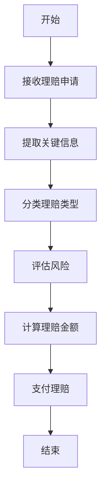
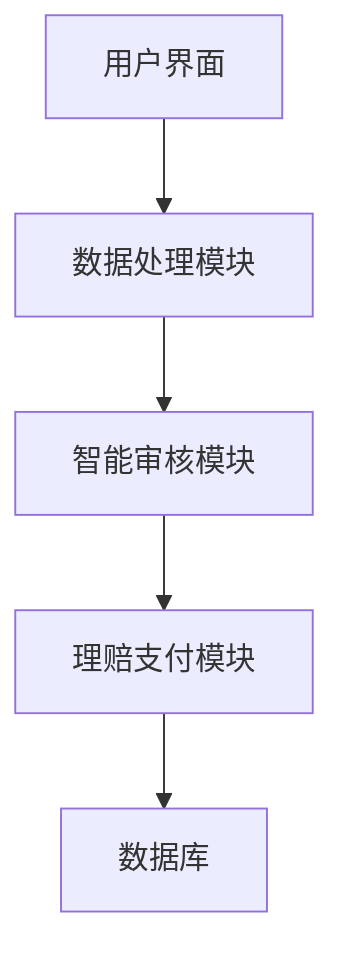
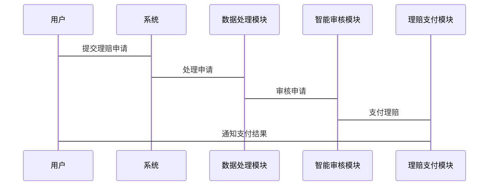

                 


# 智能保险理赔处理系统

## 关键词：智能保险理赔、人工智能、自然语言处理、机器学习、系统架构设计

## 摘要：智能保险理赔处理系统通过应用人工智能技术，显著提高了保险理赔的效率和准确性。本文详细探讨了该系统的背景、核心概念、算法原理、系统架构设计、项目实战以及未来发展方向。

---

# 第一部分: 智能保险理赔处理系统概述

## 第1章: 智能保险理赔处理系统概述

### 1.1 保险理赔的基本概念

#### 1.1.1 保险理赔的定义与流程
保险理赔是指在保险合同约定的保险事故发生后，保险公司根据合同条款向被保险人或受益人支付保险金的行为。传统的理赔流程包括理赔申请、资料审核、风险评估、理赔计算和理赔支付五个主要步骤。

#### 1.1.2 传统保险理赔的痛点
传统保险理赔过程中存在以下主要问题：
- **人工审核效率低**：理赔申请需要手动审核，耗时长且容易出错。
- **数据孤岛**：不同部门之间的数据难以共享，导致信息不一致。
- **欺诈风险高**：传统审核方式难以有效识别虚假理赔请求。
- **客户体验差**：客户需要多次提交资料，等待时间长，体验不佳。

#### 1.1.3 智能化理赔处理的必要性
随着人工智能技术的快速发展，引入智能理赔处理系统可以有效解决传统理赔的痛点，提高理赔效率和准确性，降低成本，并改善客户体验。

### 1.2 智能保险理赔处理系统的背景

#### 1.2.1 人工智能技术的发展与应用
人工智能技术，尤其是自然语言处理（NLP）和机器学习（ML），在保险行业的应用越来越广泛。智能理赔处理系统利用这些技术实现自动化审核、风险评估和欺诈检测。

#### 1.2.2 保险行业的数字化转型
保险行业正从传统的人工操作模式向数字化、智能化方向转型。智能理赔处理系统的应用是这一转型的重要组成部分。

#### 1.2.3 智能保险理赔处理系统的行业需求
随着客户对高效、便捷服务的需求增加，保险行业对智能理赔处理系统的需求日益迫切。该系统能够帮助保险公司提高服务质量和客户满意度。

### 1.3 智能保险理赔处理系统的定义与特点

#### 1.3.1 系统的定义
智能保险理赔处理系统是一种基于人工智能技术的自动化理赔处理平台，能够实现理赔申请的自动分类、智能审核、风险评估和理赔支付。

#### 1.3.2 系统的核心特点
- **自动化处理**：通过AI技术实现理赔流程的自动化。
- **高准确性**：利用机器学习模型提高审核的准确性。
- **实时处理**：系统能够实时处理理赔申请，减少等待时间。
- **智能风险评估**：基于大数据分析和机器学习模型，实现精准的风险评估。

#### 1.3.3 系统与传统理赔处理的区别
智能理赔处理系统与传统理赔处理的主要区别在于自动化程度和智能化水平。传统理赔处理依赖人工操作，而智能系统能够实现从申请到支付的全程自动化。

### 1.4 本章小结
本章介绍了智能保险理赔处理系统的背景、定义和特点，阐述了其在保险行业中的重要性和必要性。

---

# 第二部分: 智能保险理赔处理系统的核心概念与联系

## 第2章: 核心概念与原理

### 2.1 保险理赔处理的核心要素

#### 2.1.1 理赔申请的接收与分类
智能理赔系统首先接收客户的理赔申请，通过自然语言处理技术对申请内容进行分类，确定理赔类型和金额。

#### 2.1.2 理赔审核的关键环节
系统利用机器学习模型对理赔申请进行智能审核，包括资料完整性检查、风险评估和欺诈检测。

#### 2.1.3 理赔支付的流程
审核通过后，系统自动完成理赔支付，并将结果反馈给客户。

### 2.2 智能保险理赔处理系统的原理

#### 2.2.1 自然语言处理在理赔申请中的应用
自然语言处理技术用于解析客户的理赔申请内容，提取关键信息并分类。

#### 2.2.2 机器学习在风险评估中的应用
机器学习模型通过分析历史数据，识别潜在风险并评估理赔金额的合理性。

#### 2.2.3 数据挖掘在理赔数据分析中的应用
数据挖掘技术用于分析大量理赔数据，发现潜在规律和异常情况。

### 2.3 系统核心概念的ER实体关系图
```mermaid
erDiagram
    customer[CUSTOMER] {
        id : integer
        name : string
        policy_id : integer
    }
    insurance_policy[INSURANCE_POLICY] {
        id : integer
        policy_type : string
        coverage : decimal
        customer_id : integer
    }
    claim[CLAIM] {
        id : integer
        status : string
        amount : decimal
        policy_id : integer
    }
    customer --> claim : 提交理赔申请
    insurance_policy --> claim : 关联保险政策
```

### 2.4 本章小结
本章详细阐述了智能保险理赔处理系统的核心概念和工作原理，通过ER实体关系图展示了系统各实体之间的关系。

---

# 第三部分: 智能保险理赔处理系统的算法原理

## 第3章: 算法原理与实现

### 3.1 算法原理

#### 3.1.1 自然语言处理算法
- **分词**：将理赔申请文本分割成词语或短语。
- **实体识别**：识别文本中的关键实体，如人名、地点、时间等。
- **意图识别**：通过上下文理解客户的理赔意图。

#### 3.1.2 机器学习算法
- **特征提取**：从理赔申请中提取特征，如关键词、金额等。
- **分类模型**：使用随机森林或支持向量机（SVM）对理赔类型进行分类。

#### 3.1.3 算法流程图


### 3.2 算法实现

#### 3.2.1 算法选择
选择支持向量机（SVM）作为分类算法，用于分类理赔类型。

#### 3.2.2 算法实现代码
```python
from sklearn.svm import SVC
from sklearn.feature_extraction.text import TfidfVectorizer

# 数据预处理
X_train = ...  # 特征向量
y_train = ...  # 分类标签

# 模型训练
vectorizer = TfidfVectorizer()
X_train_vec = vectorizer.fit_transform(X_train)
model = SVC().fit(X_train_vec, y_train)

# 预测
X_test = ...  # 测试数据
X_test_vec = vectorizer.transform(X_test)
y_pred = model.predict(X_test_vec)
```

#### 3.2.3 数学模型与公式
支持向量机的目标函数为：
$$
\text{minimize}\quad \frac{1}{2}||w||^2 + C\sum_{i=1}^{n} \xi_i
$$
其中，$w$ 是超平面的法向量，$C$ 是惩罚参数，$\xi_i$ 是松弛变量。

### 3.3 本章小结
本章详细讲解了智能保险理赔处理系统中使用的自然语言处理和机器学习算法，通过流程图和代码示例展示了算法的实现过程。

---

# 第四部分: 智能保险理赔处理系统的系统架构设计

## 第4章: 系统架构与设计

### 4.1 系统功能模块设计

#### 4.1.1 用户界面模块
- 提供客户友好的用户界面，方便客户提交理赔申请和查询理赔状态。

#### 4.1.2 数据处理模块
- 对理赔申请进行数据清洗和预处理，提取关键信息。

#### 4.1.3 智能审核模块
- 使用机器学习模型对理赔申请进行智能审核，识别潜在风险和欺诈行为。

#### 4.1.4 理赔支付模块
- 自动完成理赔支付，并将结果反馈给客户。

### 4.2 系统架构设计

#### 4.2.1 系统架构图


#### 4.2.2 接口设计
- **API接口**：提供RESTful API，方便与其他系统的集成。

#### 4.2.3 交互流程图


### 4.3 本章小结
本章详细描述了智能保险理赔处理系统的功能模块和系统架构设计，通过架构图和交互流程图展示了系统的整体结构。

---

# 第五部分: 智能保险理赔处理系统的项目实战

## 第5章: 项目实战与分析

### 5.1 项目环境安装

#### 5.1.1 安装Python
```bash
# 安装Python
# 根据系统选择合适的安装包
```

#### 5.1.2 安装依赖库
```bash
pip install scikit-learn numpy pandas jieba
```

### 5.2 系统核心实现

#### 5.2.1 理赔申请分类代码
```python
from sklearn.svm import SVC
from sklearn.feature_extraction.text import TfidfVectorizer

# 训练模型
model = SVC()
vectorizer = TfidfVectorizer()

# 预测分类
def classify_claim(claim_text):
    X_test = [claim_text]
    X_test_vec = vectorizer.transform(X_test)
    return model.predict(X_test_vec)
```

#### 5.2.2 智能审核模块实现
```python
import jieba
from sklearn.naive_bayes import MultinomialNB

# 分词处理
def segment_text(text):
    return jieba.lcut(text)

# 训练模型
model = MultinomialNB()
```

### 5.3 实际案例分析

#### 5.3.1 案例背景
假设一位客户提交了一笔车险理赔申请，系统需要自动分类、审核和支付。

#### 5.3.2 系统处理流程
1. 接收理赔申请。
2. 分词处理，提取关键词。
3. 分类理赔类型。
4. 智能审核，评估风险。
5. 自动支付，通知客户。

### 5.4 本章小结
本章通过实际案例展示了智能保险理赔处理系统的实现过程，包括环境安装、代码实现和案例分析。

---

# 第六部分: 总结与展望

## 第6章: 总结与展望

### 6.1 系统总结
智能保险理赔处理系统通过人工智能技术显著提高了理赔处理的效率和准确性，减少了人工错误和欺诈风险，优化了客户体验。

### 6.2 未来展望
未来，随着人工智能技术的进一步发展，智能保险理赔处理系统将更加智能化和自动化。可能的发展方向包括引入深度学习模型、增强系统的自适应能力以及拓展系统的应用场景。

### 6.3 最佳实践 Tips
- **数据质量**：确保理赔数据的完整性和准确性。
- **模型优化**：定期更新和优化机器学习模型，提高分类准确率。
- **用户体验**：设计简洁直观的用户界面，提升客户满意度。

### 6.4 本章小结
本章总结了智能保险理赔处理系统的成果，并展望了未来的发展方向，同时提供了一些实用的建议。

---

# 作者：AI天才研究院/AI Genius Institute & 禅与计算机程序设计艺术 /Zen And The Art of Computer Programming

---

通过以上内容，我们详细探讨了智能保险理赔处理系统的背景、核心概念、算法原理、系统架构设计、项目实战以及未来发展方向。希望本文能为读者提供有价值的技术参考和实践指导。

