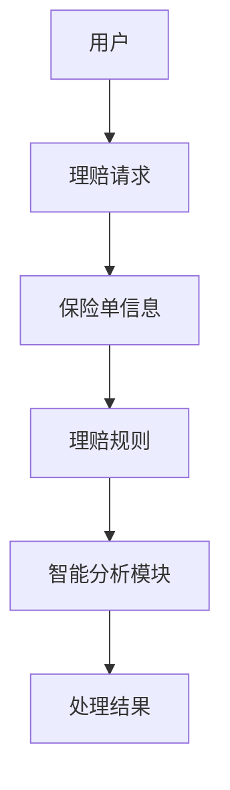
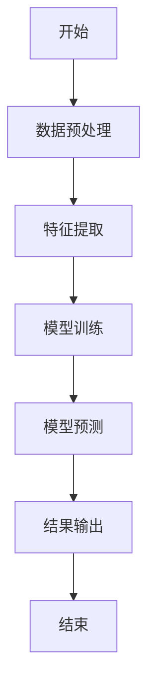
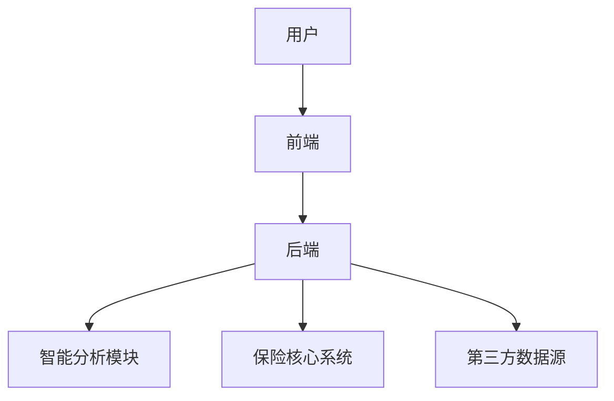

                 


# 智能保险理赔快速处理系统

> 关键词：智能保险、保险理赔、快速处理、人工智能、系统架构、算法原理

> 摘要：本文详细介绍了智能保险理赔快速处理系统的背景、核心概念、算法原理、系统架构设计及项目实战。通过分析传统保险理赔的痛点，结合人工智能技术，提出了一种高效的智能保险理赔解决方案。本文从系统设计、算法实现到项目落地，全面探讨了智能保险理赔快速处理系统的实现细节，为相关从业人员提供了参考。

---

# 第一部分: 智能保险理赔快速处理系统的背景与核心概念

## 第1章: 保险理赔的痛点与智能化需求

### 1.1 保险理赔的传统流程

#### 1.1.1 保险理赔的基本流程
保险理赔是保险业务中的核心环节，传统理赔流程通常包括以下几个步骤：
1. **报案**：用户通过电话、线上平台等方式向保险公司提交理赔申请。
2. **资料收集**：保险公司要求用户提供相关证明文件，如事故报告、医疗记录、发票等。
3. **初步审核**：保险公司对提交的资料进行初步审查，确认理赔条件是否符合。
4. **进一步调查**：对于复杂或高金额的理赔案件，保险公司可能需要进行实地调查或与第三方机构核实信息。
5. **赔付计算**：根据保险合同条款，计算应赔付的金额。
6. **赔付支付**：将赔款支付给受益人。

#### 1.1.2 传统理赔的痛点
尽管传统理赔流程看似简单，但在实际操作中存在诸多痛点：
- **效率低**：人工审核耗时长，用户等待时间久。
- **错误率高**：人工审核可能存在疏漏，导致理赔错误。
- **成本高**：需要大量人力投入，运营成本高昂。
- **用户体验差**：用户需要多次提交资料，流程繁琐，体验不佳。

#### 1.1.3 传统理赔的效率瓶颈
传统理赔效率低下的主要原因包括：
- **人工劳动密集**：需要大量人员进行资料整理、审核和调查。
- **信息孤岛**：不同部门之间数据不通，导致信息重复录入和处理。
- **规则复杂**：保险条款和理赔规则复杂多样，人工难以快速准确判断。

### 1.2 智能化保险理赔的必要性

#### 1.2.1 技术进步带来的机遇
随着人工智能、大数据和区块链等技术的快速发展，为保险行业带来了新的机遇：
- **自动化处理**：利用AI技术自动处理理赔申请，减少人工干预。
- **数据驱动决策**：通过大数据分析，提高理赔判断的准确性和效率。
- **区块链技术**：实现理赔信息的透明化和不可篡改，提升信任度。

#### 1.2.2 用户需求的变化
现代用户对保险服务的需求更加多元化和个性化：
- **快速响应**：用户希望理赔能够快速处理，减少等待时间。
- **便捷服务**：用户期望通过线上平台完成理赔全流程，无需多次线下奔波。
- **透明化**：用户希望了解理赔进度，实时查询处理状态。

#### 1.2.3 行业竞争的压力
保险行业的竞争日益激烈，保险公司需要通过技术创新来提升服务质量，降低成本，才能在市场中占据优势地位。

### 1.3 智能保险理赔的边界与外延

#### 1.3.1 系统的边界
智能保险理赔系统的边界主要集中在以下几个方面：
- **输入**：用户提交的理赔申请及相关资料。
- **输出**：智能系统生成的理赔结果和赔付金额。
- **接口**：与保险系统、第三方数据源（如医院、交警）的接口。

#### 1.3.2 系统的外延
智能保险理赔系统的外延包括：
- **用户端**：移动端或网页端的理赔申请入口。
- **第三方数据源**：与医院、交警、社保等机构的数据接口。
- **保险系统**：与保险核心系统的对接。

#### 1.3.3 系统与相关系统的接口
智能保险理赔系统需要与以下系统进行交互：
- **保险核心系统**：用于查询保单信息、处理赔付。
- **第三方数据源**：如医院数据库、交警事故记录系统。
- **用户界面**：供用户提交申请和查询进度。

### 1.4 智能保险理赔的核心要素

#### 1.4.1 数据采集
智能保险理赔系统需要采集以下数据：
- **用户信息**：用户的基本信息、保单信息。
- **理赔资料**：事故报告、医疗记录、发票等。
- **外部数据**：与第三方机构（如医院、交警）获取的数据。

#### 1.4.2 智能分析
智能分析是系统的核心部分，包括：
- **规则匹配**：根据保险条款和理赔规则，自动判断理赔条件是否符合。
- **机器学习模型**：利用历史数据训练模型，预测理赔结果。
- **自然语言处理**：对文本资料进行理解和分析，提取关键信息。

#### 1.4.3 自动处理
自动处理包括：
- **自动审核**：基于规则和模型，自动完成理赔审核。
- **自动计算**：根据审核结果，自动计算赔付金额。
- **自动支付**：将赔款直接打入用户指定账户。

#### 1.4.4 人工干预
尽管系统实现了自动化，但在以下情况下仍需要人工干预：
- **复杂案件**：涉及多方责任、高额赔付的案件。
- **异常情况**：系统无法判断的特殊情况。
- **用户申诉**：用户对理赔结果有异议时，需要人工介入处理。

---

## 第2章: 智能保险理赔的核心概念与联系

### 2.1 核心概念原理

#### 2.1.1 智能保险理赔的定义
智能保险理赔是指利用人工智能、大数据等技术，通过自动化流程实现保险理赔的快速处理，提高效率和准确性的过程。

#### 2.1.2 关键技术的实现原理
智能保险理赔系统的关键技术包括：
- **自然语言处理（NLP）**：用于理解和分析文本资料，提取关键信息。
- **机器学习**：用于训练分类模型，预测理赔结果。
- **规则引擎**：基于保险条款和业务规则，实现自动审核。

#### 2.1.3 系统的运行机制
系统的运行机制包括：
1. **用户提交申请**：用户通过线上平台提交理赔申请。
2. **数据采集与预处理**：系统采集用户提交的资料，并进行清洗和结构化处理。
3. **智能分析**：系统利用规则引擎和机器学习模型，对资料进行分析和判断。
4. **自动处理**：系统根据分析结果，自动完成理赔审核和赔付计算。
5. **结果反馈**：系统将理赔结果反馈给用户，并将赔款打入指定账户。

### 2.2 核心概念对比

#### 2.2.1 传统理赔与智能理赔的对比
| 对比维度 | 传统理赔 | 智能理赔 |
|----------|----------|----------|
| 处理时间 | 长 | 短 |
| 人工干预 | 高 | 低 |
| 准确率   | 低 | 高 |
| 成本     | 高 | 低 |

#### 2.2.2 不同智能技术的对比
| 技术 | 优点 | 缺点 |
|------|------|------|
| 规则引擎 | 实现简单，易于维护 | 需要手动编写规则，灵活性差 |
| 机器学习 | 高准确性，适应性强 | 需要大量数据和计算资源 |
| NLP    | 提取文本信息能力强 | 对文本质量敏感，处理复杂 |

#### 2.2.3 系统功能模块的对比
| 功能模块 | 传统系统 | 智能系统 |
|----------|----------|----------|
| 报案受理 | 人工受理 | 自动受理 |
| 资料审核 | 人工审核 | 自动审核 |
| 赔付计算 | 人工计算 | 自动计算 |
| 结果反馈 | 人工反馈 | 自动反馈 |

### 2.3 ER实体关系图



---

## 第3章: 算法原理与实现

### 3.1 算法选择与优化

#### 3.1.1 基于规则的匹配算法
基于规则的匹配算法是一种简单有效的规则匹配方法，适用于保险理赔中的规则判断。

#### 3.1.2 机器学习分类算法
机器学习分类算法可以用于对理赔案件进行分类，例如区分拒赔、部分赔付和全额赔付。

#### 3.1.3 算法的优化与调优
通过调整模型参数、增加特征工程等方法，可以提升算法的准确率和效率。

### 3.2 算法实现

#### 3.2.1 算法流程图


#### 3.2.2 机器学习模型实现
以下是一个简单的机器学习模型实现代码：

```python
# 数据预处理
from sklearn.preprocessing import StandardScaler
from sklearn.model_selection import train_test_split
import pandas as pd
import numpy as np

# 加载数据
data = pd.read_csv('insurance_claims.csv')
X = data.drop('target', axis=1)
y = data['target']

# 数据分割
X_train, X_test, y_train, y_test = train_test_split(X, y, test_size=0.2, random_state=42)

# 标准化
scaler = StandardScaler()
X_train_scaled = scaler.fit_transform(X_train)
X_test_scaled = scaler.transform(X_test)

# 训练模型
from sklearn.svm import SVC
model = SVC()
model.fit(X_train_scaled, y_train)

# 预测
y_pred = model.predict(X_test_scaled)

# 评估
from sklearn.metrics import accuracy_score
print(f"准确率: {accuracy_score(y_test, y_pred)}")
```

---

## 第4章: 系统分析与架构设计

### 4.1 项目介绍

#### 4.1.1 项目背景
随着保险行业的快速发展，传统理赔方式已经无法满足用户需求，亟需智能化解决方案。

#### 4.1.2 项目目标
实现智能保险理赔快速处理系统，提升理赔效率和用户体验。

### 4.2 系统功能设计

#### 4.2.1 领域模型类图


#### 4.2.2 系统架构设计


---

## 第5章: 项目实战

### 5.1 环境搭建

#### 5.1.1 工具安装
- Python 3.8+
- TensorFlow 2.0+
- Flask 2.0+
- Pandas 1.0+
- Jupyter Notebook

#### 5.1.2 开发环境配置
安装必要的Python包：
```bash
pip install numpy pandas scikit-learn tensorflow flask
```

### 5.2 核心功能实现

#### 5.2.1 数据预处理
```python
import pandas as pd
import numpy as np

# 加载数据
data = pd.read_csv('insurance_claims.csv')

# 删除缺失值
data = data.dropna()

# 转换为数值型
data['age'] = pd.to_numeric(data['age'], errors='coerce')
data['age'] = data['age'].fillna(data['age'].mean())
```

#### 5.2.2 模型训练
```python
from sklearn.model

