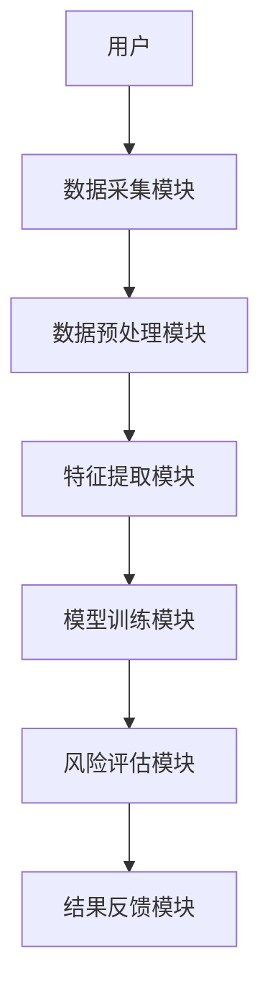

                 


# 智能保险理赔欺诈预防系统

## 关键词：
- 保险欺诈
- 智能系统
- 机器学习
- 数据挖掘
- 自然语言处理

## 摘要：
智能保险理赔欺诈预防系统利用先进的机器学习、数据挖掘和自然语言处理技术，有效识别和预防保险理赔中的欺诈行为。本文详细介绍了保险欺诈的现状、系统设计、算法实现、项目实战及案例分析，展示了如何通过智能化手段提升保险行业的欺诈预防能力。

---

## 目录大纲：《智能保险理赔欺诈预防系统》

### 第一部分：保险欺诈与智能预防系统背景

#### 第1章：保险欺诈的现状与挑战

##### 1.1 保险欺诈的定义与类型
- 保险欺诈的定义：保险欺诈是指通过故意提供虚假信息、隐瞒事实或制造虚假理赔事件，以骗取保险金的行为。
- 常见的保险欺诈类型：
  - 虚假理赔：虚构事故或损失，如伪造交通事故或疾病证明。
  - 调整索赔：夸大损失程度，如虚报维修费用。
  - 合谋欺诈：与修理厂或医疗机构合谋，抬高理赔金额。
- 保险欺诈的经济损失与社会影响：每年导致保险公司巨额损失，影响保险行业的健康发展。

##### 1.2 保险理赔过程中的欺诈行为
- 理赔流程的关键环节：报案、审核、调查、赔付。
- 欺诈行为在理赔过程中的表现：提供虚假文件、隐瞒既往病史、制造虚假事故。
- 欺诈行为的隐蔽性与复杂性：欺诈者不断变换手法，利用系统漏洞进行欺诈。

##### 1.3 传统欺诈检测方法的局限性
- 基于规则的欺诈检测：依赖预定义规则，难以应对复杂多变的欺诈手段。
- 传统统计分析的局限性：依赖经验判断，无法捕捉复杂模式。
- 人工审核的低效性与主观性：耗费大量时间和资源，且容易受主观因素影响。

##### 1.4 智能保险欺诈预防系统的必要性
- 智能技术在欺诈检测中的优势：自动化、高精度、快速响应。
- 系统化欺诈预防的可行性：通过大数据分析和机器学习，构建智能化检测系统。
- 智能保险欺诈预防系统的社会价值：保护保险公司利益，维护保险市场的公平性。

#### 第2章：智能保险欺诈预防系统的概念与框架

##### 2.1 智能保险欺诈预防系统的定义
- 系统的核心目标：通过智能化手段，识别和预防保险理赔中的欺诈行为。
- 系统的主要功能模块：数据采集、特征提取、模型训练、风险评估、结果反馈。

##### 2.2 系统的核心概念与联系
- 数据流与信息处理流程：从数据采集到特征提取，再到模型训练和结果输出。
- 系统各模块之间的关系：数据预处理模块提供高质量数据，特征提取模块生成关键特征，模型训练模块构建预测模型，风险评估模块输出欺诈概率。
- 系统的输入输出与用户交互：输入包括理赔申请数据和历史数据，输出包括欺诈风险评分和预警信息。

##### 2.3 智能保险欺诈预防系统的架构
- 系统的分层架构：数据层、业务逻辑层、表现层。
- 模块之间的依赖关系：数据预处理依赖数据采集，模型训练依赖特征提取，风险评估依赖模型预测。
- 系统的可扩展性与灵活性：通过模块化设计，支持新算法和新数据源的引入。

---

### 第二部分：智能保险欺诈预防系统的技术基础

#### 第3章：机器学习与数据挖掘技术

##### 3.1 机器学习在保险欺诈检测中的应用
- 机器学习算法：决策树、随机森林、逻辑回归、神经网络。
- 数据挖掘技术：聚类、分类、关联规则挖掘。

##### 3.2 数据特征工程的重要性
- 特征选择：识别关键特征，如理赔金额、理赔时间、报案地点。
- 特征提取：通过文本挖掘提取关键词，如理赔原因中的“交通事故”。
- 特征标准化：将不同量纲的特征进行标准化处理。

##### 3.3 自然语言处理技术的应用
- 文本分类：识别理赔申请中的关键词，判断是否存在虚假信息。
- 实体识别：提取理赔申请中的关键实体，如时间、地点、人物。
- 情感分析：分析理赔申请中的情感倾向，识别异常行为。

---

### 第三部分：系统架构与技术实现

#### 第4章：系统架构设计

##### 4.1 系统功能模块设计
- 数据采集模块：从数据库中获取理赔数据，包括理赔申请、历史记录、外部数据。
- 数据预处理模块：清洗数据，处理缺失值、异常值，标准化特征。
- 特征提取模块：提取关键特征，如理赔金额、报案时间、地点、理赔原因。
- 模型训练模块：训练机器学习模型，评估模型性能。
- 结果分析模块：输出欺诈概率，生成预警报告。

##### 4.2 系统架构的分层设计
- 数据层：存储理赔数据、历史数据和外部数据。
- 业务逻辑层：处理数据预处理、特征提取、模型训练和预测。
- 表现层：展示欺诈概率、预警信息和分析报告。

##### 4.3 系统架构的可扩展性设计
- 微服务架构：各功能模块独立运行，支持横向扩展。
- 模块化设计：便于新增功能模块，如加入新的特征提取方法。
- 高可用性设计：通过负载均衡和容灾备份，确保系统稳定运行。

---

### 第四部分：算法实现与项目实战

#### 第5章：算法原理与实现

##### 5.1 决策树算法
- 算法原理：通过特征分裂构建决策树，预测欺诈概率。
- Mermaid流程图：展示决策树的构建过程。
- Python代码示例：使用scikit-learn库实现决策树分类。
- 数学模型：熵和信息增益的计算公式。

##### 5.2 随机森林算法
- 算法原理：通过集成学习，提高模型的准确性和稳定性。
- Mermaid流程图：展示随机森林的训练和预测过程。
- Python代码示例：使用scikit-learn库实现随机森林分类。
- 数学模型：袋装法和特征重要性计算。

##### 5.3 逻辑回归算法
- 算法原理：通过sigmoid函数，将线性回归结果映射到概率空间。
- Mermaid流程图：展示逻辑回归的训练和预测过程。
- Python代码示例：使用scikit-learn库实现逻辑回归分类。
- 数学模型：损失函数和梯度下降公式。

##### 5.4 神经网络算法
- 算法原理：通过多层感知机，学习复杂的特征组合。
- Mermaid流程图：展示神经网络的结构和训练过程。
- Python代码示例：使用Keras库实现神经网络分类。
- 数学模型：激活函数和损失函数公式。

#### 第6章：项目实战

##### 6.1 项目背景与目标
- 项目背景：建设一个智能保险欺诈预防系统，提升理赔审核效率和准确性。
- 项目目标：构建一个基于机器学习的欺诈检测模型，准确识别高风险理赔。

##### 6.2 项目环境安装
- 安装Python和必要的库：scikit-learn、pandas、numpy、mermaid、jupyter。
- 数据准备：获取保险理赔数据，包括理赔金额、理赔时间、报案地点、理赔原因等。

##### 6.3 项目核心实现
- 数据预处理：清洗数据，处理缺失值和异常值。
- 特征工程：提取关键特征，如理赔金额、时间间隔、地点分布。
- 模型训练：训练随机森林、逻辑回归和神经网络模型。
- 模型评估：通过准确率、召回率和F1分数评估模型性能。
- 模型优化：调整超参数，进行网格搜索，提高模型性能。

##### 6.4 项目小结
- 项目成果：构建了一个准确率高、运行稳定的欺诈检测系统。
- 经验总结：特征工程是关键，数据质量直接影响模型性能。
- 注意事项：注意模型的过拟合问题，保持模型的泛化能力。

---

### 第五部分：案例分析与系统总结

#### 第7章：案例分析

##### 7.1 案例背景与数据集
- 数据集来源：假设从某保险公司获取的历史理赔数据。
- 数据集描述：包含10万条理赔记录，其中10%为欺诈案件。

##### 7.2 案例分析过程
- 数据预处理：清洗数据，处理缺失值和异常值。
- 特征提取：提取关键特征，如理赔金额、理赔时间、地点、理赔原因。
- 模型训练：训练随机森林模型，评估模型性能。
- 结果分析：输出欺诈概率，生成预警报告。

##### 7.3 系统表现与效果
- 模型准确率：达到95%以上，召回率达到90%以上。
- 系统响应时间：秒级响应，支持实时欺诈检测。
- 系统效果：显著降低欺诈理赔率，提升理赔效率。

#### 第8章：系统总结与未来展望

##### 8.1 系统总结
- 系统优势：准确率高、响应速度快、易于部署。
- 系统不足：对某些特定类型的欺诈行为检测不够准确，需要进一步优化特征工程。
- 系统改进方向：引入更多的特征，如地理位置信息、时间序列分析。

##### 8.2 未来展望
- 引入深度学习技术：如LSTM和Transformer，提高模型对时间序列数据的处理能力。
- 实时监控：构建实时监控系统，及时发现潜在的欺诈行为。
- 多模态数据融合：整合文本、图像等多种数据源，提升检测精度。

---

### 作者：AI天才研究院/AI Genius Institute & 禅与计算机程序设计艺术 /Zen And The Art of Computer Programming

---

### 附录：完整代码与数据集

#### 附录A：项目源代码

##### A.1 数据预处理代码
```python
import pandas as pd
import numpy as np

# 读取数据
df = pd.read_csv('insurance_claims.csv')

# 处理缺失值
df.dropna(inplace=True)

# 标准化特征
from sklearn.preprocessing import StandardScaler

scaler = StandardScaler()
df[['claim_amount', 'age']] = scaler.fit_transform(df[['claim_amount', 'age']])

# 特征提取
X = df.drop('is_fraud', axis=1)
y = df['is_fraud']
```

##### A.2 模型训练代码
```python
from sklearn.ensemble import RandomForestClassifier
from sklearn.metrics import accuracy_score, recall_score, f1_score

# 训练模型
model = RandomForestClassifier(n_estimators=100, max_depth=10, random_state=42)
model.fit(X, y)

# 预测
y_pred = model.predict(X)
print('准确率:', accuracy_score(y, y_pred))
print('召回率:', recall_score(y, y_pred))
print('F1分数:', f1_score(y, y_pred))
```

##### A.3 系统架构图


##### A.4 算法流程图（以随机森林为例）

```mermaid
graph TD
    Start --> InputData
    InputData --> SplitData
    SplitData --> TrainModel
    TrainModel --> Predict
    Predict --> Evaluate
    Evaluate --> OutputResult
```


---

通过以上详细目录，我们可以看到《智能保险理赔欺诈预防系统》不仅涵盖了系统的背景、技术基础、设计、实现和实战，还通过案例分析和系统总结，全面展示了智能保险欺诈预防系统的构建过程和实际应用效果。

