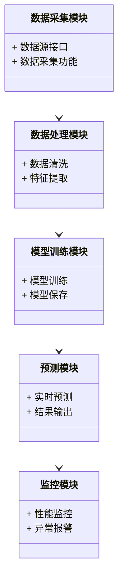
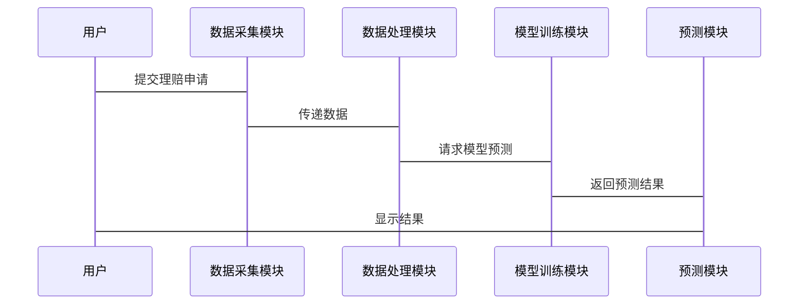

                 


```markdown
# 第一部分: 智能保险理赔欺诈预防系统概述

# 第1章: 智能保险理赔欺诈预防系统背景与概述

## 1.1 保险行业的现状与挑战
### 1.1.1 保险行业的快速发展
- 保险行业近年来的市场规模增长趋势
- 数字化转型在保险行业中的重要性
- 保险产品和服务创新的现状

### 1.1.2 保险理赔中的问题与挑战
- 传统保险理赔流程的痛点
- 保险欺诈的多样性和隐蔽性
- 理赔效率与成本控制的平衡难题

### 1.1.3 智能化技术在保险行业的应用前景
- 人工智能技术在保险行业的应用现状
- 智能保险理赔系统的潜力和优势
- 智能化技术对保险行业未来发展的推动作用

## 1.2 智能保险理赔欺诈预防系统的必要性
### 1.2.1 保险欺诈的定义与类型
- 保险欺诈的定义和表现形式
- 常见的保险欺诈类型（如假赔案、虚增保险金额等）
- 欺诈行为对保险公司和投保人的双重危害

### 1.2.2 传统保险欺诈识别的局限性
- 传统理赔流程中的人工审核模式
- 传统欺诈识别方法的低效性和局限性
- 现有技术手段在应对新型欺诈手段时的不足

### 1.2.3 智能技术在欺诈预防中的优势
- 人工智能在数据处理和模式识别方面的优势
- 机器学习算法在欺诈检测中的高精度和实时性
- 大数据技术在欺诈行为分析中的应用价值

## 1.3 智能保险理赔欺诈预防系统的概念与目标
### 1.3.1 系统的核心概念
- 智能保险理赔系统的定义和核心功能
- 欺诈预防的具体实现方式和应用场景
- 系统的智能化特点和技术实现路径

### 1.3.2 系统的目标与功能
- 系统的主要目标（如降低欺诈风险、提高理赔效率等）
- 系统的核心功能模块（如数据采集、特征提取、模型训练等）
- 系统预期达到的效果和用户价值

### 1.3.3 系统的边界与外延
- 系统的应用范围和限制条件
- 系统与外部系统的接口和数据交互
- 系统未来的扩展性和灵活性

## 1.4 本章小结
- 本章主要介绍了保险行业的现状与挑战，探讨了智能保险理赔欺诈预防系统在当前背景下的必要性，并详细阐述了系统的概念、目标和边界。

---

# 第二部分: 智能保险理赔欺诈预防系统的核心概念与联系

# 第2章: 智能保险理赔欺诈预防系统的概念模型与核心模块

## 2.1 核心概念与术语
### 2.1.1 数据采集
- 数据来源的多样性（如投保信息、理赔记录、外部数据等）
- 数据采集的标准化与规范性要求
- 数据清洗与预处理的重要性

### 2.1.2 特征提取
- 特征工程在机器学习中的作用
- 常见的保险欺诈相关特征（如理赔金额与保额的比例、理赔时间与投保时间的间隔等）
- 高效特征提取方法的选择与应用

### 2.1.3 模型训练
- 监督学习、无监督学习和半监督学习在保险欺诈检测中的应用
- 常用的分类算法（如随机森林、逻辑回归、神经网络等）
- 模型调优和评估指标的选择（如准确率、召回率、F1分数等）

### 2.1.4 预测与部署
- 模型的实时预测机制
- 模型的部署与集成
- 预测结果的可视化与可解释性

## 2.2 智能保险理赔欺诈预防系统的概念模型
### 2.2.1 系统的组成模块
- 数据采集模块、特征工程模块、模型训练模块、预测模块和监控模块
- 各模块之间的关系与数据流

### 2.2.2 概念模型的ER实体关系图
```mermaid
erDiagram
    user {
        user(UserId, UserName, UserEmail)
        claim(ClaimId, ClaimAmount, ClaimDate)
    }
    policy {
        policy(PolicyId, PolicyType, PolicyTerm)
    }
    fraud_detection {
        fraud_case(CaseId, DetectionTime, Probability)
    }
    risk_assessment {
        risk_score(UserId, Score, AssessmentTime)
    }
    fraud_detection CASE user
    policy CASE user
    risk_assessment CASE user
```

## 2.3 核心概念之间的联系
### 2.3.1 数据采集与特征提取的关联性
- 数据采集的质量对特征提取的影响
- 特征工程在数据预处理中的作用

### 2.3.2 模型训练与预测的关系
- 模型训练的目的是为了实现高效的预测
- 预测结果的反馈对模型优化的作用

## 2.4 本章小结
- 本章详细阐述了智能保险理赔欺诈预防系统的核心概念，包括数据采集、特征提取、模型训练和预测等模块，并通过ER实体关系图展示了各模块之间的关系。

---

# 第三部分: 智能保险理赔欺诈预防系统的算法原理

# 第3章: 常用算法与实现原理

## 3.1 传统机器学习算法
### 3.1.1 随机森林（Random Forest）
```mermaid
graph LR
    A[开始]
    B[数据预处理]
    C[特征选择]
    D[训练决策树]
    E[投票预测]
    F[结束]
    A -> B
    B -> C
    C -> D
    D -> E
    E -> F
```

### 3.1.2 逻辑回归（Logistic Regression）
```mermaid
graph LR
    A[开始]
    B[数据标准化]
    C[特征选取]
    D[模型训练]
    E[预测]
    F[结束]
    A -> B
    B -> C
    C -> D
    D -> E
    E -> F
```

### 3.1.3 支持向量机（SVM）
```mermaid
graph LR
    A[开始]
    B[数据转换]
    C[模型训练]
    D[预测]
    E[结束]
    A -> B
    B -> C
    C -> D
    D -> E
```

## 3.2 深度学习算法
### 3.2.1 神经网络（Neural Networks）
```mermaid
graph LR
    A[开始]
    B[数据预处理]
    C[构建神经网络模型]
    D[模型训练]
    E[预测]
    F[结束]
    A -> B
    B -> C
    C -> D
    D -> E
    E -> F
```

### 3.2.2 长短期记忆网络（LSTM）
```mermaid
graph LR
    A[开始]
    B[数据准备]
    C[构建LSTM模型]
    D[模型训练]
    E[预测]
    F[结束]
    A -> B
    B -> C
    C -> D
    D -> E
    E -> F
```

## 3.3 算法对比与选择
### 3.3.1 各算法的优缺点对比
| 算法类型 | 优点 | 缺点 |
|----------|------|------|
| 随机森林 | 高精度、易于解释 | 计算资源消耗大 |
| 逻辑回归 | 简单高效 | 对非线性关系表现较差 |
| 神经网络 | 强大学习能力 | 黑箱问题，难解释 |
| LSTM     | 适合时间序列数据 | 训练时间长 |

### 3.3.2 根据场景选择合适的算法
- 根据数据类型选择算法
- 根据计算资源选择算法
- 根据模型的可解释性需求选择算法

## 3.4 本章小结
- 本章详细介绍了几种常用的机器学习和深度学习算法，通过对比分析帮助读者选择适合具体场景的算法。

---

# 第四部分: 智能保险理赔欺诈预防系统的系统架构与设计

# 第4章: 系统架构设计与实现

## 4.1 系统架构设计
### 4.1.1 模块划分
- 数据采集模块
- 数据处理模块
- 模型训练模块
- 预测模块
- 监控模块

### 4.1.2 模块之间的关系


### 4.1.3 系统整体架构


## 4.2 接口设计与交互流程
### 4.2.1 系统接口设计
- 数据接口：数据输入格式和输出格式
- 模型接口：模型调用方式和返回结果
- 用户接口：前端交互界面设计

### 4.2.2 交互流程图


## 4.3 本章小结
- 本章详细描述了智能保险理赔欺诈预防系统的架构设计，包括模块划分、接口设计和交互流程。

---

# 第五部分: 智能保险理赔欺诈预防系统的项目实战

# 第5章: 项目实战与实现

## 5.1 环境安装与配置
### 5.1.1 安装Python与必要的库
- Python安装与版本管理
- 安装机器学习库（如scikit-learn、TensorFlow、Keras等）
- 安装数据处理库（如Pandas、NumPy等）

### 5.1.2 安装Jupyter Notebook或IDE
- 安装Jupyter Notebook
- 配置开发环境

## 5.2 数据预处理与特征工程
### 5.2.1 数据清洗
- 处理缺失值
- 去重
- 异常值处理

### 5.2.2 特征工程
- 特征选择
- 特征变换（如标准化、编码等）
- 新特征的构建

## 5.3 模型训练与优化
### 5.3.1 模型训练
- 使用随机森林、逻辑回归等算法训练模型
- 调参与优化
- 模型保存

### 5.3.2 模型评估
- 精准率、召回率、F1分数等指标计算
- ROC-AUC曲线绘制
- 混淆矩阵分析

## 5.4 模型部署与预测
### 5.4.1 部署模型
- 使用Flask或Django构建API
- 部署到服务器或云平台
- 模型实时预测

### 5.4.2 预测结果分析
- 预测结果的可视化
- 预测结果的可解释性分析
- 模型的实时监控与维护

## 5.5 项目总结与优化
### 5.5.1 项目小结
- 项目实现的主要成果
- 系统的优缺点
- 可能遇到的问题及解决方案

### 5.5.2 系统优化建议
- 数据源的扩展
- 模型的迭代优化
- 系统性能的提升

## 5.6 本章小结
- 本章通过实际项目展示了智能保险理赔欺诈预防系统的实现过程，从环境配置到数据处理，再到模型训练和部署，详细讲解了每一步的操作和实现细节。

---

# 第六部分: 总结与展望

# 第6章: 总结与展望

## 6.1 系统总结
### 6.1.1 系统的优势
- 高效性
- 准确性
- 可扩展性

### 6.1.2 系统的局限性
- 数据依赖性
- 模型的可解释性
- 算法的局限性

## 6.2 应用案例与实际效果
### 6.2.1 系统的实际应用案例
- 某保险公司应用案例
- 系统的实际效果展示
- 用户反馈与评价

## 6.3 未来展望
### 6.3.1 技术发展
- 人工智能技术的进一步发展
- 新型算法的应用潜力
- 大数据技术的深度融合

### 6.3.2 行业发展趋势
- 保险行业的数字化转型
- 智能保险系统的普及
- 智慧保险生态的构建

## 6.4 本章小结
- 本章总结了智能保险理赔欺诈预防系统的优缺点和实际应用效果，并展望了未来技术发展和行业趋势。

---

# 附录

## 附录A: 参考文献
- 列出本书中引用的所有文献和资料来源

## 附录B: 代码仓库地址
- 提供GitHub或其他代码托管平台的仓库地址，方便读者获取代码示例

## 附录C: 术语表
- 解释书中使用的专业术语和缩写词

---

# 作者：AI天才研究院/AI Genius Institute & 禅与计算机程序设计艺术 /Zen And The Art of Computer Programming

---

* * *

**摘要：** 本文系统地介绍了智能保险理赔欺诈预防系统的背景、核心概念、算法原理、系统架构、项目实现及应用案例，旨在为保险行业提供一种高效、智能的欺诈预防解决方案。通过理论与实践相结合的方式，详细阐述了如何利用人工智能技术构建一个智能化的保险欺诈预防系统，帮助保险公司降低欺诈风险、提高理赔效率，推动保险行业的数字化转型。

**关键词：** 智能保险、理赔欺诈、预防系统、机器学习、人工智能、大数据
```

