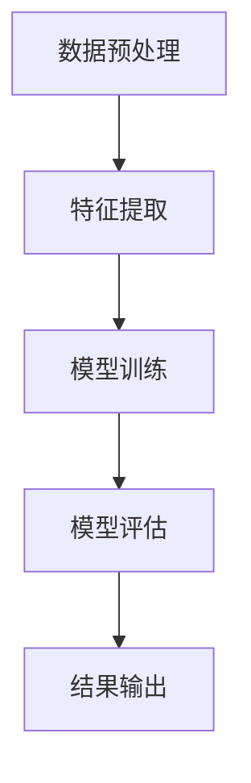
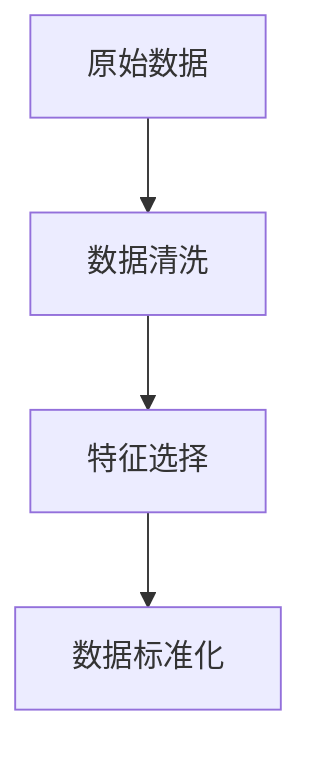
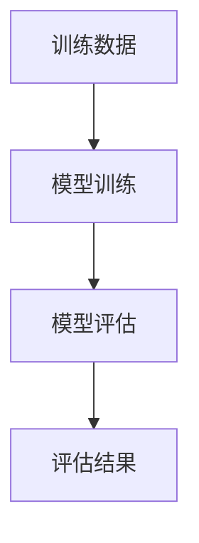
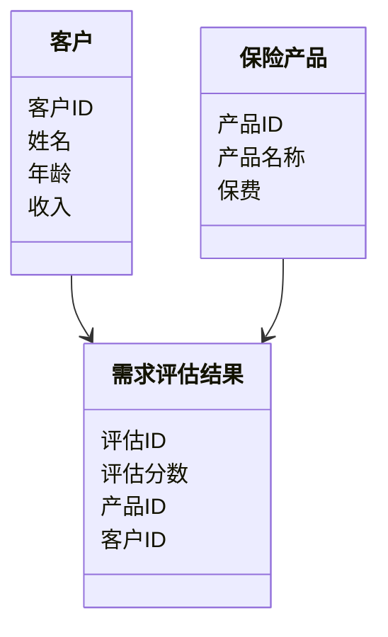
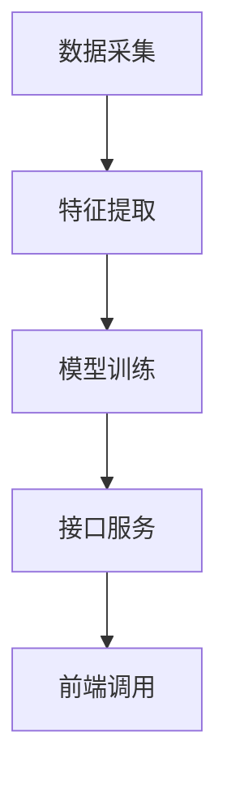
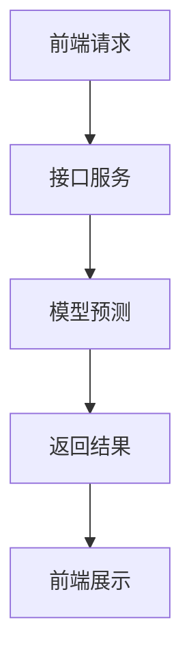

                 


# 智能保险需求评估工具

## 关键词：智能保险，需求评估，机器学习，自然语言处理，系统架构，保险行业

## 摘要：  
智能保险需求评估工具是一种基于人工智能技术的解决方案，旨在通过数据驱动的方法，精准评估保险需求，优化保险业务流程。本文将详细探讨该工具的背景、核心概念、算法原理、系统架构、项目实战及优化建议，为读者提供全面的技术解析。

---

## 第一部分: 智能保险需求评估工具概述

### 第1章: 保险需求评估的背景与现状

#### 1.1 保险行业的现状与挑战

##### 1.1.1 保险行业的现状分析  
保险行业近年来发展迅速，市场规模不断扩大，产品种类日益多样化。然而，传统保险需求评估方法存在效率低、精度差、成本高等问题，难以满足现代保险业务的需求。

##### 1.1.2 传统保险需求评估方法的局限性  
传统方法依赖人工分析，存在以下问题：  
- 数据处理效率低，难以应对海量数据。  
- 评估结果主观性较强，缺乏客观依据。  
- 无法实时更新模型，难以适应市场变化。  

##### 1.1.3 智能保险需求评估工具的必要性  
智能工具通过自动化数据处理和机器学习算法，能够快速、精准地评估保险需求，提升保险业务的效率和客户满意度。

#### 1.2 智能保险需求评估工具的定义与目标

##### 1.2.1 智能保险需求评估工具的定义  
智能保险需求评估工具是一种基于人工智能技术，利用大数据分析和机器学习算法，对保险需求进行智能评估的工具。

##### 1.2.2 工具的核心目标  
- 提供精准的保险需求预测。  
- 优化保险产品的设计和定价。  
- 提升客户服务体验。  

##### 1.2.3 工具的预期效果与价值  
- 提高保险业务的效率和准确性。  
- 降低保险公司的运营成本。  
- 提升客户满意度和忠诚度。  

### 第2章: 智能保险需求评估工具的核心概念

#### 2.1 核心概念与原理

##### 2.1.1 数据驱动的保险需求分析  
通过收集和分析大量数据，包括客户信息、市场数据、历史保险数据等，利用数据分析技术提取有用信息。

##### 2.1.2 机器学习在保险需求评估中的应用  
机器学习算法（如随机森林、支持向量机）用于分类和回归分析，帮助预测客户的需求。

##### 2.1.3 自然语言处理在保险需求分析中的作用  
利用自然语言处理技术，分析客户反馈、社交媒体评论等非结构化数据，提取情感和关键词。

#### 2.2 核心概念对比分析

##### 2.2.1 传统保险需求评估与智能评估的对比  
| 对比维度 | 传统评估 | 智能评估 |
|----------|----------|----------|
| 数据来源 | 少量结构化数据 | 大量结构化和非结构化数据 |
| 方法 | 人工分析 | 机器学习、自然语言处理 |
| 效率 | 低效 | 高效 |

##### 2.2.2 数据特征与模型特征的对比  
- 数据特征：客户年龄、收入、职业等。  
- 模型特征：特征重要性、模型复杂度等。  

##### 2.2.3 不同保险产品的需求评估差异  
- 寿险：注重客户健康状况、家庭结构。  
- 财产险：注重资产价值、风险因素。  

#### 2.3 数据模型与实体关系图

##### 2.3.1 数据模型的构建  
构建客户、保险产品、需求评估结果等实体的数据模型。  

##### 2.3.2 实体关系图（ER图）设计  
```mermaid
erd
  矩形 表格 {
    客户（客户ID, 姓名, 年龄, 收入）
    保险产品（产品ID, 产品名称, 保费）
    需求评估结果（评估ID, 评估分数, 产品ID, 客户ID）
  }
  线条 客户 --> 需求评估结果
  线条 保险产品 --> 需求评估结果
```

---

## 第二部分: 智能保险需求评估工具的算法原理

### 第3章: 保险需求评估的算法原理

#### 3.1 机器学习算法在保险需求评估中的应用

##### 3.1.1 常见机器学习算法概述  
- 线性回归：用于预测连续型需求评估结果。  
- 支持向量机（SVM）：用于分类问题。  
- 随机森林：用于特征重要性分析。  

##### 3.1.2 支持向量机（SVM）在保险需求评估中的应用  
SVM适用于高维数据分类，能够处理非线性问题。  

##### 3.1.3 随机森林在保险需求评估中的应用  
随机森林通过集成学习，提高模型的准确性和鲁棒性。  

#### 3.2 算法流程图

##### 3.2.1 保险需求评估算法流程图  


##### 3.2.2 数据预处理流程  


##### 3.2.3 模型训练与评估流程  


#### 3.3 数学模型与公式解析

##### 3.3.1 保险需求评估的数学模型  
- 线性回归模型：$$y = \beta_0 + \beta_1x_1 + \beta_2x_2 + \epsilon$$  
- 逻辑回归模型：$$P(y=1|x) = \frac{1}{1 + e^{-\beta x}}$$  
- 决策树模型：$$f(x) = \text{类别}(x)$$  

---

## 第三部分: 智能保险需求评估工具的系统架构设计

### 第4章: 系统架构设计

#### 4.1 问题场景介绍  
系统需要处理海量数据，支持多种保险产品的需求评估，并提供实时结果输出。

#### 4.2 系统功能设计

##### 4.2.1 领域模型  


#### 4.3 系统架构设计

##### 4.3.1 模块划分  
- 数据采集模块：负责收集客户数据和保险产品数据。  
- 特征提取模块：提取数据特征并进行预处理。  
- 模型训练模块：训练机器学习模型并保存模型。  
- 接口服务模块：提供API供前端调用。  

##### 4.3.2 模块交互流程图  


#### 4.4 系统接口设计  
- 数据接口：提供数据导入和导出功能。  
- 模型接口：提供模型训练和预测功能。  

#### 4.5 系统交互流程图  


---

## 第四部分: 项目实战

### 第5章: 项目实战

#### 5.1 环境安装与配置

##### 5.1.1 安装Python  
```bash
python --version
pip install --upgrade pip
```

##### 5.1.2 安装机器学习库  
```bash
pip install scikit-learn pandas numpy
```

#### 5.2 核心代码实现

##### 5.2.1 数据预处理代码  
```python
import pandas as pd
import numpy as np

# 加载数据
data = pd.read_csv('insurance_data.csv')

# 数据清洗
data.dropna(inplace=True)
data = pd.get_dummies(data)
```

##### 5.2.2 模型训练代码  
```python
from sklearn.ensemble import RandomForestClassifier
from sklearn.model_selection import train_test_split

# 划分数据集
X = data.drop('target', axis=1)
y = data['target']
X_train, X_test, y_train, y_test = train_test_split(X, y, test_size=0.2)

# 训练模型
model = RandomForestClassifier()
model.fit(X_train, y_train)
```

##### 5.2.3 模型评估代码  
```python
from sklearn.metrics import accuracy_score

# 预测结果
y_pred = model.predict(X_test)

# 计算准确率
accuracy = accuracy_score(y_test, y_pred)
print(f'准确率：{accuracy}')
```

#### 5.3 代码功能解读与分析  
- 数据预处理代码：完成数据清洗和特征编码。  
- 模型训练代码：使用随机森林算法训练模型。  
- 模型评估代码：计算模型的准确率，评估模型性能。  

#### 5.4 案例分析与详细讲解  
假设有一名客户，年龄30岁，收入50000美元，职业为工程师。通过模型预测，该客户的保险需求评分为0.85，属于高需求客户。

#### 5.5 项目总结  
通过实战项目，验证了智能保险需求评估工具的有效性和实用性。

---

## 第五部分: 优化建议与未来展望

### 第6章: 优化建议与未来展望

#### 6.1 系统优化建议  
- 优化模型训练效率，减少计算时间。  
- 提升模型的可解释性，方便业务人员理解。  

#### 6.2 未来发展方向  
- 研究更先进的机器学习算法，如深度学习模型。  
- 结合区块链技术，提升数据安全性和透明度。  

#### 6.3 最佳实践 Tips  
- 数据预处理是关键，确保数据质量。  
- 模型调参是提升准确率的重要步骤。  

---

## 小结  
智能保险需求评估工具通过人工智能技术，显著提升了保险业务的效率和准确性。未来，随着技术的不断进步，工具的功能和性能将进一步优化，为保险行业带来更多价值。

---

## 注意事项  
- 数据隐私保护是重中之重，需遵守相关法律法规。  
- 模型部署时需考虑系统的可扩展性和稳定性。  

---

## 拓展阅读  
- 《机器学习实战》  
- 《Python机器学习》  
- 《深度学习》  

---

## 作者：  
AI天才研究院/AI Genius Institute & 禅与计算机程序设计艺术 /Zen And The Art of Computer Programming

