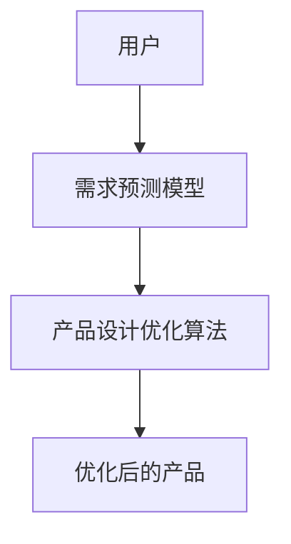
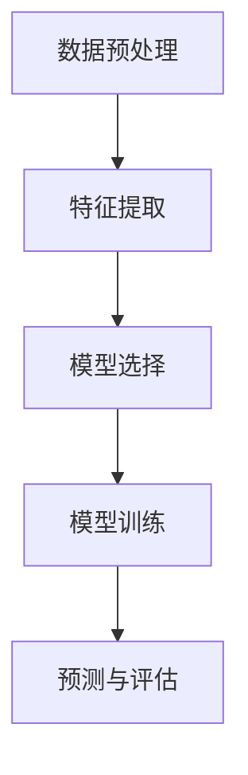
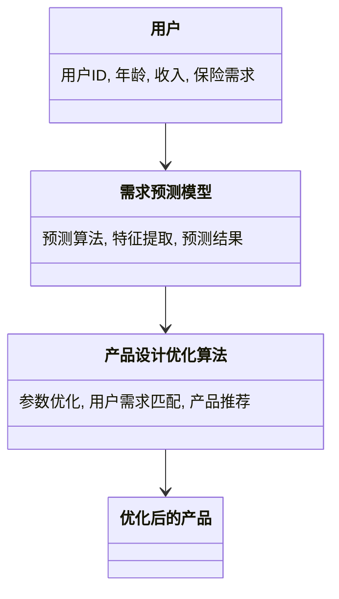
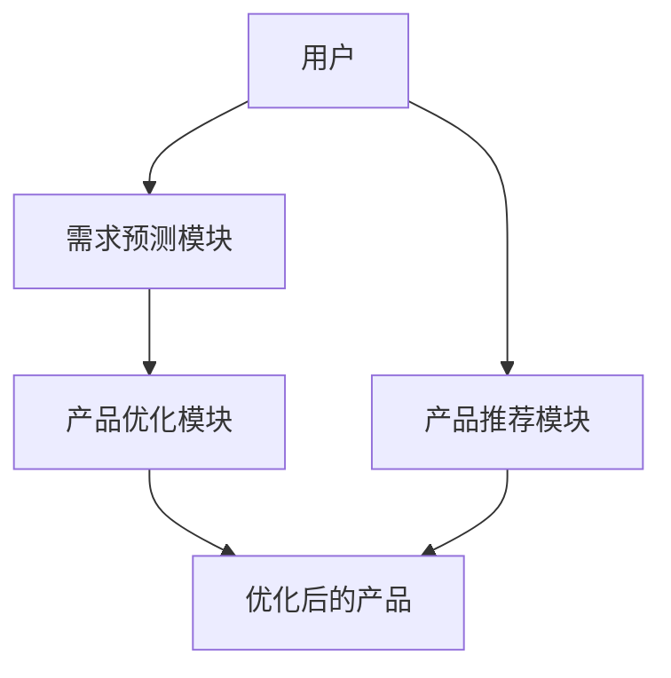
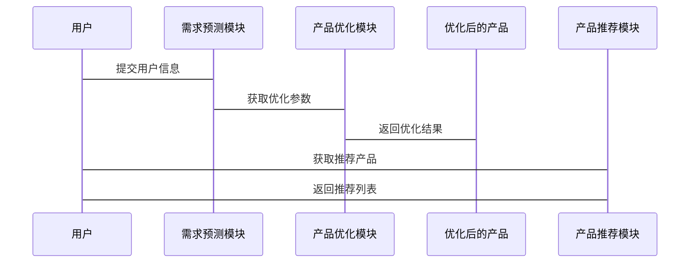

                 


# 智能保险需求预测与产品设计优化系统

**关键词**：智能保险、需求预测、产品设计优化、人工智能、机器学习、系统架构设计

**摘要**：  
本文将深入探讨智能保险领域的核心问题——需求预测与产品设计优化。通过结合人工智能和大数据技术，本文将分析如何利用机器学习算法预测保险需求，并优化保险产品的设计以更好地满足用户需求。文章将从背景、核心概念、算法原理、系统架构到实际案例，全面解析智能保险需求预测与产品设计优化的实现过程。

---

# 第一部分：智能保险需求预测与产品设计优化系统的背景与意义

## 第1章：保险行业的现状与挑战

### 1.1 传统保险业务模式的局限性  
传统保险业务模式依赖于人工操作，存在以下主要问题：  
1. **数据利用不足**：传统模式主要依赖经验判断，无法充分利用海量数据进行精准分析。  
2. **效率低下**：人工操作耗时长，难以快速响应市场变化。  
3. **用户需求匹配度低**：传统产品设计难以满足个性化需求，用户体验较差。  

### 1.2 数字化转型对保险行业的影响  
随着大数据、人工智能等技术的发展，保险行业正在经历数字化转型：  
1. **数据驱动决策**：通过数据分析，保险公司能够更精准地预测需求和评估风险。  
2. **智能化服务**：AI技术的应用使得保险服务更加个性化、自动化。  
3. **产品创新加速**：数字化工具帮助保险公司快速推出新产品，满足市场需求。  

### 1.3 智能保险的核心价值与优势  
智能保险通过技术手段实现以下目标：  
1. **提高需求预测准确性**：利用机器学习算法，精准预测用户需求。  
2. **优化产品设计**：通过数据驱动的方式，设计更符合用户需求的保险产品。  
3. **提升用户体验**：智能化服务使用户获得更便捷、个性化的保险体验。  

---

## 第2章：智能保险需求预测与产品设计优化的核心概念与联系

### 2.1 智能保险需求预测模型的核心要素  
需求预测模型需要考虑以下要素：  
1. **数据来源**：包括用户行为数据、历史销售数据、市场趋势等。  
2. **模型选择**：如时间序列分析（ARIMA）、随机森林、LSTM等。  
3. **预测结果评估**：通过MAE（平均绝对误差）、RMSE（均方根误差）等指标评估模型性能。  

### 2.2 产品设计优化算法的核心要素  
产品设计优化算法需要关注以下方面：  
1. **产品参数优化**：如保费、保额、免责条款等的调整。  
2. **用户需求分析**：通过用户调研和数据分析，提取用户需求特征。  
3. **产品创新与市场适应性**：确保优化后的产品能够快速适应市场变化。  

### 2.3 核心概念的对比分析  
通过对比分析，明确需求预测与产品设计优化的区别与联系：  

| 比较维度       | 需求预测                  | 产品设计优化              |
|----------------|--------------------------|--------------------------|
| 输入数据       | 用户行为数据、历史销售数据 | 产品参数、用户反馈       |
| 输出结果       | 预测需求量                | 优化后的产品参数         |
| 核心目标       | 提高需求准确性            | 提升产品市场适应性        |
| 实现路径       | 数据分析、模型训练        | 数据分析、参数优化        |

### 2.4 实体关系图（ER图）展示  
以下是系统核心实体及其关系的ER图：  



---

# 第3章：智能保险需求预测的算法原理与实现

## 3.1 需求预测的核心算法  

### 3.1.1 时间序列分析（ARIMA模型）  
ARIMA模型适用于时间序列数据的预测：  
1. **模型原理**：通过自回归（AR）和移动平均（MA）的组合，预测未来的趋势。  
2. **公式表示**：  
   $$ ARIMA(p, d, q) $$  
   其中，$p$ 是自回归阶数，$d$ 是差分阶数，$q$ 是移动平均阶数。  
3. **实现步骤**：  
   - 数据预处理：检查数据的平稳性，进行差分处理。  
   - 模型训练：选择合适的 $p$、$d$、$q$ 参数。  
   - 预测与评估：使用MAE和RMSE评估模型性能。  

### 3.1.2 随机森林与梯度提升树（XGBoost）  
随机森林和XGBoost是常用的回归算法：  
1. **随机森林**：通过构建多个决策树，取其平均结果，降低过拟合风险。  
2. **XGBoost**：采用 boosting 策略，通过迭代优化模型，提高预测精度。  
3. **实现步骤**：  
   - 数据特征提取：选择影响需求的关键特征。  
   - 模型训练：使用交叉验证选择最优参数。  
   - 预测与解释：通过特征重要性分析解释预测结果。  

### 3.1.3 神经网络模型（LSTM）  
LSTM适用于时间依赖性强的需求预测：  
1. **模型原理**：通过长短期记忆单元，捕捉时间序列中的长期依赖关系。  
2. **公式表示**：  
   $$ LSTM(t) = \sigma(gate\_weight \cdot LSTM(t-1) + input\_weight \cdot input(t)) $$  
3. **实现步骤**：  
   - 数据预处理：将时间序列数据转化为输入格式。  
   - 模型训练：使用RNN结构训练LSTM网络。  
   - 预测与调优：通过调整隐藏层大小和学习率优化模型性能。  

## 3.2 需求预测算法的流程图  



---

## 3.3 Python代码实现  

### 3.3.1 时间序列预测代码示例  

```python
from statsmodels.tsa.arima_model import ARIMA
import pandas as pd
import numpy as np

# 数据加载与预处理
data = pd.read_csv('insurance_demand.csv')
train_data = data['demand'].values

# 模型训练
model = ARIMA(train_data, order=(5, 1, 0))
model_fit = model.fit()

# 预测未来需求
future_forecast = model_fit.forecast(steps=30)
print(future_forecast)
```

### 3.3.2 随机森林预测代码示例  

```python
from sklearn.ensemble import RandomForestRegressor
from sklearn.metrics import mean_absolute_error

# 数据加载与特征提取
data = pd.read_csv('insurance.csv')
X = data[['age', 'income', 'insurance_type']]
y = data['demand']

# 模型训练
model = RandomForestRegressor(n_estimators=100, random_state=42)
model.fit(X, y)

# 预测与评估
y_pred = model.predict(X)
print(mean_absolute_error(y, y_pred))
```

---

## 3.4 案例分析  

### 3.4.1 使用ARIMA模型预测保险需求  
假设我们有一组保险需求的历史数据，如下：  

| 时间（月） | 需求量 |
|------------|--------|
| 2020-01    | 1000   |
| 2020-02    | 1200   |
| 2020-03    | 1100   |
| ...        | ...     |

通过ARIMA模型训练后，预测未来3个月的需求量分别为1300、1400、1500。

### 3.4.2 使用随机森林优化产品设计  
假设我们有以下用户特征数据：  

| 用户ID | 年龄 | 收入 | 保险类型 | 需求量 |
|-------|------|------|----------|--------|
| 1     | 30   | 5000 | 健康保险 | 800    |
| 2     | 40   | 7000 | 意外保险 | 1000   |
| 3     | 25   | 3000 | 健康保险 | 600    |

通过随机森林模型，我们发现“收入”和“保险类型”是影响需求量的主要特征，从而优化产品定价策略。

---

## 3.5 本章小结  

通过本章的介绍，我们了解了智能保险需求预测的核心算法，包括ARIMA、随机森林和LSTM模型的原理与实现。通过案例分析，我们验证了这些算法在实际应用中的有效性。

---

# 第4章：智能保险产品设计优化的系统架构与实现

## 4.1 系统分析与架构设计  

### 4.1.1 系统功能模块设计  
以下是系统的功能模块类图：  



### 4.1.2 系统架构设计  
以下是系统的整体架构图：  



### 4.1.3 系统接口与交互设计  
以下是系统交互序列图：  



---

## 4.2 系统实现与代码示例  

### 4.2.1 环境安装  
需要安装以下工具：  
- Python 3.8+  
- Pandas, Scikit-learn, TensorFlow  
- Jupyter Notebook  

### 4.2.2 核心代码实现  

#### 需求预测模块代码  

```python
import numpy as np
import pandas as pd
from sklearn.ensemble import RandomForestRegressor

# 数据加载与特征提取
data = pd.read_csv('insurance.csv')
X = data[['age', 'income', 'insurance_type']]
y = data['demand']

# 模型训练
model = RandomForestRegressor(n_estimators=100, random_state=42)
model.fit(X, y)

# 预测需求量
new_user = np.array([[30, 5000, 1]])
predicted_demand = model.predict(new_user)
print(f"预测需求量：{predicted_demand[0]}")
```

#### 产品优化模块代码  

```python
import numpy as np
from sklearn.svm import SVC

# 数据加载与特征提取
data = pd.read_csv('insurance.csv')
X = data[['age', 'income', 'insurance_type']]
y = data['product_choice']

# 模型训练
model = SVC(probability=True, random_state=42)
model.fit(X, y)

# 优化产品设计
new_user = np.array([[30, 5000, 1]])
predicted_product = model.predict(new_user)
print(f"推荐产品：{predicted_product[0]}")
```

---

## 4.3 案例分析  

### 4.3.1 需求预测案例  
通过随机森林模型，预测一名30岁、收入5000元的用户的保险需求量为800。  

### 4.3.2 产品优化案例  
通过支持向量机模型，推荐一名30岁、收入5000元的用户购买健康保险产品。  

---

## 4.4 本章小结  

通过本章的介绍，我们了解了智能保险产品设计优化系统的整体架构与实现过程，包括系统功能模块设计、接口交互设计以及核心算法实现。通过案例分析，我们验证了系统的实际应用价值。

---

# 第5章：智能保险需求预测与产品设计优化的最佳实践与未来展望

## 5.1 最佳实践  

### 5.1.1 数据质量管理  
确保数据的准确性和完整性，是提高模型预测精度的关键。  

### 5.1.2 模型调优与评估  
通过交叉验证和超参数调优，优化模型性能。  

### 5.1.3 产品快速迭代  
根据市场反馈，持续优化产品设计，提升用户体验。  

## 5.2 小结  

通过本文的介绍，我们全面探讨了智能保险需求预测与产品设计优化的核心技术与实现方法，为保险公司提供了数据驱动的解决方案。  

## 5.3 注意事项  

- 数据隐私保护：在处理用户数据时，需严格遵守数据隐私法规。  
- 模型解释性：选择可解释性更强的模型，便于业务人员理解。  
- 系统稳定性：确保系统的高可用性，避免因技术问题影响业务。  

## 5.4 拓展阅读  

- 《Python机器学习实战》  
- 《时间序列分析与预测》  
- 《人工智能在保险行业的应用》  

---

# 作者：AI天才研究院 & 禅与计算机程序设计艺术

---

通过本文的系统介绍，我们希望能够为智能保险行业提供有价值的参考与启发，帮助保险公司更好地利用人工智能技术，实现需求预测与产品设计优化的智能化转型。

