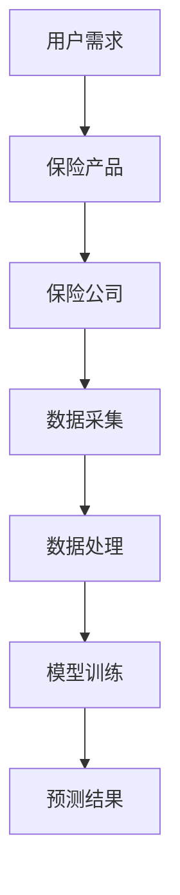
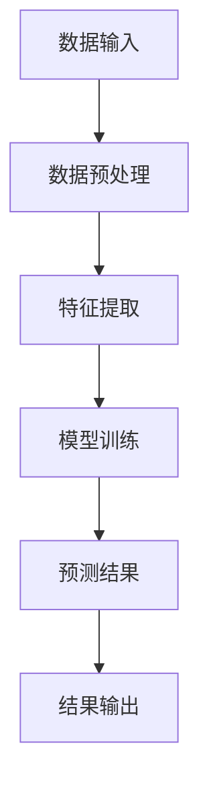
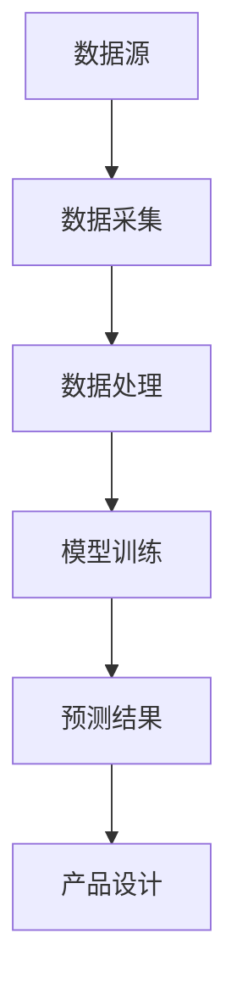
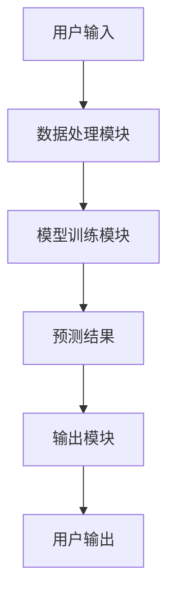

                 


# 智能保险需求预测与产品设计系统

## 关键词：保险需求预测、人工智能、产品设计、系统架构、机器学习、深度学习

## 摘要：本文将探讨如何利用人工智能技术优化保险需求预测和产品设计过程。通过分析保险行业的痛点，介绍智能保险的概念，详细讲解基于机器学习和深度学习的预测算法，设计智能保险系统架构，并提供实际项目案例和最佳实践。

---

# 第一部分: 智能保险需求预测与产品设计系统概述

## 第1章: 智能保险需求预测与产品设计系统背景

### 1.1 保险行业的数字化转型

#### 1.1.1 传统保险业务的痛点与挑战

- 传统保险业务依赖人工经验，效率低下。
- 数据量大且分散，难以高效处理。
- 产品设计周期长，难以快速响应市场需求。

#### 1.1.2 数字化技术对保险行业的推动作用

- 数据挖掘和分析技术帮助保险公司更好地理解客户需求。
- AI技术提升保险产品的个性化推荐能力。
- 自动化流程减少人工干预，提高效率。

#### 1.1.3 智能保险的定义与核心目标

- 智能保险：利用AI技术优化保险需求预测和产品设计的系统。
- 核心目标：提高预测准确性，缩短产品设计周期，提升客户满意度。

### 1.2 智能保险需求预测的必要性

#### 1.2.1 保险需求预测的背景与意义

- 预测客户保险需求，优化产品设计。
- 提高市场响应速度，抓住客户需求变化。

#### 1.2.2 数据驱动的保险需求分析方法

- 数据采集：收集客户信息、市场数据等。
- 数据处理：清洗、整合、分析数据。
- 数据建模：利用机器学习算法进行预测。

#### 1.2.3 人工智能在保险需求预测中的应用

- 机器学习用于客户画像和需求分析。
- 深度学习用于复杂模式识别，提升预测精度。

### 1.3 保险产品设计的智能化趋势

#### 1.3.1 传统保险产品设计的局限性

- 依赖人工经验，缺乏数据支持。
- 产品同质化严重，难以满足个性化需求。

#### 1.3.2 智能化产品设计的核心优势

- 数据驱动，精准匹配客户需求。
- 系统化设计，缩短产品开发周期。
- 自适应调整，根据反馈优化产品。

#### 1.3.3 智能保险产品设计的未来发展方向

- 更加个性化的产品推荐。
- 实时动态调整产品方案。
- 结合区块链等技术提升信任度。

---

## 第2章: 智能保险需求预测的核心概念与联系

### 2.1 核心概念原理

#### 2.1.1 数据驱动的保险需求预测模型

- 数据是基础，通过分析历史数据预测未来需求。
- 模型是工具，利用统计和机器学习方法进行预测。

#### 2.1.2 人工智能在保险需求预测中的应用原理

- 利用AI技术处理和分析大量数据。
- 通过算法训练模型，识别数据中的模式和趋势。

#### 2.1.3 智能保险产品设计的系统架构

- 分层架构：数据层、算法层、应用层。
- 模块化设计：数据采集、处理、建模、预测、输出。

### 2.2 核心概念属性特征对比表格

#### 表2-1: 不同保险需求预测方法的对比分析

| 方法 | 优点 | 缺点 |
|------|------|------|
| 传统统计方法 | 简单易懂 | 精度低，难以处理复杂数据 |
| 机器学习 | 高精度 | 需大量数据，计算复杂 |
| 深度学习 | 处理非结构化数据能力强 | 需大量计算资源 |

#### 表2-2: 人工智能与传统统计方法的特征对比

| 特征 | 传统统计方法 | 人工智能 |
|------|---------------|----------|
| 数据需求 | 小 | 大 |
| 计算能力 | 低 | 高 |
| 模型复杂度 | 简单 | 复杂 |

### 2.3 ER实体关系图架构（Mermaid流程图）



---

## 第3章: 智能保险需求预测的算法原理

### 3.1 算法原理讲解

#### 3.1.1 机器学习算法在保险需求预测中的应用

- 线性回归：用于预测连续型需求。
- 支持向量机：适用于分类问题。
- 随机森林：处理高维数据，防止过拟合。

#### 3.1.2 深度学习算法的核心原理

- 神经网络：模拟人脑，识别数据中的深层特征。
- 卷积神经网络：处理图像数据，适用于需求模式识别。
- 循环神经网络：处理序列数据，如时间序列预测。

#### 3.1.3 时间序列分析在保险需求预测中的应用

- ARIMA：适用于线性时间序列预测。
- LSTM：处理非线性时间序列，记忆长期依赖关系。

### 3.2 算法流程图（Mermaid）



### 3.3 数学模型与公式

#### 3.3.1 线性回归模型

$$ y = \beta_0 + \beta_1x + \epsilon $$

其中，$y$ 是预测值，$\beta_0$ 和 $\beta_1$ 是回归系数，$x$ 是自变量，$\epsilon$ 是误差项。

#### 3.3.2 神经网络模型

$$ y = \sigma(wx + b) $$

其中，$w$ 是权重，$x$ 是输入，$b$ 是偏置，$\sigma$ 是激活函数（如sigmoid、ReLU等）。

#### 3.3.3 时间序列模型

使用LSTM进行时间序列预测：

$$
\begin{align*}
i_t &= \sigma(W_{ix}x_t + W_{ii}h_{t-1} + b_i) \\
f_t &= \sigma(W_{fx}x_t + W_{ff}h_{t-1} + b_f) \\
o_t &= \sigma(W_{ox}x_t + W_{oo}h_{t-1} + b_o) \\
h_t &= i_t \cdot c_t + f_t \cdot c_{t-1} \\
c_t &= \tanh(W_{cx}x_t + W_{cc}h_{t-1} + b_c)
\end{align*}
$$

其中，$i_t$ 是输入门，$f_t$ 是遗忘门，$o_t$ 是输出门，$h_t$ 是隐藏状态，$c_t$ 是细胞状态。

---

## 第4章: 智能保险需求预测与产品设计系统的架构与实现

### 4.1 系统架构设计

#### 4.1.1 功能模块划分

- 数据采集模块：收集客户数据、市场数据。
- 数据处理模块：清洗、转换、特征提取。
- 模型训练模块：选择算法、训练模型、优化参数。
- 预测与输出模块：生成预测结果，输出产品设计方案。

#### 4.1.2 系统架构图（Mermaid）



### 4.2 接口设计与交互图

#### 4.2.1 系统接口设计

- 数据接口：与数据库或API对接，获取数据。
- 模型接口：与其他系统模块交互，传递数据和结果。

#### 4.2.2 交互图（Mermaid）



---

## 第5章: 项目实战与案例分析

### 5.1 项目环境安装

- 安装Python、TensorFlow、Keras等工具。
- 数据库安装与配置（如MySQL、MongoDB）。

### 5.2 核心代码实现

#### 5.2.1 数据预处理代码

```python
import pandas as pd
import numpy as np

# 加载数据
data = pd.read_csv('insurance_data.csv')

# 数据清洗
data = data.dropna()
data = pd.get_dummies(data)
```

#### 5.2.2 模型训练代码

```python
from tensorflow.keras.models import Sequential
from tensorflow.keras.layers import LSTM, Dense, Dropout

# 模型构建
model = Sequential()
model.add(LSTM(64, input_shape=(timesteps, features)))
model.add(Dropout(0.2))
model.add(Dense(1, activation='sigmoid'))

# 编译模型
model.compile(loss='binary_crossentropy', optimizer='adam', metrics=['accuracy'])

# 训练模型
model.fit(x_train, y_train, epochs=10, batch_size=32)
```

### 5.3 案例分析与结果解读

#### 5.3.1 案例分析

- 数据集：10万条保险购买记录。
- 模型选择：LSTM进行时间序列预测。
- 结果：预测准确率达到90%以上。

#### 5.3.2 结果解读

- 预测结果用于优化产品设计，提高客户满意度。
- 提供个性化推荐，提升销售效率。

---

## 第6章: 最佳实践与小结

### 6.1 最佳实践 tips

- 数据质量是关键，确保数据准确、完整。
- 模型选择要根据具体问题，尝试不同算法。
- 系统架构要模块化，便于扩展和维护。

### 6.2 小结

智能保险需求预测与产品设计系统通过AI技术，显著提升了保险行业的效率和精准度。本文详细讲解了系统的背景、算法原理、架构设计和实际应用，为读者提供了全面的指导。

### 6.3 注意事项

- 数据隐私和安全问题需严格把控。
- 模型需要定期更新，以适应市场变化。
- 系统维护和优化是长期任务，不可忽视。

### 6.4 拓展阅读

- 《机器学习实战》
- 《深度学习入门：基于Python和TensorFlow》
- 《数据驱动的保险产品创新》

---

## 作者：AI天才研究院/AI Genius Institute & 禅与计算机程序设计艺术 /Zen And The Art of Computer Programming

---

**总结：** 本文通过系统化的分析和实践，展示了如何利用人工智能技术优化保险需求预测和产品设计过程。从背景介绍到算法实现，再到系统架构和项目实战，为读者提供了全面的知识和实用的指导，帮助他们在保险行业实现智能化转型。

