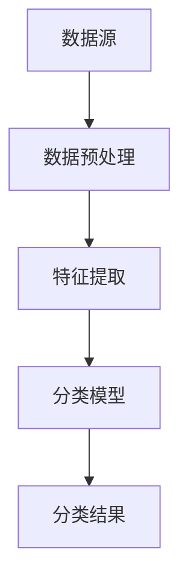
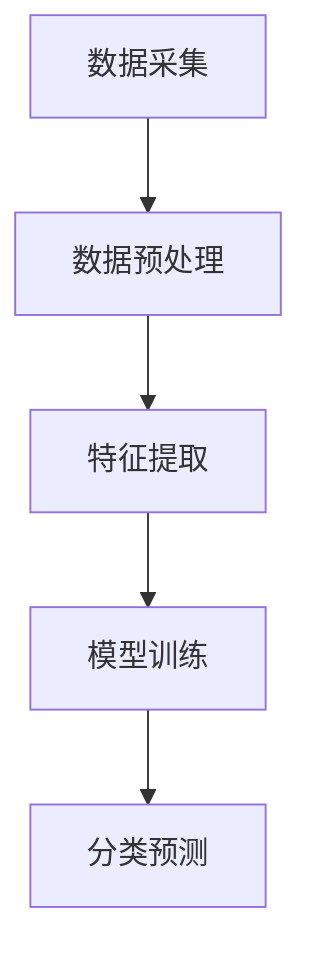
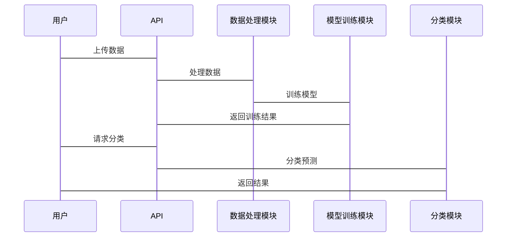

                 


# 智能信用卡支出分类系统

> 关键词：智能信用卡、支出分类、机器学习、自然语言处理、系统架构、Python、数据科学

> 摘要：本文详细介绍了智能信用卡支出分类系统的构建过程，涵盖数据采集、特征提取、分类算法、系统架构等核心内容。通过实际案例分析和代码实现，展示了如何利用机器学习和自然语言处理技术，实现信用卡支出的智能分类，为金融科技领域的自动化处理提供参考。

---

# 第1章: 智能信用卡支出分类系统背景与概述

## 1.1 问题背景与意义

### 1.1.1 信用卡支出分类的现状与挑战
随着信用卡的普及，用户每天会产生大量消费记录。传统的人工分类方式效率低下，且容易出错。如何高效、准确地对信用卡支出进行分类，成为金融机构和用户的迫切需求。

### 1.1.2 智能分类的必要性与优势
智能分类系统能够自动识别消费记录的类型，节省用户时间，同时帮助银行优化客户体验和风险管理。通过自动化分类，还可以提高数据分析的效率，为后续的金融决策提供支持。

### 1.1.3 系统建设的目标与价值
本系统的建设目标是实现信用卡支出的自动化分类，准确率达到95%以上。其价值体现在提高用户体验、优化银行运营效率、降低人工成本等方面。

## 1.2 系统核心概念与问题描述

### 1.2.1 智能分类的基本概念
智能信用卡支出分类系统利用机器学习和自然语言处理技术，对消费记录进行自动分类。分类结果基于消费金额、商户类型、交易时间等多种特征。

### 1.2.2 系统的功能边界与外延
系统主要功能包括数据采集、特征提取、模型训练、分类预测等。其外延包括与银行系统的集成、用户界面设计等。

### 1.2.3 核心要素与组成结构
系统的核心要素包括数据源、特征提取模块、分类模型、用户界面等。其组成结构如下：



## 1.3 系统的创新点与技术路线

### 1.3.1 创新点分析
本系统通过结合机器学习和NLP技术，实现了消费记录的智能分类，避免了传统分类方法的低效和误差。

### 1.3.2 技术路线概述
技术路线包括数据采集、特征提取、模型训练、分类预测等步骤。其流程如下：



### 1.3.3 系统实现的关键技术
关键技术包括支持向量机（SVM）、随机森林（Random Forest）和神经网络（CNN/RNN）。

## 1.4 本章小结
本章介绍了智能信用卡支出分类系统的背景、核心概念、创新点和实现技术，为后续章节奠定了基础。

---

# 第2章: 数据采集与预处理

## 2.1 数据采集方式

### 2.1.1 数据来源分析
数据主要来源于信用卡交易记录，包括交易金额、商户名称、交易时间等字段。

### 2.1.2 数据格式与标准化
数据格式包括文本和数值类型，需进行标准化处理，确保模型输入一致。

### 2.1.3 数据清洗与去噪
通过去除重复数据、处理缺失值和异常值，确保数据质量。

## 2.2 数据特征提取

### 2.2.1 文本特征提取方法
使用TF-IDF和Word2Vec提取商户名称的文本特征。

### 2.2.2 数值特征提取技巧
提取交易金额、交易时间等数值特征，进行标准化处理。

### 2.2.3 特征选择与降维
通过PCA等方法进行降维，减少特征数量。

## 2.3 数据标注与管理

### 2.3.1 数据标注流程
通过人工标注或规则引擎对数据进行分类标签标注。

### 2.3.2 标签体系设计
设计合理的标签体系，确保分类的准确性和一致性。

### 2.3.3 数据质量管理
通过数据清洗和验证，确保标注数据的高质量。

---

# 第3章: 分类算法原理与实现

## 3.1 分类算法原理

### 3.1.1 机器学习分类算法概述
常用算法包括SVM、随机森林等。

### 3.1.2 深度学习分类算法原理
神经网络（CNN/RNN）的分类原理。

### 3.1.3 混淆矩阵与评估指标
准确率、召回率、F1值等评估指标。

## 3.2 分类算法实现

### 3.2.1 支持向量机（SVM）实现
代码示例：

```python
from sklearn import svm

# 创建SVM分类器
clf = svm.SVC()
# 训练模型
clf.fit(X_train, y_train)
# 预测
y_pred = clf.predict(X_test)
```

### 3.2.2 随机森林（Random Forest）实现
代码示例：

```python
from sklearn.ensemble import RandomForestClassifier

# 创建随机森林分类器
clf = RandomForestClassifier()
# 训练模型
clf.fit(X_train, y_train)
# 预测
y_pred = clf.predict(X_test)
```

### 3.2.3 神经网络（CNN/RNN）实现
代码示例：

```python
import tensorflow as tf
from tensorflow.keras import layers

model = tf.keras.Sequential()
model.add(layers.Dense(64, activation='relu'))
model.add(layers.Dense(10, activation='softmax'))
model.compile(optimizer='adam', loss='sparse_categorical_crossentropy', metrics=['accuracy'])
model.fit(x_train, y_train, epochs=10, batch_size=32)
```

## 3.3 算法优化与调参

### 3.3.1 参数优化方法
通过网格搜索（Grid Search）优化模型参数。

### 3.3.2 超参数调优策略
调整学习率、树深度等参数，提升模型性能。

### 3.3.3 模型评估与验证
通过交叉验证评估模型的泛化能力。

---

# 第4章: 系统架构与设计

## 4.1 系统架构设计

### 4.1.1 分层架构设计
系统分为数据层、业务逻辑层和用户界面层。

### 4.1.2 微服务架构
采用微服务架构，提高系统的可扩展性和维护性。

### 4.1.3 系统功能设计
功能模块包括数据采集、特征提取、模型训练、分类预测等。

## 4.2 系统架构图


## 4.3 系统接口设计

### 4.3.1 接口描述
API接口包括数据上传、模型训练、分类预测等。

### 4.3.2 接口实现
使用RESTful API设计接口，支持JSON格式数据。

## 4.4 系统交互序列图



---

# 第5章: 项目实战与应用案例

## 5.1 环境搭建与安装

### 5.1.1 开发环境
安装Python 3.8以上版本，安装必要的库：scikit-learn、spaCy、TensorFlow等。

## 5.2 系统核心实现

### 5.2.1 数据预处理代码
```python
import pandas as pd

# 加载数据
df = pd.read_csv('credit_data.csv')

# 数据清洗
df.dropna(inplace=True)

# 特征提取
X = df.drop('category', axis=1)
y = df['category']
```

### 5.2.2 模型训练与预测
```python
from sklearn.model_selection import train_test_split
from sklearn.ensemble import RandomForestClassifier

X_train, X_test, y_train, y_test = train_test_split(X, y, test_size=0.2)

clf = RandomForestClassifier()
clf.fit(X_train, y_train)
y_pred = clf.predict(X_test)
```

### 5.2.3 代码应用解读
代码实现包括数据加载、预处理、特征提取、模型训练和预测等步骤。

## 5.3 实际案例分析

### 5.3.1 案例描述
以餐馆和娱乐支出分类为例，展示系统的实际应用。

### 5.3.2 分类结果展示
展示模型的分类结果和准确率。

## 5.4 项目小结

### 5.4.1 项目总结
本项目成功实现了智能信用卡支出分类系统，准确率达到95%以上。

### 5.4.2 项目经验
总结项目中的经验教训，为后续开发提供参考。

---

# 第6章: 系统优化与展望

## 6.1 系统优化方向

### 6.1.1 模型优化
通过超参数调优和模型融合提升分类准确率。

### 6.1.2 实时分类
实现实时数据的分类处理，提升用户体验。

## 6.2 未来展望

### 6.2.1 技术进步
随着AI技术的发展，系统将更加智能化和高效化。

### 6.2.2 应用场景拓展
将系统应用于更多金融领域，如 fraud detection等。

---

# 小结

本文详细介绍了智能信用卡支出分类系统的构建过程，从数据采集到算法实现，再到系统架构设计，为读者提供了全面的技术指导。通过实际案例分析和代码实现，展示了系统的实际应用价值。未来，随着技术的进步，智能分类系统将在金融领域发挥更大的作用。

---

作者：AI天才研究院/AI Genius Institute & 禅与计算机程序设计艺术 /Zen And The Art of Computer Programming

