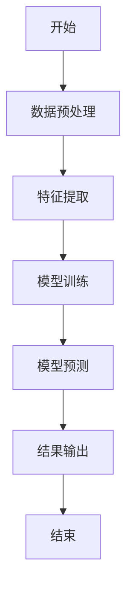
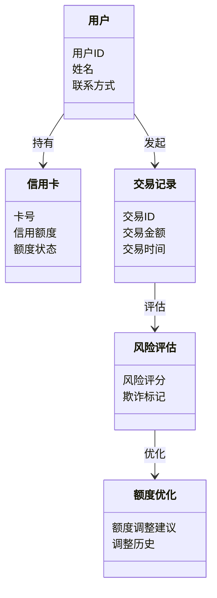
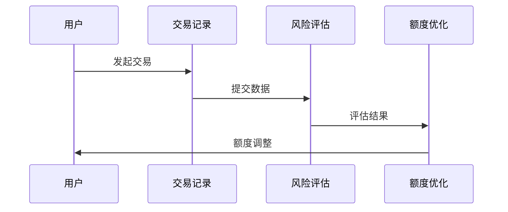

                 


# 《智能信用卡额度优化与风险控制系统》

## 关键词：智能信用卡、额度优化、风险控制、人工智能、系统设计

## 摘要：本文系统地探讨了智能信用卡额度优化与风险控制系统的构建，从背景、核心概念到算法原理、系统架构，再到项目实战和总结，全面解析了该系统的实现过程。通过详细讲解，读者可以掌握如何利用人工智能技术优化信用卡额度，并有效控制风险，确保系统安全性和用户满意度。

---

# 第一部分：智能信用卡额度优化与风险控制系统概述

## 第1章：背景介绍

### 1.1 问题背景
#### 1.1.1 传统信用卡额度管理的痛点
传统信用卡额度管理依赖人工审核，存在效率低、误差大、成本高等问题。随着金融业务的复杂化，传统方法难以满足实时性和精准性的需求。

#### 1.1.2 风险控制在信用卡业务中的重要性
信用卡业务中的风险控制直接关系到金融机构的资产安全和用户信用评估。传统方法难以应对复杂的欺诈行为和信用风险。

#### 1.1.3 人工智能在金融领域的应用趋势
人工智能技术的发展为金融领域的智能化转型提供了有力支持，特别是在信用卡额度优化和风险控制方面，AI技术的应用越来越广泛。

### 1.2 问题描述
#### 1.2.1 信用卡额度优化的核心问题
如何根据用户的信用状况、消费行为等多维数据，动态调整信用卡额度，以提高用户满意度和机构收益。

#### 1.2.2 风险控制的关键挑战
如何在海量交易数据中识别潜在风险，及时预警和处理，降低欺诈交易和信用违约的风险。

#### 1.2.3 系统化解决方案的必要性
通过系统化的解决方案，整合多源数据，利用智能算法，实现信用卡额度的动态优化和风险的实时控制。

### 1.3 问题解决
#### 1.3.1 智能信用卡额度优化的目标
目标是实现信用卡额度的动态调整，提高用户满意度和机构收益，同时降低风险。

#### 1.3.2 风险控制的智能化路径
通过机器学习和大数据分析，建立风险评估模型，实现对潜在风险的实时监控和预警。

#### 1.3.3 系统化解决方案的框架
整合多源数据，构建智能算法模型，设计高效的系统架构，实现信用卡额度优化和风险控制的系统化解决方案。

### 1.4 边界与外延
#### 1.4.1 系统的边界定义
系统主要针对信用卡用户的信用评估和风险控制，边界清晰，功能模块明确。

#### 1.4.2 相关领域的外延
涉及大数据分析、机器学习、人工智能等技术领域，同时也关联到金融监管和用户隐私保护。

#### 1.4.3 系统与外部环境的交互
系统与外部数据源（如征信机构、交易数据等）进行数据交互，同时与前端系统（如银行系统、用户界面）进行信息传递。

### 1.5 核心要素组成
#### 1.5.1 数据驱动的特征
系统依赖于多源、多维的实时数据，通过数据分析和建模，实现信用卡额度的动态优化。

#### 1.5.2 智能算法的核心作用
利用机器学习算法（如随机森林、神经网络）进行风险评估和信用评分，实现精准的额度调整和风险控制。

#### 1.5.3 系统架构的关键组成部分
系统架构包括数据采集、数据处理、模型训练、风险评估、额度优化和系统决策等核心模块。

### 1.6 本章小结
通过本章的介绍，读者可以理解智能信用卡额度优化与风险控制系统的背景、问题、目标以及核心要素，为后续章节的学习奠定基础。

---

# 第二部分：核心概念与联系

## 第2章：核心概念与联系

### 2.1 核心概念原理
#### 2.1.1 智能信用卡额度优化的原理
通过机器学习算法对用户行为数据进行分析，预测用户的信用风险，动态调整信用卡额度。

#### 2.1.2 风险控制的核心机制
利用大数据分析和智能算法，实时监控交易数据，识别潜在风险，采取相应的控制措施。

#### 2.1.3 人工智能在系统中的应用
人工智能技术贯穿于数据采集、特征提取、模型训练和预测等环节，实现系统的智能化运作。

### 2.2 核心概念属性特征对比
以下表格展示了智能信用卡额度优化和风险控制的核心概念属性特征对比：

| 属性 | 额度优化 | 风险控制 |
|------|----------|----------|
| 数据来源 | 用户信用记录、消费行为 | 交易数据、用户行为、信用评分 |
| 核心算法 | 线性回归、随机森林 | 支持向量机、神经网络 |
| 输出结果 | 动态额度调整 | 风险评分、欺诈预警 |
| 目标 | 提高用户满意度和收益 | 降低风险损失 |

### 2.3 ER实体关系图
以下为系统的ER实体关系图，展示了用户、信用卡、交易记录、风险评估和额度优化之间的关系：

```mermaid
er
  actor: 用户
  actor --> credit_card: 持卡人
  credit_card --> transaction: 交易记录
  transaction --> risk_assessment: 风险评估
  risk_assessment --> credit_limit_optimization: 额度优化
  credit_limit_optimization --> system_decision: 系统决策
```

### 2.4 本章小结
通过本章的分析，读者可以清晰理解智能信用卡额度优化和风险控制的核心概念及其相互关系，为后续章节的系统设计和实现奠定理论基础。

---

# 第三部分：算法原理讲解

## 第3章：算法原理

### 3.1 算法原理概述
#### 3.1.1 智能信用卡额度优化算法
基于用户信用评分和消费行为，利用随机森林算法进行额度预测和优化。

#### 3.1.2 风险控制算法
通过支持向量机（SVM）进行风险分类，识别高风险交易并触发预警机制。

#### 3.1.3 算法的核心思想
随机森林和SVM算法分别用于额度优化和风险控制，通过特征提取和模型训练实现精准预测。

### 3.2 算法流程图
以下为智能信用卡额度优化与风险控制系统的算法流程图：



### 3.3 算法数学模型
#### 额度优化模型
随机森林算法用于信用评分预测：

$$ CreditScore = f(UserData) $$

其中，$UserData$ 包括用户的信用历史、收入水平、消费行为等特征。

#### 风险控制模型
支持向量机（SVM）用于欺诈检测：

$$ RiskScore = g(TransactionData) $$

其中，$TransactionData$ 包括交易金额、时间、地点、商户类别等特征。

### 3.4 本章小结
通过本章的详细讲解，读者可以理解智能信用卡额度优化和风险控制系统的算法原理，为后续的系统设计和实现提供理论支持。

---

# 第四部分：系统分析与架构设计

## 第4章：系统分析与架构设计

### 4.1 系统功能设计
#### 4.1.1 系统功能模块
系统主要包括数据采集、数据处理、模型训练、风险评估、额度优化和系统决策等模块。

#### 4.1.2 领域模型
领域模型展示了系统的核心实体及其关系，如下图所示：



#### 4.1.3 系统架构图
系统架构采用分层设计，包括数据层、业务逻辑层和应用层：


#### 4.1.4 系统接口设计
系统主要接口包括数据输入接口、模型训练接口、风险评估接口和额度优化接口。

#### 4.1.5 系统交互序列图
以下是系统交互的序列图，展示了用户发起交易后系统如何进行风险评估和额度优化：



### 4.2 本章小结
通过本章的系统分析与架构设计，读者可以清晰了解智能信用卡额度优化与风险控制系统的整体结构和各模块的功能，为后续的系统实现奠定基础。

---

# 第五部分：项目实战

## 第5章：项目实战

### 5.1 环境安装
#### 5.1.1 系统环境要求
- 操作系统：Linux/Windows/MacOS
- Python版本：3.6及以上
- 硬件要求：具备足够的计算能力，推荐使用云服务器

#### 5.1.2 软件安装
- 安装Python依赖库：numpy、pandas、scikit-learn、xgboost、pymermaid
- 安装Jupyter Notebook或IDE（如PyCharm）

### 5.2 核心代码实现
#### 5.2.1 数据预处理代码
```python
import pandas as pd
import numpy as np

# 加载数据
data = pd.read_csv('credit_data.csv')

# 数据清洗
data = data.dropna()
data = pd.get_dummies(data)
```

#### 5.2.2 额度优化模型实现
```python
from sklearn.ensemble import RandomForestRegressor
from sklearn.metrics import mean_squared_error

# 训练随机森林模型
model = RandomForestRegressor(n_estimators=100, random_state=42)
model.fit(X_train, y_train)

# 预测信用评分
y_pred = model.predict(X_test)
print(mean_squared_error(y_test, y_pred))
```

#### 5.2.3 风险控制模型实现
```python
from sklearn.svm import SVC
from sklearn.metrics import accuracy_score

# 训练SVM模型
model = SVC(C=1.0, gamma='auto')
model.fit(X_train, y_train)

# 预测风险评分
y_pred = model.predict(X_test)
print(accuracy_score(y_test, y_pred))
```

### 5.3 案例分析
#### 5.3.1 实际案例分析
以下是一个实际案例的分析：

假设一位用户的信用评分为750，消费行为稳定，但近期在高风险商户有多笔大额交易。系统通过风险评估模型识别出该用户的交易风险较高，触发预警机制，并建议降低信用卡额度。

#### 5.3.2 系统决策过程
1. 系统接收用户的交易数据。
2. 数据预处理并提取特征。
3. 风险评估模型预测风险评分。
4. 额度优化模型根据风险评分和用户信用状况调整额度。
5. 系统输出调整后的额度和风险预警信息。

### 5.4 本章小结
通过本章的项目实战，读者可以掌握智能信用卡额度优化与风险控制系统的具体实现步骤和代码，加深对系统设计的理解。

---

# 第六部分：总结与扩展

## 第6章：总结与扩展

### 6.1 最佳实践 tips
- 数据质量和实时性是系统性能的关键，建议采用分布式架构和实时数据处理技术。
- 在模型训练中，建议使用交叉验证和超参数调优，提高模型的准确性和泛化能力。
- 系统上线后，建议定期监控模型性能，并根据业务需求进行优化和迭代。

### 6.2 小结
通过本章的总结，读者可以回顾整本书的核心内容和关键点，进一步巩固对智能信用卡额度优化与风险控制系统的理解。

### 6.3 注意事项
- 系统设计和实现过程中，需注意数据隐私和安全问题，确保用户信息的安全。
- 系统上线前，建议进行全面的测试和验证，确保系统的稳定性和可靠性。

### 6.4 拓展阅读
- 《Python机器学习实战》
- 《深入浅出机器学习》
- 《系统设计指南》

---

# 作者：AI天才研究院/AI Genius Institute & 禅与计算机程序设计艺术 /Zen And The Art of Computer Programming

