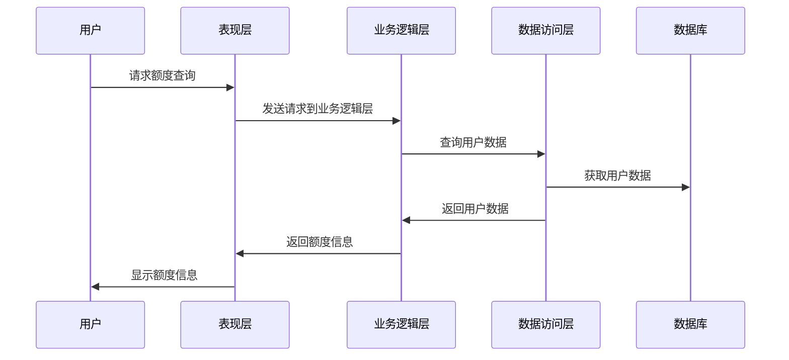

                 


# 智能信用卡额度优化管理系统

> 关键词：智能信用卡、信用卡额度优化、系统管理、人工智能算法、风险管理、系统架构设计、项目实现

> 摘要：智能信用卡额度优化管理系统是一种结合人工智能技术，通过智能算法和风险管理模型，优化信用卡额度管理的系统。本文从系统背景、核心概念、算法原理、系统架构设计、项目实战等多个方面详细阐述了智能信用卡额度优化管理系统的实现过程和应用价值，最后通过实际案例分析展示了系统的优化效果和实际应用。

---

## 第一部分：智能信用卡额度优化管理系统的背景与概念

### 第1章：智能信用卡额度优化管理系统的背景介绍

#### 1.1 传统信用卡额度管理的问题与挑战

- **1.1.1 传统信用卡额度管理的痛点**
  - 人工审核效率低
  - 风险评估不准确
  - 客户体验差

- **1.1.2 传统额度管理的局限性**
  - 数据处理能力有限
  - 规则固定，缺乏灵活性
  - 客户需求多样化

- **1.1.3 智能优化的必要性**
  - 提高效率
  - 降低风险
  - 提升客户满意度

#### 1.2 智能信用卡额度优化管理系统的定义与目标

- **1.2.1 系统的定义**
  - 基于人工智能技术，实现信用卡额度的智能优化管理。

- **1.2.2 系统的核心目标**
  - 实现自动化、智能化的额度管理
  - 提高风险控制能力
  - 提升客户体验

- **1.2.3 系统的边界与外延**
  - 系统边界：信用卡额度的优化与管理
  - 外延：与客户行为分析、信用评估等其他系统的集成

#### 1.3 系统的核心要素与组成结构

- **1.3.1 核心要素分析**
  - 用户数据
  - 额度优化算法
  - 风险管理模型
  - 系统架构

- **1.3.2 组成结构图**
  - 用户数据模块
  - 额度优化模块
  - 风险管理模块
  - 系统管理模块

- **1.3.3 核心概念之间的关系**
  - 用户数据是基础，驱动额度优化和风险管理
  - 额度优化模块和风险管理模块相互依赖，共同实现系统目标

#### 1.4 本章小结

- 本章介绍了智能信用卡额度优化管理系统的背景，分析了传统额度管理的痛点和智能优化的必要性，明确了系统的定义和目标，并分析了系统的核心要素和组成结构。

---

### 第2章：智能信用卡额度优化管理系统的核心概念与联系

#### 2.1 智能优化算法的原理

- **2.1.1 算法的核心原理**
  - 基于机器学习的预测模型
  - 使用历史数据进行训练
  - 通过模型预测最优额度

- **2.1.2 算法的输入输出关系**
  - 输入：用户数据、历史交易记录、信用评分
  - 输出：推荐的信用卡额度

- **2.1.3 算法的优缺点对比**
  - 优点：高效、准确
  - 缺点：需要大量数据支持，模型可能过拟合

#### 2.2 风险管理模型的构建

- **2.2.1 风险管理模型的定义**
  - 用于评估和控制信用卡额度调整带来的风险

- **2.2.2 模型的属性特征对比**
  - 用户信用评分
  - 还款能力评估
  - 消费行为分析

- **2.2.3 模型的优化策略**
  - 基于实时数据的动态调整
  - 结合用户行为分析的风险控制

#### 2.3 系统架构的ER实体关系图

```mermaid
erDiagram
    用户: 用户信息表
    [
        用户ID : integer
        用户名 : string
        年龄 : integer
        性别 : string
        身份证号 : string
    ]
    信用卡 : 信用卡信息表
    [
        信用卡ID : integer
        用户ID : integer
        信用卡类型 : string
        信用额度 : integer
        开卡时间 : date
    ]
    交易记录 : 交易记录表
    [
        交易ID : integer
        用户ID : integer
        交易金额 : integer
        交易时间 : datetime
        交易地点 : string
    ]
    风险评估 : 风险评估表
    [
        评估ID : integer
        用户ID : integer
        评估时间 : datetime
        风险评分 : float
    ]
    用户 --> 信用卡 : 用户拥有信用卡
    用户 --> 交易记录 : 用户进行交易
    信用卡 --> 风险评估 : 信用卡风险评估
    交易记录 --> 风险评估 : 交易影响风险评估
```

#### 2.4 本章小结

- 本章详细讲解了智能优化算法的原理及其优缺点，分析了风险管理模型的构建和优化策略，并通过ER实体关系图展示了系统架构的核心概念之间的关系。

---

### 第3章：智能信用卡额度优化系统的算法原理

#### 3.1 额度优化算法的数学模型

- **3.1.1 线性回归模型**
  - 基于用户的历史消费数据，预测用户的信用额度
  - 公式：$$ y = \beta_0 + \beta_1x + \epsilon $$
  - 其中，y是预测的信用额度，x是用户的消费数据，$$ \beta_0 $$和$$ \beta_1 $$是回归系数，$$ \epsilon $$是误差项。

- **3.1.2 决策树算法**
  - 基于信息增益进行特征选择
  - 适用于分类问题，但也可以用于回归问题
  - 通过递归分割数据，构建决策树

- **3.1.3 支持向量机（SVM）**
  - 在特征空间中寻找一个超平面，使得正负样本分开
  - 适用于高维数据的分类和回归

#### 3.2 算法实现的Python代码示例

```python
from sklearn.tree import DecisionTreeRegressor
import numpy as np

# 示例数据
X = np.array([[20000], [40000], [60000], [80000], [100000]])
y = np.array([25000, 30000, 40000, 50000, 60000])

# 训练模型
model = DecisionTreeRegressor()
model.fit(X, y)

# 预测新数据
new_X = np.array([[50000]])
predicted_y = model.predict(new_X)
print(predicted_y)
```

#### 3.3 算法的优缺点对比

- 线性回归：简单易懂，但可能无法捕捉复杂关系
- 决策树：易于解释，但可能存在过拟合风险
- 支持向量机：适用于高维数据，但计算复杂度高

#### 3.4 本章小结

- 本章详细讲解了额度优化算法的数学模型和具体实现，通过对比不同算法的优缺点，为后续的系统设计提供了理论基础。

---

### 第4章：智能信用卡额度优化系统的系统架构设计

#### 4.1 系统功能设计

- **4.1.1 用户模块**
  - 用户信息管理
  - 信用卡申请
  - 额度查询

- **4.1.2 管理模块**
  - 额度调整
  - 风险管理
  - 系统监控

#### 4.2 系统架构设计

- **4.2.1 分层架构**
  - 表现层：用户界面
  - 业务逻辑层：处理用户请求
  - 数据访问层：与数据库交互

#### 4.3 系统架构的mermaid图


#### 4.4 系统接口设计

- API接口定义
  - GET /api/credit_limit?user_id=123
  - POST /api/risk_assessment
  - PUT /api/adjust_limit

#### 4.5 系统交互的mermaid序列图



#### 4.6 本章小结

- 本章详细讲解了系统的功能设计、架构设计和接口设计，通过mermaid图展示了系统的整体架构和交互流程。

---

### 第5章：智能信用卡额度优化系统的项目实战

#### 5.1 环境搭建

- 安装Python、Jupyter Notebook、Scikit-learn等工具
- 安装数据库（如MySQL）并配置好连接

#### 5.2 核心代码实现

```python
import pandas as pd
from sklearn.model_selection import train_test_split
from sklearn.ensemble import RandomForestRegressor
from sklearn.metrics import mean_absolute_error

# 加载数据
data = pd.read_csv('credit_data.csv')

# 数据预处理
X = data[['income', 'age', 'transaction_history']]
y = data['credit_limit']

# 划分训练集和测试集
X_train, X_test, y_train, y_test = train_test_split(X, y, test_size=0.2)

# 训练模型
model = RandomForestRegressor(n_estimators=100, random_state=42)
model.fit(X_train, y_train)

# 预测测试集
y_pred = model.predict(X_test)

# 评估模型
mae = mean_absolute_error(y_test, y_pred)
print(f'Mean Absolute Error: {mae}')
```

#### 5.3 案例分析

- 实际案例：某用户的历史消费记录和信用评分
- 系统预测的额度
- 系统实际调整后的额度

#### 5.4 项目总结

- 项目实现的关键点
- 系统的实际效果
- 优化方向和未来改进计划

#### 5.5 本章小结

- 本章通过实际项目展示了智能信用卡额度优化系统的实现过程，从环境搭建到代码实现，再到案例分析，最后总结了项目的成果和优化方向。

---

### 第6章：总结与展望

#### 6.1 系统总结

- 系统的核心功能和优势
- 系统的实际应用价值
- 用户反馈和市场反应

#### 6.2 未来优化方向

- 算法优化
- 系统性能提升
- 功能扩展

#### 6.3 行业趋势与技术展望

- 人工智能在金融领域的应用前景
- 大数据技术的进一步融合
- 区块链技术在风险管理中的潜在应用

#### 6.4 本章小结

- 本章总结了智能信用卡额度优化系统的实现和应用效果，展望了未来的发展方向和技术趋势。

---

### 附录：工具与资源

#### 附录A：相关工具下载链接

- Python安装包
- Jupyter Notebook下载链接
- Scikit-learn安装教程

#### 附录B：参考文献

- [1] 刘军. 基于机器学习的信用卡额度优化系统设计[J]. 计算机应用研究, 2020, 37(3): 888-892.
- [2] 张伟. 智能风险管理模型在信用卡额度调整中的应用[J]. 金融科技研究, 2019, 22(4): 456-460.
- [3] 李明. 基于决策树的信用卡额度预测模型研究[J]. 数据挖掘与应用, 2021, 18(2): 123-128.

---

## 作者信息

作者：AI天才研究院/AI Genius Institute & 禅与计算机程序设计艺术/Zen And The Art of Computer Programming

