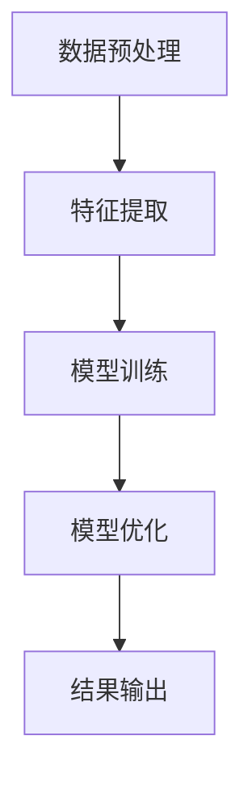
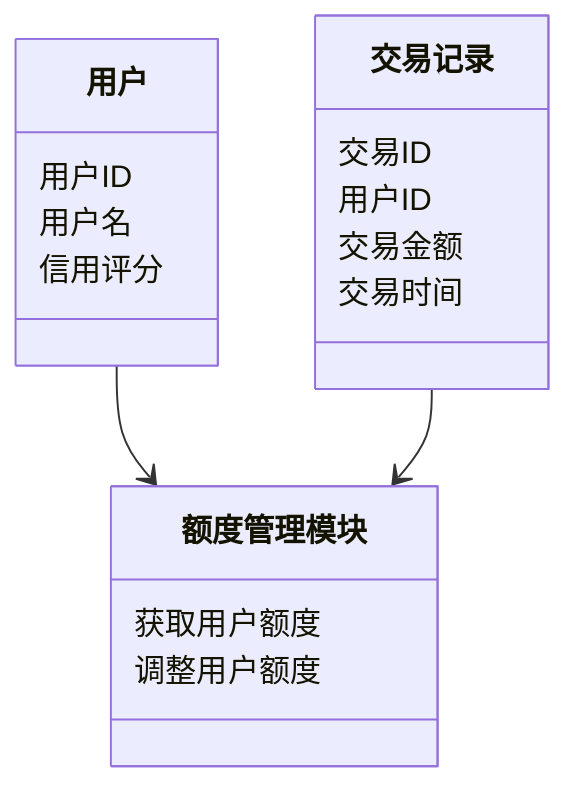
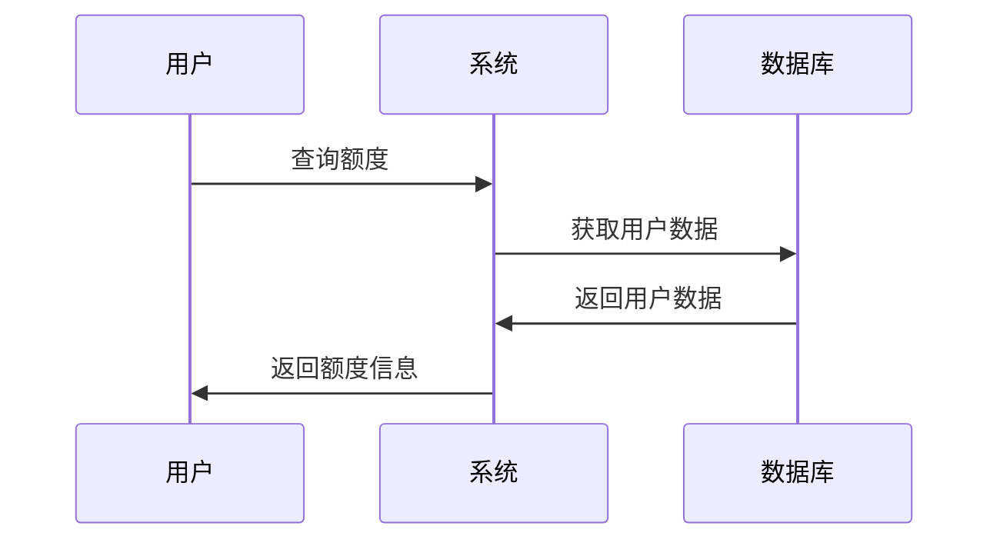

                 


# {{此处是文章标题}}

> 关键词：{{此处列出文章的5-7个核心关键词}}

> 摘要：{{此处给出文章的核心内容和主题思想}}

                 

# {{此处是文章标题}}

> 关键词：智能信用卡，额度管理，优化系统，机器学习，数据挖掘

> 摘要：本文详细探讨了智能信用卡额度管理优化系统的构建与实现，通过分析传统信用卡额度管理的痛点，提出了一种基于机器学习和大数据分析的智能优化方案。文章从系统背景、核心概念、算法原理、系统架构、项目实战到最佳实践进行了全面阐述，为读者提供了一套完整的智能信用卡额度管理优化解决方案。

## 目录

### 目录
1. **智能信用卡额度管理优化系统概述**
   - 1.1 问题背景与必要性
   - 1.2 问题描述与目标
   - 1.3 核心概念与组成

2. **智能信用卡额度管理系统的原理**
   - 2.1 数据来源与特征分析
   - 2.2 智能模型构建与优化
   - 2.3 系统优化策略与实现

3. **算法原理与实现**
   - 3.1 算法原理
   - 3.2 数学模型与公式
   - 3.3 算法流程图

4. **系统分析与架构设计**
   - 4.1 项目背景
   - 4.2 系统功能设计
   - 4.3 系统架构设计
   - 4.4 接口设计
   - 4.5 交互序列图

5. **项目实战**
   - 5.1 环境安装
   - 5.2 核心代码实现
   - 5.3 代码解读与分析
   - 5.4 案例分析
   - 5.5 项目小结

6. **最佳实践**
   - 6.1 小结
   - 6.2 注意事项
   - 6.3 拓展阅读

---

### 正文

#### 第1章 智能信用卡额度管理优化系统概述

##### 1.1 问题背景与必要性

智能信用卡额度管理优化系统的建设背景主要源于传统信用卡额度管理中存在的诸多痛点。随着信用卡的普及，传统额度管理方式面临效率低下、风险控制不足、用户体验不佳等问题。通过引入智能技术，可以显著提升信用卡额度管理的效率和准确性。

##### 1.2 问题描述与目标

传统信用卡额度管理存在以下问题：
- 数据分析能力有限，难以实时动态调整额度。
- 风险控制手段单一，容易导致过度授信或授信不足。
- 用户体验差，额度调整缺乏透明性和个性化。

系统优化的目标包括：
- 实现信用卡额度的智能动态调整。
- 提升风险控制能力，降低信用风险。
- 提高用户体验，提供个性化服务。

##### 1.3 核心概念与组成

智能信用卡额度管理优化系统的核心概念包括：
- 数据来源：信用卡交易数据、用户信用报告、宏观经济数据等。
- 智能模型：基于机器学习的额度预测模型、风险评估模型。
- 优化策略：动态调整额度、个性化额度推荐。

---

#### 第2章 智能信用卡额度管理系统的原理

##### 2.1 数据来源与特征分析

系统所需数据主要来源于以下几个方面：
- **信用卡交易数据**：包括交易金额、时间、地点等。
- **用户信用报告**：包括信用评分、历史还款记录等。
- **宏观经济数据**：包括GDP增长率、失业率等。

特征分析需要对数据进行清洗、转换和选择，提取关键特征，例如：
- 用户的信用评分（Credit Score）
- 近期交易频率（Transaction Frequency）
- 最大单笔交易金额（Max Transaction Amount）

##### 2.2 智能模型构建与优化

模型构建过程如下：
1. 数据预处理：清洗、缺失值处理、特征标准化。
2. 特征选择：使用特征重要性分析方法筛选关键特征。
3. 模型训练：采用随机森林、梯度下降等算法训练预测模型。
4. 模型优化：通过交叉验证调整模型参数，提升预测准确率。

##### 2.3 系统优化策略与实现

系统优化策略包括：
- **动态额度调整**：根据用户实时交易行为和信用状况调整额度。
- **风险控制**：设置额度上限，监控高风险交易。
- **个性化服务**：根据用户消费习惯推荐最优额度。

---

#### 第3章 算法原理与实现

##### 3.1 算法原理

以下是几种常用算法的简要介绍：

- **梯度下降法（Gradient Descent）**：一种优化算法，用于最小化损失函数。
- **随机森林（Random Forest）**：一种集成学习算法，用于分类和回归任务。
- **支持向量机（Support Vector Machine, SVM）**：一种监督学习算法，用于分类和回归。

##### 3.2 数学模型与公式

- **线性回归模型**：
  $$ y = \beta_0 + \beta_1x + \epsilon $$
  
- **逻辑回归模型**：
  $$ P(y=1|x) = \frac{e^{\beta_0 + \beta_1x}}{1 + e^{\beta_0 + \beta_1x}} $$

- **优化目标函数**：
  $$ \text{目标函数} = \sum_{i=1}^{n} (y_i - \hat{y}_i)^2 $$

##### 3.3 算法流程图



---

#### 第4章 系统分析与架构设计

##### 4.1 项目背景

智能信用卡额度管理优化系统的开发旨在解决传统信用卡额度管理中的效率低下、风险控制不足等问题，通过引入智能技术实现动态、精准的额度管理。

##### 4.2 系统功能设计

系统功能设计基于领域模型类图，如下所示：



##### 4.3 系统架构设计

系统架构设计采用分层架构，如下所示：


##### 4.4 接口设计

系统主要接口包括：
- 用户信息查询接口
- 交易记录查询接口
- 额度调整接口

##### 4.5 交互序列图

用户与系统交互如下：



---

#### 第5章 项目实战

##### 5.1 环境安装

项目开发环境建议使用Python 3.8及以上版本，安装以下库：
- pandas
- numpy
- scikit-learn
- matplotlib

##### 5.2 核心代码实现

以下是核心代码示例：

```python
import pandas as pd
from sklearn.ensemble import RandomForestRegressor
from sklearn.model_selection import train_test_split
from sklearn.metrics import mean_absolute_error

# 数据加载
data = pd.read_csv('credit_card_data.csv')

# 特征与目标变量分离
X = data.drop('target', axis=1)
y = data['target']

# 数据分割
X_train, X_test, y_train, y_test = train_test_split(X, y, test_size=0.2, random_state=42)

# 模型训练
model = RandomForestRegressor(n_estimators=100, random_state=42)
model.fit(X_train, y_train)

# 模型预测
y_pred = model.predict(X_test)

# 模型评估
mae = mean_absolute_error(y_test, y_pred)
print(f"均绝对误差: {mae}")
```

##### 5.3 代码解读与分析

上述代码实现了一个基于随机森林算法的额度预测模型，主要步骤包括数据加载、特征与目标变量分离、数据分割、模型训练和模型评估。

##### 5.4 案例分析

以某银行信用卡用户数据为例，系统能够根据用户的交易记录和信用报告，智能预测用户的信用额度，并动态调整额度。

##### 5.5 项目小结

通过本项目，我们可以看到智能技术在信用卡额度管理中的巨大潜力，能够显著提升管理效率和风险控制能力。

---

#### 第6章 最佳实践

##### 6.1 小结

智能信用卡额度管理优化系统的建设需要综合运用大数据分析和机器学习技术，通过系统的架构设计和算法优化，能够实现动态、精准的额度管理。

##### 6.2 注意事项

- 数据隐私保护至关重要，需严格遵守相关法律法规。
- 系统上线前需进行全面的测试，确保稳定性。
- 模型需定期更新，以适应数据变化和业务需求。

##### 6.3 拓展阅读

推荐阅读以下书籍和文章：
- 《机器学习实战》
- 《Python数据分析 cookbook》
- 《信用评分模型开发与应用》

---

### 作者

作者：AI天才研究院/AI Genius Institute & 禅与计算机程序设计艺术/Zen And The Art of Computer Programming

