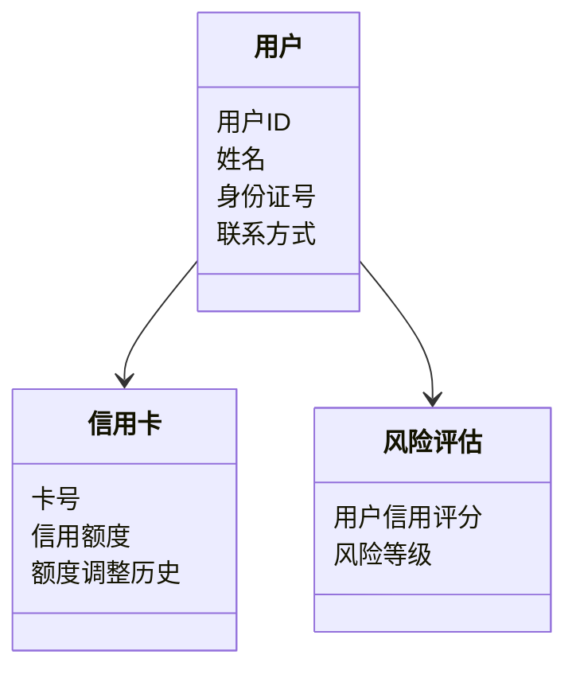
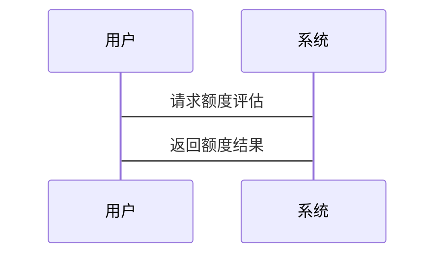

                 


# 智能信用卡额度管理系统

## 关键词：智能信用卡，额度管理，机器学习，大数据分析，系统架构设计

## 摘要：智能信用卡额度管理系统是一种基于人工智能技术的创新解决方案，通过机器学习算法和大数据分析，实现信用卡额度的智能化管理。本文详细探讨了系统的背景、核心概念、算法原理、系统架构设计以及项目实战，为读者提供全面的技术指导。

---

## 第1章：智能信用卡额度管理的背景

### 1.1 信用卡额度管理的现状

- 1.1.1 传统信用卡额度管理的流程
- 1.1.2 当前信用卡额度管理的痛点
- 1.1.3 智能化管理的必要性

### 1.2 传统信用卡额度管理的问题

- 1.2.1 人工审核效率低
- 1.2.2 风险控制能力不足
- 1.2.3 用户体验差

### 1.3 智能化管理的目标

- 1.3.1 提高审核效率
- 1.3.2 增强风险控制能力
- 1.3.3 提升用户体验

### 1.4 技术背景

- 1.4.1 人工智能的发展
- 1.4.2 大数据分析的应用
- 1.4.3 机器学习算法的成熟

### 1.5 核心概念与边界

- 1.5.1 核心概念解析
- 1.5.2 核心要素与ER实体关系图

---

## 第2章：智能信用卡额度管理的核心概念

### 2.1 核心概念解析

- 2.1.1 智能信用卡额度管理的定义
- 2.1.2 核心特征对比

### 2.2 核心要素与ER实体关系图

- 2.2.1 核心要素分析
- 2.2.2 ER实体关系图设计

---

## 第3章：算法原理与实现

### 3.1 数据预处理与特征提取

- 3.1.1 数据清洗与标准化
- 3.1.2 特征选择与提取

### 3.2 算法选择与模型调优

- 3.2.1 算法选择（如随机森林、XGBoost）
- 3.2.2 模型调优与评估

### 3.3 算法流程图

```mermaid
graph TD
A[开始] -> B[数据预处理]
B -> C[特征提取]
C -> D[模型训练]
D -> E[模型评估]
E -> F[结束]
```

### 3.4 数学模型与公式

- 3.4.1 线性回归模型：$$y = \beta_0 + \beta_1x + \epsilon$$
- 3.4.2 决策树模型：决策树结构示例

### 3.5 示例与解释

- 3.5.1 示例数据集
- 3.5.2 模型训练过程
- 3.5.3 结果解释

---

## 第4章：系统分析与架构设计

### 4.1 问题场景介绍

- 4.1.1 系统目标
- 4.1.2 问题场景分析

### 4.2 系统功能设计（领域模型）



### 4.3 系统架构设计（架构图）


### 4.4 接口与交互设计（序列图）



---

## 第5章：项目实战与实现

### 5.1 环境安装与数据准备

- 5.1.1 安装Python与相关库
- 5.1.2 数据集获取与预处理

### 5.2 特征工程与模型训练

- 5.2.1 特征工程代码
- 5.2.2 模型训练代码

### 5.3 系统部署与测试

- 5.3.1 系统部署流程
- 5.3.2 系统测试与优化

### 5.4 实际案例分析

- 5.4.1 案例背景
- 5.4.2 模型分析
- 5.4.3 结果解读

### 5.5 代码实现与解读

- 5.5.1 数据处理代码
- 5.5.2 模型训练代码
- 5.5.3 系统部署代码

---

## 第6章：总结与最佳实践

### 6.1 核心知识点回顾

- 6.1.1 系统设计要点
- 6.1.2 算法实现细节

### 6.2 最佳实践与注意事项

- 6.2.1 数据隐私保护
- 6.2.2 模型优化建议

### 6.3 未来展望与拓展阅读

- 6.3.1 技术发展趋势
- 6.3.2 推荐阅读资料

---

## 作者：AI天才研究院 & 禅与计算机程序设计艺术

