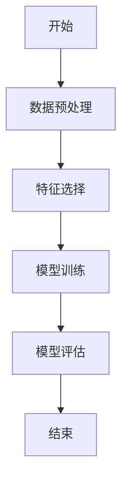
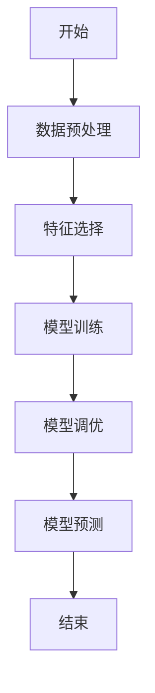
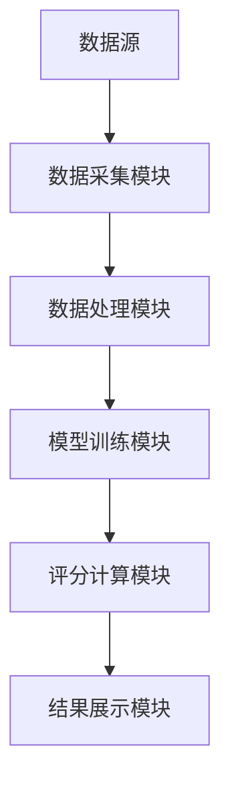
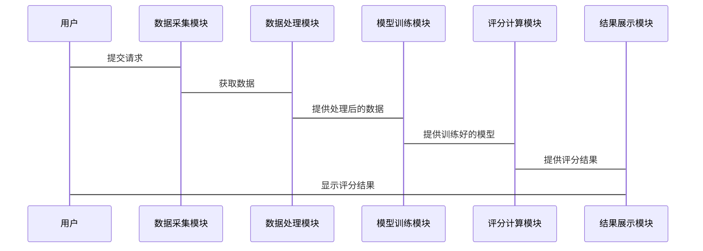

                 


# 第三章: 常用算法原理与实现

## 3.1 逻辑回归算法

### 3.1.1 算法原理与流程
逻辑回归是一种用于分类的统计方法，常用于预测二分类问题。其核心思想是通过将线性组合的值映射到概率，从而实现分类。以下是逻辑回归的典型流程：

1. 数据预处理：清洗数据，处理缺失值和异常值，标准化或归一化特征。
2. 特征选择：选择对目标变量影响较大的特征。
3. 模型训练：使用训练数据拟合逻辑回归模型，通过极大似然估计法优化参数。
4. 模型评估：通过准确率、召回率、F1分数等指标评估模型性能。
5. 模型预测：使用训练好的模型对新数据进行预测。

**流程图：**


### 3.1.2 逻辑回归的数学模型
逻辑回归的数学模型可以表示为：

$$ P(y=1|x) = \frac{1}{1 + e^{- (w \cdot x + b)}} $$

其中，\( w \) 是权重向量，\( b \) 是偏置项，\( x \) 是输入特征向量。

### 3.1.3 逻辑回归的优缺点
- **优点：**
  - 简单易实现，易于解释。
  - 对异常值的影响较小。
- **缺点：**
  - 不能直接处理非线性关系。
  - 对特征的分布假设敏感。

### 3.1.4 逻辑回归的代码实现
以下是Python中的逻辑回归实现示例：

```python
import numpy as np
from sklearn.linear_model import LogisticRegression
from sklearn.model_selection import train_test_split
from sklearn.metrics import accuracy_score

# 数据准备
X = np.array([[1, 2], [3, 4], [5, 6], [7, 8]])
y = np.array([0, 1, 1, 0])

# 划分训练集和测试集
X_train, X_test, y_train, y_test = train_test_split(X, y, test_size=0.25)

# 初始化模型
model = LogisticRegression()

# 训练模型
model.fit(X_train, y_train)

# 预测
y_pred = model.predict(X_test)

# 评估
print("准确率:", accuracy_score(y_test, y_pred))
```

## 3.2 XGBoost算法

### 3.2.1 算法原理与流程
XGBoost是一种基于树的集成学习算法，通过多棵决策树的组合来提高模型的准确性和鲁棒性。以下是其典型流程：

1. 初始化参数：设置学习率、树的深度、正则化参数等。
2. 数据预处理：清洗数据，处理缺失值，进行特征选择。
3. 模型训练：使用梯度提升法，逐步构建决策树。
4. 模型调优：通过交叉验证优化模型参数。
5. 模型预测：使用训练好的模型对新数据进行预测。

**流程图：**


### 3.2.2 XGBoost的数学模型
XGBoost的核心思想是通过损失函数的二阶导数和权重更新，逐步优化模型。其数学模型较为复杂，但核心可以表示为：

$$ f(x) = \sum_{k=1}^{n} \theta_k h(x) $$

其中，\( \theta_k \) 是第k棵树的权重，\( h(x) \) 是第k棵树的结构。

### 3.2.3 XGBoost的优缺点
- **优点：**
  - 高效性：使用正则化和稀疏数据处理，减少计算量。
  - 鲁棒性：对异常值和噪声有较强的鲁棒性。
- **缺点：**
  - 参数多，调参复杂。
  - 对内存需求较高，不适合大数据量。

### 3.2.4 XGBoost的代码实现
以下是Python中的XGBoost实现示例：

```python
import xgboost as xgb
from xgboost import XGBClassifier
from sklearn.model_selection import train_test_split
from sklearn.metrics import accuracy_score

# 数据准备
X = np.array([[1, 2], [3, 4], [5, 6], [7, 8]])
y = np.array([0, 1, 1, 0])

# 划分训练集和测试集
X_train, X_test, y_train, y_test = train_test_split(X, y, test_size=0.25)

# 初始化模型
model = XGBClassifier()

# 训练模型
model.fit(X_train, y_train)

# 预测
y_pred = model.predict(X_test)

# 评估
print("准确率:", accuracy_score(y_test, y_pred))
```

## 3.3 算法对比分析
通过对比逻辑回归和XGBoost的性能，可以发现：

- 逻辑回归简单易实现，适合线性可分数据，但在非线性问题上表现较差。
- XGBoost具有较高的准确性和鲁棒性，适合复杂的数据分布，但参数多，调参复杂。

在实际应用中，通常会根据数据特性和任务需求选择合适的算法。

---

# 第四章: 智能信用评分系统架构设计

## 4.1 系统架构概述
智能信用评分系统是一个复杂的系统，需要考虑数据采集、模型训练、评分计算和结果展示等多个环节。以下是系统架构的总体设计：

1. 数据采集模块：从数据库或其他数据源获取客户信息、交易记录等数据。
2. 数据处理模块：对数据进行清洗、特征提取和预处理。
3. 模型训练模块：选择合适的算法，训练信用评分模型。
4. 评分计算模块：对新客户进行信用评分。
5. 结果展示模块：将评分结果展示给用户或系统。

**系统架构图：**


## 4.2 系统功能设计

### 4.2.1 数据采集模块
- **功能：** 从数据库、API或其他数据源获取客户信息、交易记录等数据。
- **核心流程：**
  1. 连接数据源。
  2. 获取数据。
  3. 存储数据。

### 4.2.2 数据处理模块
- **功能：** 对数据进行清洗、特征提取和预处理。
- **核心流程：**
  1. 数据清洗：处理缺失值、异常值。
  2. 特征选择：选择对评分影响较大的特征。
  3. 数据预处理：归一化、标准化等。

### 4.2.3 模型训练模块
- **功能：** 训练信用评分模型。
- **核心流程：**
  1. 选择算法（逻辑回归、XGBoost等）。
  2. 训练模型。
  3. 评估模型性能。

### 4.2.4 评分计算模块
- **功能：** 对新客户进行信用评分。
- **核心流程：**
  1. 获取客户信息。
  2. 计算信用评分。
  3. 返回评分结果。

### 4.2.5 结果展示模块
- **功能：** 将评分结果展示给用户或系统。
- **核心流程：**
  1. 接收评分结果。
  2. 展示给用户或系统。
  3. 处理用户反馈。

## 4.3 系统架构图


## 4.4 系统接口设计
系统接口设计包括以下几个部分：

1. 数据采集接口：用于从数据源获取数据。
2. 数据处理接口：用于数据清洗和特征提取。
3. 模型训练接口：用于训练信用评分模型。
4. 评分计算接口：用于对新客户进行信用评分。
5. 结果展示接口：用于展示评分结果。

## 4.5 系统交互设计
以下是系统的交互流程：

1. 用户提交请求。
2. 系统调用数据采集模块获取数据。
3. 数据处理模块对数据进行处理。
4. 模型训练模块训练模型。
5. 评分计算模块计算信用评分。
6. 结果展示模块展示评分结果。

**交互序列图：**


---

# 第五章: 智能信用评分系统项目实战

## 5.1 项目介绍
本项目旨在开发一个智能信用评分系统，利用机器学习算法对客户的信用风险进行评估。通过本项目，读者可以掌握从数据处理到模型训练再到系统部署的完整流程。

## 5.2 环境安装
在开始项目之前，请确保安装以下工具和库：

- Python 3.x
- NumPy
- Pandas
- Scikit-learn
- XGBoost
- Mermaid
- Jupyter Notebook

## 5.3 系统核心实现

### 5.3.1 数据预处理
```python
import pandas as pd
import numpy as np

# 加载数据
data = pd.read_csv('credit_data.csv')

# 处理缺失值
data = data.dropna()

# 特征选择
selected_features = ['income', 'age', 'loan_amount']
data = data[selected_features]

# 标准化处理
from sklearn.preprocessing import StandardScaler

scaler = StandardScaler()
data_scaled = scaler.fit_transform(data)
```

### 5.3.2 模型训练
```python
from sklearn.model_selection import train_test_split
from sklearn.linear_model import LogisticRegression
from xgboost import XGBClassifier
from sklearn.metrics import accuracy_score

# 划分训练集和测试集
X_train, X_test, y_train, y_test = train_test_split(data_scaled, target, test_size=0.25)

# 逻辑回归模型
model_lr = LogisticRegression()
model_lr.fit(X_train, y_train)
y_pred_lr = model_lr.predict(X_test)
print("逻辑回归准确率:", accuracy_score(y_test, y_pred_lr))

# XGBoost模型
model_xgb = XGBClassifier()
model_xgb.fit(X_train, y_train)
y_pred_xgb = model_xgb.predict(X_test)
print("XGBoost准确率:", accuracy_score(y_test, y_pred_xgb))
```

### 5.3.3 模型优化与调参
```python
from sklearn.model_selection import GridSearchCV

# 逻辑回归调参
param_grid = {'C': [0.1, 1, 10], 'penalty': ['l1', 'l2']}
grid_search_lr = GridSearchCV(model_lr, param_grid, cv=5)
grid_search_lr.fit(X_train, y_train)
best_model_lr = grid_search_lr.best_estimator_

# XGBoost调参
param_grid = {
    'n_estimators': [50, 100, 200],
    'learning_rate': [0.01, 0.1, 0.2],
    'max_depth': [3, 4, 5]
}
grid_search_xgb = GridSearchCV(model_xgb, param_grid, cv=5)
grid_search_xgb.fit(X_train, y_train)
best_model_xgb = grid_search_xgb.best_estimator_
```

### 5.3.4 系统部署与测试
```python
# 部署模型
import joblib

# 保存模型
joblib.dump(best_model_lr, 'lr_model.pkl')
joblib.dump(best_model_xgb, 'xgb_model.pkl')

# 加载模型
loaded_model_lr = joblib.load('lr_model.pkl')
loaded_model_xgb = joblib.load('xgb_model.pkl')

# 测试
new_customer = [[50000, 30, 20000]]
new_customer_scaled = scaler.transform(new_customer)
print("逻辑回归预测结果:", loaded_model_lr.predict(new_customer_scaled))
print("XGBoost预测结果:", loaded_model_xgb.predict(new_customer_scaled))
```

## 5.4 项目总结
通过本项目，我们掌握了智能信用评分系统的开发流程，包括数据预处理、模型训练、模型优化和系统部署。在实际应用中，可以根据具体需求选择合适的算法，并通过调参和优化提高模型的准确性和鲁棒性。

---

# 第六章: 智能信用评分系统优化与部署

## 6.1 模型优化

### 6.1.1 参数优化
通过网格搜索（Grid Search）和随机搜索（Random Search）等方法，找到最佳模型参数，提高模型性能。

### 6.1.2 特征优化
通过特征重要性分析，去除对模型贡献小的特征，降低模型复杂度，提高计算效率。

## 6.2 系统部署

### 6.2.1 模型部署
将训练好的模型部署到生产环境中，通过API接口提供信用评分服务。

### 6.2.2 系统监控
实时监控系统运行状态，包括模型性能、数据输入输出、系统资源使用情况等。

## 6.3 系统优化

### 6.3.1 模型可解释性优化
通过特征重要性分析、模型解释性工具（如SHAP值）等方法，提高模型的可解释性。

### 6.3.2 系统性能优化
通过优化算法、减少计算复杂度、使用分布式计算等方法，提高系统的运行效率。

---

# 结语

智能信用评分系统是一个复杂的系统，涉及数据处理、模型训练、系统设计等多个环节。通过本文的介绍，读者可以全面了解智能信用评分系统的核心概念、算法原理、系统架构设计和项目实战。在实际应用中，可以根据具体需求选择合适的算法，并通过不断优化和调整，提高系统的准确性和鲁棒性。

---

# 附录

## 附录A: 参考文献
1. 周志华. 《机器学习实战》. 清华大学出版社, 2016.
2. 周扬. 《Python机器学习项目实战》. 人民邮电出版社, 2019.
3. XGBoost官方文档.

## 附录B: 工具与库
- Python
- NumPy
- Pandas
- Scikit-learn
- XGBoost
- Mermaid
- Jupyter Notebook

## 附录C: 代码与数据

### 附录C.1 代码示例
```python
# 附录C.1.1 数据预处理
import pandas as pd
import numpy as np

data = pd.read_csv('credit_data.csv')
data = data.dropna()
selected_features = ['income', 'age', 'loan_amount']
data = data[selected_features]
from sklearn.preprocessing import StandardScaler
scaler = StandardScaler()
data_scaled = scaler.fit_transform(data)

# 附录C.1.2 模型训练
from sklearn.model_selection import train_test_split
from sklearn.linear_model import LogisticRegression
from xgboost import XGBClassifier
from sklearn.metrics import accuracy_score

X_train, X_test, y_train, y_test = train_test_split(data_scaled, target, test_size=0.25)
model_lr = LogisticRegression()
model_lr.fit(X_train, y_train)
y_pred_lr = model_lr.predict(X_test)
print("逻辑回归准确率:", accuracy_score(y_test, y_pred_lr))

model_xgb = XGBClassifier()
model_xgb.fit(X_train, y_train)
y_pred_xgb = model_xgb.predict(X_test)
print("XGBoost准确率:", accuracy_score(y_test, y_pred_xgb))

# 附录C.1.3 模型优化与调参
from sklearn.model_selection import GridSearchCV

param_grid = {'C': [0.1, 1, 10], 'penalty': ['l1', 'l2']}
grid_search_lr = GridSearchCV(model_lr, param_grid, cv=5)
grid_search_lr.fit(X_train, y_train)
best_model_lr = grid_search_lr.best_estimator_

param_grid = {
    'n_estimators': [50, 100, 200],
    'learning_rate': [0.01, 0.1, 0.2],
    'max_depth': [3, 4, 5]
}
grid_search_xgb = GridSearchCV(model_xgb, param_grid, cv=5)
grid_search_xgb.fit(X_train, y_train)
best_model_xgb = grid_search_xgb.best_estimator_

# 附录C.1.4 系统部署与测试
import joblib

joblib.dump(best_model_lr, 'lr_model.pkl')
joblib.dump(best_model_xgb, 'xgb_model.pkl')

loaded_model_lr = joblib.load('lr_model.pkl')
loaded_model_xgb = joblib.load('xgb_model.pkl')

new_customer = [[50000, 30, 20000]]
new_customer_scaled = scaler.transform(new_customer)
print("逻辑回归预测结果:", loaded_model_lr.predict(new_customer_scaled))
print("XGBoost预测结果:", loaded_model_xgb.predict(new_customer_scaled))
```

### 附录C.2 数据格式
数据格式为CSV，包含以下字段：
- `customer_id`: 客户ID
- `income`: 收入
- `age`: 年龄
- `loan_amount`: 贷款金额
- `credit_score`: 信用评分（目标变量）

---

# 作者

**作者：AI天才研究院/AI Genius Institute & 禅与计算机程序设计艺术 /Zen And The Art of Computer Programming**

---

以上是《智能信用评分系统》的技术博客文章的完整目录和内容。如果需要进一步的修改或补充，请随时告知！

