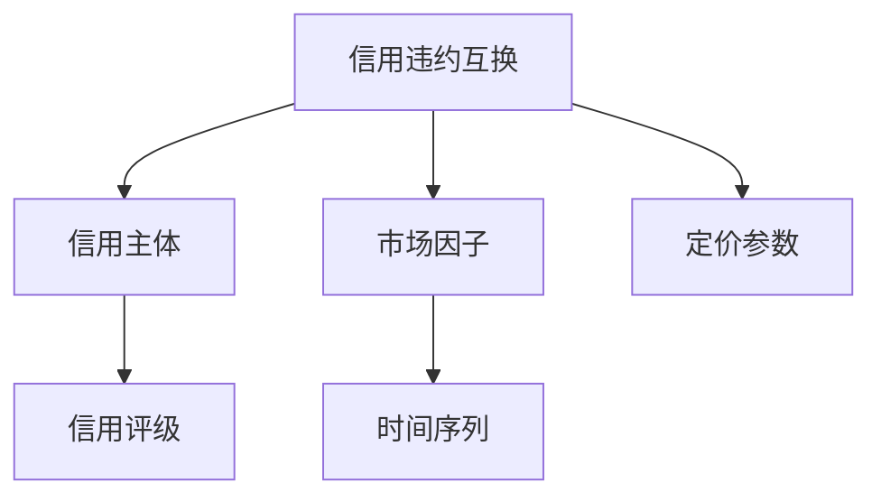
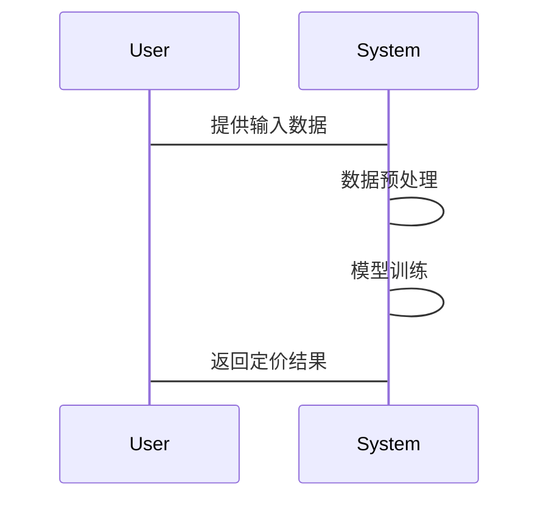

                 


# 智能信用违约互换定价模型

> 关键词：智能定价模型、信用违约互换、机器学习、金融衍生工具、风险评估

> 摘要：本文探讨智能信用违约互换定价模型的构建与应用，结合金融理论与机器学习技术，分析其在信用风险管理和定价中的优势，提供从理论到实践的详细指导。

---

## 第一部分：智能信用违约互换定价模型的背景与基础

### 第1章：信用违约互换（CDS）概述

#### 1.1 信用违约互换的基本概念

- **1.1.1 定义与结构**
  - 信用违约互换（CDS）是一种金融衍生工具，允许投资者对冲信用风险。
  - 标的资产：单一非违约债券或债券组合。
  - 结构：买方支付保费，卖方在债券违约时赔偿损失。

- **1.1.2 市场角色**
  - 买方：寻求信用保护的投资者。
  - 卖方：提供信用保护的金融机构。
  - 中介：交易商和结算机构。

- **1.1.3 主要功能**
  - 转移信用风险。
  - 提供流动性解决方案。
  - 用于投机和对冲。

- **1.1.4 风险类型**
  - 信用风险：债务人违约。
  - 交易对手风险：交易对手无法履行义务。
  - 利率风险：利率波动影响价格。
  - 流动性风险：市场不活跃导致买卖困难。

#### 1.2 智能定价模型的必要性

- **1.2.1 传统定价的挑战**
  - 假设过于简化：传统模型假设资产相关性恒定，忽略了市场动态变化。
  - 参数估计困难：历史数据不足导致估计误差大。
  - 计算复杂性：多变量模型难以实时计算。

- **1.2.2 智能定价的优势**
  - 数据驱动：利用历史数据自动优化定价。
  - 非线性建模：捕捉复杂市场关系。
  - 实时更新：快速响应市场变化。

- **1.2.3 对金融市场的影响**
  - 提高定价效率。
  - 增强市场流动性。
  - 改善风险定价。

#### 1.3 相关技术基础

- **1.3.1 信用评分与风险评估**
  - 信用评分模型（如PD模型）评估违约概率。
  - 风险评估工具（VaR、CVaR）量化风险敞口。

- **1.3.2 时间序列分析**
  - 常见方法：ARIMA、GARCH模型。
  - 应用于预测信用风险和市场波动。

- **1.3.3 机器学习与深度学习**
  - 无监督学习发现隐藏模式。
  - 深度学习捕捉复杂非线性关系。

---

## 第二部分：智能信用违约互换定价模型的核心概念

### 第2章：智能定价模型的理论基础

#### 2.1 定价理论与模型构建

- **2.1.1 定价理论**
  - 市场定价：反映市场预期。
  - 风险中性定价：无套利条件下的定价。
  - 智能定价：结合市场数据和模型预测。

- **2.1.2 模型构建原则**
  - 数据驱动 vs. 模型驱动：数据驱动依赖历史数据，模型驱动基于理论。
  - 线性 vs. 非线性：非线性模型捕捉复杂关系。
  - 基于规则 vs. 数据驱动：数据驱动模型适应性强。

#### 2.2 模型的特征与属性

- **2.2.1 核心特征对比**
  | 特征维度 | 数据驱动模型       | 模型驱动模型       |
  |----------|--------------------|--------------------|
  | 建模方式 | 基于历史数据       | 基于理论假设       |
  | 灵活性   | 高                 | 低                 |
  | 需求数据 | 需大量数据         | 数据需求较低       |

- **2.2.2 ER实体关系图**



---

## 第三部分：智能信用违约互换定价模型的算法原理

### 第3章：基于机器学习的定价模型

#### 3.1 机器学习算法概述

- **3.1.1 监督学习与无监督学习**
  - 监督学习：输入特征预测目标变量。
  - 无监督学习：发现数据内在结构。

- **3.1.2 常见算法**
  - 随机森林：特征重要性分析。
  - 神经网络：捕捉非线性关系。

#### 3.2 时间序列分析

- **3.2.1 ARIMA模型**
  - 适用于平稳时间序列。
  - 分为AR、MA、ARMA三种模型。

- **3.2.2 LSTM网络**
  - 长短期记忆网络。
  - 适用于长期依赖关系。

#### 3.3 算法流程图


#### 3.4 Python代码实现

```python
import pandas as pd
from sklearn.ensemble import RandomForestRegressor

# 数据加载与预处理
data = pd.read_csv('cds_data.csv')
data = data.dropna()

# 特征与目标分离
features = data.drop(['price', 'date'], axis=1)
target = data['price']

# 模型训练
model = RandomForestRegressor()
model.fit(features, target)

# 模型预测
new_data = features.iloc[-1].values.reshape(1, -1)
predicted_price = model.predict(new_data)
```

---

## 第四部分：智能信用违约互换定价模型的系统架构

### 第4章：系统分析与架构设计

#### 4.1 系统功能设计

- **4.1.1 功能模块**
  - 数据采集模块：获取实时市场数据。
  - 模型训练模块：构建定价模型。
  - 定价计算模块：输出实时定价。
  - 风险评估模块：评估定价风险。

- **4.1.2 功能流程图**


#### 4.2 系统架构设计

- **4.2.1 分层架构**
  - 数据层：存储原始数据。
  - 应用层：处理数据和模型计算。
  - 展示层：用户界面展示结果。

- **4.2.2 系统交互图**



---

## 第五部分：智能信用违约互换定价模型的项目实战

### 第5章：项目实现与案例分析

#### 5.1 环境搭建

- **5.1.1 工具安装**
  - Python：版本3.8及以上。
  - 库：pandas、scikit-learn、keras、tensorflow。

- **5.1.2 数据来源**
  - 数据集：CDS市场历史数据，包含信用主体、评级、时间序列等。

#### 5.2 数据预处理与特征提取

- **5.2.1 数据清洗**
  - 去除缺失值。
  - 处理异常值。

- **5.2.2 特征工程**
  - 编码：将分类变量转换为数值。
  - 标准化：归一化处理。

#### 5.3 模型实现与训练

- **5.3.1 算法选择**
  - 使用随机森林或神经网络。

- **5.3.2 模型训练**
  - 分训练集和测试集。
  - 调参优化。

#### 5.4 案例分析

- **5.4.1 实际案例**
  - 数据：某公司CDS数据。
  - 实现：构建模型并预测定价。
  - 分析：对比模型预测与实际价格。

#### 5.5 结果分析与优化

- **5.5.1 结果分析**
  - 模型准确性评估。
  - 检查误差分布。

- **5.5.2 模型优化**
  - 调整超参数。
  - 换算法尝试。

---

## 第六部分：智能信用违约互换定价模型的最佳实践与小结

### 第6章：最佳实践与小结

#### 6.1 最佳实践

- **6.1.1 数据质量**
  - 确保数据准确性和完整性。

- **6.1.2 模型选择**
  - 根据数据和问题选择合适算法。

- **6.1.3 模型监控**
  - 实时监控模型性能。
  - 定期重新训练模型。

#### 6.2 小结

- 智能信用违约互换定价模型利用机器学习技术，显著提升了定价的准确性和效率。
- 在实际应用中，需注意数据质量和模型维护。
- 未来，随着AI技术进步，定价模型将更加智能化和个性化。

---

## 作者：AI天才研究院 & 禅与计算机程序设计艺术

---

通过以上目录大纲，我们可以看到《智能信用违约互换定价模型》从基础理论到实际应用，系统地介绍了智能定价模型的构建与实施。接下来，将按照这个大纲逐步展开，撰写完整的技术博客文章。

