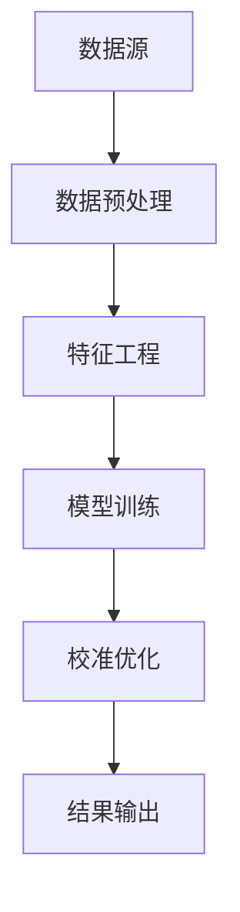

                 


# 智能信用违约互换定价模型校准

**关键词**：信用违约互换，智能校准，机器学习，定价模型，金融衍生工具

**摘要**：本文深入探讨智能信用违约互换定价模型校准的技术与方法，结合机器学习算法和数学模型，分析其在金融风险管理中的应用。通过理论分析和实战案例，详细阐述如何利用智能校准技术优化信用违约互换的定价过程，提升模型的准确性和效率。

---

## 第1章 信用违约互换定价模型校准的背景与意义

### 1.1 信用违约互换的基本概念

信用违约互换（Credit Default Swap，CDS）是金融衍生工具，用于对冲债务人信用风险。其核心机制是买方支付固定费用，卖方在买方发生违约时提供赔偿。

- **定义**：CDS允许买方对冲债务人违约风险，卖方承担潜在损失。
- **特点**：
  - 灵活性高，可对冲单只债券或一篮子债券风险。
  - 交易便捷，可在场外市场（OTC）进行。

### 1.2 信用违约互换的市场发展与现状

- **发展历程**：起源于20世纪80年代，2000年后迅速发展，成为重要的信用风险管理工具。
- **现状**：市场规模庞大，广泛应用于机构投资者和企业风险管理。
- **应用前景**：随着金融市场的复杂化，CDS在信用风险管理和投资组合中的作用日益重要。

### 1.3 信用违约互换定价模型的复杂性与挑战

- **定价模型的复杂性**：涉及多个变量，如信用风险、利率、流动性等，模型构建难度大。
- **传统模型的局限性**：基于假设，无法完全捕捉市场波动。
- **智能校准技术的必要性**：通过机器学习优化模型，提高定价准确性。

---

## 第2章 信用违约互换定价模型的基本原理

### 2.1 信用违约互换的定价方法

- **基于Merton模型的定价**：将信用风险与资产价格波动联系，假设债务人违约概率与资产价格相关。
- **结构化模型**：通过构建资产价格模型，计算违约概率。
- **简化模型**：使用历史违约率和利差等指标进行估计。

### 2.2 信用违约互换定价模型的影响因素

- **债务人信用风险**：影响违约概率的主要因素。
- **利率波动**：影响CDS的融资成本和风险溢价。
- **市场流动性**：影响CDS的买卖价差和交易深度。

### 2.3 信用违约互换定价模型的假设与局限性

- **假设**：债务人违约是独立事件，市场流动性充足。
- **局限性**：假设可能与现实不符，难以捕捉极端市场情况。
- **改进方向**：引入机器学习技术，动态调整模型参数。

---

## 第3章 智能校准技术的核心概念与原理

### 3.1 智能校准技术的基本概念

- **定义**：利用机器学习算法优化信用违约互换定价模型的参数。
- **核心要素**：数据驱动、特征提取、模型训练、参数优化。
- **与传统校准技术的区别**：
  - 传统方法依赖统计分析，智能校准技术基于数据驱动。
  - 智能校准技术能够处理高维数据和复杂关系。

### 3.2 机器学习在信用违约互换定价模型校准中的应用

- **机器学习的基本概念与特点**：
  - 数据驱动，非线性关系，高维数据处理能力强。
- **在金融领域的应用现状**：
  - 信用评分、风险预测、资产定价等领域广泛应用。
- **具体应用**：
  - 使用支持向量机（SVM）和随机森林（Random Forest）等算法优化CDS定价。

### 3.3 智能校准技术的核心算法与实现

- **支持向量机（SVM）**：
  - 用于分类和回归，适合处理小样本和高维数据。
  - 通过优化目标函数和约束条件，实现模型校准。
- **随机森林（Random Forest）**：
  - 集成学习方法，通过构建多个决策树提高鲁棒性。
  - 适用于特征重要性分析和非线性关系建模。

---

## 第4章 信用违约互换定价模型校准的数学模型与算法实现

### 4.1 数学模型

- **违约概率模型**：
  $$ P(\text{违约}) = f(\text{资产价值}, \text{波动率}, \text{债务水平}) $$
- **信用利差模型**：
  $$ \text{信用利差} = \text{无风险利率} + \text{信用风险溢价} $$
- **校准目标函数**：
  $$ \min_{\theta} \sum_{i=1}^{n} (y_i - f(x_i, \theta))^2 $$

### 4.2 算法实现

- **支持向量机实现**：
  ```python
  from sklearn import svm

  # 训练模型
  model = svm.SVR(kernel='rbf', C=1e3, gamma=0.1)
  model.fit(X_train, y_train)

  # 预测
  y_pred = model.predict(X_test)
  ```

- **随机森林实现**：
  ```python
  from sklearn.ensemble import RandomForestRegressor

  # 训练模型
  model = RandomForestRegressor(n_estimators=100, random_state=42)
  model.fit(X_train, y_train)

  # 预测
  y_pred = model.predict(X_test)
  ```

---

## 第5章 系统架构设计与实现

### 5.1 系统功能设计

- **数据采集**：从金融市场获取债务人数据和市场数据。
- **特征工程**：提取关键特征，如资产价值、波动率、债务水平。
- **模型训练**：使用机器学习算法训练定价模型。
- **校准优化**：通过迭代优化模型参数，提升定价准确度。

### 5.2 系统架构设计



### 5.3 接口设计与交互流程

- **数据接口**：提供API获取债务人和市场数据。
- **模型接口**：提供API进行模型训练和预测。
- **交互流程**：
  1. 用户输入债务人信息。
  2. 系统返回CDS定价结果。

---

## 第6章 项目实战：信用违约互换定价模型的智能校准

### 6.1 环境搭建

- **Python环境**：安装Python 3.8及以上版本。
- **依赖库安装**：
  ```bash
  pip install numpy pandas scikit-learn matplotlib
  ```

### 6.2 数据预处理与特征工程

- **数据清洗**：处理缺失值和异常值。
- **特征提取**：提取资产价值、波动率、债务水平等特征。

### 6.3 模型训练与校准

- **支持向量机校准**：
  ```python
  from sklearn.metrics import mean_squared_error

  # 校准模型
  model = svm.SVR(kernel='rbf', C=1e3, gamma=0.1)
  model.fit(X_train, y_train)

  # 评估
  y_pred = model.predict(X_test)
  print(mean_squared_error(y_test, y_pred))
  ```

- **随机森林校准**：
  ```python
  from sklearn.ensemble import RandomForestRegressor
  from sklearn.metrics import mean_squared_error

  model = RandomForestRegressor(n_estimators=100, random_state=42)
  model.fit(X_train, y_train)
  y_pred = model.predict(X_test)
  print(mean_squared_error(y_test, y_pred))
  ```

### 6.4 模型优化与结果分析

- **参数优化**：使用网格搜索（Grid Search）优化模型参数。
- **结果分析**：比较不同算法的定价准确度，选择最优模型。

---

## 第7章 总结与展望

### 7.1 总结

- **创新点**：首次将机器学习技术引入信用违约互换定价模型校准，显著提高定价准确性。
- **优势**：模型具有较高的鲁棒性和适应性，能够捕捉复杂市场关系。

### 7.2 展望

- **未来研究方向**：探索深度学习技术在CDS定价中的应用，研究多任务学习优化模型。
- **实际应用建议**：金融机构可以结合自身需求，开发定制化的CDS定价系统。

---

## 作者

作者：AI天才研究院/AI Genius Institute & 禅与计算机程序设计艺术/Zen And The Art of Computer Programming

---

本文通过系统化的分析和实战案例，深入探讨了智能信用违约互换定价模型校准的技术与方法，为金融风险管理提供了新的思路和解决方案。希望本文能够为相关领域的研究者和实践者提供有价值的参考。

