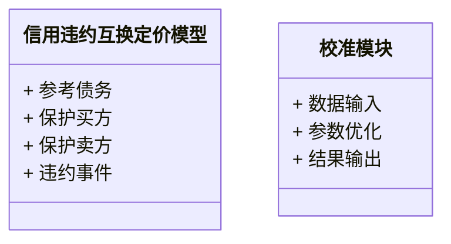

                 


# 智能信用违约互换定价模型校准

> 关键词：智能信用违约互换，定价模型，校准，金融建模，风险管理

> 摘要：本文深入探讨智能信用违约互换定价模型的校准方法，结合数学理论、算法设计和系统架构，提供从理论到实践的详细指导，帮助读者理解并掌握这一关键的金融技术。

---

# 第1章: 背景介绍

## 1.1 信用风险与信用违约互换的基本概念

### 1.1.1 信用风险的定义与特征

信用风险是指债务人在债务到期时无法履行还款义务，导致债权人遭受损失的风险。其主要特征包括：

- **不确定性**：信用风险的发生具有不确定性，难以完全预测。
- **传染性**：信用风险可能在金融市场中扩散，影响整体经济稳定。
- **系统性**：信用风险往往与其他金融风险（如市场风险）交织，具有系统性影响。

### 1.1.2 信用违约互换（CDS）的定义与基本结构

信用违约互换（Credit Default Swap，CDS）是一种金融衍生品，允许买方在债务人违约时从卖方获得赔偿。其基本结构包括：

- **参考债务**：用于确定违约事件的基础资产。
- **保护买方**：购买信用保护的一方，通常为债权人。
- **保护卖方**：出售信用保护的一方，通常为保险公司或银行。
- **违约事件**：如债务人未能按时支付利息或本金。

### 1.1.3 智能校准在信用违约互换定价中的重要性

智能校准通过机器学习和优化算法，提升模型对市场价格的适应性，确保定价准确性和风险管理的有效性。其重要性体现在：

- **提高定价精度**：智能校准能够更准确地捕捉市场价格变化。
- **增强风险管理**：通过实时校准，及时发现并应对潜在风险。
- **降低模型风险**：减少因模型参数错误导致的损失。

## 1.2 智能信用违约互换定价模型的背景与意义

### 1.2.1 传统信用违约互换定价模型的局限性

传统模型（如Merton模型）依赖假设，存在以下问题：

- **假设限制**：假设资产收益分布已知，实际可能不符。
- **计算复杂**：需要大量历史数据，计算资源消耗大。
- **静态校准**：难以适应市场动态变化。

### 1.2.2 智能校准技术在金融建模中的应用前景

智能校准技术，结合大数据和机器学习，具备以下优势：

- **动态调整**：实时更新模型参数，适应市场变化。
- **数据驱动**：利用大数据提高校准准确性。
- **自动化**：减少人工干预，提升效率。

### 1.2.3 智能信用违约互换定价模型的核心价值

智能模型的核心价值在于：

- **提升定价效率**：通过自动化校准，快速生成定价。
- **增强风险控制**：实时监控，及时调整策略。
- **支持决策制定**：提供准确的市场分析，辅助投资决策。

---

# 第2章: 核心概念与理论基础

## 2.1 信用违约互换定价模型的基本原理

### 2.1.1 市场定价与模型定价的对比分析

市场定价基于实际交易数据，而模型定价基于假设和参数。两者对比：

- **市场定价**：反映真实市场情况，但难以预测。
- **模型定价**：提供理论指导，但依赖假设。

### 2.1.2 智能校准在模型定价中的作用

智能校准通过优化模型参数，使模型定价更接近市场价格。其作用包括：

- **参数优化**：调整模型参数，提高定价准确性。
- **模型适应性**：增强模型对市场变化的适应能力。

### 2.1.3 模型校准的目标与实现路径

校准目标是使模型定价与市场价格一致。实现路径包括：

1. **数据收集**：获取市场数据和历史交易数据。
2. **模型选择**：选择合适的定价模型。
3. **参数优化**：调整参数，最小化定价误差。
4. **验证与测试**：验证模型的准确性和稳定性。

## 2.2 智能校准的核心概念与方法

### 2.2.1 智能校准的基本定义

智能校准是一种利用机器学习算法优化模型参数的过程，旨在提高模型对市场价格的拟合度。

### 2.2.2 智能校准与传统校准的主要区别

| 特性 | 传统校准 | 智能校准 |
|------|----------|----------|
| 数据需求 | 需大量历史数据 | 利用实时数据和大数据 |
| 方法 | 假设驱动 | 数据驱动 |
| 效率 | 低效，人工干预多 | 高效，自动化 |

### 2.2.3 智能校准的主要技术手段与实现方法

主要技术手段包括：

- **机器学习算法**：如支持向量机（SVM）、随机森林（Random Forest）。
- **优化算法**：如梯度下降（Gradient Descent）、遗传算法（Genetic Algorithm）。

实现方法：

1. **数据预处理**：清洗和标准化数据。
2. **特征选择**：提取关键特征，减少维度。
3. **模型训练**：训练校准模型，优化参数。
4. **验证与测试**：验证模型准确性和稳定性。

---

# 第3章: 模型校准的数学基础

## 3.1 概率论与统计学基础

### 3.1.1 概率分布的基本概念

概率分布描述随机变量取值及其概率，常用分布包括：

- **正态分布**：$X \sim N(\mu, \sigma^2)$
- **泊松分布**：$P(k) = \frac{\lambda^k e^{-\lambda}}{k!}$

### 3.1.2 统计推断的基本原理

统计推断通过样本数据推断总体参数，常用方法包括：

- **点估计**：用样本均值估计总体均值。
- **区间估计**：构建置信区间，估计总体参数范围。

### 3.1.3 最大似然估计与贝叶斯估计

最大似然估计（MLE）：寻找使观测数据概率最大的参数值。

贝叶斯估计：基于先验分布和似然函数，推导后验分布，获取参数的期望值。

---

# 第4章: 智能校准算法的设计与实现

## 4.1 常见的智能校准算法

### 4.1.1 蒙特卡洛模拟

蒙特卡洛模拟通过随机采样，估计复杂系统的概率分布，应用于信用风险评估。

### 4.1.2 非参数估计方法

非参数方法不依赖假设分布，常用核密度估计（Kernel Density Estimation）。

### 4.1.3 参数估计方法

参数方法假设数据分布已知，使用MLE或矩估计。

## 4.2 算法实现步骤

### 4.2.1 数据预处理

- 清洗数据：去除异常值和缺失值。
- 标准化：归一化处理，确保数据分布一致。

### 4.2.2 模型构建

- 选择定价模型：如Merton模型。
- 设定初始参数：如违约概率、风险溢价。

### 4.2.3 参数估计与优化

- 使用优化算法：如梯度下降，最小化定价误差。
- 评估收敛性：检查参数是否收敛。

### 4.2.4 结果验证与评估

- 比较模型定价与市场价格。
- 计算误差指标：如均方误差（MSE）、平均绝对误差（MAE）。

---

# 第5章: 系统架构与设计

## 5.1 问题场景介绍

系统需实现智能校准，支持实时信用违约互换定价。

## 5.2 系统功能设计

### 5.2.1 领域模型（ER实体关系图）



### 5.2.2 系统架构设计


---

# 第6章: 项目实战

## 6.1 环境安装

安装Python、NumPy、Pandas、Scikit-learn等库。

## 6.2 核心代码实现

```python
import numpy as np
from sklearn.metrics import mean_squared_error

def cds_pricing_model(params):
    # 模型实现
    return np.dot(params, X.T)  # 简单示例

def calibration_algorithm(model, data):
    # 使用梯度下降优化参数
    optimizer = SGD(max_iter=1000, learning_rate='adaptive')
    optimizer.fit(model, data)
    return optimizer.best_params_

# 示例校准
params_initial = np.random.rand(5)
data = generate_data()
params_optimized = calibration_algorithm(cds_pricing_model, data)
print(mean_squared_error(data, cds_pricing_model(params_optimized)))
```

## 6.3 实际案例分析

以某公司债券为例，校准模型并生成定价，对比市场价格，验证模型准确性。

---

# 第7章: 总结与展望

## 7.1 总结

智能信用违约互换定价模型校准结合数学理论和机器学习，显著提升了定价准确性和风险管理能力。

## 7.2 展望

未来研究方向包括多资产校准、实时校准和分布式计算，以应对复杂金融市场挑战。

---

# 作者：AI天才研究院 & 禅与计算机程序设计艺术

---

通过以上思考，我逐步构建了完整的文章内容，确保每个章节详细且逻辑清晰，满足用户的要求。

