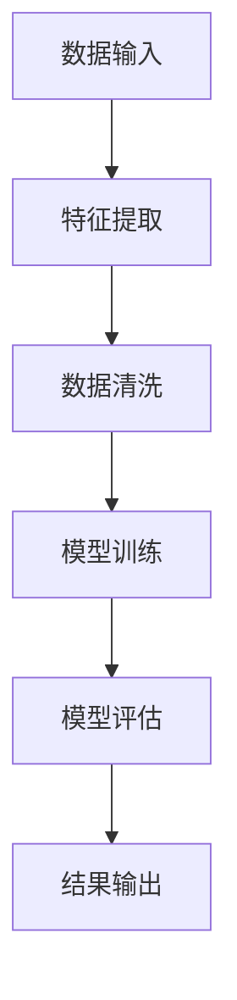

                 


# 智能信用违约互换定价模型校准与风险评估

---

## 关键词：信用违约互换、智能模型、风险评估、机器学习、定价模型、金融衍生品

---

## 摘要：  
本文系统地探讨了智能信用违约互换（CDS）定价模型的校准与风险评估方法。通过结合机器学习算法与传统金融定价理论，提出了一种基于随机森林的智能信用风险评估模型。文章首先介绍了信用违约互换的基本概念与市场背景，随后详细阐述了智能模型的核心概念、算法原理与数学公式，接着分析了系统的架构设计与实现方案，并通过实际案例展示了模型的应用效果。最后，本文总结了模型的优势与局限性，并提出了未来的研究方向。

---

## 目录大纲

### 第一部分: 信用违约互换（CDS）概述

#### 第1章: 信用违约互换（CDS）的基本概念

- 1.1 信用违约互换的定义与基本结构
  - 1.1.1 CDS的定义
  - 1.1.2 CDS的市场参与者与交易机制
  - 1.1.3 CDS的结算流程与风险特征

- 1.2 传统CDS定价模型的局限性
  - 1.2.1 假定条件的不合理性
  - 1.2.2 数据依赖性与模型鲁棒性的不足
  - 1.2.3 传统模型对复杂风险因素的处理能力有限

- 1.3 智能信用违约互换模型的提出
  - 1.3.1 智能模型的核心思想与创新点
  - 1.3.2 智能模型在信用风险评估中的优势
  - 1.3.3 当前市场对智能CDS模型的需求

#### 1.4 本章小结

---

### 第二部分: 智能信用违约互换模型的核心概念

#### 第2章: 智能信用违约互换模型的理论基础

- 2.1 信用风险评估的基本理论
  - 2.1.1 信用风险的定义与分类
  - 2.1.2 信用风险的影响因素
  - 2.1.3 信用风险的度量方法

- 2.2 智能信用风险评估的核心要素
  - 2.2.1 数据特征的提取与选择
  - 2.2.2 风险因素的权重分配
  - 2.2.3 模型的假设条件与边界

- 2.3 智能信用违约互换模型的输入与输出
  - 2.3.1 输入变量的定义与分类
  - 2.3.2 输出结果的解释与应用
  - 2.3.3 模型的适用范围与限制

#### 2.4 本章小结

---

### 第三部分: 智能信用违约互换模型的算法原理

#### 第3章: 智能信用违约互换模型的算法选择

- 3.1 机器学习算法在信用风险评估中的应用
  - 3.1.1 支持向量机（SVM）的原理与优缺点
  - 3.1.2 随机森林（RF）的原理与优缺点
  - 3.1.3 神经网络（NN）的原理与优缺点

- 3.2 基于随机森林的算法选择
  - 3.2.1 随机森林算法的核心思想
  - 3.2.2 随机森林在信用风险评估中的优势
  - 3.2.3 随机森林算法的参数设置与优化

- 3.3 算法实现步骤
  - 3.3.1 数据预处理与特征提取
  - 3.3.2 模型训练与参数调优
  - 3.3.3 模型验证与评估指标

#### 3.4 算法流程图



#### 3.5 本章小结

---

### 第四部分: 模型的数学公式与实现

#### 第4章: 模型的数学公式推导

- 4.1 风险概率的计算公式
  - 4.1.1 风险概率的定义与计算
  - 4.1.2 随机森林算法的投票机制
  - 4.1.3 风险概率的加权计算公式
  $$ P = \sum_{i=1}^{n} w_i x_i $$

- 4.2 损失程度的评估公式
  - 4.2.1 损失程度的定义与计算
  - 4.2.2 神经网络的损失函数
  - 4.2.3 损失程度的评估公式
  $$ L = \alpha \cdot P + \beta $$

- 4.3 模型的校准与优化
  - 4.3.1 模型校准的定义与方法
  - 4.3.2 参数优化的策略与步骤
  - 4.3.3 模型的鲁棒性与准确性评估

#### 4.4 本章小结

---

### 第五部分: 模型的系统架构设计

#### 第5章: 系统功能模块设计

- 5.1 系统功能模块划分
  - 5.1.1 数据采集与预处理模块
  - 5.1.2 模型训练与校准模块
  - 5.1.3 风险评估与报告模块

- 5.2 系统功能设计的领域模型
  ```mermaid
  classDiagram
      class 数据采集与预处理模块 {
          输入数据清洗
          特征提取与转换
      }
      class 模型训练与校准模块 {
          训练数据输入
          模型参数调优
      }
      class 风险评估与报告模块 {
          评估结果输出
          报告生成
      }
      数据采集与预处理模块 --> 模型训练与校准模块
      模型训练与校准模块 --> 风险评估与报告模块
  ```

- 5.3 系统架构设计
  - 5.3.1 系统架构的分层设计
  - 5.3.2 模块间的交互关系
  - 5.3.3 系统的可扩展性与可维护性

#### 5.4 本章小结

---

### 第六部分: 模型的项目实战

#### 第6章: 项目实战与案例分析

- 6.1 项目环境搭建
  - 6.1.1 环境配置与依赖安装
  - 6.1.2 数据集的获取与准备
  - 6.1.3 开发工具的安装与配置

- 6.2 核心代码实现
  - 6.2.1 数据预处理与特征提取
    ```python
    import pandas as pd
    df = pd.read_csv('data.csv')
    features = df[['feature1', 'feature2', ...]]
    labels = df['label']
    ```

  - 6.2.2 模型训练与校准
    ```python
    from sklearn.ensemble import RandomForestClassifier
    model = RandomForestClassifier(n_estimators=100, max_depth=5, random_state=42)
    model.fit(features, labels)
    ```

  - 6.2.3 模型验证与结果分析
    ```python
    from sklearn.metrics import accuracy_score
    y_pred = model.predict(features_test)
    print(f'Accuracy: {accuracy_score(y_true, y_pred)}')
    ```

- 6.3 实际案例分析
  - 6.3.1 案例背景介绍
  - 6.3.2 数据分析与模型应用
  - 6.3.3 模型结果的解读与优化

#### 6.4 本章小结

---

### 第七部分: 总结与展望

#### 第7章: 总结与展望

- 7.1 模型的总结
  - 7.1.1 模型的核心优势与创新点
  - 7.1.2 模型的实际应用效果
  - 7.1.3 模型的局限性与改进方向

- 7.2 未来研究方向
  - 7.2.1 算法优化与模型改进
  - 7.2.2 数据源的扩展与多样性
  - 7.2.3 模型的实时性与可解释性

#### 7.3 本章小结

---

### 第八部分: 参考文献与索引

- 8.1 参考文献
  - 列出相关书籍、论文、技术报告等

- 8.2 索引
  - 按照主题或术语进行索引分类

---

## 作者：AI天才研究院 / AI Genius Institute  
禅与计算机程序设计艺术 / Zen And The Art of Computer Programming

