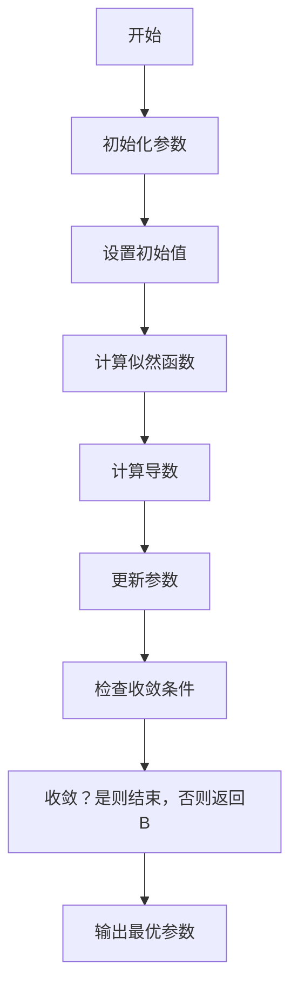

                 


```markdown
# 智能信用违约互换定价模型校准系统

## 关键词
智能信用违约互换, 定价模型, 校准系统, 蒙特卡洛模拟, 最大似然估计, 金融衍生工具

## 摘要
本文详细探讨了智能信用违约互换定价模型校准系统的设计与实现，从背景介绍、核心概念、算法原理、系统架构到项目实战，全面解析了该系统的构建过程。文章首先介绍了信用违约互换的基本概念及其在金融市场中的作用，接着分析了传统定价模型的局限性以及智能化定价的需求。随后，详细讲解了蒙特卡洛模拟和最大似然估计等核心算法的原理与实现步骤，并通过ER图和Mermaid流程图展示了系统的实体关系与算法流程。最后，结合实际案例，详细阐述了系统的功能设计、架构设计、接口设计和交互流程，并提供了完整的Python代码实现与结果分析。

---

## 第一部分: 智能信用违约互换定价模型校准系统的背景与核心概念

### 第1章: 信用违约互换与智能定价模型的背景介绍

#### 1.1 信用违约互换（CDS）的基本概念
- 1.1.1 CDS的定义与基本结构
- 1.1.2 CDS在金融市场中的作用与地位
- 1.1.3 CDS的标准化与市场发展

#### 1.2 智能信用违约互换定价的背景与问题背景
- 1.2.1 传统信用违约互换定价模型的局限性
- 1.2.2 智能化定价的需求与驱动力
- 1.2.3 当前市场对智能CDS定价模型的需求

#### 1.3 信用违约互换定价模型校准系统的定义与目标
- 1.3.1 定价模型校准的定义
- 1.3.2 系统的目标与核心功能
- 1.3.3 系统的边界与外延

### 第2章: 智能信用违约互换定价模型的核心概念与联系

#### 2.1 核心概念原理
- 2.1.1 信用风险模型的基本原理
- 2.1.2 智能定价模型的数学基础
- 2.1.3 校准系统的实现原理

#### 2.2 核心概念属性特征对比表
| 概念 | 属性 | 特征 |
|------|------|------|
| 信用违约互换 | 风险类型 | 信用风险 |
| 智能定价模型 | 输入参数 | 值业风险、信用利差等 |
| 校准系统 | 输出结果 | 模型参数最优解 |

#### 2.3 ER实体关系图
```mermaid
erDiagram
    actor 用户
    actor 市场数据提供者
    actor 模型开发者
    actor 系统管理员
    database 系统数据库
    system 智能校准系统
    用户 -> 系统: 提交校准请求
    系统 -> 数据库: 查询历史数据
    系统 -> 模型开发者: 获取模型参数
    系统 -> 市场数据提供者: 获取实时数据
    系统 -> 系统管理员: 管理系统运行
```

---

## 第二部分: 智能信用违约互换定价模型校准的算法原理

### 第3章: 蒙特卡洛模拟与最大似然估计

#### 3.1 蒙特卡洛模拟原理
- 3.1.1 蒙特卡洛模拟的基本原理
- 3.1.2 蒙特卡洛模拟在信用风险中的应用
- 3.1.3 蒙特卡洛模拟的实现步骤

#### 3.2 最大似然估计原理
- 3.2.1 最大似然估计的基本原理
- 3.2.2 在信用违约互换定价中的应用
- 3.2.3 实现步骤与注意事项

#### 3.3 算法流程图


#### 3.4 Python实现代码
```python
import numpy as np
from scipy.stats import norm

# 蒙特卡洛模拟实现
def monte_carlo_simulation(nsim=1000, mu=0, sigma=1):
    returns = np.random.normal(mu, sigma, nsim)
    return returns

# 最大似然估计实现
def mle_estimation(data):
    n = len(data)
    mu = (1/n)*sum(data)
    variance = (1/n)*sum((x - mu)**2 for x in data)
    return mu, np.sqrt(variance)

# 示例数据
data = [1, 2, 3, 4, 5]
mu, sigma = mle_estimation(data)
print(f"MLE估计的均值：{mu}，标准差：{sigma}")
```

#### 3.5 数学模型与公式
- 蒙特卡洛模拟的数学模型：
  $$ P(X \leq x) = \int_{-\infty}^{x} \frac{1}{\sigma \sqrt{2\pi}} e^{-\frac{(t-\mu)^2}{2\sigma^2}} dt $$
- 最大似然估计的似然函数：
  $$ L(\theta) = \prod_{i=1}^{n} f(x_i; \theta) $$
  其中，$\theta$ 是模型参数，$f(x_i; \theta)$ 是概率密度函数。

---

## 第三部分: 系统分析与架构设计

### 第4章: 系统功能设计与架构实现

#### 4.1 系统功能模块设计
- 4.1.1 数据采集模块
- 4.1.2 模型构建模块
- 4.1.3 校准模块
- 4.1.4 结果分析模块

#### 4.2 系统架构设计


#### 4.3 系统接口设计与交互流程
```mermaid
sequenceDiagram
    actor 用户
    system 系统
    用户 -> 系统: 提交校准请求
    系统 -> 用户: 返回校准结果
    用户 -> 系统: 获取结果分析
    系统 -> 用户: 返回分析报告
```

---

## 第四部分: 项目实战与结果分析

### 第5章: 项目实战

#### 5.1 环境安装与配置
- Python安装与配置
- 安装必要的库（如NumPy、SciPy、Matplotlib等）

#### 5.2 核心代码实现
```python
import numpy as np
from scipy.optimize import minimize

# 示例数据
credit违约数据 = np.array([0.01, 0.02, 0.03, 0.04, 0.05])

# 定义损失函数
def loss_function(params, data):
    mu, sigma = params
    return -np.sum(norm.logpdf(data, mu, sigma))

# 最小化问题
result = minimize(loss_function, [0.02, 0.01], args=credit违约数据)

# 输出最优参数
print(f"最优均值：{result.x[0]}，最优标准差：{result.x[1]}")
```

#### 5.3 实际案例分析
- 数据来源与预处理
- 校准过程与结果展示
- 结果分析与验证

#### 5.4 项目小结
- 校准系统的优势与不足
- 未来改进方向与潜在应用

---

## 第五部分: 最佳实践与总结

### 第6章: 最佳实践与注意事项

#### 6.1 最佳实践
- 数据质量的重要性
- 模型选择的策略
- 系统维护与更新

#### 6.2 注意事项
- 参数敏感性分析
- 系统性能优化
- 数据隐私与安全

### 第7章: 小结与拓展阅读

#### 7.1 小结
- 本文的核心内容回顾
- 系统的关键技术总结

#### 7.2 拓展阅读
- 推荐的相关书籍与论文
- 相关领域的最新研究进展

---

## 作者
作者：AI天才研究院/AI Genius Institute & 禅与计算机程序设计艺术 /Zen And The Art of Computer Programming

---

以上是《智能信用违约互换定价模型校准系统》的技术博客文章的详细目录大纲。接下来，您可以根据上述结构撰写完整的文章内容，确保每个部分都包含丰富的技术细节和具体的实现示例。

