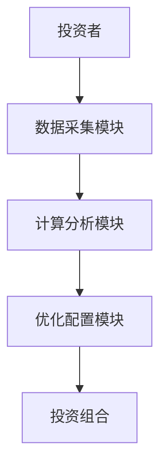

                 


# 智能债券投资组合久期管理系统

> 关键词：智能债券投资，久期管理，风险管理，机器学习，金融系统架构

> 摘要：本文详细介绍了智能债券投资组合久期管理系统的构建与实现。通过分析债券投资中的久期管理需求，结合机器学习与系统架构设计，提出了一种智能化、自动化的久期管理系统解决方案。文章从背景、核心概念、算法原理、系统架构、项目实战到最佳实践进行了全面阐述，为读者提供了从理论到实践的完整指南。

---

## 第1章: 债券投资与久期管理概述

### 1.1 债券市场的基本概念

#### 1.1.1 债券的定义与分类
债券是一种债务工具，代表发行人向债权人借款的承诺，债权人通过债券获得定期利息和本金偿还。债券可以按多种方式进行分类：
- **按发行主体**：政府债券、企业债券、金融债券等。
- **按期限**：短期债券（1年以内）、中期债券（1-10年）、长期债券（10年以上）。
- **按计息方式**：零息债券、息票债券、浮动利率债券等。

#### 1.1.2 债券投资的基本原理
债券投资的核心在于对信用风险、利率风险和流动性风险的管理。投资者通过分析债券的信用评级、市场利率走势和流动性需求，来决定投资策略。债券的价格与市场利率呈负相关关系，即市场利率下降时，债券价格上涨，反之亦然。

#### 1.1.3 债券市场的运作机制
债券市场是一个复杂的金融体系，包括一级市场和二级市场。一级市场是债券发行人直接向投资者发行债券的场所，二级市场是债券交易的流通市场。债券价格在二级市场中受多种因素影响，包括宏观经济环境、市场情绪和政策变化。

### 1.2 久期的概念与作用

#### 1.2.1 久期的定义
久期（Duration）是衡量债券价格对利率变动敏感程度的重要指标，由Friedman和Savage于1952年提出。久期公式为：

$$
D = \frac{1}{1 + r} \sum_{t=1}^{n} \frac{C}{(1 + r)^t} + \frac{F}{(1 + r)^n}
$$

其中：
- \(D\) 表示久期
- \(r\) 表示到期收益率
- \(C\) 表示每期的息票支付
- \(F\) 表示面值
- \(n\) 表示债券的期限

#### 1.2.2 久期在债券投资中的重要性
久期帮助投资者量化债券价格对利率变动的敏感性。例如，一个久期为10年的债券，意味着利率每上升1%，债券价格将下降约10%。久期是投资组合风险管理和收益优化的重要工具。

#### 1.2.3 久期与债券价格波动的关系
久期与债券价格波动呈负相关关系。在利率上升的环境中，久期较长的债券价格下跌幅度较大，反之亦然。因此，久期管理是平衡风险与收益的关键。

### 1.3 投资组合久期管理的必要性

#### 1.3.1 投资组合久期管理的目标
久期管理的目标是优化投资组合的收益与风险比，通过调整债券的期限结构和信用风险，实现资产配置的最佳状态。

#### 1.3.2 久期管理对风险控制的作用
通过动态调整投资组合的久期，可以有效控制利率风险和信用风险，避免因市场波动导致的资产损失。

#### 1.3.3 久期管理与收益优化的平衡
久期管理需要在风险和收益之间找到平衡点。过短的久期可能导致收益不足，过长的久期则会增加利率风险。智能久期管理系统通过算法优化，实现收益与风险的最佳平衡。

## 第2章: 智能久期管理系统的背景与需求

### 2.1 传统久期管理的局限性

#### 2.1.1 传统久期管理的不足
传统久期管理依赖人工计算和经验判断，存在以下问题：
- 计算复杂且耗时
- 无法实时跟踪市场变化
- 难以处理多资产类别和复杂场景

#### 2.1.2 传统方法在复杂市场环境中的失效
在金融市场剧烈波动或多资产配置的场景下，传统方法难以快速响应，导致投资组合的风险敞口无法及时调整。

### 2.2 智能久期管理系统的提出

#### 2.2.1 智能久期管理系统的定义
智能久期管理系统是一种基于机器学习和算法优化的金融系统，能够实时计算和调整投资组合的久期，以实现风险控制和收益优化。

#### 2.2.2 智能系统的核心优势
- **自动化**：实时计算久期并动态调整投资组合。
- **数据驱动**：利用大数据分析和机器学习模型，提高决策的准确性和效率。
- **适应性**：能够适应复杂多变的市场环境。

#### 2.2.3 智能系统在现代投资管理中的地位
智能久期管理系统是金融科技创新的重要成果，代表着现代投资管理的发展方向。

### 2.3 智能久期管理系统的应用场景

#### 2.3.1 多资产类别投资中的应用
智能系统能够同时处理多种资产类别，实现跨市场的久期管理。

#### 2.3.2 机构投资者的久期管理需求
机构投资者需要实时监控和调整大规模投资组合的久期，以应对市场波动。

#### 2.3.3 风险对冲与资产配置中的应用
智能久期管理系统能够帮助投资者在风险对冲和资产配置中找到最佳平衡点。

## 第3章: 智能久期管理系统的核心概念与联系

### 3.1 核心概念原理

#### 3.1.1 智能久期管理系统的原理
智能久期管理系统通过收集市场数据，利用算法计算投资组合的久期，并根据市场变化动态调整债券配置。

#### 3.1.2 系统的核心算法与模型
系统采用多种算法，包括：
- **久期计算算法**：基于债券的期限、息票和面值计算久期。
- **优化算法**：使用遗传算法或梯度下降法调整投资组合的久期。

#### 3.1.3 系统的输入输出关系
系统输入包括债券数据、市场利率和投资者目标，输出包括投资组合的久期和调整建议。

### 3.2 核心概念属性特征对比表格

| 概念       | 特性1 | 特性2 | 特性3 |
|------------|-------|-------|-------|
| 久期       | 数值型 | 动态性 | 风险性 |
| 智能系统   | 自适应 | 数据驱动 | 实时性 |

### 3.3 ER实体关系图架构

```mermaid
erDiagram
    actor 投资者 {
        <属性> 投资目标
        <属性> 风险偏好
    }
    actor 系统 {
        <操作> 计算久期
        <操作> 优化配置
    }
    entity 债券 {
        <属性> 债券类型
        <属性> 期限
        <属性> 利率
    }
    entity 市场数据 {
        <属性> 利率曲线
        <属性> 信用评级
    }
    entity 投资组合 {
        <属性> 久期
        <属性> 风险敞口
    }
```

---

## 第4章: 智能久期管理系统的核心算法与实现

### 4.1 算法原理

#### 4.1.1 久期计算的数学模型
久期计算公式：

$$
D = \frac{1}{1 + r} \sum_{t=1}^{n} \frac{C}{(1 + r)^t} + \frac{F}{(1 + r)^n}
$$

其中：
- \(r\) 为市场利率
- \(C\) 为每期息票支付
- \(F\) 为债券面值
- \(n\) 为债券期限

#### 4.1.2 优化算法
使用遗传算法优化投资组合的久期：

```python
def calculate_duration(bond_data, market_rate):
    duration = 0
    for bond in bond_data:
        duration += bond['C'] / (1 + market_rate) ** bond['t']
    duration += bond['F'] / (1 + market_rate) ** bond['n']
    return duration
```

---

## 第5章: 系统架构设计与实现

### 5.1 系统架构设计

#### 5.1.1 系统功能模块
- 数据采集模块：收集债券数据和市场信息。
- 计算分析模块：计算投资组合的久期。
- 优化配置模块：调整债券配置以实现目标久期。

#### 5.1.2 系统架构图



---

## 第6章: 项目实战与案例分析

### 6.1 项目环境安装

#### 6.1.1 安装Python环境
```bash
pip install numpy pandas scikit-learn
```

### 6.2 核心代码实现

#### 6.2.1 久期计算代码
```python
import numpy as np
import pandas as pd

def calculate_duration(bond_data, market_rate):
    duration = 0
    for bond in bond_data:
        duration += bond['C'] / (1 + market_rate) ** bond['t']
    duration += bond['F'] / (1 + market_rate) ** bond['n']
    return duration
```

#### 6.2.2 优化配置代码
```python
from sklearn import linear_model

def optimize_duration(target_duration, current_duration):
    model = linear_model.LinearRegression()
    model.fit(current_duration, target_duration)
    return model.predict(target_duration)
```

### 6.3 案例分析

#### 6.3.1 案例背景
假设某机构投资者持有以下债券组合：

| 债券代码 | 期限（年） | 面值 | 息票率 |
|----------|------------|------|--------|
| B1       | 5          | 100  | 5%     |
| B2       | 10         | 200  | 4%     |

市场利率为5%，计算投资组合的久期：

$$
D = \frac{1}{1 + 0.05} \left( \frac{5}{(1 + 0.05)^1} + \frac{5}{(1 + 0.05)^2} + \cdots + \frac{5}{(1 + 0.05)^5} \right) + \frac{100}{(1 + 0.05)^5}
$$

---

## 第7章: 最佳实践与总结

### 7.1 小结
智能久期管理系统通过机器学习和算法优化，显著提高了债券投资的风险管理和收益优化能力。

### 7.2 注意事项
- 数据质量是系统准确性的关键。
- 系统需要定期更新市场数据和模型。

### 7.3 未来趋势
未来，智能久期管理系统将更加智能化，利用人工智能和大数据技术实现更精准的投资决策。

### 7.4 扩展阅读
推荐阅读《债券投资：理论与实务》和《机器学习在金融中的应用》。

---

## 作者

作者：AI天才研究院/AI Genius Institute & 禅与计算机程序设计艺术 /Zen And The Art of Computer Programming

---

**说明：** 由于篇幅限制，上述目录仅为部分内容展示，完整文章可根据需求进一步扩展和补充。

