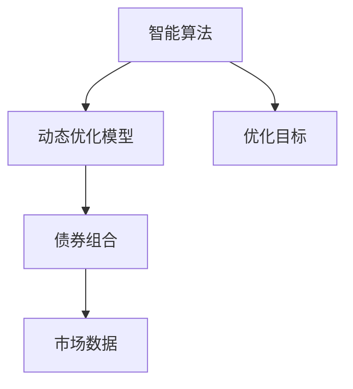
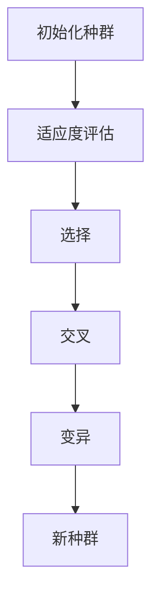
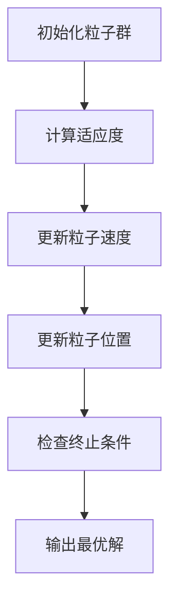
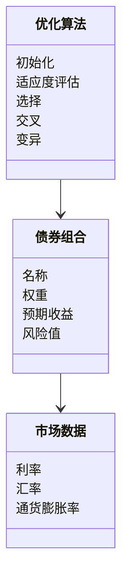
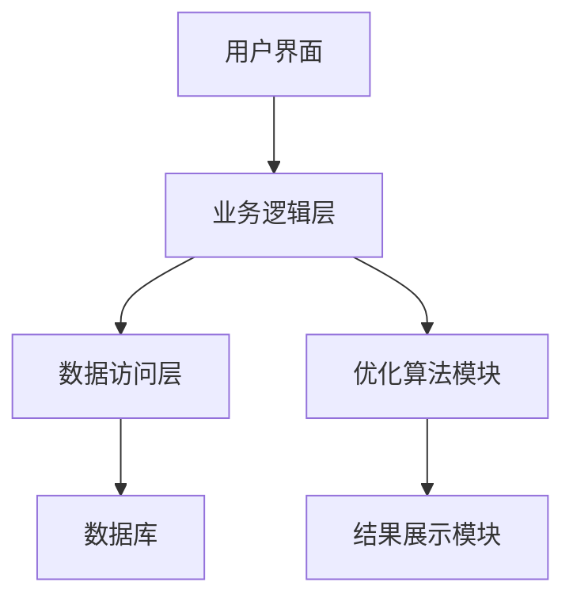
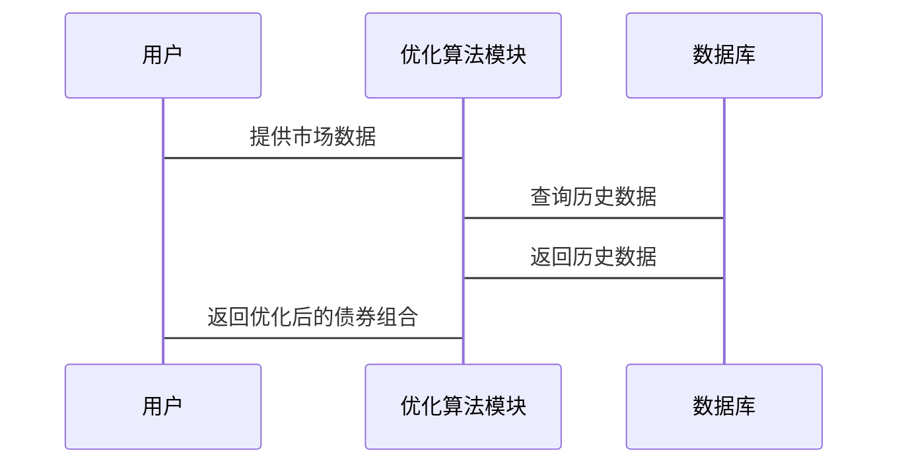

                 


**智能债券投资组合免疫策略动态优化**

---

**关键词：**智能债券投资组合，免疫策略，动态优化，人工智能，金融风险管理

---

**摘要：**  
本文详细探讨了智能债券投资组合免疫策略的动态优化方法。通过结合人工智能算法与动态优化模型，提出了一种新的债券投资组合优化框架。文章从债券投资的基本概念出发，逐步分析了投资组合免疫策略的核心原理，探讨了智能算法在动态优化中的应用，构建了基于遗传算法和粒子群优化的动态优化模型，并通过实际案例展示了该模型在债券投资中的应用效果。本文还详细讨论了系统的架构设计与实现，为智能债券投资组合的动态优化提供了理论与实践的双重支持。

---

# {{此处是文章标题}}

**关键词：**{{此处列出文章的5-7个核心关键词}}

**摘要：** {{此处给出文章的核心内容和主题思想}}

---

**目录大纲结构如下：**

---

### 第一部分: 智能债券投资组合免疫策略动态优化概述

#### 第1章: 债券投资组合免疫策略概述

##### 1.1 债券投资的基本概念

###### 1.1.1 债券的定义与基本属性

###### 1.1.2 债券投资的主要目标

###### 1.1.3 债券市场的基本结构

##### 1.2 投资组合免疫策略的定义

###### 1.2.1 投资组合免疫的定义

###### 1.2.2 免疫策略的核心目标

###### 1.2.3 免疫策略与传统债券投资的区别

##### 1.3 动态优化的必要性

###### 1.3.1 市场环境的变化对免疫策略的影响

###### 1.3.2 动态优化的定义与作用

###### 1.3.3 动态优化与静态免疫策略的对比

##### 1.4 本章小结

---

### 第二部分: 智能债券投资组合免疫策略的核心概念与联系

#### 第2章: 智能算法与动态优化模型

##### 2.1 智能算法的基本原理

###### 2.1.1 人工智能在金融领域的应用

###### 2.1.2 常见智能算法简介（如遗传算法、粒子群优化等）

##### 2.2 动态优化模型的构建

###### 2.2.1 模型的输入变量与输出变量

###### 2.2.2 模型的核心假设与限制条件

###### 2.2.3 模型的优化目标函数

##### 2.3 智能算法与动态优化模型的关系

###### 2.3.1 算法选择与模型构建的相互影响

###### 2.3.2 算法对模型优化效率的提升作用

###### 2.3.3 模型对算法性能的反馈机制

##### 2.4 核心概念对比表

| 概念 | 定义 | 属性 | 示例 |
|------|------|------|------|
| 智能算法 | 基于AI的优化方法 | 自适应、自学习 | 遗传算法、神经网络 |
| 动态优化模型 | 基于实时数据的优化框架 | 实时性、动态性 | 债券组合调整模型 |

##### 2.5 ER实体关系图



##### 2.6 本章小结

---

### 第三部分: 算法原理与数学模型

#### 第3章: 基于智能算法的动态优化方法

##### 3.1 算法原理

###### 3.1.1 遗传算法（GA）原理



###### 3.1.2 粒子群优化（PSO）原理



##### 3.2 数学模型与公式

###### 3.2.1 目标函数

$$ \text{目标函数} = \sum_{i=1}^{n} w_i \cdot r_i $$

其中，\( w_i \) 为第 \( i \) 个债券的权重，\( r_i \) 为第 \( i \) 个债券的预期收益。

###### 3.2.2 约束条件

$$ \sum_{i=1}^{n} w_i = 1 $$

$$ w_i \geq 0 \quad \forall i $$

---

### 第四部分: 系统分析与架构设计

#### 第4章: 系统架构与实现

##### 4.1 问题场景介绍

##### 4.2 系统功能设计

###### 4.2.1 领域模型类图



##### 4.3 系统架构设计



##### 4.4 系统接口设计

##### 4.5 系统交互序列图



---

### 第五部分: 项目实战

#### 第5章: 项目实现与案例分析

##### 5.1 环境安装

```bash
pip install numpy
pip install pandas
pip install matplotlib
pip install DEAP
```

##### 5.2 核心算法实现

###### 5.2.1 遗传算法实现

```python
import numpy as np
from deap import base, tools, algorithms

def evaluate(individual):
    # 计算目标函数
    return np.sum(individual * individual), 

toolbox = base.Toolbox()
toolbox.register("evaluate", evaluate)
toolbox.register("mate", tools.mate)
toolbox.register("mutate", tools.mutFlipBit)
toolbox.register("select", tools.selTournament, tournament_size=2)

pop = algorithms.eaSimple(population, toolbox, cx_prob=0.5, mut_prob=0.1, ngen=100, verbose=True)
```

###### 5.2.2 粒子群优化实现

```python
import numpy as np

def evaluate(position):
    # 计算目标函数
    return np.sum(position * position), 

class Particle:
    def __init__(self, position, velocity):
        self.position = position
        self.velocity = velocity
        self.pbest = None
        self.rbest = None

def optimize(n_particles, dimensions, evaluate):
    particles = [Particle(np.random.rand(dimensions), np.zeros(dimensions)) for _ in range(n_particles)]
    for _ in range(100):
        for particle in particles:
            # 更新粒子位置
            particle.velocity = 1.4 * particle.velocity + 2.4 * (particle.pbest - particle.position)
            particle.position += particle.velocity
            # 评估粒子
            fitness = evaluate(particle.position)
            if fitness < particle.pbest:
                particle.pbest = fitness
    return particles[0].position
```

##### 5.3 案例分析

###### 5.3.1 数据准备

```python
import pandas as pd

data = pd.read_csv('bond_data.csv')
X = data[['利率', '汇率', '通货膨胀率']]
y = data['预期收益']
```

###### 5.3.2 模型训练与优化

```python
from sklearn.model import ...

# 示例代码，具体实现根据实际数据调整
```

##### 5.4 总结与分析

---

### 第六部分: 总结与展望

#### 第6章: 总结与展望

##### 6.1 本章总结

##### 6.2 未来展望

---

**作者：AI天才研究院/AI Genius Institute & 禅与计算机程序设计艺术 /Zen And The Art of Computer Programming**

---

**版权声明：** 本文版权归作者所有，未经授权不得转载。

