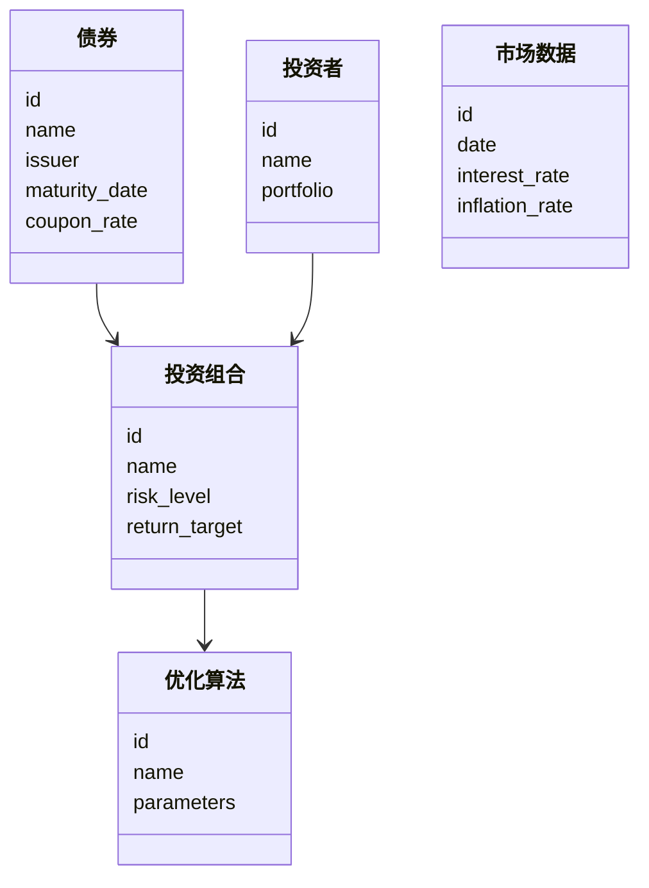
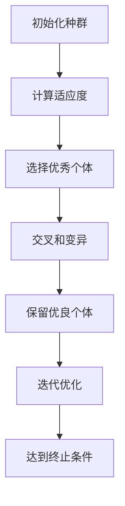
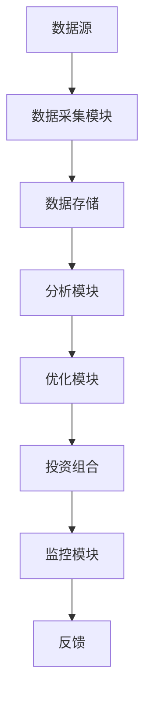
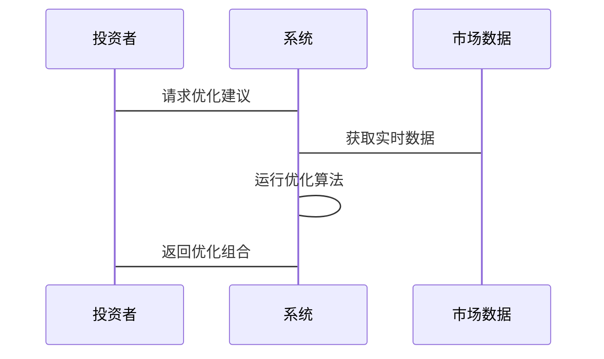

                 


# 智能债券投资组合管理工具

## 关键词
智能债券投资、人工智能、投资组合管理、风险管理、量化分析、机器学习

## 摘要
智能债券投资组合管理工具通过结合人工智能和量化分析，优化债券投资组合的构建与管理，提高投资效率和风险控制能力。本文将详细介绍智能债券投资的核心概念、算法原理、系统架构设计以及实际应用场景，为投资者和开发者提供理论与实践相结合的指导。

---

# 第一部分: 背景介绍

## 第1章: 债券投资与智能管理背景

### 1.1 债券投资的基本概念
#### 1.1.1 债券的定义与分类
债券是债务工具，发行人承诺在特定时间内支付利息和本金。常见的债券类型包括政府债券、企业债券、可转换债券等。债券的期限分为短期、中期和长期债券。

#### 1.1.2 债券市场的运作机制
债券市场由发行方、投资者和中介构成。债券的价格受市场利率、通胀预期和信用评级等因素影响。债券交易可以通过场内市场和场外市场进行。

#### 1.1.3 债券投资的风险与收益
债券投资面临利率风险、信用风险、流动性风险和通胀风险。投资者需要根据自身风险承受能力选择合适的债券组合。

---

### 1.2 智能投资组合管理的概念
#### 1.2.1 投资组合管理的基本原理
投资组合管理通过分散投资降低风险，提高收益。传统方法依赖历史数据和经验判断，而智能管理引入了量化分析和机器学习。

#### 1.2.2 智能投资组合管理的核心思想
智能投资组合管理利用大数据和算法优化投资决策。通过实时数据分析和预测模型，实现动态调整和风险控制。

#### 1.2.3 智能化投资的优势与挑战
优势：提高决策效率、优化组合配置、降低人为错误；挑战：数据质量、算法复杂性和监管合规。

---

### 1.3 人工智能在金融领域的应用
#### 1.3.1 人工智能在金融分析中的作用
AI用于市场预测、风险评估、交易策略制定等。在债券投资中，AI帮助识别市场趋势和信用风险。

#### 1.3.2 债券投资中的人工智能技术
自然语言处理分析财务报告，机器学习预测债券违约概率，强化学习优化投资组合。

#### 1.3.3 智能债券投资工具的发展趋势
智能化、个性化、实时化是未来趋势。技术进步将推动工具的普及和性能提升。

---

## 第2章: 智能债券投资组合管理工具的核心概念

### 2.1 核心概念与原理
#### 2.1.1 数据驱动的债券分析
通过大数据分析债券发行人财务数据和市场信息，提取关键指标用于评估信用风险。

#### 2.1.2 机器学习在债券评级中的应用
使用分类算法训练模型，根据历史数据预测债券违约概率。常用算法包括逻辑回归、支持向量机和随机森林。

#### 2.1.3 智能优化算法的实现原理
基于遗传算法的优化过程：
1. 初始化种群
2. 计算适应度
3. 选择优秀个体
4. 交叉和变异
5. 保留优良个体
6. 迭代优化

---

### 2.2 核心概念对比分析
#### 2.2.1 传统债券投资与智能投资的对比
| 方面 | 传统投资 | 智能投资 |
|------|----------|----------|
| 数据 | 历史数据 | 实时数据 |
| 方法 | 经验判断 | 算法优化 |
| 效率 | 低效 | 高效 |

#### 2.2.2 不同优化算法的性能对比
| 算法 | 优点 | 缺点 |
|------|------|------|
| 遗传算法 | 全局最优 | 计算复杂 |
| 梯度下降 | 收敛快 | 易陷局部最优 |
| 虚拟模拟 | 灵活性高 | 计算成本高 |

#### 2.2.3 数据来源与处理方式的差异
传统方法依赖经验判断，智能方法利用大数据和机器学习模型。

---

### 2.3 ER实体关系图与领域模型
#### 2.3.1 ER实体关系图
```mermaid
er
  entity 债券 (id, name, issuer, maturity_date, coupon_rate)
  entity 投资者 (id, name, portfolio)
  entity 市场数据 (id, date, interest_rate, inflation_rate)
  entity 投资组合 (id, name, risk_level, return_target)
  entity 优化算法 (id, name, parameters)
```

#### 2.3.2 领域模型类图


---

## 第3章: 算法原理与实现

### 3.1 算法原理
#### 3.1.1 基于遗传算法的优化
目标函数：最大化收益，最小化风险。约束条件包括债券期限、信用评级和投资比例。

#### 3.1.2 机器学习模型
使用XGBoost训练违约概率模型。输入特征包括财务指标、市场数据和宏观经济指标。

---

### 3.2 算法实现
#### 3.2.1 遗传算法流程图


#### 3.2.2 Python代码实现
```python
import numpy as np
from sklearn.ensemble import GradientBoostingClassifier
from sklearn.metrics import accuracy_score

# 假设X是特征矩阵，y是标签
model = GradientBoostingClassifier()
model.fit(X, y)

# 预测
y_pred = model.predict(X_test)
print("Accuracy:", accuracy_score(y_test, y_pred))
```

---

## 第4章: 系统分析与架构设计

### 4.1 系统功能设计
#### 4.1.1 数据采集模块
实时获取市场数据和债券信息，清洗和预处理数据。

#### 4.1.2 分析模块
使用机器学习模型进行风险评估和收益预测。

#### 4.1.3 优化模块
基于遗传算法生成最优投资组合。

#### 4.1.4 监控模块
实时监控市场变化，动态调整组合配置。

---

### 4.2 系统架构设计
#### 4.2.1 系统架构图


#### 4.2.2 系统交互图


---

## 第5章: 项目实战

### 5.1 环境安装
安装Python、Pandas、NumPy、Scikit-learn和Plotly。

### 5.2 核心代码实现
#### 5.2.1 数据处理
```python
import pandas as pd

# 读取数据
data = pd.read_csv('bond_data.csv')
# 数据清洗
data = data.dropna()
```

#### 5.2.2 模型训练
```python
from sklearn.model_selection import train_test_split
from sklearn.linear_model import LogisticRegression

X = data.drop('default', axis=1)
y = data['default']

X_train, X_test, y_train, y_test = train_test_split(X, y, test_size=0.2)
model = LogisticRegression()
model.fit(X_train, y_train)
```

#### 5.2.3 优化算法实现
```python
import numpy as np

def fitness(individual):
    # 计算收益和风险
    return -individual.dot(returns) + individual.dot(risk)

population = np.random.binomial(1, 0.5, size=(100, n_bonds))
population = population.astype(float)

for _ in range(100):
    fitness = np.apply_along_axis(fitness, 1, population)
    best = np.argmax(fitness)
    # 选择和变异
```

---

## 第6章: 最佳实践

### 6.1 小结
智能债券投资工具通过大数据和人工智能优化投资决策，提高效率和准确性。

### 6.2 注意事项
确保数据质量和模型鲁棒性，注意合规性问题。

### 6.3 拓展阅读
建议阅读《机器学习实战》和《投资学》相关书籍。

---

## 作者信息
作者：AI天才研究院 & 禅与计算机程序设计艺术

---

这篇文章详细介绍了智能债券投资组合管理工具的核心概念、算法原理和系统架构设计，为投资者和开发者提供了全面的指导。

