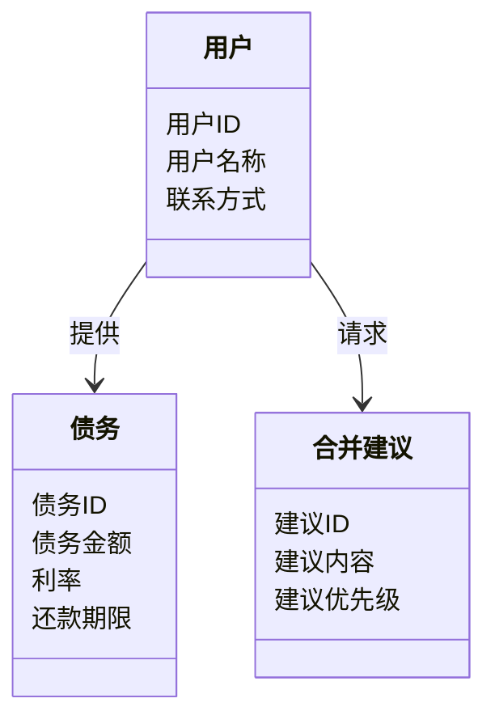
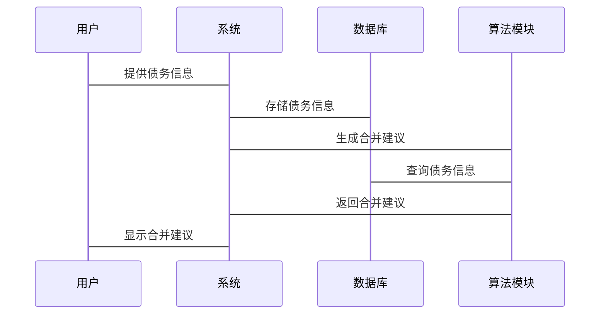

                 


# 智能债务合并建议生成器

> 关键词：智能债务合并、债务优化、推荐算法、系统架构、项目实战

> 摘要：智能债务合并建议生成器是一种利用算法和系统架构优化债务结构的工具，通过分析债务数据，生成最优合并建议，帮助用户降低利息支出，提高财务健康状况。本文详细介绍了智能债务合并的背景、核心概念、算法原理、系统架构、项目实战及案例分析，为读者提供全面的技术解读。

---

## 第一部分: 智能债务合并建议生成器的背景与核心概念

### 第1章: 智能债务合并的背景与问题背景

#### 1.1 债务问题的现状与挑战

##### 1.1.1 债务问题的普遍性
债务问题在个人和企业中普遍存在。随着经济的发展，个人和企业面临的债务压力越来越大。例如，个人可能有多张信用卡欠款、房贷、车贷等，而企业则可能面临供应链融资、银行贷款等多种债务。这些债务往往具有不同的利率、还款期限和还款方式，管理起来复杂且容易产生额外的财务负担。

##### 1.1.2 债务问题对个人和企业的影响
债务问题对个人和企业的财务健康状况有着深远的影响。例如，高额的债务可能导致个人信用评分下降，影响未来的贷款申请；企业如果不能合理管理债务，可能导致现金流断裂，甚至面临破产风险。此外，债务压力还可能影响个人的心理健康，导致焦虑、失眠等问题。

##### 1.1.3 当前债务管理工具的局限性
传统的债务管理工具通常只能提供简单的债务记录和提醒功能，无法根据债务的具体情况提供个性化的优化建议。例如，用户可能需要手动输入债务信息，且只能查看基本的还款计划，无法自动优化债务结构，降低整体的财务负担。

#### 1.2 智能债务合并的必要性

##### 1.2.1 债务合并的基本概念
债务合并是指将多个债务整合为一个或少数几个债务的过程。通过债务合并，可以简化还款流程，降低管理成本，并可能获得更优惠的利率。例如，将多张信用卡欠款合并为一个低利率的个人贷款，可以减少总的利息支出。

##### 1.2.2 智能债务合并的优势
智能债务合并通过自动化技术，能够根据债务的具体情况（如利率、还款期限、可用额度等）生成最优的合并方案。与传统方法相比，智能债务合并的优势在于其高效性、准确性和个性化。它能够帮助用户快速找到最优的债务结构，降低财务负担。

##### 1.2.3 智能债务合并的目标与边界
智能债务合并的目标是通过算法优化，帮助用户找到最优的债务合并方案，降低整体的利息支出，提高财务健康状况。其边界包括：仅处理已知的债务信息，不考虑未来可能出现的债务；假设用户提供的债务信息是准确的；仅提供优化建议，不直接处理债务。

---

### 第2章: 智能债务合并的核心概念与系统架构

#### 2.1 核心概念与系统架构

##### 2.1.1 债务数据的收集与处理
智能债务合并的第一步是收集和处理债务数据。用户需要提供债务的相关信息，包括债务金额、利率、还款期限等。系统会对这些数据进行清洗和预处理，确保数据的准确性和完整性。

##### 2.1.2 债务分析的算法与模型
智能债务合并的核心是算法和模型。系统需要根据债务的具体情况，生成最优的合并方案。常用的算法包括基于规则的匹配和机器学习模型。例如，基于规则的匹配可以将高利率的债务优先合并，而机器学习模型可以通过历史数据预测最优的合并方案。

##### 2.1.3 债务合并建议的生成逻辑
系统在生成债务合并建议时，需要考虑多个因素，如债务的总金额、利率、还款期限等。系统会根据这些因素生成多个可能的合并方案，并对每个方案进行评估，选择最优的一个或几个方案作为建议。

#### 2.2 系统架构的ER实体关系图

```mermaid
erDiagram
    actor 用户 {
        <属性> 用户ID
        <属性> 用户名称
        <属性> 联系方式
    }
    actor 债务机构 {
        <属性> 机构ID
        <属性> 机构名称
        <属性> 联系方式
    }
    actor 系统管理员 {
        <属性> 管理员ID
        <属性> 用户名
        <属性> 密码
    }
    debt 债务 {
        <主键> 债务ID
        <外键> 用户ID
        <外键> 机构ID
        <属性> 债务金额
        <属性> 利率
        <属性> 还款期限
    }
    suggestion 合并建议 {
        <主键> 建议ID
        <外键> 债务ID
        <属性> 建议内容
        <属性> 建议优先级
    }
    用户 --> 债务: 提供
    债务机构 --> 债务: 提供
    系统管理员 --> 债务: 管理
    用户 --> 合并建议: 请求
    系统管理员 --> 合并建议: 管理
```

---

## 第三部分: 智能债务合并算法原理

### 第3章: 推荐算法的原理与实现

#### 3.1 算法原理

##### 3.1.1 基于规则的匹配算法
基于规则的匹配算法是一种简单但有效的推荐算法。它通过预定义的规则，将债务按照特定的条件进行匹配。例如，将高利率的债务优先合并，或者将相同机构的债务合并。

##### 3.1.2 基于机器学习的推荐算法
基于机器学习的推荐算法是一种更复杂的推荐方法。它通过训练模型，学习债务的特征，并生成最优的合并方案。常用的算法包括随机森林、支持向量机（SVM）和神经网络等。

#### 3.2 算法实现

##### 3.2.1 基于规则的匹配算法实现
以下是一个基于规则的匹配算法的Python实现示例：

```python
def merge_debt(debt_list):
    # 根据利率排序
    debt_list.sort(key=lambda x: x['rate'], reverse=True)
    # 合并高利率的债务
    merged_debt = []
    total_amount = 0
    total_rate = 0
    for debt in debt_list:
        total_amount += debt['amount']
        total_rate = max(debt['rate'], total_rate)
    merged_debt.append({
        'amount': total_amount,
        'rate': total_rate
    })
    return merged_debt
```

##### 3.2.2 基于机器学习的推荐算法实现
以下是一个基于机器学习的推荐算法的Python实现示例：

```python
from sklearn.ensemble import RandomForestRegressor

# 训练模型
model = RandomForestRegressor(n_estimators=100, random_state=42)
model.fit(X_train, y_train)

# 预测最优合并方案
X_test = ...  # 测试数据
y_pred = model.predict(X_test)
```

#### 3.3 数学模型与公式

##### 3.3.1 基于规则的匹配算法的数学模型
基于规则的匹配算法的数学模型可以表示为：

$$
\text{合并后的债务金额} = \sum_{i=1}^{n} \text{债务金额}_i
$$

$$
\text{合并后的债务利率} = \max_{i=1}^{n} \text{债务利率}_i
$$

##### 3.3.2 基于机器学习的推荐算法的数学模型
基于机器学习的推荐算法通常使用回归模型，例如随机森林或神经网络。其数学模型可以表示为：

$$
y = f(X)
$$

其中，$y$ 是目标变量（如最优合并方案的总利息支出），$X$ 是输入特征（如债务金额、利率等），$f$ 是训练好的模型。

---

## 第四部分: 系统分析与架构设计方案

### 第4章: 系统分析与架构设计

#### 4.1 问题场景介绍
系统需要处理用户提供的债务信息，并生成最优的债务合并建议。用户可能包括个人和企业用户，系统需要支持多种债务类型和多种合并方案。

#### 4.2 项目介绍
智能债务合并建议生成器是一个基于算法和系统架构的债务优化工具，旨在帮助用户降低债务负担，提高财务健康状况。

#### 4.3 系统功能设计

##### 4.3.1 领域模型



##### 4.3.2 系统架构设计

```mermaid
containerDiagram
    前端 --> 后端
    后端 --> 数据库
    数据库 --> 后端
```

##### 4.3.3 系统接口设计
系统接口设计包括用户输入债务信息、系统生成合并建议、用户查看建议等。

##### 4.3.4 系统交互设计



---

## 第五部分: 项目实战

### 第5章: 项目实战

#### 5.1 环境安装
用户需要安装Python、Jupyter Notebook、scikit-learn等工具。

#### 5.2 核心功能实现

##### 5.2.1 债务数据的收集与处理
用户需要提供债务信息，系统将其存储在数据库中。

##### 5.2.2 债务合并建议的生成
系统根据债务信息生成最优的合并方案。

##### 5.2.3 合并建议的展示
系统将生成的合并建议以友好的方式展示给用户。

#### 5.3 代码实现

##### 5.3.1 数据预处理
```python
import pandas as pd

# 读取债务数据
debt_data = pd.read_csv('debt.csv')

# 数据清洗
debt_data.dropna(inplace=True)
```

##### 5.3.2 算法实现
```python
from sklearn.ensemble import RandomForestRegressor

# 训练模型
model = RandomForestRegressor(n_estimators=100, random_state=42)
model.fit(X_train, y_train)

# 预测最优合并方案
X_test = ...  # 测试数据
y_pred = model.predict(X_test)
```

#### 5.4 案例分析

##### 5.4.1 案例背景
用户有三笔债务，分别为：
- 信用卡A：金额1万元，利率15%
- 信用卡B：金额2万元，利率20%
- 个人贷款：金额5万元，利率10%

##### 5.4.2 算法实现
系统会根据债务信息生成最优的合并方案。

##### 5.4.3 合并建议
系统会建议将信用卡A和信用卡B合并为一笔金额为3万元，利率为18%的贷款，同时保留个人贷款。

#### 5.5 项目小结
通过智能债务合并建议生成器，用户可以快速找到最优的债务合并方案，降低财务负担，提高财务健康状况。

---

## 第六部分: 总结与展望

### 第6章: 总结与展望

#### 6.1 总结
智能债务合并建议生成器是一种高效、准确的债务优化工具，能够帮助用户降低债务负担，提高财务健康状况。

#### 6.2 展望
未来，智能债务合并建议生成器可以通过集成更多的债务类型和优化算法，进一步提高其推荐的准确性和效率。

---

## 作者

作者：AI天才研究院/AI Genius Institute & 禅与计算机程序设计艺术 /Zen And The Art of Computer Programming

