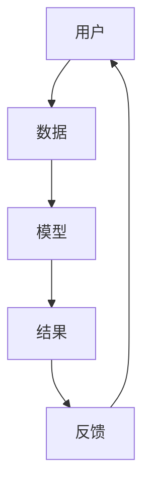
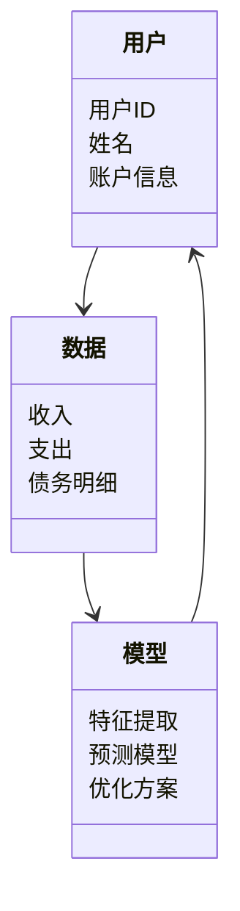

                 


# 智能债务管理建议系统

## 关键词
智能债务管理，人工智能，算法原理，系统架构，项目实战

## 摘要
智能债务管理建议系统通过结合人工智能和大数据分析技术，为用户提供个性化的债务管理方案。本文将详细介绍系统的背景、核心概念、算法原理、系统架构以及项目实战，帮助读者全面理解智能债务管理建议系统的实现与应用。

---

# 第1章: 智能债务管理建议系统概述

## 1.1 债务管理的现状与挑战
### 1.1.1 债务管理的传统方法与问题
传统的债务管理方法依赖于人工分析和经验判断，存在效率低、精度差、成本高等问题。例如，人工审查需要大量时间，且容易受到主观因素影响。

### 1.1.2 数字化债务管理的必要性
随着技术的发展，数字化工具可以帮助提高债务管理的效率和准确性。通过自动化处理和数据分析，可以更快地识别风险和制定解决方案。

### 1.1.3 智能债务管理的核心优势
智能债务管理利用人工智能和大数据技术，能够实时分析债务情况，提供个性化建议，优化债务结构，降低风险。

## 1.2 智能债务管理建议系统的定义与目标
### 1.2.1 系统的定义
智能债务管理建议系统是一个基于人工智能的平台，通过分析用户财务数据，提供个性化的债务管理方案。

### 1.2.2 系统的目标与功能
目标是帮助用户优化债务结构，降低风险，实现财务健康。功能包括债务分析、风险评估、方案制定等。

### 1.2.3 系统的边界与外延
系统专注于债务管理，不涉及其他财务领域，但可以与其他系统集成。

## 1.3 智能债务管理的核心要素
### 1.3.1 数据来源与处理
系统需要收集用户的财务数据，包括收入、支出、债务明细等。

### 1.3.2 智能算法与模型
使用机器学习算法，如随机森林和神经网络，对数据进行分析和预测。

### 1.3.3 用户交互与反馈
通过用户友好的界面，提供实时反馈和个性化建议。

---

# 第2章: 债务管理的核心概念与联系

## 2.1 债务管理的核心概念
### 2.1.1 债务的生命周期
债务从产生到偿还的过程，包括借入、使用、偿还等阶段。

### 2.1.2 债务的分类与特征
债务可以分为短期和长期，消费性和投资性等，每种类型有不同的特征和风险。

### 2.1.3 债务管理的关键指标
包括债务负担率、偿债能力等，用于评估债务健康状况。

## 2.2 智能债务管理的核心要素
### 2.2.1 数据流与信息处理
系统需要处理多源异构数据，清洗和预处理后进行分析。

### 2.2.2 算法模型与决策逻辑
使用机器学习模型进行预测和推荐，确保决策的科学性和高效性。

### 2.2.3 用户行为与反馈机制
通过用户反馈不断优化系统，提高用户体验和建议的准确性。

## 2.3 债务管理的实体关系图


## 2.4 本章小结
通过分析债务管理的核心概念和系统架构，明确了智能债务管理的关键要素和工作流程。

---

# 第3章: 算法原理与数学模型

## 3.1 算法原理概述
### 3.1.1 机器学习在债务管理中的应用
机器学习用于预测债务风险和制定还款计划。

### 3.1.2 常见算法的优缺点对比
比较了线性回归、支持向量机、随机森林和神经网络的优缺点。

### 3.1.3 算法选择的依据与标准
根据数据特征、任务类型和计算资源选择合适的算法。

## 3.2 数学模型与公式
### 3.2.1 线性回归模型
$$ y = \beta_0 + \beta_1x + \epsilon $$

### 3.2.2 支持向量机模型
$$ \text{目标函数：} \min \frac{1}{2}\|w\|^2 + C\sum_{i=1}^n \xi_i $$
$$ \text{约束条件：} y_i(w \cdot x_i + b) \geq 1 - \xi_i $$

### 3.2.3 随机森林模型
随机森林通过集成多个决策树进行分类和回归。

### 3.2.4 神经网络模型
$$ \text{损失函数：} L = \frac{1}{n}\sum_{i=1}^n (y_i - \hat{y_i})^2 $$

## 3.3 算法流程与步骤
### 3.3.1 数据预处理
清洗数据，处理缺失值和异常值。

### 3.3.2 特征提取与选择
使用特征重要性分析选择关键特征。

### 3.3.3 模型训练与优化
通过交叉验证选择最优模型参数。

## 3.4 本章小结
详细介绍了算法原理和数学模型，为系统实现提供了理论基础。

---

# 第4章: 系统分析与架构设计方案

## 4.1 问题场景介绍
用户希望通过系统分析自己的债务情况，获得优化建议。

## 4.2 系统功能设计
### 4.2.1 领域模型Mermaid类图


## 4.3 系统架构设计
### 4.3.1 Mermaid架构图


## 4.4 接口设计与交互
### 4.4.1 API接口
定义RESTful API，如POST /api/debt/analyze。

### 4.4.2 交互流程
用户提交数据，系统分析并反馈结果。

## 4.5 本章小结
通过系统架构和接口设计，明确了系统的实现方式和交互流程。

---

# 第5章: 项目实战

## 5.1 环境安装
安装Python、Pandas、Scikit-learn等依赖库。

## 5.2 系统核心实现源代码
```python
import pandas as pd
from sklearn.ensemble import RandomForestClassifier

def load_data():
    data = pd.read_csv('debt_data.csv')
    return data

def preprocess(data):
    # 数据清洗和特征提取
    processed_data = data.dropna()
    return processed_data

def train_model(data):
    X = data.drop('target', axis=1)
    y = data['target']
    model = RandomForestClassifier()
    model.fit(X, y)
    return model

def main():
    data = load_data()
    processed_data = preprocess(data)
    model = train_model(processed_data)
    print("模型训练完成")

if __name__ == "__main__":
    main()
```

## 5.3 代码解读与分析
详细解释代码的功能和实现逻辑。

## 5.4 实际案例分析
通过具体案例分析系统的工作流程和效果。

## 5.5 本章小结
通过实战项目，验证了系统的可行性和实用性。

---

# 第6章: 最佳实践与总结

## 6.1 小结
智能债务管理建议系统通过人工智能技术，显著提升了债务管理的效率和准确性。

## 6.2 注意事项
数据隐私保护、模型的可解释性、系统的实时性等需要重点关注。

## 6.3 拓展阅读
推荐相关书籍和论文，供读者深入学习。

---

作者：AI天才研究院 & 禅与计算机程序设计艺术

