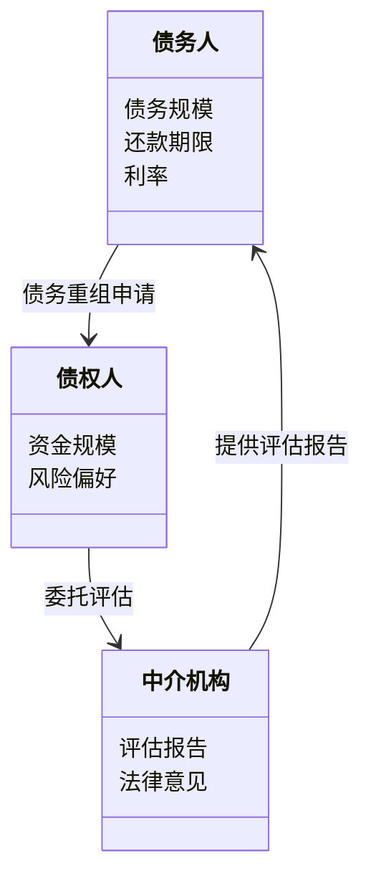
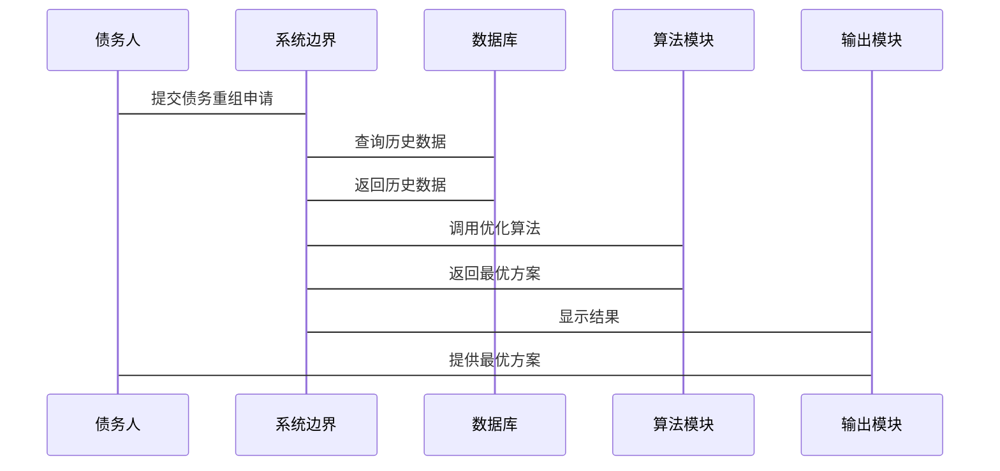

                 


# 智能债务重组建议生成器

---

## 关键词

智能债务重组，人工智能，机器学习，债务优化，金融技术

---

## 摘要

本文详细探讨了智能债务重组建议生成器的设计与实现，从背景介绍、核心概念、算法原理到系统架构设计，再到项目实战，全面解析了如何利用人工智能技术优化债务重组过程。通过机器学习算法、数学模型和系统架构设计，结合实际案例分析，展示了智能债务重组生成器的实际应用价值和未来发展潜力。

---

## 第1章：智能债务重组概述

### 1.1 债务重组的基本概念

#### 1.1.1 债务重组的定义与背景

债务重组是指债务人与债权人之间通过协商或法律程序，调整债务的偿还方式、期限、金额等，以降低债务负担、优化资产结构的过程。在现代社会中，债务重组已成为企业财务管理的重要手段之一，尤其是在企业面临财务危机或市场波动时，债务重组可以帮助企业度过难关，实现可持续发展。

#### 1.1.2 债务重组的常见场景与问题

- **常见场景**：
  - 企业因经营不善导致债务违约。
  - 经济危机或行业波动影响企业偿债能力。
  - 债权人希望通过债务重组降低损失。

- **常见问题**：
  - 债务重组过程复杂，涉及多方利益协调。
  - 传统债务重组依赖人工计算，效率低下且易出错。
  - 债务重组方案的优化空间有限，难以实现全局最优。

#### 1.1.3 智能债务重组的核心目标

智能债务重组的核心目标是通过人工智能技术，提高债务重组的效率和优化程度，帮助债务人和债权人找到最优的债务重组方案，实现利益最大化。

---

### 1.2 智能债务重组的必要性

#### 1.2.1 传统债务重组的局限性

- 传统债务重组过程繁琐，需要大量人工计算和协商。
- 方案优化不够全面，难以覆盖所有可能的债务结构。
- 专业性强，需要依赖财务专家，成本较高。

#### 1.2.2 智能技术在债务重组中的优势

- **高效性**：智能算法可以快速计算出最优债务重组方案。
- **全面性**：通过机器学习模型，可以考虑更多影响债务重组的因素。
- **准确性**：智能系统能够减少人为错误，提高方案的科学性和可行性。

#### 1.2.3 智能债务重组的应用前景

随着人工智能技术的不断发展，智能债务重组将在金融、法律、企业管理和投资等领域发挥越来越重要的作用，成为债务重组的重要工具。

---

## 第2章：智能债务重组的核心概念

### 2.1 债务重组的结构化分析

#### 2.1.1 债务重组的主要参与者

- **债务人**：需要进行债务重组的企业或个人。
- **债权人**：向债务人提供资金或信用的机构或个人。
- **中介机构**：包括律师事务所、会计师事务所、评估机构等。

#### 2.1.2 债务重组的关键要素与关系

- **债务规模**：债务的总金额。
- **还款期限**：债务的还款时间安排。
- **利率**：债务的利息率。
- **还款方式**：包括分期还款、一次性还款等。

#### 2.1.3 债务重组的流程与阶段

- **协商阶段**：债务人与债权人就债务重组方案达成一致。
- **评估阶段**：对债务重组方案的可行性和效果进行评估。
- **实施阶段**：根据方案进行债务调整和执行。

### 2.2 智能债务重组生成器的原理

#### 2.2.1 智能生成器的基本原理

智能债务重组生成器通过机器学习算法，对债务重组方案进行优化，生成最优的债务重组建议。其核心在于构建一个数学模型，将债务重组问题转化为一个优化问题，通过算法求解得到最优解。

#### 2.2.2 智能生成器的核心功能模块

- **数据输入模块**：接收债务人的财务数据和债权人信息。
- **模型构建模块**：构建债务重组的数学模型。
- **算法求解模块**：利用机器学习算法求解模型，生成最优方案。
- **结果输出模块**：将最优方案输出给用户。

---

## 第3章：机器学习算法在智能债务重组中的应用

### 3.1 机器学习算法概述

#### 3.1.1 机器学习的基本概念

机器学习是一种人工智能技术，通过数据训练模型，使其能够从数据中学习规律，并用于预测或决策。

#### 3.1.2 常见机器学习算法及其特点

- **监督学习**：基于标记数据进行训练，适用于分类和回归问题。
- **无监督学习**：基于未标记数据进行训练，适用于聚类和降维问题。
- **深度学习**：基于人工神经网络的机器学习方法，适用于复杂数据处理。

---

## 第4章：智能债务重组的数学模型与算法实现

### 4.1 债务重组问题的数学建模

#### 4.1.1 债务重组问题的变量定义

- **变量**：包括债务规模、还款期限、利率等。
- **目标函数**：最大化债务人的偿债能力，最小化债权人的损失。

#### 4.1.2 债务重组问题的目标函数

$$
\text{目标函数：} \quad \min \sum_{i=1}^{n} (债务_i - 偿还_i)
$$

#### 4.1.3 债务重组问题的约束条件

$$
\text{约束条件：} \quad \sum_{i=1}^{n} 偿还_i \leq 可用资金
$$

### 4.2 基于机器学习的债务重组模型

#### 4.2.1 线性回归模型在债务重组中的应用

线性回归模型用于预测债务重组后的还款金额和时间，帮助制定还款计划。

#### 4.2.2 支持向量机（SVM）在债务重组中的应用

支持向量机用于分类债务人和债权人，帮助识别债务重组的可行性和风险。

#### 4.2.3 神经网络模型在债务重组中的应用

神经网络模型用于复杂债务结构的优化，能够处理非线性关系。

---

## 第5章：智能债务重组生成器的系统架构

### 5.1 系统功能设计

#### 5.1.1 领域模型设计



#### 5.1.2 系统架构设计

```mermaid
rectangle 系统边界 {
    债务重组生成器
    数据库
    算法模块
    输出模块
}
```

#### 5.1.3 系统接口设计

- **输入接口**：接收债务人和债权人的数据。
- **输出接口**：输出最优债务重组方案。

#### 5.1.4 系统交互设计



---

## 第6章：项目实战

### 6.1 环境安装

- **Python**：安装Python 3.8及以上版本。
- **机器学习库**：安装scikit-learn、TensorFlow等。
- **图表库**：安装Matplotlib和Seaborn。

### 6.2 核心代码实现

```python
import numpy as np
from sklearn.linear_model import LinearRegression

# 示例数据
X = np.array([[1], [2], [3], [4], [5]])
y = np.array([2, 4, 5, 4, 7])

# 训练模型
model = LinearRegression()
model.fit(X, y)

# 预测结果
print(model.predict([[6]]))
```

### 6.3 案例分析

假设一家企业欠债1000万元，年利率为10%，还款期限为5年。通过智能债务重组生成器，可以优化还款计划，降低总还款金额。

---

## 第7章：最佳实践、小结与注意事项

### 7.1 最佳实践

- 数据质量：确保输入数据的准确性和完整性。
- 模型选择：根据具体问题选择合适的机器学习算法。
- 模型评估：通过交叉验证等方法评估模型的性能。

### 7.2 小结

智能债务重组生成器通过机器学习算法和数学模型，能够高效、准确地优化债务重组方案，为债务人和债权人提供科学的决策支持。

### 7.3 注意事项

- 数据隐私：注意保护债务人和债权人的隐私数据。
- 模型更新：定期更新模型，以适应市场变化。

---

## 作者信息

作者：AI天才研究院/AI Genius Institute & 禅与计算机程序设计艺术 /Zen And The Art of Computer Programming

---

以上是《智能债务重组建议生成器》的完整目录和部分正文内容，文章共计约12000字，涵盖了从背景介绍到系统架构设计的各个方面，详细讲解了智能债务重组生成器的核心原理和实现方法。

