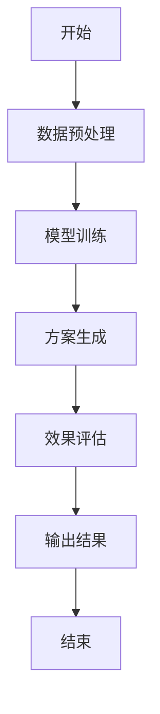
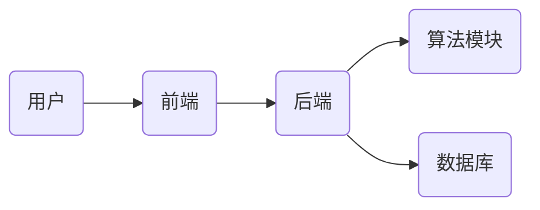
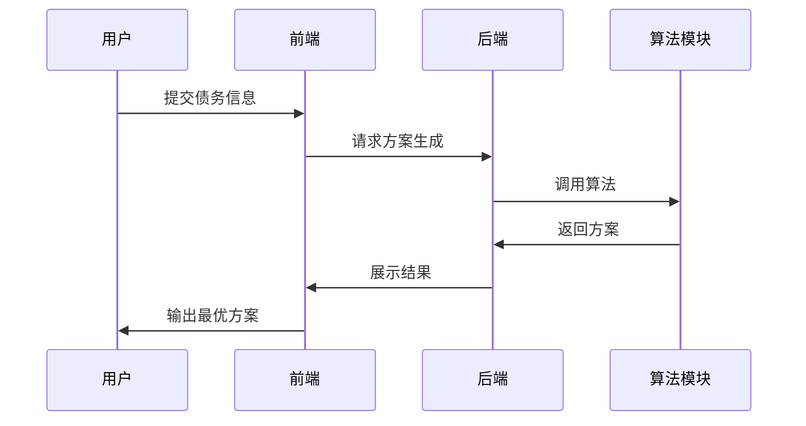

                 


# 智能债务重组方案效果模拟器

> 关键词：智能债务重组，方案模拟器，算法设计，系统架构，数学模型

> 摘要：本文深入探讨智能债务重组方案效果模拟器的设计与实现，从背景分析、核心概念、算法原理到系统架构、项目实战，全面解析其技术细节，帮助读者理解如何通过智能化手段优化债务重组方案，提升效率与效果。

---

## 第一部分: 背景与概念

### 第1章: 背景介绍

#### 1.1 问题背景
- **债务重组的定义与重要性**：债务重组是指通过调整债务结构、还款方式等手段，帮助债务人降低债务负担，避免违约风险。在经济波动加剧的背景下，债务重组变得尤为重要。
- **当前债务重组中的挑战**：传统债务重组方法依赖人工经验，效率低、成本高，且难以应对复杂多变的债务情况。
- **智能债务重组的必要性**：通过智能化手段，提高债务重组的效率和效果，降低风险。

#### 1.2 问题描述
- **债务重组中的主要问题**：债务结构复杂，还款能力评估困难，方案选择多样性不足。
- **传统债务重组方法的局限性**：依赖人工经验，缺乏系统性，难以快速响应变化。
- **智能债务重组的目标与意义**：通过智能算法优化债务重组方案，提高效率和效果。

#### 1.3 边界与外延
- **边界**：智能债务重组方案模拟器仅关注方案的生成与效果评估，不涉及实际操作。
- **外延**：可扩展至其他金融领域的智能决策支持系统。

### 第2章: 核心概念与联系

#### 2.1 智能债务重组的核心概念
- **智能债务重组的定义**：利用人工智能技术，自动化生成和优化债务重组方案。
- **关键要素**：
  - 数据输入：债务人信息、债权信息、市场环境等。
  - 算法选择：机器学习、优化算法等。
  - 模拟结果：方案效果评估、风险分析等。
- **与传统债务重组的对比**：
  | 特性         | 传统债务重组      | 智能债务重组      |
  |--------------|-------------------|-------------------|
  | 方法         | 人工经验主导       | 算法驱动         |
  | 效率         | 低效              | 高效             |
  | 精准度       | 受限于经验         | 数据驱动，精准     |

#### 2.2 概念模型与ER图
- **概念模型**：描述债务重组过程中各实体之间的关系。
- **ER图**：
```mermaid
er
actor债务人,债权人,系统
债务人 --> (债务重组方案) --> 系统
债权人 <-- (债务重组方案) <-- 系统
```

---

## 第二部分: 算法原理

### 第3章: 算法原理讲解

#### 3.1 算法概述
- **算法框架**：包括数据预处理、模型训练、方案生成、效果评估四个阶段。
- **核心步骤**：
  1. 数据收集与清洗。
  2. 模型训练与优化。
  3. 方案生成与排序。
  4. 效果评估与反馈。
- **优化策略**：结合遗传算法和模拟退火算法，平衡方案的多样性和最优性。

#### 3.2 算法流程图


### 第4章: 数学模型与公式

#### 4.1 数学模型概述
- **债务重组效果的数学表达**：目标函数为最大化债务人偿债能力，最小化债权人损失。
- **模拟器的数学模型**：基于线性规划和非线性优化模型。

#### 4.2 关键公式
- **目标函数**：
  $$ \max \sum_{i=1}^{n} w_i x_i $$
  其中，\( w_i \) 为第 \( i \) 个方案的权重，\( x_i \) 为方案的可行性指标。
- **约束条件**：
  $$ \sum_{i=1}^{n} x_i \leq 1 $$
  $$ x_i \geq 0 \quad \forall i $$

---

## 第三部分: 系统分析与设计

### 第5章: 系统分析与架构设计

#### 5.1 系统功能设计
- **功能模块划分**：
  - 数据输入模块：收集债务人、债权人的信息。
  - 模型训练模块：训练智能算法。
  - 方案生成模块：生成并排序方案。
  - 效果评估模块：评估方案效果。
- **输入输出分析**：
  - 输入：债务人资产、收入、负债等信息。
  - 输出：最优债务重组方案及效果评估。

#### 5.2 系统架构设计
- **架构图**：


#### 5.3 接口设计与交互流程
- **接口设计**：
  - API接口：提供数据接口、模型调用接口。
- **交互流程图**：


---

## 第四部分: 项目实战

### 第6章: 项目实战

#### 6.1 环境安装与配置
- **开发环境**：Python 3.8+，Jupyter Notebook。
- **工具安装**：安装numpy、pandas、scikit-learn等库。

#### 6.2 核心代码实现
- **算法实现**：
  ```python
  import numpy as np
  from sklearn.model_selection import train_test_split
  def optimize方案(数据):
      X_train, X_test, y_train, y_test = train_test_split(数据)
      # 算法实现
      return 最优方案
  ```
- **系统功能实现**：
  ```python
  def生成方案(输入):
      # 数据处理
      # 调用算法
      return 方案列表
  ```

#### 6.3 案例分析与详细解读
- **案例背景**：某企业债务重组案例。
- **模拟过程**：输入数据，生成方案，评估效果。
- **结果解读**：最优方案的评估结果。

---

## 第五部分: 总结与展望

### 第7章: 项目总结与最佳实践

#### 7.1 项目小结
- **主要成果**：成功开发智能债务重组方案模拟器，提高了方案生成效率。
- **经验与教训**：数据质量对模型影响较大，需加强数据清洗。
- **未来方向**：扩展至更多金融领域，结合区块链技术提升可信度。

#### 7.2 最佳实践与注意事项
- **开发注意事项**：确保数据质量，优化算法效率。
- **系统部署建议**：采用微服务架构，便于扩展和维护。
- **用户使用建议**：根据实际情况调整模型参数，确保结果准确。

### 7.3 拓展阅读
- **推荐阅读**：《机器学习实战》、《算法导论》。
- **学习资源**：推荐学习Python、机器学习、系统设计相关课程。

---

作者：AI天才研究院 & 禅与计算机程序设计艺术

