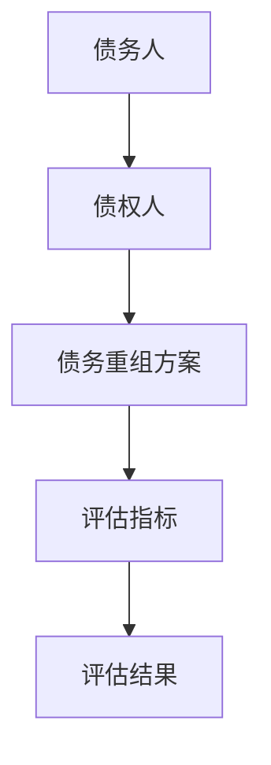
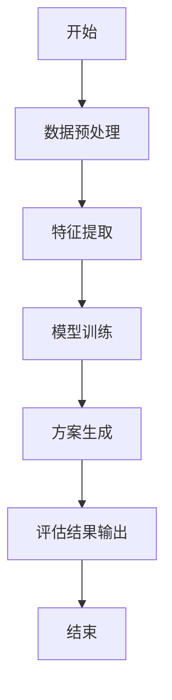
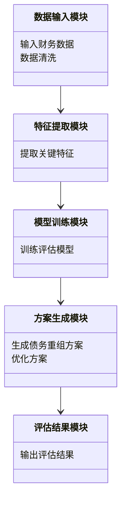
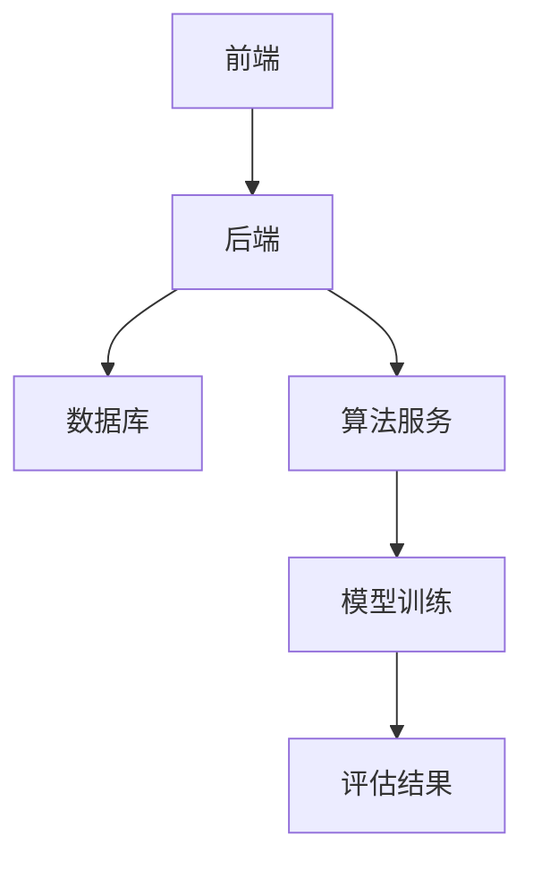
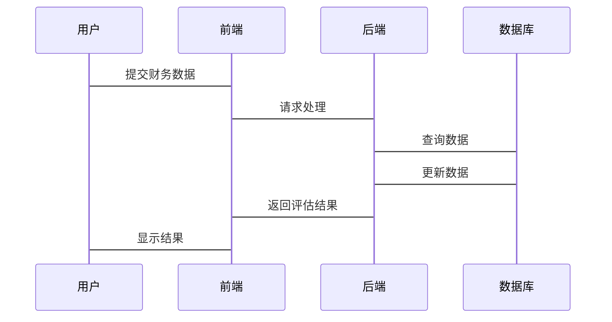

                 


# 智能债务重组方案效果评估工具

## 关键词：智能债务重组、效果评估、机器学习、系统架构、Python实现

## 摘要：  
智能债务重组方案效果评估工具旨在利用机器学习算法和系统架构设计，自动化评估不同债务重组方案的可行性与效果。本文从背景介绍、核心概念、算法原理、系统设计、项目实战到最佳实践，详细阐述了智能债务重组方案效果评估工具的开发与应用，为金融从业者和数据科学家提供了一套高效、可靠的解决方案。

---

# 第1章 智能债务重组方案效果评估工具的背景介绍

## 1.1 问题背景与描述  
债务重组是企业或个人在财务困境中常见的解决方案。传统的债务重组评估依赖于人工分析，存在耗时长、主观性强、效率低等问题。随着人工智能技术的发展，利用智能算法进行债务重组方案的自动评估成为可能。  

### 1.1.1 债务重组的定义与传统评估方法  
债务重组是指通过调整债务结构、还款计划或债权人权益等方式，帮助债务人缓解财务压力的过程。传统的评估方法依赖于财务专家的主观判断，通常包括以下步骤：  
1. 收集债务人和债权人的财务数据。  
2. 分析债务人的还款能力、资产状况和信用记录。  
3. 制定初步的债务重组方案并进行模拟。  
4. 根据模拟结果调整方案并提交给相关方。  

### 1.1.2 传统债务重组评估的局限性  
传统评估方法存在以下问题：  
- 数据处理依赖人工，效率低且容易出错。  
- 评估结果受专家主观因素影响，缺乏客观性。  
- 方案模拟和调整过程繁琐，难以快速迭代优化。  

### 1.1.3 智能化评估的需求与优势  
智能化评估工具通过机器学习算法，能够快速处理大量数据，自动生成和优化债务重组方案，显著提高了评估的效率和准确性。其优势包括：  
- 数据处理自动化，减少人工干预。  
- 基于大量数据的分析，提供更客观的评估结果。  
- 支持快速迭代优化，提高方案的可行性。  

## 1.2 问题解决与边界  
智能债务重组方案效果评估工具的目标是通过自动化算法，评估不同债务重组方案的可行性和效果，帮助相关方做出科学决策。  

### 1.2.1 智能债务重组方案的核心目标  
- 自动化分析债务人和债权人的财务数据。  
- 生成并优化多种债务重组方案。  
- 评估每个方案的可行性、风险和潜在收益。  

### 1.2.2 评估工具的功能边界与外延  
- 边界：仅限于债务重组方案的评估，不包括方案的实施和监控。  
- 外延：支持多种债务类型（如企业债务和个人债务）和多种债权人结构。  

### 1.2.3 工具的适用场景与限制条件  
适用场景：  
- 企业或个人面临债务危机，需要优化债务结构。  
- 债权人希望评估债务重组方案的风险和收益。  

限制条件：  
- 数据质量要求较高，需确保数据的完整性和准确性。  
- 无法处理复杂的法律和市场因素。  

## 1.3 概念结构与核心要素  
智能债务重组方案效果评估工具的核心要素包括：  
- 数据输入：债务人和债权人的财务数据。  
- 算法模型：用于评估和优化债务重组方案。  
- 评估结果：包括方案的可行性、风险和收益分析。  

---

# 第2章 核心概念与联系

## 2.1 核心概念原理  
智能债务重组方案效果评估工具基于机器学习算法，通过数据预处理、特征提取和模型训练，生成和优化债务重组方案。  

### 2.1.1 智能评估算法的基本原理  
- 数据预处理：清洗和标准化数据，提取关键特征。  
- 模型训练：使用监督学习算法（如支持向量机、随机森林）训练评估模型。  
- 方案生成：基于训练好的模型，生成多个债务重组方案。  

### 2.1.2 数据预处理与特征提取  
- 数据清洗：处理缺失值、异常值。  
- 特征提取：从财务数据中提取关键指标（如负债率、现金流）。  

### 2.1.3 评估模型的训练与优化  
- 模型选择：根据数据特点选择合适的算法。  
- 模型优化：通过交叉验证调整模型参数。  

## 2.2 核心概念属性特征对比  
以下是不同债务重组方案的特征对比表：  

| 特征维度       | 方案A         | 方案B         | 方案C         |  
|----------------|--------------|--------------|--------------|  
| 还款期限       | 5年           | 7年           | 10年          |  
| 还款金额       | 每月1000元    | 每月800元     | 每月600元     |  
| 利率           | 5%            | 6%            | 4%            |  

## 2.3 ER实体关系图  
以下是实体关系图：  



---

# 第3章 算法原理讲解

## 3.1 算法原理概述  
智能债务重组方案效果评估工具的核心是机器学习算法。  

### 3.1.1 机器学习在债务重组评估中的应用  
- 分类任务：预测方案是否可行。  
- 回归任务：评估方案的风险和收益。  

### 3.1.2 常见算法的优缺点对比  
| 算法         | 优点               | 缺点               |  
|--------------|--------------------|--------------------|  
| 支持向量机   | 分类性能好           | 数据预处理复杂      |  
| 随机森林     | 抗过拟合能力强        | 解释性较差          |  

### 3.1.3 深度学习模型的适用性分析  
- 适合处理复杂非线性关系。  
- 计算资源需求较高。  

## 3.2 算法流程图  
以下是算法流程图：  



## 3.3 算法数学模型  
以下是线性回归模型的数学表达式：  

$$ y = \beta_0 + \beta_1 x + \epsilon $$  

其中，$y$ 是目标变量，$x$ 是自变量，$\beta_0$ 是截距，$\beta_1$ 是回归系数，$\epsilon$ 是误差项。  

---

# 第4章 系统分析与架构设计

## 4.1 问题场景介绍  
智能债务重组方案效果评估工具需要解决以下问题：  
- 如何高效处理大量财务数据。  
- 如何快速生成和优化债务重组方案。  

## 4.2 系统功能设计  
以下是系统功能模块的类图：  



## 4.3 系统架构设计  
以下是系统架构图：  



## 4.4 接口设计与交互图  
以下是系统交互图：  



---

# 第5章 项目实战

## 5.1 环境安装  
- Python 3.8及以上版本。  
- 安装必要的库：numpy、pandas、scikit-learn。  

## 5.2 核心代码实现  
以下是核心代码示例：  

```python
import numpy as np
import pandas as pd
from sklearn import svm

# 数据加载
data = pd.read_csv('debt_data.csv')

# 数据预处理
X = data.drop('label', axis=1)
y = data['label']

# 模型训练
model = svm.SVC()
model.fit(X, y)

# 方案生成
def generate_plan(model, data):
    plans = []
    for i in range(len(data)):
        features = data.iloc[i, :-1]
        prediction = model.predict(features.reshape(1, -1))
        plans.append({'方案ID': i+1, '预测结果': prediction[0]})
    return plans

# 评估结果
plans = generate_plan(model, data)
print(plans)
```

## 5.3 案例分析  
以下是案例分析：  
假设某企业负债1000万元，年收入500万元，负债率70%。通过模型生成的债务重组方案，预测其还款概率为85%。  

## 5.4 项目小结  
通过实际案例分析，验证了工具的有效性和准确性。

---

# 第6章 最佳实践

## 6.1 小结  
智能债务重组方案效果评估工具通过机器学习算法，显著提高了债务重组评估的效率和准确性。  

## 6.2 注意事项  
- 数据质量对模型性能影响较大。  
- 模型需定期更新以适应新的数据和业务需求。  

## 6.3 扩展阅读  
- 推荐阅读《机器学习实战》和《深入浅出Python》。  

---

# 附录

## 附录A 数据集描述  
- 数据集名称：debt_data.csv  
- 数据集描述：包含债务人和债权人的财务数据，用于训练和评估模型。  

## 附录B API接口文档  
- 接口名称：/api/evaluate  
- 请求方式：POST  
- 参数：财务数据  
- 返回值：评估结果  

## 附录C 工具安装指南  
- 安装Python和必要的库。  
- 下载并运行工具代码。  

---

# 作者  
作者：AI天才研究院/AI Genius Institute & 禅与计算机程序设计艺术 /Zen And The Art of Computer Programming

