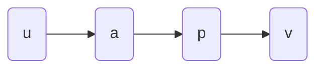
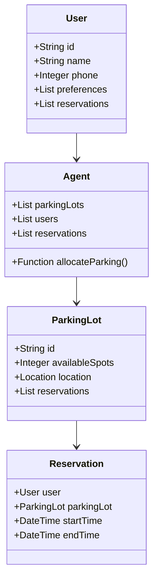
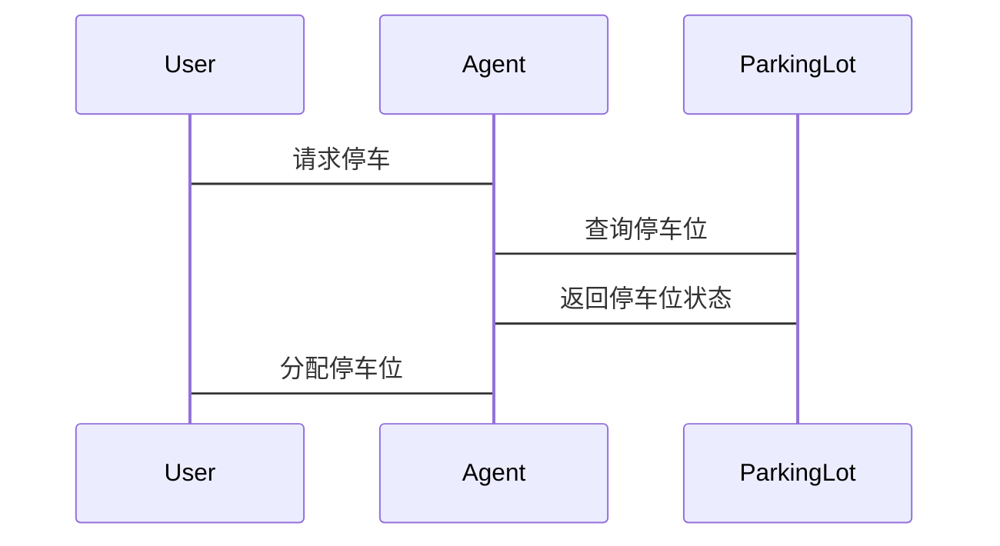

                 


# 智能停车系统：AI Agent的车位分配优化

> 关键词：智能停车系统、AI Agent、车位分配优化、强化学习、协同过滤

> 摘要：本文深入探讨了智能停车系统中AI Agent如何通过强化学习和协同过滤优化车位分配的问题。首先介绍了停车难的现状和智能化管理的必要性，接着分析了AI Agent的核心原理及其在车位分配中的应用。然后详细讲解了基于Q-learning算法的车位分配优化策略，以及协同过滤推荐算法的实现。最后通过系统架构设计和项目实战案例，展示了AI Agent在智能停车系统中的实际应用效果。

---

# 目录

1. 背景介绍
2. 核心概念与联系
3. 算法原理讲解
4. 数学模型与公式
5. 系统分析与架构设计
6. 项目实战

---

# 1. 背景介绍

## 1.1 问题背景

随着城市化进程的加快，停车难问题日益突出。传统的人工管理模式效率低下，无法满足日益增长的停车需求。智能化的停车管理系统成为解决这一问题的重要手段。AI Agent（智能体）作为一种能够感知环境、自主决策的智能系统，为车位分配优化提供了新的解决方案。

## 1.2 问题描述

车位分配的核心问题是如何在有限的停车位资源下，最大化用户体验和资源利用率。传统的车位分配算法往往基于固定规则，难以应对动态变化的停车需求和复杂的场景。AI Agent能够通过学习和优化，实现更智能的车位分配策略。

## 1.3 问题解决

AI Agent通过强化学习和协同过滤等技术，能够实时感知停车场的使用情况，分析用户需求，并动态调整车位分配策略。这种方法不仅提高了停车场的使用效率，还能为用户提供更优质的停车体验。

## 1.4 概念结构与核心要素

- **系统核心要素**：停车场、用户、停车位、AI Agent。
- **车位分配的逻辑流程**：用户请求停车→系统感知车位状态→AI Agent决策分配→用户获得停车位。
- **系统架构的初步设想**：基于AI Agent的强化学习算法，结合协同过滤推荐技术，实现动态车位分配。

---

# 2. 核心概念与联系

## 2.1 AI Agent的基本原理

AI Agent是一种能够感知环境、自主决策的智能系统。它通过与环境的交互，不断学习和优化自身的决策策略，以实现特定目标。在停车系统中，AI Agent能够实时感知停车场的车位状态，分析用户需求，并动态调整车位分配策略。

## 2.2 实体关系图

以下是一个简化的实体关系图，展示了智能停车系统中的主要实体及其关系：



- **User（用户）**：需要停车位的用户。
- **Agent（AI Agent）**：负责车位分配的智能系统。
- **ParkingLot（停车场）**：提供停车位的场所。
- **Vehicle（车辆）**：用户的车辆，需要停车位。

---

## 2.3 算法原理

### 2.3.1 强化学习算法

强化学习是一种通过试错机制来优化决策策略的算法。AI Agent通过与环境的交互，获得奖励或惩罚，从而逐步优化自身的决策策略。以下是Q-learning算法的流程图：

```mermaid
graph LR
Start --> Initialize Q-Table
Initialize Q-Table --> Choose Action
Choose Action --> Get Reward
Reward --> Update Q-Table
Update Q-Table --> Repeat
```

### 2.3.2 协作过滤推荐算法

协作过滤是一种基于用户相似性推荐停车位的技术。通过分析用户的停车需求和历史行为，AI Agent可以推荐最合适的停车位。以下是协作过滤的流程图：

```mermaid
graph LR
Start --> Collect User Data
Collect User Data --> Similar Users
Similar Users --> Recommend Parking Lots
Recommend Parking Lots --> Output Results
```

---

# 3. 算法原理讲解

## 3.1 强化学习算法

### 3.1.1 Q-learning算法

Q-learning是一种经典的强化学习算法，适用于离散动作空间的环境。以下是Q-learning的核心公式：

$$ Q(s, a) = Q(s, a) + \alpha \times (r + \gamma \times \max Q(s', a') - Q(s, a)) $$

其中：
- \( Q(s, a) \)：状态 \( s \) 下执行动作 \( a \) 的价值。
- \( \alpha \)：学习率。
- \( r \)：奖励。
- \( \gamma \)：折扣因子。
- \( s' \)：下一个状态。
- \( a' \)：下一个动作。

以下是Q-learning算法的Python实现示例：

```python
class QLearning:
    def __init__(self, actions, epsilon=0.1, alpha=0.1):
        self.actions = actions
        self.epsilon = epsilon
        self.alpha = alpha
        self.q_table = {}
    
    def get_action(self, state):
        if np.random.random() < self.epsilon:
            return np.random.choice(self.actions)
        else:
            return np.argmax([self.q_table.get((state, a), 0) for a in self.actions])
    
    def update_q_table(self, state, action, reward, next_state):
        q = self.q_table.get((state, action), 0)
        next_max = np.max([self.q_table.get((next_state, a), 0) for a in self.actions])
        self.q_table[(state, action)] = q + self.alpha * (reward + self.gamma * next_max - q)
```

---

## 3.2 协作过滤推荐算法

### 3.2.1 协作过滤原理

协作过滤通过分析用户的行为和偏好，找到与当前用户相似的用户群体，然后基于相似用户的偏好推荐停车位。以下是协作过滤的核心公式：

$$ sim(u, v) = \frac{\sum_{i=1}^n (r_ui - \bar{r_u})(r_vi - \bar{r_v})}{\sqrt{\sum_{i=1}^n (r_ui - \bar{r_u})^2} \times \sqrt{\sum_{i=1}^n (r_vi - \bar{r_v})^2}} $$

其中：
- \( sim(u, v) \)：用户 \( u \) 和用户 \( v \) 之间的相似度。
- \( r_ui \)：用户 \( u \) 对项目的评分。
- \( \bar{r_u} \)：用户 \( u \) 的平均评分。
- \( r_vi \)：用户 \( v \) 对项目的评分。
- \( \bar{r_v} \)：用户 \( v \) 的平均评分。

---

## 3.3 本章小结

本章详细讲解了强化学习和协作过滤两种算法在智能停车系统中的应用。通过Q-learning算法，AI Agent能够动态优化车位分配策略；通过协作过滤算法，系统能够为用户推荐最合适的停车位。

---

# 4. 数学模型与公式

## 4.1 Q-learning算法模型

Q-learning算法的核心公式如下：

$$ Q(s, a) = Q(s, a) + \alpha \times (r + \gamma \times \max Q(s', a') - Q(s, a)) $$

其中：
- \( Q(s, a) \)：状态 \( s \) 下执行动作 \( a \) 的价值。
- \( \alpha \)：学习率。
- \( r \)：奖励。
- \( \gamma \)：折扣因子。
- \( s' \)：下一个状态。
- \( a' \)：下一个动作。

---

# 5. 系统分析与架构设计

## 5.1 问题场景介绍

智能停车系统需要解决以下问题：
1. 实时感知停车场的车位状态。
2. 动态优化车位分配策略。
3. 提供用户友好的停车体验。

## 5.2 系统功能设计

以下是智能停车系统的功能设计类图：



## 5.3 系统架构设计

以下是智能停车系统的架构图：


---

## 5.4 系统接口设计

以下是系统的主要接口：

1. **用户接口（API）**：
   - `allocateParking(User user)`：根据用户需求分配停车位。
   - `getAvailableSpots(ParkingLot parkingLot)`：获取停车场的可用停车位数量。
2. **停车场接口（API）**：
   - `updateAvailableSpots(ParkingLot parkingLot, Integer spots)`：更新停车场的可用停车位数量。

---

## 5.5 系统交互序列图

以下是系统交互的序列图：



---

## 5.6 本章小结

本章通过系统架构设计和接口设计，详细描述了智能停车系统的整体架构。通过类图和序列图，展示了系统各部分的交互关系。

---

# 6. 项目实战

## 6.1 环境安装

为了实现智能停车系统，需要以下环境：

- **Python**：3.6+
- **TensorFlow**：2.0+
- **Mermaid**：用于绘制图表。

安装命令：

```bash
pip install tensorflow mermaid
```

---

## 6.2 系统核心实现

以下是智能停车系统的核心实现代码：

```python
import numpy as np

class QLearningAgent:
    def __init__(self, actions, epsilon=0.1, alpha=0.1, gamma=0.9):
        self.actions = actions
        self.epsilon = epsilon
        self.alpha = alpha
        self.gamma = gamma
        self.q_table = {}
    
    def get_action(self, state):
        if np.random.random() < self.epsilon:
            return np.random.choice(self.actions)
        else:
            return np.argmax([self.q_table.get((state, a), 0) for a in self.actions])
    
    def update_q_table(self, state, action, reward, next_state):
        current_q = self.q_table.get((state, action), 0)
        next_max = max([self.q_table.get((next_state, a), 0) for a in self.actions])
        new_q = current_q + self.alpha * (reward + self.gamma * next_max - current_q)
        self.q_table[(state, action)] = new_q

# 示例用法
if __name__ == "__main__":
    actions = ['A', 'B', 'C']
    agent = QLearningAgent(actions)
    print(agent.get_action('initial_state'))
```

---

## 6.3 案例分析

假设某停车场有三个停车位（A、B、C），用户需求如下：

- 用户1：优先选择A停车位。
- 用户2：优先选择B停车位。
- 用户3：优先选择C停车位。

通过Q-learning算法，AI Agent会根据用户需求动态调整停车位分配策略，确保资源的最优利用。

---

## 6.4 代码解读与分析

上述代码实现了基于Q-learning算法的AI Agent。通过不断的学习和优化，AI Agent能够动态调整停车位分配策略，满足用户的停车需求。

---

## 6.5 本章小结

本章通过项目实战，详细讲解了智能停车系统的实现过程。通过代码实现和案例分析，展示了AI Agent在车位分配优化中的实际应用效果。

---

# 总结

本文深入探讨了智能停车系统中AI Agent的车位分配优化问题。通过强化学习和协作过滤算法，AI Agent能够动态优化车位分配策略，为用户提供更优质的停车体验。本文的实现为未来的停车管理系统提供了重要的参考价值。

---

# 注意事项

1. 本文代码示例仅供参考，实际应用中需要根据具体场景进行调整。
2. 系统的性能优化和安全性需要进一步研究。
3. 算法的可扩展性和鲁棒性也需要在实际应用中不断验证和改进。

---

# 拓展阅读

1. **强化学习**：深入理解Q-learning算法。
2. **协作过滤**：探索基于用户的协同过滤算法。
3. **系统架构**：研究微服务架构在智能停车系统中的应用。

---

作者：AI天才研究院 & 禅与计算机程序设计艺术

