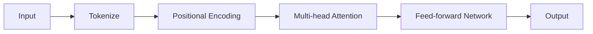

                 


# 智能健康管理 AI Agent：LLM 驱动的个人健康助手

> 关键词：智能健康管理、AI Agent、LLM、大语言模型、个人健康助手

> 摘要：本文深入探讨了智能健康管理 AI Agent 的设计与实现，结合大语言模型（LLM）的技术原理，系统地分析了其在个人健康助手中的应用。文章从背景介绍、技术原理、系统架构到项目实战，全面阐述了如何利用 LLM 构建智能化的个人健康管理系统，并通过实际案例展示了其在健康管理中的潜力与优势。

---

# 第一部分: 智能健康管理 AI Agent 背景与概述

## 第1章: 智能健康管理与 AI Agent 概述

### 1.1 智能健康管理的背景与意义

#### 1.1.1 传统健康管理的局限性
传统健康管理主要依赖于人工记录和简单的数据分析，存在效率低、个性化不足、实时性差等问题。例如，用户需要手动记录饮食、运动和睡眠数据，医生通过简单的检查提供健康建议，这种方式难以满足现代人对高效、精准健康管理的需求。

#### 1.1.2 智能化健康管理的需求
随着人工智能技术的发展，智能化健康管理逐渐成为趋势。用户希望通过智能设备和应用程序实时监测健康数据，并获得个性化的健康建议。这不仅提高了健康管理的效率，还能帮助用户更好地预防疾病。

#### 1.1.3 AI Agent 在健康管理中的作用
AI Agent（智能代理）能够通过自然语言处理、数据分析等技术，为用户提供个性化的健康建议和实时支持。例如，用户可以通过与 AI Agent 对话，获取饮食建议、运动计划和健康风险评估。

### 1.2 大语言模型（LLM）的兴起

#### 1.2.1 LLM 的定义与特点
大语言模型（LLM）是一种基于深度学习的自然语言处理模型，具有以下特点：
- **大规模数据训练**：通常使用海量文本数据进行预训练，具有强大的上下文理解和生成能力。
- **Transformer 架构**：采用自注意力机制，能够捕捉文本中的长距离依赖关系。
- **多任务能力**：通过微调可以适应多种任务，如文本生成、问答系统、文本分类等。

#### 1.2.2 LLM 在自然语言处理中的优势
LLM 的优势主要体现在以下方面：
- **强大的生成能力**：能够生成自然流畅的文本，适用于健康建议、健康知识问答等场景。
- **上下文理解**：能够通过上下文理解用户的意图，提供更精准的健康建议。
- **可扩展性**：通过微调和参数调整，可以适应不同的健康场景和用户需求。

#### 1.2.3 LLM 在健康管理中的潜力
在健康管理中，LLM 可以帮助用户进行健康咨询、疾病预测、健康数据分析等。例如，用户可以通过与 AI Agent 对话，获得个性化的饮食建议和运动计划。

### 1.3 智能健康管理 AI Agent 的概念

#### 1.3.1 AI Agent 的基本定义
AI Agent 是一种能够感知环境、理解用户需求并执行任务的智能系统。在健康管理领域，AI Agent 可以通过自然语言处理技术与用户交互，提供个性化的健康管理服务。

#### 1.3.2 LLM 驻动的 AI Agent 的特点
LLM 驻动的 AI Agent 具有以下特点：
- **自然语言交互**：通过自然语言理解技术，用户可以以口语化的方式与 AI Agent 交流。
- **个性化服务**：基于用户的历史数据和实时输入，提供个性化的健康建议。
- **实时响应**：能够快速响应用户的需求，提供实时的健康支持。

#### 1.3.3 AI Agent 在个人健康助手中的应用
AI Agent 可以应用于多种健康管理场景，例如：
- **健康咨询**：提供疾病症状查询、健康建议等。
- **健康监测**：实时监测用户的健康数据，如心率、血压等。
- **健康计划制定**：根据用户的健康状况，制定个性化的饮食和运动计划。

### 1.4 本章小结
本章介绍了智能健康管理的背景与意义，探讨了大语言模型（LLM）的兴起及其在健康管理中的潜力，最后定义了 LLM 驻动的 AI Agent 并分析了其在个人健康助手中的应用。

---

# 第二部分: 大语言模型（LLM）技术原理

## 第2章: 大语言模型（LLM）的核心原理

### 2.1 注意力机制与 Transformer 模型

#### 2.1.1 注意力机制的提出与原理
注意力机制最初由 Bahdanau 等人提出，用于机器翻译任务。其核心思想是计算输入序列中每个词对当前词的重要性权重，从而 focus on 重要的信息。

注意力机制的公式如下：
$$
\alpha_i = \frac{\exp(e_i)}{\sum_{j=1}^n \exp(e_j)}
$$

其中，\( e_i \) 是查询与候选词之间的相似度得分。

#### 2.1.2 Transformer 模型的基本结构
Transformer 模型由编码器和解码器组成。编码器负责将输入序列映射到一个固定的维度空间，解码器则根据编码结果生成输出序列。

图 2-1 展示了 Transformer 模型的基本结构：



#### 2.1.3 LLM 的训练与优化
LLM 的训练过程包括以下几个步骤：
1. **预训练**：使用大规模通用文本数据进行无监督预训练，目标是最小化预测下一个词的概率。
2. **微调**：针对特定任务进行有监督微调，例如健康咨询任务。

### 2.2 LLM 的训练与微调

#### 2.2.1 预训练任务与目标函数
预训练任务通常包括词预测任务（如 masked language modeling）和下一个句子预测任务（NSP）。目标函数为交叉熵损失函数：

$$
L = -\sum_{i=1}^n \sum_{j=1}^m y_{i,j} \log p(y_{i,j}|x_i)
$$

其中，\( y_{i,j} \) 是标签，\( p(y_{i,j}|x_i) \) 是模型预测的概率。

#### 2.2.2 基于任务的微调方法
在健康咨询任务中，我们需要对模型进行微调。具体步骤如下：
1. **数据准备**：收集健康相关的文本数据，包括健康问题、疾病症状、健康建议等。
2. **模型加载**：加载预训练好的 LLM 模型。
3. **微调训练**：使用健康相关的数据对模型进行微调，优化健康咨询任务的性能。

#### 2.2.3 模型的可解释性与鲁棒性
为了提高模型的可解释性，可以采用以下方法：
- **注意力权重分析**：通过分析注意力权重，理解模型在生成健康建议时关注的关键词。
- **模型解释工具**：使用如 LIME 等工具，对模型的预测结果进行解释。

### 2.3 LLM 在健康领域的应用挑战

#### 2.3.1 数据隐私与安全问题
健康管理数据通常包含敏感信息，如何在保证数据隐私的前提下训练模型是一个重要挑战。

#### 2.3.2 偏差与错误的处理
LLM 可能会引入数据中的偏差，例如在健康建议中提供不准确的信息。需要通过数据清洗、模型优化等方法减少偏差。

#### 2.3.3 模型的可解释性要求
为了使用户信任 AI Agent 的建议，模型需要具备较高的可解释性，用户需要理解模型的决策过程。

### 2.4 本章小结
本章详细介绍了 LLM 的核心原理，包括注意力机制、Transformer 模型及其训练过程。同时，探讨了 LLM 在健康领域应用中的挑战。

---

# 第三部分: 智能健康管理 AI Agent 的系统设计

## 第3章: 系统功能模块设计

### 3.1 用户数据管理模块

#### 3.1.1 数据采集
用户数据包括健康数据（如心率、血压）和行为数据（如饮食、运动记录）。数据可以通过智能设备（如智能手表、健康手环）采集。

#### 3.1.2 数据存储
用户数据需要存储在安全的数据库中，确保数据隐私。可以采用关系型数据库（如 MySQL）或 NoSQL 数据库（如 MongoDB）。

#### 3.1.3 数据分析
通过对用户数据的分析，生成个性化的健康报告。例如，根据用户的饮食记录，生成饮食建议。

### 3.2 健康咨询模块

#### 3.2.1 自然语言理解
通过 NLP 技术理解用户的健康问题，例如“我最近总是感到疲劳，可能是什么原因？”

#### 3.2.2 健康知识库
构建一个包含常见疾病、健康知识的数据库，用于回答用户的问题。

#### 3.2.3 生成健康建议
基于健康知识库和用户数据，生成个性化的健康建议。

### 3.3 健康监测模块

#### 3.3.1 实时监测
通过智能设备实时监测用户的健康数据，例如心率、血压。

#### 3.3.2 异常检测
当监测到异常数据时，及时通知用户或医生。

#### 3.3.3 健康提醒
根据用户的健康数据，设置健康提醒，例如提醒用户按时服药。

### 3.4 系统架构设计

图 3-1 展示了系统的架构设计：


### 3.5 本章小结
本章详细设计了智能健康管理 AI Agent 的功能模块，包括用户数据管理、健康咨询和健康监测模块，并给出了系统的架构设计。

---

# 第四部分: 项目实战

## 第4章: 智能健康管理 AI Agent 的实现

### 4.1 环境配置

#### 4.1.1 安装 Python 和依赖库
```bash
pip install python-transformers torch huggingface_hub
```

#### 4.1.2 安装 NLP 工具
```bash
pip install spacy
python -m spacy download en_core_web_sm
```

### 4.2 核心代码实现

#### 4.2.1 加载预训练模型
```python
from transformers import AutoTokenizer, AutoModelForCausalLM
tokenizer = AutoTokenizer.from_pretrained("gpt2")
model = AutoModelForCausalLM.from_pretrained("gpt2")
```

#### 4.2.2 定义微调任务
```python
def compute_loss(outputs, labels):
    loss = nn.CrossEntropyLoss()(
        outputs.logits[:, :-1, :], labels[:, 1:]
    )
    return loss
```

#### 4.2.3 微调训练
```python
from torch.optim import Adam
optimizer = Adam(model.parameters(), lr=1e-5)
for epoch in range(num_epochs):
    for batch in train_loader:
        optimizer.zero_grad()
        outputs = model(**batch)
        loss = compute_loss(outputs, batch['labels'])
        loss.backward()
        optimizer.step()
```

### 4.3 案例分析与实际应用

#### 4.3.1 健康咨询案例
用户输入：“我最近总是感到疲劳，可能是什么原因？”
系统输出：“疲劳可能由多种原因引起，包括缺乏睡眠、营养不良、压力过大等。”

#### 4.3.2 健康监测案例
用户的心率数据：75 次/分钟。
系统分析：正常心率范围为 60-100 次/分钟，建议用户保持良好的运动习惯。

### 4.4 本章小结
本章通过实际代码实现了智能健康管理 AI Agent 的核心功能，包括模型加载、微调训练和健康咨询模块。

---

# 第五部分: 最佳实践与小结

## 第5章: 最佳实践与总结

### 5.1 最佳实践 tips

#### 5.1.1 数据隐私保护
在实际应用中，必须确保用户数据的隐私和安全，采用加密技术和数据脱敏等方法。

#### 5.1.2 模型优化
为了提高模型的性能，可以采用以下优化方法：
- **模型压缩**：通过剪枝、量化等技术减少模型大小。
- **知识蒸馏**：将大模型的知识迁移到小模型中。

#### 5.1.3 可解释性提升
为了提高模型的可解释性，可以采用以下方法：
- **注意力权重分析**：通过分析注意力权重，理解模型的决策过程。
- **可视化工具**：使用如 TensorBoard 等工具，对模型的训练过程进行可视化监控。

### 5.2 本章小结
本章总结了智能健康管理 AI Agent 的实现过程，并提出了数据隐私保护、模型优化和可解释性提升等最佳实践建议。

---

# 附录: 参考资料与工具

### 附录 A: 数据集与工具库
- **健康数据集**：Kaggle、UCI 等平台提供健康相关的数据集。
- **NLP 工具库**：Transformers、spaCy 等。

### 附录 B: 推荐阅读
- **书籍**：《Deep Learning》、《Natural Language Processing with PyTorch》。
- **论文**：《Attention Is All You Need》、《BERT: Pre-training of Deep Bidirectional Transformers for NLP》。

---

# 作者：AI天才研究院/AI Genius Institute & 禅与计算机程序设计艺术 /Zen And The Art of Computer Programming

---

以上是《智能健康管理 AI Agent：LLM 驱动的个人健康助手》的完整目录和内容概述，涵盖了从背景介绍、技术原理到系统实现的全过程。希望对您有所帮助！

