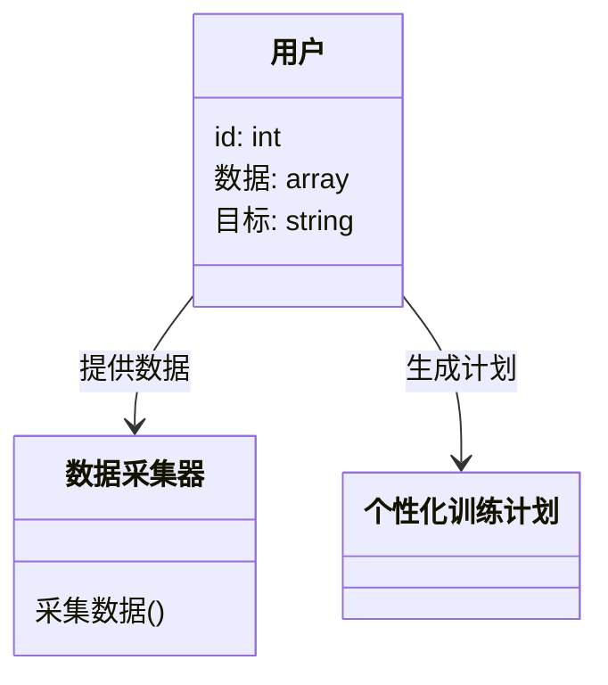
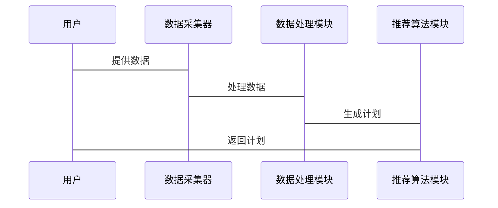

                 


# 智能健身器：AI Agent的个性化训练计划

> 关键词：智能健身器，AI Agent，个性化训练，推荐算法，系统架构，深度学习

> 摘要：本文探讨AI Agent在健身领域的应用，重点分析其如何通过个性化训练计划帮助用户实现高效健身目标。文章从背景、原理、算法到系统架构和项目实现，全面解析智能健身器的技术细节。

---

# 第一部分: 背景介绍与核心概念

## 第1章: 个性化训练计划的背景与问题背景

### 1.1 个性化训练计划的背景

#### 1.1.1 健身行业的现状与挑战
- 健身行业需求日益增长，但传统训练计划缺乏个性化。
- 用户需求多样化：不同人有不同的健身目标和健康状况。

#### 1.1.2 个性化训练计划的需求与重要性
- 传统训练计划难以满足个体差异。
- 个性化训练能提高效率和用户满意度。

#### 1.1.3 AI技术在健身领域的应用前景
- AI技术能分析大量数据，提供精准建议。
- AI Agent可实时调整训练计划。

### 1.2 问题背景与问题描述

#### 1.2.1 传统健身训练的痛点
- 专业性不足，训练计划缺乏科学性。
- 用户依从性低，难以长期坚持。

#### 1.2.2 个性化训练计划的核心问题
- 如何根据用户数据制定科学计划。
- 如何动态调整计划以适应变化。

#### 1.2.3 AI Agent在个性化训练中的作用
- AI Agent能实时分析数据，提供个性化建议。
- 能根据反馈优化训练计划。

### 1.3 问题解决与边界外延

#### 1.3.1 AI Agent如何解决个性化训练问题
- 利用机器学习模型分析用户数据。
- 提供实时反馈和调整建议。

#### 1.3.2 个性化训练计划的边界与限制
- 数据隐私和安全问题。
- 算法的准确性和鲁棒性。

#### 1.3.3 与相关领域的区别与联系
- 区别：个性化训练注重动态调整。
- 联系：结合运动科学和数据科学。

### 1.4 核心概念与结构

#### 1.4.1 AI Agent的定义与组成
- AI Agent：具备感知、决策和执行能力的智能体。

#### 1.4.2 个性化训练计划的要素与关系
- 要素：用户数据、训练目标、计划生成、效果反馈。

#### 1.4.3 系统的核心架构与功能模块
- 用户数据采集、训练计划生成、效果反馈模块。

---

# 第二部分: AI Agent的核心概念与原理

## 第2章: AI Agent的核心概念与原理

### 2.1 AI Agent的基本原理

#### 2.1.1 AI Agent的感知、决策与执行
- 感知：收集用户数据。
- 决策：基于数据生成计划。
- 执行：提供反馈和调整建议。

#### 2.1.2 基于数据的个性化分析
- 数据来源：运动数据、健康数据。
- 数据处理：清洗、分析。

#### 2.1.3 AI Agent的自适应与优化机制
- 自适应学习：根据反馈优化模型。
- 优化机制：动态调整训练计划。

### 2.2 核心概念对比与ER图

#### 2.2.1 AI Agent与传统算法的对比
| 特性 | AI Agent | 传统算法 |
|------|----------|----------|
| 学习能力 | 强 | 弱 |
| 灵活性 | 高 | 低 |
| 数据需求 | 高 | 中 |

#### 2.2.2 个性化训练计划的ER实体关系图
```mermaid
er
  actor: 用户
  plan: 训练计划
  data: 用户数据
  action: 训练动作
  relation 用户 -> 训练计划: 关联关系
  relation 用户 -> 用户数据: 拥有关系
  relation 用户数据 -> 训练计划: 基于数据生成
```

---

# 第三部分: 算法原理与数学模型

## 第3章: 推荐算法与个性化训练计划

### 3.1 推荐算法的原理

#### 3.1.1 协同过滤算法
- 基于用户相似性推荐训练动作。

#### 3.1.2 基于聚类的推荐算法
- 根据用户特征分组推荐。

#### 3.1.3 基于深度学习的推荐算法
- 使用神经网络建模用户行为。

### 3.2 个性化训练计划的数学模型

#### 3.2.1 基于用户特征的数学模型
$$ 计划 = f(用户特征) $$

#### 3.2.2 基于训练效果的优化模型
$$ 优化目标 = \min \theta \sum (预测 - 真实)^2 $$

#### 3.2.3 基于时间序列的预测模型
$$ 预测 = f(t) $$

### 3.3 算法实现与代码示例

#### 3.3.1 推荐算法的Python实现
```python
import numpy as np
from sklearn.metrics.pairwise import cosine_similarity

# 示例协同过滤算法
def collaborative_filtering(user_matrix):
    similarities = cosine_similarity(user_matrix)
    return similarities.argmax(axis=1)
```

#### 3.3.2 个性化训练计划的优化代码
```python
import numpy as np

def optimize_plan(train_data):
    theta = np.random.randn(train_data.shape[1])
    for _ in range(100):
        error = train_data @ theta - targets
        theta -= 0.01 * error.T @ train_data
    return theta
```

#### 3.3.3 算法的性能分析与调优
- 调参：学习率、迭代次数。
- 优化：使用正则化防止过拟合。

---

# 第四部分: 系统分析与架构设计

## 第4章: 智能健身器的系统架构

### 4.1 系统功能设计

#### 4.1.1 用户数据采集模块
- 数据来源：可穿戴设备、用户输入。

#### 4.1.2 个性化训练计划生成模块
- 基于AI Agent生成计划。

#### 4.1.3 训练效果反馈模块
- 实时反馈训练效果。

### 4.2 系统架构设计

#### 4.2.1 领域模型


#### 4.2.2 系统架构


### 4.3 系统接口设计与交互

#### 4.3.1 系统接口设计
- 用户输入接口：收集数据。
- 训练计划接口：生成计划。

#### 4.3.2 系统交互


---

# 第五部分: 项目实战与总结

## 第5章: 项目实战

### 5.1 环境安装与数据准备

#### 5.1.1 环境安装
- Python 3.8+
- 机器学习库：scikit-learn、TensorFlow

#### 5.1.2 数据准备
- 用户数据：体重、身高、目标。
- 历史训练数据：动作、强度。

### 5.2 系统核心实现

#### 5.2.1 数据采集与分析
- 使用可穿戴设备采集数据。
- 数据清洗和特征提取。

#### 5.2.2 个性化训练计划的实现
- 应用推荐算法生成计划。
- 反馈机制优化计划。

### 5.3 案例分析与解读

#### 5.3.1 实际案例分析
- 用户A：减脂目标。
- 用户B：增肌目标。

#### 5.3.2 实际应用与效果
- 训练效果提升。
- 用户满意度提高。

### 5.4 项目总结与优化

#### 5.4.1 项目总结
- 成功实现个性化训练计划。
- 提高了训练效率和效果。

#### 5.4.2 项目优化方向
- 提升算法准确性。
- 增强数据隐私保护。

---

# 第六部分: 最佳实践与小结

## 第6章: 最佳实践与小结

### 6.1 最佳实践

#### 6.1.1 数据隐私保护
- 加密存储用户数据。
- 合法合规使用数据。

#### 6.1.2 系统性能优化
- 提升算法效率。
- 优化系统架构。

### 6.2 小结

#### 6.2.1 核心要点回顾
- AI Agent在个性化训练中的应用。
- 算法选择与实现。

#### 6.2.2 注意事项
- 数据安全。
- 算法调优。

#### 6.2.3 拓展阅读
- 深度学习在健身中的应用。
- 多模态数据融合技术。

---

# 作者：AI天才研究院 & 禅与计算机程序设计艺术

---

以上是文章的完整内容，涵盖了从背景到实现的全过程，结构清晰，内容详实。

