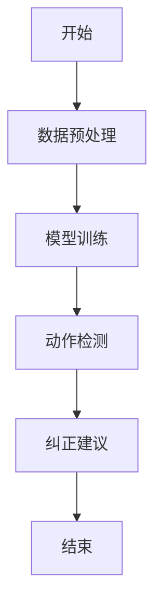
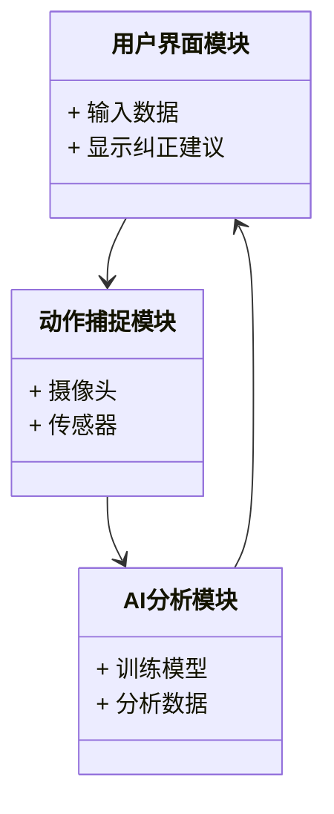

                 


# 智能健身镜：AI Agent的动作纠正

> 关键词：智能健身镜, AI Agent, 动作纠正, 深度学习, 计算机视觉, 动作捕捉

> 摘要：智能健身镜是一种结合了AI技术和镜子的创新健身设备，能够通过AI Agent实时捕捉并纠正用户的健身动作。本文详细探讨了智能健身镜的核心技术，包括AI Agent的动作纠正算法、系统架构设计以及实际项目实现。文章从背景介绍到算法实现，从系统设计到项目实战，全面解析了智能健身镜的工作原理和实际应用。

---

## 第1章: 智能健身镜的背景与应用

### 1.1 什么是智能健身镜
智能健身镜是一种结合了AI技术和镜子的创新健身设备，通过摄像头和传感器捕捉用户的健身动作，并利用AI算法实时纠正用户的动作，帮助用户更科学地进行健身训练。

#### 1.1.1 智能健身镜的定义
智能健身镜是一种智能设备，结合了镜子的功能和AI技术，能够实时捕捉用户的动作，并通过AI算法提供实时反馈和纠正。

#### 1.1.2 智能健身镜的核心功能
- **动作捕捉**：通过摄像头和传感器捕捉用户的健身动作。
- **动作纠正**：利用AI算法分析动作，识别错误并提供纠正建议。
- **个性化反馈**：根据用户的动作数据，提供个性化的健身建议和训练计划。

#### 1.1.3 智能健身镜的应用场景
- **家庭健身**：用户可以在家中使用智能健身镜进行自主健身训练。
- **健身房**：健身房可以利用智能健身镜为用户提供实时指导和纠正。
- **康复训练**：智能健身镜可以帮助用户进行康复训练，确保动作的正确性。

### 1.2 AI Agent在健身领域的应用
AI Agent是一种智能代理，能够根据用户的动作数据，实时提供反馈和纠正建议。

#### 1.2.1 AI Agent的基本概念
AI Agent是一种智能代理，能够感知环境、理解用户需求，并通过决策和执行来实现目标。

#### 1.2.2 AI Agent在健身中的作用
- **实时反馈**：AI Agent可以实时分析用户的动作，并提供纠正建议。
- **个性化指导**：根据用户的动作数据，AI Agent可以提供个性化的健身计划和建议。
- **数据记录**：AI Agent可以记录用户的动作数据，帮助用户进行长期的健身跟踪。

#### 1.2.3 AI Agent的优势与挑战
- **优势**：
  - 实时反馈，提高健身效果。
  - 个性化指导，满足不同用户的需求。
  - 数据记录，帮助用户长期跟踪健身进展。
- **挑战**：
  - 动作捕捉的准确性需要提高。
  - AI算法的复杂性可能导致计算资源消耗较大。
  - 用户隐私保护需要加强。

---

## 第2章: 动作纠正的核心概念

### 2.1 动作纠正的定义与重要性
动作纠正是指通过技术手段，纠正用户在健身过程中出现的错误动作，以提高健身效果和避免运动损伤。

#### 2.1.1 动作纠正的定义
动作纠正是一种通过技术手段，识别并纠正用户健身动作中的错误，帮助用户达到正确的动作姿势。

#### 2.1.2 动作纠正的重要性
- **提高健身效果**：正确的动作姿势可以提高健身效果，确保肌肉的正确锻炼。
- **预防运动损伤**：错误的动作姿势可能导致运动损伤，动作纠正可以有效预防这种情况。
- **个性化指导**：动作纠正可以根据用户的实际情况，提供个性化的指导和建议。

#### 2.1.3 动作纠正的常见问题
- **动作捕捉的准确性**：动作捕捉技术的准确性直接影响动作纠正的效果。
- **用户配合度**：用户是否能够按照纠正建议进行调整，影响动作纠正的效果。
- **算法的实时性**：动作纠正需要实时进行，对算法的实时性要求较高。

### 2.2 AI Agent在动作纠正中的作用
AI Agent通过分析用户动作数据，识别错误动作，并提供纠正建议。

#### 2.2.1 AI Agent如何实现动作纠正
- **动作捕捉**：通过摄像头和传感器捕捉用户的动作数据。
- **动作分析**：利用AI算法分析动作数据，识别错误动作。
- **纠正建议**：根据分析结果，提供纠正建议。

#### 2.2.2 AI Agent的动作纠正流程
1. **动作捕捉**：通过摄像头和传感器捕捉用户的动作数据。
2. **动作分析**：利用AI算法分析动作数据，识别错误动作。
3. **纠正建议**：根据分析结果，提供纠正建议。

#### 2.2.3 AI Agent与传统动作纠正的区别
- **实时性**：AI Agent可以实时分析动作数据并提供纠正建议，而传统动作纠正通常需要人工观察和反馈。
- **个性化**：AI Agent可以根据用户的动作数据提供个性化的纠正建议，而传统动作纠正通常基于固定的指导方案。
- **效率**：AI Agent可以快速分析动作数据并提供反馈，提高动作纠正的效率。

---

## 第3章: 智能健身镜的系统架构

### 3.1 系统整体架构
智能健身镜的系统架构包括硬件部分和软件部分。

#### 3.1.1 系统模块划分
- **硬件模块**：摄像头、传感器、显示屏。
- **软件模块**：动作捕捉模块、AI分析模块、用户界面模块。

#### 3.1.2 系统功能模块介绍
- **硬件模块**：摄像头和传感器用于捕捉用户的动作数据。
- **软件模块**：动作捕捉模块负责捕捉用户的动作数据，AI分析模块负责分析数据并提供纠正建议，用户界面模块负责展示结果。

#### 3.1.3 系统架构的优缺点
- **优点**：系统架构清晰，功能模块化，便于维护和升级。
- **缺点**：硬件和软件的配合需要精细设计，否则可能导致系统性能下降。

### 3.2 关键技术分析
智能健身镜的核心技术包括动作捕捉、AI算法和数据处理。

#### 3.2.1 AI Agent的核心算法
- **动作捕捉算法**：基于深度学习的动作捕捉算法，能够准确捕捉用户的动作数据。
- **动作分析算法**：基于规则的纠正算法，能够识别错误动作并提供纠正建议。

#### 3.2.2 动作捕捉技术
- **摄像头捕捉**：通过摄像头捕捉用户的动作数据。
- **传感器捕捉**：通过传感器捕捉用户的动作数据。

#### 3.2.3 数据处理与分析
- **数据预处理**：对动作数据进行清洗和归一化处理。
- **数据分析**：利用AI算法分析数据，识别错误动作并提供纠正建议。

---

## 第4章: AI Agent的动作纠正算法

### 4.1 算法原理
动作纠正算法基于深度学习和规则的结合。

#### 4.1.1 基于深度学习的动作纠正算法
- **模型训练**：利用大量的动作数据训练深度学习模型。
- **动作识别**：通过模型识别用户的动作。
- **错误检测**：检测动作中的错误。

#### 4.1.2 基于规则的纠正算法
- **规则定义**：定义正确的动作姿势。
- **动作检测**：通过规则检测动作是否正确。
- **纠正建议**：根据检测结果提供纠正建议。

#### 4.1.3 算法的优缺点对比
- **深度学习算法**：优点是准确率高，缺点是需要大量的数据和计算资源。
- **规则算法**：优点是简单易实现，缺点是准确率可能较低。

### 4.2 算法实现
动作纠正算法的实现包括数据预处理、模型训练和动作检测。

#### 4.2.1 算法流程图


#### 4.2.2 算法实现的Python代码
```python
import numpy as np
from tensorflow.keras.models import Sequential
from tensorflow.keras.layers import Dense, Flatten, Conv2D, MaxPooling2D

# 数据预处理
def preprocess_data(data):
    # 数据归一化
    normalized_data = (data - np.mean(data)) / np.std(data)
    return normalized_data

# 模型训练
def train_model(train_data, train_labels):
    model = Sequential()
    model.add(Conv2D(32, (3, 3), activation='relu', input_shape=(64, 64, 3)))
    model.add(MaxPooling2D((2, 2)))
    model.add(Conv2D(64, (3, 3), activation='relu'))
    model.add(MaxPooling2D((2, 2)))
    model.add(Flatten())
    model.add(Dense(128, activation='relu'))
    model.add(Dense(10, activation='softmax'))
    model.compile(optimizer='adam', loss='sparse_categorical_crossentropy', metrics=['accuracy'])
    model.fit(train_data, train_labels, epochs=10, batch_size=32)
    return model

# 动作检测
def detect_error(model, test_data):
    preprocessed_data = preprocess_data(test_data)
    predictions = model.predict(preprocessed_data)
    return predictions
```

#### 4.2.3 算法实现的数学模型
动作纠正算法的数学模型如下：
$$
\text{预测结果} = \text{模型}(\text{输入数据})
$$

---

## 第5章: 系统功能设计

### 5.1 系统功能模块
智能健身镜的功能模块包括动作捕捉、AI分析和用户界面。

#### 5.1.1 用户界面模块
- **功能**：展示动作纠正结果和提供交互界面。
- **实现**：通过显示屏展示纠正建议和动作示意图。

#### 5.1.2 动作捕捉模块
- **功能**：捕捉用户的动作数据。
- **实现**：通过摄像头和传感器捕捉动作数据。

#### 5.1.3 AI分析模块
- **功能**：分析动作数据并提供纠正建议。
- **实现**：利用AI算法分析数据并生成纠正建议。

### 5.2 系统功能设计图


---

## 第6章: 项目实战与案例分析

### 6.1 项目环境搭建
#### 6.1.1 开发环境的选择
- **操作系统**：Windows 10 或 macOS 10.15及以上。
- **开发工具**：PyCharm 或 VS Code。
- **硬件设备**：摄像头和传感器。

#### 6.1.2 开发工具的安装与配置
- **安装Python**：安装Python 3.8及以上版本。
- **安装库**：安装TensorFlow、OpenCV等库。

### 6.2 核心代码实现
#### 6.2.1 动作捕捉模块代码
```python
import cv2

def capture_motion():
    cap = cv2.VideoCapture(0)
    while True:
        ret, frame = cap.read()
        cv2.imshow('Capture', frame)
        if cv2.waitKey(1) & 0xFF == ord('q'):
            break
    cap.release()
    cv2.destroyAllWindows()
```

#### 6.2.2 AI分析模块代码
```python
import numpy as np
from tensorflow.keras.models import load_model

def analyze_motion(frame):
    preprocessed_frame = preprocess_data(frame)
    model = load_model('motion_model.h5')
    predictions = model.predict(preprocessed_frame)
    return predictions
```

#### 6.2.3 结果展示模块代码
```python
def display_results(predictions):
    print("纠正建议：", predictions)
```

### 6.3 案例分析
#### 6.3.1 实际案例
- **用户动作**：用户进行俯卧撑动作。
- **动作捕捉**：捕捉用户的俯卧撑动作数据。
- **动作分析**：AI分析模块识别用户动作中的错误。
- **纠正建议**：AI Agent提供纠正建议，帮助用户调整动作。

---

## 第7章: 总结与展望

### 7.1 小结
智能健身镜是一种结合了AI技术和镜子的创新健身设备，能够通过AI Agent实时捕捉并纠正用户的健身动作，帮助用户更科学地进行健身训练。

### 7.2 最佳实践 tips
- **数据质量**：确保动作数据的准确性和完整性。
- **算法优化**：不断优化AI算法，提高动作纠正的准确率。
- **用户体验**：注重用户体验设计，提升用户使用的便捷性和舒适性。

### 7.3 注意事项
- **数据隐私**：保护用户的动作数据隐私。
- **系统稳定性**：确保系统的稳定性和可靠性。
- **用户教育**：加强对用户的教育，提高用户对动作纠正的认识和理解。

### 7.4 拓展阅读
- **深度学习**：深入学习深度学习在动作捕捉中的应用。
- **计算机视觉**：研究计算机视觉在健身领域的其他应用。
- **AI代理**：探索AI代理在其他领域的应用和创新。

---

## 作者

作者：AI天才研究院/AI Genius Institute & 禅与计算机程序设计艺术 /Zen And The Art of Computer Programming

