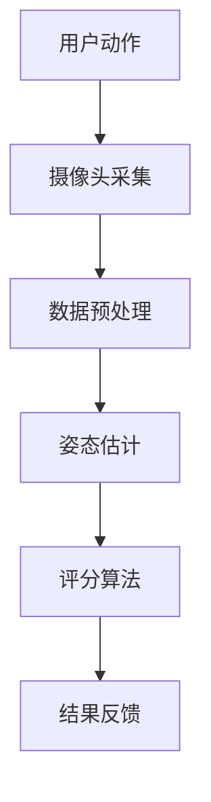
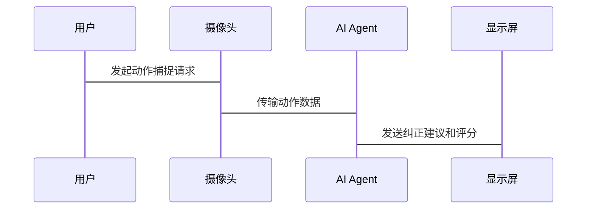

                 

---

# 《智能健身镜：AI Agent的实时动作纠正与评分》

---

## 关键词：智能健身镜、AI Agent、实时动作纠正、动作评分、计算机视觉、姿态估计、评分算法

---

## 摘要：

智能健身镜是一种结合了AI技术的智能设备，能够实时捕捉用户的动作，并通过AI Agent提供动作纠正和评分服务。本文将从技术背景、核心算法、系统架构、项目实现等多方面详细分析智能健身镜的工作原理和实现方法，探讨其在健身领域的应用前景。

---

# 正文

## 第一部分: 背景介绍与核心概念

### 第1章: 智能健身镜的背景与应用

#### 1.1 问题背景与需求分析

随着人们对健康生活的追求，健身逐渐成为日常生活的一部分。然而，传统健身方式存在诸多问题，例如缺乏专业指导、动作标准难以掌握、健身效果难以量化等。这些问题严重影响了用户的健身体验和效果。智能健身镜的出现，为这些问题提供了一种高效的解决方案。

智能健身镜是一种结合了AI技术的智能镜子，能够实时捕捉用户的动作，并通过AI Agent提供实时的动作纠正和评分服务。这种设备不仅能够帮助用户掌握正确的动作姿势，还能通过评分系统量化用户的健身效果，从而提升用户的健身体验和效果。

#### 1.2 智能健身镜的核心功能

智能健身镜的核心功能包括以下几点：

1. **实时动作捕捉**：通过摄像头和深度传感器，实时捕捉用户的动作数据。
2. **动作纠正**：基于AI算法，分析用户的动作，提供实时纠正建议。
3. **动作评分**：根据动作的标准程度，给出评分，帮助用户量化健身效果。
4. **个性化指导**：根据用户的动作数据，提供个性化的健身建议。

#### 1.3 用户需求与场景分析

用户在使用智能健身镜时，主要有以下需求：

1. **实时反馈**：用户希望在动作完成后立即得到反馈，以便及时调整动作。
2. **精准纠正**：用户希望纠正建议能够准确指出动作中的问题。
3. **量化评估**：用户希望通过评分了解自己的健身效果。

主要应用场景包括家庭健身、健身房、康复训练等。

---

## 第二部分: 核心概念与技术原理

### 第2章: AI Agent与动作捕捉技术

#### 2.1 AI Agent的核心原理

AI Agent是一种智能体，能够根据环境输入做出决策并执行动作。在智能健身镜中，AI Agent的主要功能是处理用户的动作数据，并提供纠正建议和评分。

AI Agent的工作流程如下：

1. **数据采集**：通过摄像头和传感器采集用户的动作数据。
2. **数据处理**：对采集到的数据进行预处理，提取关键特征。
3. **模型推理**：通过预训练的模型对动作进行分类和评分。
4. **结果输出**：将纠正建议和评分反馈给用户。

#### 2.2 动作捕捉技术的实现原理

动作捕捉技术是智能健身镜的核心技术之一，主要包括以下几种实现方式：

1. **基于摄像头的2D动作捕捉**：通过摄像头采集用户的图像，利用深度学习模型（如姿态估计模型）提取用户的骨骼信息。
2. **基于深度传感器的3D动作捕捉**：通过深度传感器（如Kinect、RGB-D传感器）捕捉用户的3D动作数据。
3. **基于惯性传感器的动作捕捉**：通过穿戴式设备（如智能手环、智能鞋）捕捉用户的动作数据。

#### 2.3 AI Agent与动作捕捉的协同工作

AI Agent与动作捕捉技术的协同工作流程如下：

1. **数据采集**：动作捕捉技术采集用户的动作数据。
2. **数据传输**：将采集到的数据传输给AI Agent。
3. **数据处理**：AI Agent对数据进行分析和处理，生成纠正建议和评分。
4. **结果反馈**：将纠正建议和评分反馈给用户。

---

## 第三部分: 算法原理与数学模型

### 第3章: 姿态估计与评分算法

#### 3.1 姿态估计的实现原理

姿态估计是智能健身镜的核心算法之一，主要用于识别用户的动作姿势。常见的姿态估计方法包括：

1. **基于深度学习的2D姿态估计**：通过卷积神经网络（CNN）提取图像特征，预测用户的骨骼点位置。
2. **基于深度学习的3D姿态估计**：通过3D卷积神经网络（3D CNN）提取视频特征，预测用户的3D骨骼点位置。

姿态估计的数学模型如下：

$$
y = f(x) + \epsilon
$$

其中，$x$ 是输入数据，$y$ 是输出结果，$f$ 是模型函数，$\epsilon$ 是噪声。

#### 3.2 动作评分算法的设计

动作评分算法是智能健身镜的另一个核心算法，主要用于根据用户的动作标准程度给出评分。常见的评分算法包括：

1. **基于相似度的评分方法**：通过计算用户的动作与标准动作的相似度，给出评分。
2. **基于能量函数的评分优化**：通过优化能量函数，提升评分的准确性。

评分算法的数学模型如下：

$$
score = \sum_{i=1}^{n} w_i \cdot s_i
$$

其中，$w_i$ 是第$i$个特征的权重，$s_i$ 是第$i$个特征的得分。

---

## 第四部分: 系统分析与架构设计

### 第4章: 智能健身镜的系统架构

#### 4.1 系统组成与功能设计

智能健身镜的系统组成包括硬件部分和软件部分：

1. **硬件部分**：摄像头、深度传感器、显示屏等。
2. **软件部分**：AI Agent、姿态估计算法、评分算法等。

#### 4.2 系统架构设计

智能健身镜的系统架构设计如下：

#### 4.3 系统接口设计

智能健身镜的系统接口设计如下：

---

## 第五部分: 项目实战

### 第5章: 项目实现与案例分析

#### 5.1 环境安装与配置

智能健身镜的开发环境包括：

1. **硬件环境**：摄像头、深度传感器等。
2. **软件环境**：Python、OpenCV、TensorFlow等。

#### 5.2 系统核心实现

智能健身镜的核心实现包括：

1. **姿态估计模型的训练与部署**
2. **评分算法的实现与优化**
3. **AI Agent的开发与集成**

#### 5.3 实际案例分析

以俯卧撑动作为例，详细分析智能健身镜的动作纠正与评分过程。

---

## 第六部分: 总结与展望

### 第6章: 总结与展望

#### 6.1 本书内容总结

智能健身镜是一种结合了AI技术的智能设备，能够实时捕捉用户的动作，并通过AI Agent提供动作纠正和评分服务。

#### 6.2 未来改进方向

1. **提升动作捕捉精度**
2. **优化评分算法**
3. **扩展应用场景**

#### 6.3 学习建议与注意事项

1. **学习建议**：建议读者学习深度学习、计算机视觉等基础知识，熟悉姿态估计和评分算法的实现。
2. **注意事项**：在开发智能健身镜时，需要注意数据隐私保护、硬件性能优化等问题。

---

## 作者：AI天才研究院/AI Genius Institute & 禅与计算机程序设计艺术 /Zen And The Art of Computer Programming

