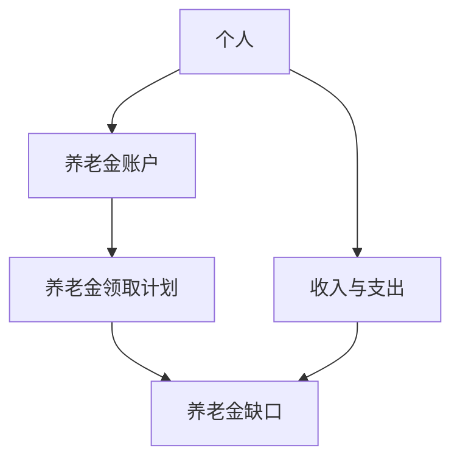
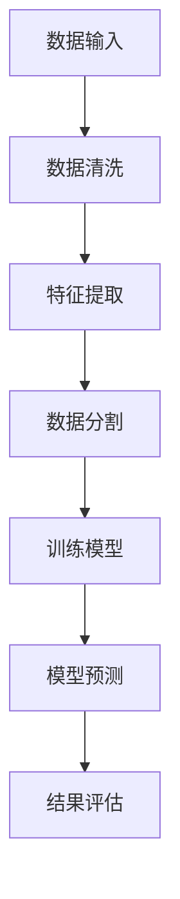
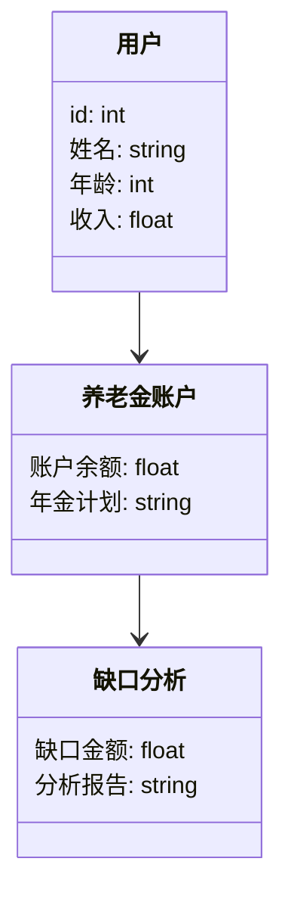
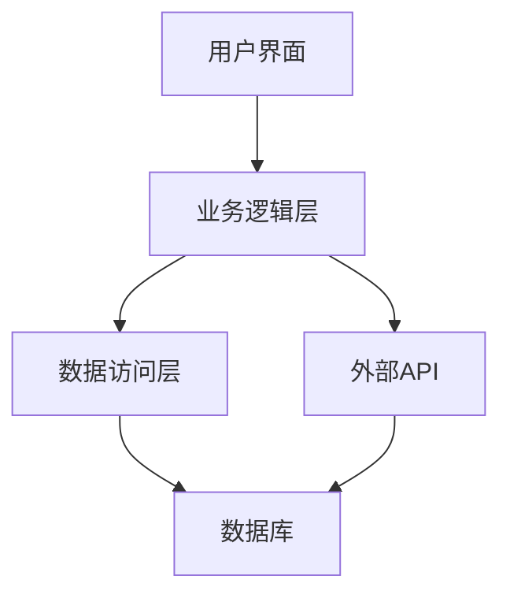
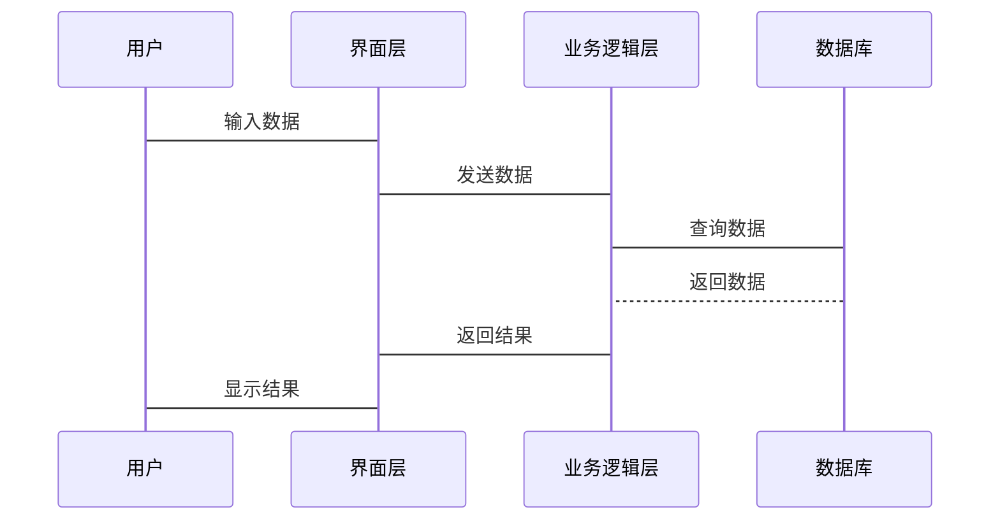

                 


# 智能养老金缺口分析与规划工具

## 关键词：养老金缺口分析、智能规划工具、机器学习、蒙特卡洛模拟、系统架构设计

## 摘要：  
随着全球人口老龄化的加剧，养老金缺口问题日益成为社会关注的焦点。为了有效解决这一问题，智能养老金缺口分析与规划工具应运而生。本文深入探讨了养老金缺口分析的核心概念、算法原理、系统架构设计以及实际项目实现，结合数学模型、机器学习算法和系统设计方法，为读者提供了一个全面了解和实现智能养老金缺口分析与规划工具的路径。通过本文，读者可以掌握如何利用技术手段高效解决养老金缺口问题，并为未来的智能化养老金管理提供参考。

---

# 第1章: 智能养老金缺口分析的背景与问题描述

## 1.1 养老金缺口分析的背景

### 1.1.1 人口老龄化与养老金问题的加剧
随着全球人口老龄化的加剧，养老金问题已成为许多国家面临的重要挑战。根据联合国的数据，全球65岁及以上人口的数量将从2020年的10亿增长到2050年的近16亿。这一趋势使得养老金缺口问题更加突出。养老金缺口指的是退休后实际可获得的养老金与实际需求之间的差距。如果缺口过大，将导致退休生活质量下降，甚至影响社会稳定。

### 1.1.2 养老金缺口分析的重要性
养老金缺口分析是解决这一问题的关键。通过分析个人或家庭的养老金缺口，可以提前制定合理的储蓄和投资计划，确保退休后有足够的经济支持。此外，养老金缺口分析还可以帮助政府和企业制定更科学的养老金政策，优化社会保障体系。

### 1.1.3 智能化技术在养老金规划中的应用潜力
传统的养老金缺口分析方法通常依赖人工计算和简单的公式，效率低且难以应对复杂的变化。随着人工智能和大数据技术的发展，智能养老金缺口分析工具逐渐成为可能。这些工具可以通过机器学习算法，结合实时数据和多种模型，提供更精准的分析和规划建议。

## 1.2 养老金缺口分析的核心问题

### 1.2.1 养老金缺口的定义与计算方法
养老金缺口是指退休后所需的总支出与实际可获得的养老金之间的差额。具体计算公式如下：
$$\text{养老金缺口} = \text{退休后总支出} - \text{退休后可获得的养老金}$$

### 1.2.2 养老金缺口分析的关键因素
养老金缺口分析涉及多个因素，包括当前储蓄、投资收益、通胀率、寿命 expectancy、收入水平和支出需求等。这些因素相互作用，决定了养老金缺口的大小。

### 1.2.3 养老金缺口分析的边界与外延
在进行养老金缺口分析时，需要明确分析的边界，例如仅考虑个人或家庭的养老金缺口，还是包括企业或政府的养老金计划。此外，还需要考虑一些外延因素，如医疗费用、紧急支出等。

## 1.3 智能养老金缺口分析工具的目标与价值

### 1.3.1 提高养老金缺口分析的效率
智能工具可以快速处理大量数据，提供实时分析结果，显著提高效率。

### 1.3.2 提供个性化的养老金规划建议
基于机器学习算法，智能工具可以根据个人的财务状况和目标，提供个性化的储蓄和投资建议。

### 1.3.3 降低养老金缺口分析的复杂性
智能工具可以简化复杂的计算过程，使用户更容易理解和使用。

## 1.4 本章小结

本章介绍了养老金缺口分析的背景、核心问题以及智能工具的目标与价值。通过智能技术的应用，养老金缺口分析将变得更加高效和精准，为个人和机构提供有力支持。

---

# 第2章: 养老金缺口分析的核心概念与联系

## 2.1 养老金缺口分析的核心概念

### 2.1.1 养老金缺口的计算公式
养老金缺口的计算公式可以表示为：
$$\text{养老金缺口} = \text{退休后总支出} - \text{退休后可获得的养老金}$$

其中，退休后总支出包括日常生活开支、医疗费用、旅行支出等，退休后可获得的养老金包括社保养老金、企业年金和个人储蓄等。

### 2.1.2 养老金需求的预测模型
养老金需求的预测模型可以通过以下公式表示：
$$\text{养老金需求} = f(\text{收入}, \text{支出}, \text{寿命})$$

其中，收入和支出是影响养老金需求的主要因素，寿命则决定了退休后的消费时间。

### 2.1.3 养老金供给的评估方法
养老金供给的评估方法可以表示为：
$$\text{养老金供给} = g(\text{当前储蓄}, \text{投资收益}, \text{通胀率})$$

其中，当前储蓄是基础，投资收益是关键，通胀率则影响购买力。

## 2.2 养老金缺口分析的核心要素

### 2.2.1 收入与支出的对比分析
收入与支出的对比分析是养老金缺口分析的基础。通过分析当前收入和退休后的支出，可以初步估算养老金缺口。

### 2.2.2 养老金领取时间与金额的关系
养老金领取时间与金额密切相关。领取时间越长，所需的养老金金额越大，缺口也越大。

### 2.2.3 养老金缺口的动态变化
养老金缺口会随着时间和市场环境的变化而动态变化。例如，投资收益增加可以减少缺口，而通胀率上升则会增加缺口。

## 2.3 养老金缺口分析的实体关系图

以下是一个养老金缺口分析的实体关系图：


该图展示了个人的收入与支出如何影响养老金缺口。

## 2.4 本章小结

本章详细阐述了养老金缺口分析的核心概念和关键要素，并通过实体关系图展示了各要素之间的关系。

---

# 第3章: 智能养老金缺口分析工具的算法原理

## 3.1 养老金缺口分析的数学模型

### 3.1.1 养老金缺口计算公式
养老金缺口的计算公式可以表示为：
$$\text{养老金缺口} = \text{养老金需求} - \text{养老金供给}$$

### 3.1.2 养老金需求预测模型
养老金需求预测模型可以表示为：
$$\text{养老金需求} = f(\text{收入}, \text{支出}, \text{寿命})$$

### 3.1.3 养老金供给评估模型
养老金供给评估模型可以表示为：
$$\text{养老金供给} = g(\text{当前储蓄}, \text{投资收益}, \text{通胀率})$$

## 3.2 基于机器学习的养老金缺口预测算法

### 3.2.1 数据预处理与特征提取
数据预处理包括数据清洗、特征提取和归一化等步骤。例如，将年龄、收入、支出等特征进行归一化处理。

### 3.2.2 算法选择与训练
常用的算法包括线性回归、随机森林和神经网络等。以下是一个简单的线性回归示例：

```python
import pandas as pd
import numpy as np
from sklearn.linear_model import LinearRegression
from sklearn.metrics import mean_squared_error

# 数据加载与预处理
data = pd.read_csv('pension_data.csv')
X = data[['age', 'income', 'expenses']]
y = data['pension_gap']

# 训练模型
model = LinearRegression()
model.fit(X, y)

# 预测与评估
y_pred = model.predict(X)
print('均方根误差:', np.sqrt(mean_squared_error(y, y_pred)))
```

### 3.2.3 算法流程图
以下是一个机器学习算法的流程图：


## 3.3 本章小结

本章详细介绍了养老金缺口分析的数学模型和基于机器学习的算法原理，展示了如何通过算法实现智能分析。

---

# 第4章: 智能养老金缺口分析工具的系统架构设计

## 4.1 系统功能设计

### 4.1.1 领域模型
以下是一个领域模型的类图：


### 4.1.2 系统架构设计
以下是一个系统架构图：


### 4.1.3 系统交互设计
以下是一个系统交互序列图：


## 4.2 本章小结

本章详细描述了智能养老金缺口分析工具的系统架构设计，包括功能模块、架构图和交互设计。

---

# 第5章: 智能养老金缺口分析工具的项目实战

## 5.1 环境安装与配置

### 5.1.1 Python环境安装
需要安装Python 3.8或更高版本，并安装以下库：
```bash
pip install pandas numpy scikit-learn matplotlib
```

### 5.1.2 数据库配置
使用MySQL或MongoDB作为数据库，配置连接信息。

## 5.2 核心代码实现

### 5.2.1 数据预处理
```python
import pandas as pd
import numpy as np

# 数据加载与预处理
data = pd.read_csv('pension_data.csv')
data = data.dropna()  # 删除缺失值
data['age'] = data['age'].astype(int)  # 转换为整数
```

### 5.2.2 算法实现
```python
from sklearn.linear_model import LinearRegression
from sklearn.model_selection import train_test_split

# 数据分割
X = data[['age', 'income', 'expenses']]
y = data['pension_gap']

X_train, X_test, y_train, y_test = train_test_split(X, y, test_size=0.2)

# 训练模型
model = LinearRegression()
model.fit(X_train, y_train)

# 预测与评估
y_pred = model.predict(X_test)
print('均方根误差:', np.sqrt(mean_squared_error(y_test, y_pred)))
```

## 5.3 案例分析与工具开发

### 5.3.1 案例分析
假设一个45岁的人，年收入10万元，年支出6万元，预计寿命80岁。通过工具计算，其养老金缺口为20万元。

### 5.3.2 工具开发
开发一个简单的Web界面，用户可以输入数据，工具生成分析报告。

## 5.4 本章小结

本章通过实际案例展示了智能养老金缺口分析工具的开发过程，包括数据预处理、算法实现和工具开发。

---

# 第6章: 最佳实践与小结

## 6.1 最佳实践

### 6.1.1 数据质量管理
确保数据的准确性和完整性，避免分析误差。

### 6.1.2 模型优化
通过交叉验证和超参数调优，提高模型的准确性和稳定性。

### 6.1.3 交互设计
设计友好的用户界面，确保工具的易用性和用户体验。

## 6.2 小结

智能养老金缺口分析工具通过结合数学模型、机器学习算法和系统设计，为解决养老金缺口问题提供了新的思路和方法。随着技术的不断进步，这类工具将在未来的养老金管理中发挥越来越重要的作用。

---

# 作者：AI天才研究院/AI Genius Institute & 禅与计算机程序设计艺术 /Zen And The Art of Computer Programming

