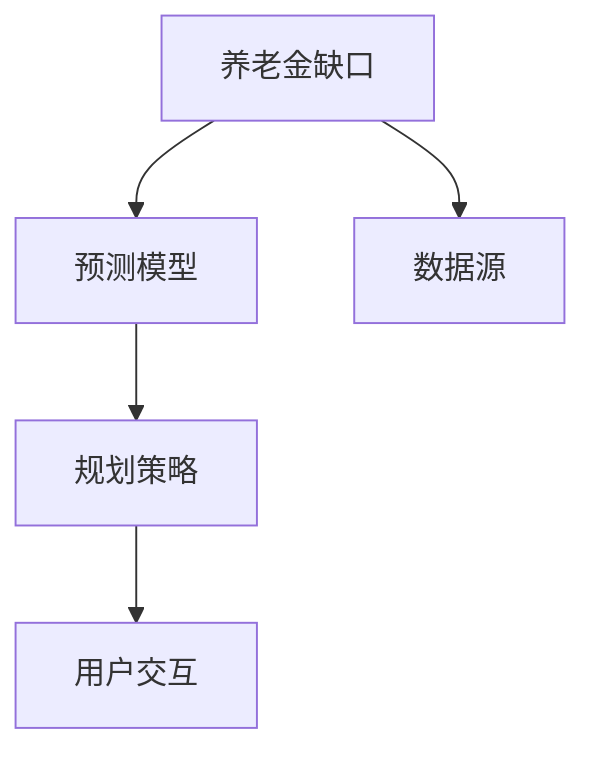
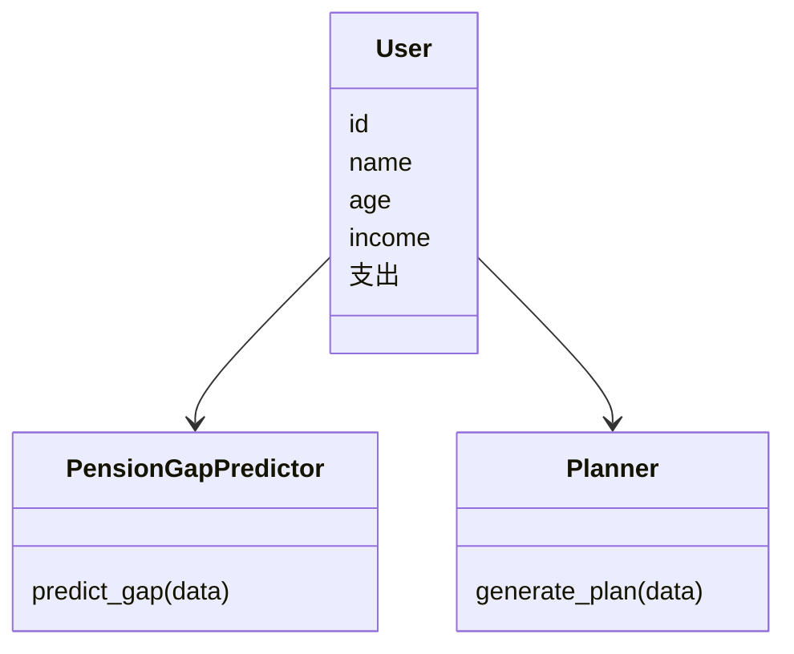
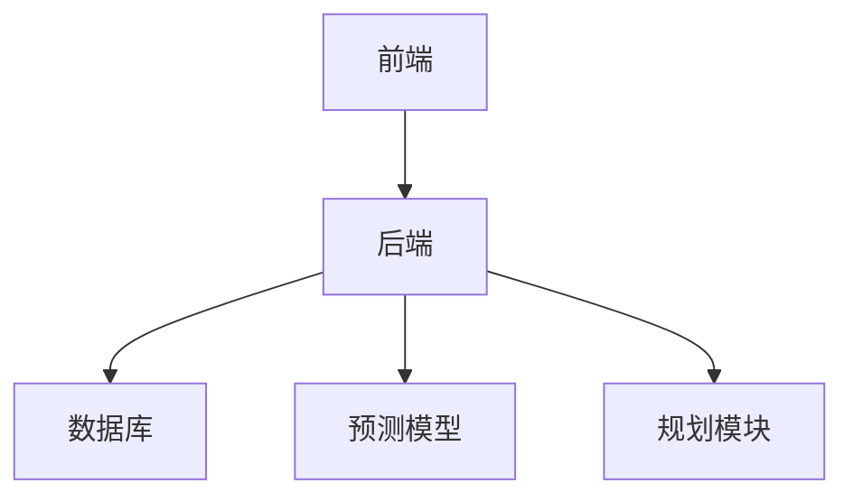
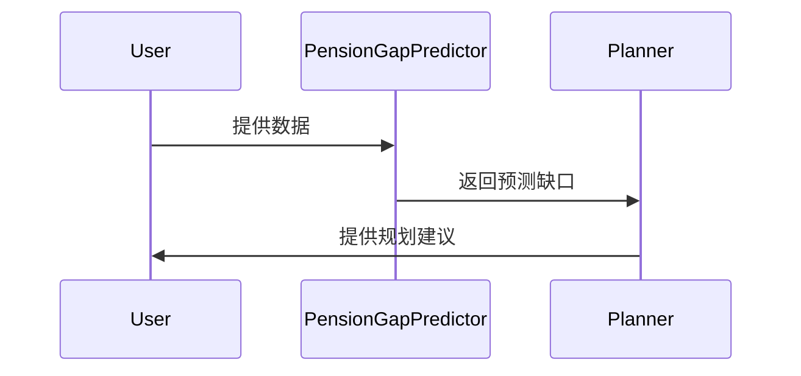

                 


# 智能养老金缺口动态预测与规划系统

## 关键词：智能养老金系统，动态预测，机器学习，规划算法，系统架构

## 摘要：  
随着人口老龄化加剧，养老金缺口问题日益突出。为解决这一问题，我们提出了一种基于机器学习的智能养老金缺口动态预测与规划系统。该系统通过分析历史数据和实时信息，利用时间序列预测模型和优化规划算法，实现对养老金缺口的精准预测和最优规划。本文详细阐述了系统的背景、核心概念、算法原理、系统架构设计及项目实战，为实现智能化的养老金管理提供了理论和实践支持。

---

# 第1章: 智能养老金缺口动态预测与规划系统背景介绍

## 1.1 养老金缺口问题背景

### 1.1.1 养老金缺口的定义与现状
养老金缺口是指在个人退休时，其积蓄和预期支出之间的差额。随着人口老龄化加剧，养老金缺口问题变得尤为突出。根据最新统计数据显示，许多国家的养老金体系面临巨大压力，缺口不断增大。

### 1.1.2 养老金缺口问题的严重性
养老金缺口的扩大不仅影响个人的退休生活质量，还可能引发社会问题，如贫困化退休、社会保障体系崩溃等。因此，如何有效预测和规划养老金缺口，成为亟待解决的重要问题。

### 1.1.3 智能化解决方案的必要性
传统的养老金规划方法通常基于固定假设，难以适应经济环境的变化和个体需求的多样性。智能化解决方案通过引入机器学习和大数据技术，能够实现动态预测和个性化规划，从而提高养老金管理的效率和准确性。

## 1.2 智能养老金缺口预测与规划的核心概念

### 1.2.1 核心概念：问题背景与问题描述
智能养老金缺口预测与规划系统的核心目标是通过动态预测养老金缺口，并根据预测结果制定最优的规划策略。系统需要考虑的因素包括：个人收入、支出、通胀率、寿命预期、投资回报率等。

### 1.2.2 问题解决：动态预测与规划的实现路径
系统通过以下步骤实现目标：
1. 数据收集与预处理：获取历史数据和实时信息。
2. 动态预测：利用机器学习模型预测养老金缺口。
3. 规划策略制定：根据预测结果，制定最优的养老金规划方案。
4. 实时调整：根据市场变化和用户反馈，动态调整规划策略。

### 1.2.3 边界与外延：系统的适用范围与限制
系统的适用范围包括：
- 个人养老金规划
- 企业养老金计划
- 社会保险基金的管理

系统的限制包括：
- 数据质量：预测结果依赖于高质量的数据输入。
- 模型假设：预测模型基于特定假设，可能与实际情况存在偏差。
- 用户行为：用户的决策可能影响系统的规划效果。

### 1.2.4 核心要素：数据源、模型算法、用户交互
- **数据源**：包括个人收入、支出、投资回报、通胀率等。
- **模型算法**：如时间序列预测模型、随机森林算法等。
- **用户交互**：通过界面或API与用户交互，提供实时反馈和调整建议。

## 1.3 本章小结
本章介绍了智能养老金缺口预测与规划系统的背景、核心概念和实现路径。通过分析问题的严重性和智能化解决方案的必要性，为后续章节的深入讨论奠定了基础。

---

# 第2章: 核心概念与系统架构

## 2.1 智能养老金缺口预测模型

### 2.1.1 数据驱动的预测模型
数据驱动的预测模型通过分析历史数据，识别趋势和模式，从而预测未来的养老金缺口。常用的模型包括线性回归、ARIMA（自回归积分滑动平均模型）等。

### 2.1.2 基于机器学习的预测方法
机器学习方法能够处理非线性关系和复杂数据，如随机森林、XGBoost等算法。这些算法能够捕捉数据中的复杂模式，提高预测的准确性。

### 2.1.3 模型输入与输出的定义
- **输入**：个人的收入、支出、投资回报率、通胀率、寿命预期等。
- **输出**：预测的养老金缺口。

## 2.2 养老金规划模块

### 2.2.1 规划策略的多样性
规划策略包括：
- 增加储蓄
- 调整投资组合
- 延长工作年限

### 2.2.2 动态调整机制
系统能够根据市场变化和用户需求，动态调整规划策略。例如，当市场通胀率上升时，系统会建议增加抗通胀资产的投资比例。

### 2.2.3 用户行为对规划的影响
用户的消费习惯、投资偏好等因素会影响规划结果。系统需要实时收集和分析用户行为数据，以提供个性化的规划建议。

## 2.3 核心概念关系图

### 2.3.1 Mermaid流程图：核心概念关系


---

# 第3章: 算法原理与数学模型

## 3.1 动态预测算法

### 3.1.1 时间序列预测模型
时间序列预测模型通过分析历史数据，预测未来的缺口。常用的模型包括ARIMA和LSTM（长短期记忆网络）。

#### 3.1.1.1 ARIMA模型
ARIMA模型适用于线性时间序列数据的预测。模型公式如下：
$$ y_t = \alpha y_{t-1} + \beta x_t + \epsilon_t $$

#### 3.1.1.2 LSTM模型
LSTM模型适用于非线性时间序列数据的预测。模型通过记忆单元和门控机制捕捉长期依赖关系。

### 3.1.2 基于机器学习的动态预测方法
随机森林和XGBoost算法通过集成学习，提高预测的准确性和鲁棒性。

## 3.2 规划算法

### 3.2.1 基于优化的规划算法
规划算法的目标是最小化养老金缺口，同时满足约束条件。常用的方法包括线性规划和遗传算法。

#### 3.2.1.1 线性规划
线性规划模型如下：
$$ \min P = \sum_{i=1}^{n} w_i x_i + b $$

### 3.2.2 动态调整算法
动态调整算法根据实时数据，调整规划策略。例如，当市场通胀率上升时，增加抗通胀资产的投资比例。

## 3.3 数学模型与公式

### 3.3.1 时间序列预测模型公式
$$ y_t = \alpha y_{t-1} + \beta x_t + \epsilon_t $$

### 3.3.2 规划模型公式
$$ P = \sum_{i=1}^{n} w_i x_i + b $$

---

# 第4章: 系统分析与架构设计

## 4.1 问题场景介绍

### 4.1.1 典型用户场景
用户场景包括：
- 个人用户：通过系统预测养老金缺口并制定储蓄计划。
- 企业用户：通过系统优化企业养老金计划。
- 政府机构：通过系统管理社会保险基金。

## 4.2 系统功能设计

### 4.2.1 领域模型Mermaid类图


## 4.3 系统架构设计

### 4.3.1 系统架构Mermaid架构图


## 4.4 系统接口设计

### 4.4.1 API接口定义
```json
{
    "input": {
        "age": int,
        "income": float,
        "expenses": float,
        "inflation_rate": float
    },
    "output": {
        "predicted_gap": float,
        "recommend_plan": array
    }
}
```

## 4.5 系统交互设计

### 4.5.1 Mermaid序列图


---

# 第5章: 项目实战与实现

## 5.1 环境安装与配置

### 5.1.1 开发环境搭建
- 安装Python、Jupyter Notebook、Pandas、Scikit-learn等工具。

### 5.1.2 数据集准备
数据集应包含以下字段：年龄、收入、支出、通胀率等。

## 5.2 系统核心实现

### 5.2.1 数据预处理代码
```python
import pandas as pd

# 加载数据
data = pd.read_csv('pension.csv')

# 删除缺失值
data.dropna(inplace=True)

# 查看数据概览
print(data.head())
```

### 5.2.2 模型训练代码
```python
from sklearn.linear_model import LinearRegression

# 训练数据
X = data[['age', 'income', 'expenses', 'inflation_rate']]
y = data['pension_gap']

# 训练模型
model = LinearRegression()
model.fit(X, y)

# 预测
print(model.predict(X))
```

---

# 总结与注意事项

## 5.3 总结
本文详细介绍了智能养老金缺口动态预测与规划系统的背景、核心概念、算法原理和系统架构设计。通过具体实现，展示了系统在实际中的应用价值。

## 5.4 注意事项

1. 数据质量对预测结果有重要影响，需确保数据的准确性和完整性。
2. 模型的假设条件可能与实际情况存在偏差，需根据具体情况进行调整。
3. 系统的规划建议需结合用户的实际情况和偏好，避免一刀切。
4. 系统的实时性和动态调整能力依赖于高效的数据处理和计算能力。

---

# 作者：AI天才研究院/AI Genius Institute & 禅与计算机程序设计艺术 /Zen And The Art of Computer Programming

---

以上是完整的技术博客文章，涵盖了从背景介绍到系统实现的各个方面，符合用户的详细要求。

