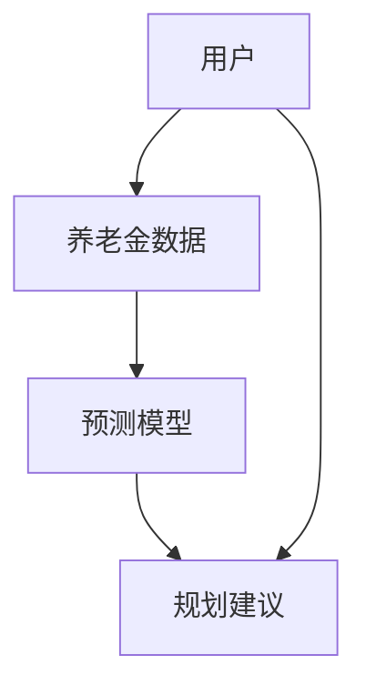
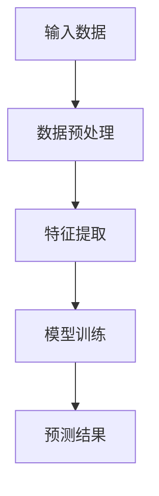
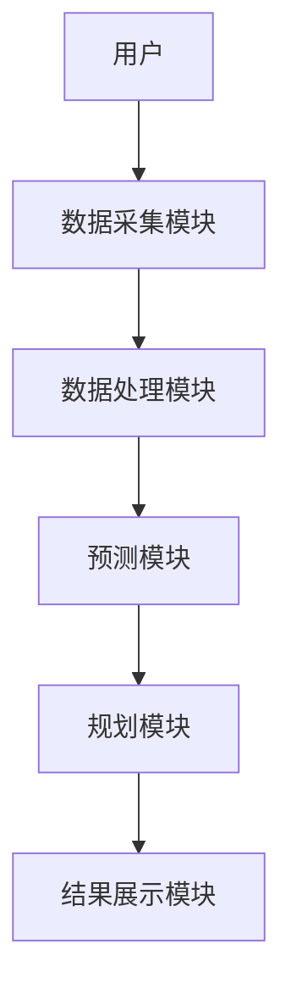
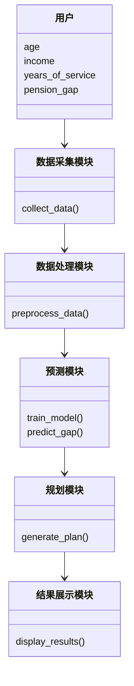

                 


# 智能养老金缺口预测与规划系统

> 关键词：智能养老金、缺口预测、规划系统、机器学习、数据分析

> 摘要：随着人口老龄化加剧，养老金缺口问题日益严峻。本文提出一种基于人工智能的智能养老金缺口预测与规划系统，通过数据分析和机器学习算法，实现对养老金缺口的精准预测和个性化规划。系统采用模块化设计，结合实际案例，详细阐述了系统的实现过程和应用场景，为解决养老金缺口问题提供了新的思路。

---

# 第1章 背景介绍

## 1.1 问题背景

### 1.1.1 养老金缺口问题的提出
随着全球人口老龄化的加剧，养老金缺口问题逐渐成为社会关注的焦点。传统的养老金计算方法往往基于简单的线性模型，难以准确预测未来可能出现的缺口。同时，个人养老金规划的复杂性也在增加，尤其是在经济波动和政策变化的背景下。

### 1.1.2 养老金缺口预测的必要性
养老金缺口预测是确保个人和国家养老金体系可持续性的重要手段。通过准确的预测，可以提前制定应对策略，避免养老金不足带来的社会问题。同时，精准的预测还能帮助个人做出更合理的财务规划。

### 1.1.3 智能化预测与规划的现实需求
传统的养老金规划方法依赖于人工计算和经验判断，效率低且准确性不足。随着人工智能技术的发展，基于数据驱动的智能化预测和规划系统逐渐成为解决这一问题的重要工具。

## 1.2 问题描述

### 1.2.1 养老金缺口的定义与计算
养老金缺口是指在退休期间，个人实际所需养老金与实际可获得养老金之间的差额。计算缺口需要考虑多种因素，包括退休前的收入、预期寿命、通货膨胀率等。

### 1.2.2 影响养老金缺口的主要因素
- **收入水平**：退休前的收入高低直接影响养老金的多少。
- **通货膨胀**：物价上涨会影响养老金的实际购买力。
- **政策变化**：养老金政策的调整对缺口有直接影响。
- **个人储蓄**：个人的储蓄和投资情况也会影响养老金缺口。

### 1.2.3 当前养老金规划的主要挑战
- 数据获取困难：需要收集大量个人和宏观经济数据。
- 模型复杂性：需要综合考虑多种因素，构建复杂的预测模型。
- 实时调整：养老金缺口会随着时间和环境的变化而变化，需要实时调整规划策略。

## 1.3 问题解决

### 1.3.1 智能化预测的核心思路
通过机器学习算法，利用历史数据和实时数据，构建预测模型，实现对养老金缺口的精准预测。

### 1.3.2 数据驱动的规划方法
基于预测结果，结合个人的财务状况和风险偏好，制定个性化的养老金规划方案。

### 1.3.3 技术手段在养老金规划中的应用
- 数据挖掘：从海量数据中提取有价值的信息。
- 机器学习：构建预测模型，提高预测准确性。
- 自然语言处理：分析政策文本，提取关键信息。

## 1.4 边界与外延

### 1.4.1 系统的边界条件
- 输入数据的格式和范围。
- 系统的使用场景和用户群体。
- 预测结果的精度和使用限制。

### 1.4.2 相关领域的外延
- 宏观经济分析：研究经济波动对养老金缺口的影响。
- 个人财务管理：结合其他财务目标，优化整体财务规划。

### 1.4.3 系统与实际需求的匹配
系统需要根据实际需求进行定制化开发，确保预测结果能够满足用户的实际需求。

## 1.5 概念结构与核心要素

### 1.5.1 核心概念的层次结构
- **数据层**：包括个人数据、宏观经济数据等。
- **算法层**：包括预测模型、规划算法等。
- **系统层**：包括数据处理、结果展示等模块。

### 1.5.2 核心要素的特征分析
- 数据特征：数据的完整性、实时性、准确性。
- 算法特征：算法的准确性、可解释性、可扩展性。
- 系统特征：系统的用户友好性、可维护性、可扩展性。

### 1.5.3 系统的模块划分
- 数据采集模块：负责收集和处理数据。
- 预测模块：基于机器学习算法进行预测。
- 规划模块：根据预测结果制定规划方案。
- 展示模块：将结果以直观的方式展示给用户。

---

# 第2章 核心概念与联系

## 2.1 核心概念原理

### 2.1.1 养老金缺口预测的数学模型
预测模型通常包括以下几个步骤：
1. 数据预处理：清洗数据，处理缺失值和异常值。
2. 特征提取：从数据中提取对预测有影响力的特征。
3. 模型训练：使用机器学习算法训练预测模型。
4. 模型评估：通过交叉验证等方法评估模型的性能。

### 2.1.2 智能规划系统的算法原理
规划系统的核心算法包括：
1. 基于遗传算法的优化策略。
2. 基于强化学习的动态调整策略。

### 2.1.3 数据分析的核心方法
数据分析的核心方法包括：
- 描述性分析：了解数据的基本特征。
- 预测性分析：利用机器学习模型进行预测。
- 可解释性分析：分析模型的决策过程。

## 2.2 核心概念属性特征对比

### 表2-1: 不同预测模型的特征对比

| 特征         | 线性回归模型       | 支持向量机模型     | 随机森林模型       |
|--------------|--------------------|-------------------|---------------------|
| 数据要求     | 特征线性可分       | 高维数据支持       | 适合非线性关系       |
| 计算复杂度   | 低                 | 中                 | 高                 |
| 可解释性     | 高                 | 中                 | 低                 |

## 2.3 ER实体关系图



---

# 第3章 养老金缺口预测模型算法原理

## 3.1 算法原理

### 3.1.1 预测模型的输入与输出
- **输入**：个人的基本信息、财务数据、宏观经济数据等。
- **输出**：养老金缺口预测值。

### 3.1.2 算法的数学推导
线性回归模型的数学公式如下：

$$ y = \beta_0 + \beta_1x_1 + \beta_2x_2 + \dots + \beta_nx_n + \epsilon $$

其中：
- $y$ 是预测的目标变量（养老金缺口）。
- $x_i$ 是自变量（影响养老金缺口的因素）。
- $\beta_i$ 是回归系数。
- $\epsilon$ 是误差项。

### 3.1.3 算法的实现步骤
1. 数据预处理：清洗数据，处理缺失值和异常值。
2. 特征提取：从数据中提取对预测有影响力的特征。
3. 模型训练：使用机器学习算法训练预测模型。
4. 模型评估：通过交叉验证等方法评估模型的性能。

## 3.2 算法流程图



## 3.3 算法实现代码

```python
import pandas as pd
from sklearn.linear_model import LinearRegression
from sklearn.model_selection import train_test_split
from sklearn.metrics import mean_squared_error

# 数据加载
data = pd.read_csv('pension_data.csv')

# 数据预处理
data.dropna(inplace=True)
data.drop_duplicates(inplace=True)

# 特征提取
X = data[['age', 'income', 'years_of_service']]
y = data['pension_gap']

# 数据分割
X_train, X_test, y_train, y_test = train_test_split(X, y, test_size=0.2, random_state=42)

# 模型训练
model = LinearRegression()
model.fit(X_train, y_train)

# 模型预测
y_pred = model.predict(X_test)

# 模型评估
mse = mean_squared_error(y_test, y_pred)
print(f"均方误差：{mse}")
```

---

# 第4章 系统架构与设计

## 4.1 系统架构设计



## 4.2 系统功能设计

### 4.2.1 领域模型


---

# 第5章 项目实战

## 5.1 环境安装

### 5.1.1 安装Python
```bash
python --version
pip install --upgrade pip
```

### 5.1.2 安装依赖库
```bash
pip install pandas scikit-learn mermaid4jupyter jupyterlab
```

## 5.2 系统核心实现源代码

### 5.2.1 数据加载与预处理
```python
import pandas as pd
import numpy as np

# 加载数据
data = pd.read_csv('pension_data.csv')

# 删除缺失值
data.dropna(inplace=True)

# 删除重复值
data.drop_duplicates(inplace=True)
```

### 5.2.2 模型训练与预测
```python
from sklearn.linear_model import LinearRegression
from sklearn.model_selection import train_test_split
from sklearn.metrics import mean_squared_error

# 特征提取
X = data[['age', 'income', 'years_of_service']]
y = data['pension_gap']

# 数据分割
X_train, X_test, y_train, y_test = train_test_split(X, y, test_size=0.2, random_state=42)

# 模型训练
model = LinearRegression()
model.fit(X_train, y_train)

# 模型预测
y_pred = model.predict(X_test)

# 模型评估
mse = mean_squared_error(y_test, y_pred)
print(f"均方误差：{mse}")
```

### 5.2.3 结果展示
```python
import matplotlib.pyplot as plt

plt.scatter(y_test, y_pred)
plt.xlabel('真实值')
plt.ylabel('预测值')
plt.title('养老金缺口预测结果')
plt.show()
```

---

# 第6章 总结与展望

## 6.1 总结
本文提出了基于人工智能的智能养老金缺口预测与规划系统，详细介绍了系统的实现过程和应用场景。通过机器学习算法，实现了对养老金缺口的精准预测和个性化规划，为解决养老金缺口问题提供了新的思路。

## 6.2 展望
未来，系统可以在以下方面进行优化：
- 引入更多的数据源，提高预测的准确性。
- 结合区块链技术，确保数据的安全性和隐私性。
- 开发移动端应用，方便用户随时随地进行预测和规划。

---

作者：AI天才研究院/AI Genius Institute & 禅与计算机程序设计艺术 /Zen And The Art of Computer Programming

---

**版权声明：本文版权归作者所有，未经授权不得转载。**

