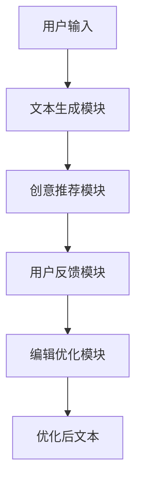
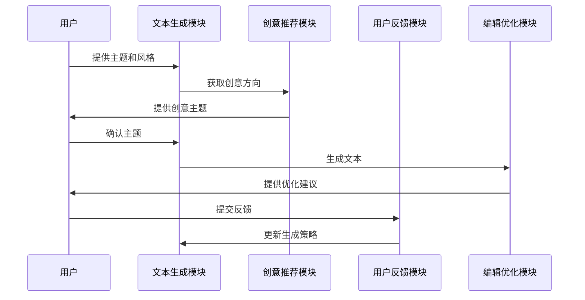

                 


# 智能写作AI Agent：LLM辅助的创意内容生成

> 关键词：智能写作AI Agent，LLM，创意内容生成，自然语言处理，深度学习

> 摘要：本文探讨了如何利用大语言模型（LLM）辅助创意内容生成，介绍智能写作AI Agent的设计与实现。从背景到技术原理，再到系统架构和实战案例，全面解析LLM在智能写作中的应用。

---

## 第一部分: 智能写作AI Agent的背景与核心概念

### 第1章: 智能写作的背景与问题描述

#### 1.1 智能写作的背景
##### 1.1.1 写作面临的挑战
现代写作领域面临效率低下、创意枯竭和个性化需求多样化等挑战。传统写作工具难以应对复杂的内容生成需求，尤其是在创意写作中，如何快速生成高质量的内容成为关键问题。

##### 1.1.2 AI技术在写作中的应用潜力
AI技术，特别是大语言模型（LLM），在自然语言处理（NLP）领域取得了突破性进展。LLM能够理解和生成人类语言，具备强大的文本生成能力，为创意写作提供了新的可能性。

##### 1.1.3 LLM在创意内容生成中的优势
LLM能够根据输入的上下文生成连贯且符合语境的文本，支持多种语言、风格和主题的创作。通过参数微调和提示工程，可以定制化生成符合用户需求的内容。

#### 1.2 问题背景与目标
##### 1.2.1 创意写作的核心问题
创意写作需要解决的问题包括：如何激发创意、保持内容连贯性、满足多样化需求等。

##### 1.2.2 LLM辅助写作的解决方案
利用LLM进行内容生成，通过模型推理和生成能力，辅助作者完成从灵感捕捉到内容完善的过程。

##### 1.2.3 边界与外延
LLM辅助写作的边界包括生成文本的质量、模型的训练数据质量和用户输入的准确性。外延则包括将LLM应用于其他领域的内容生成，如广告文案、技术文档等。

### 第2章: LLM与智能写作的核心概念

#### 2.1 LLM的定义与特点
##### 2.1.1 大语言模型的定义
大语言模型是指基于大量数据训练的深度学习模型，具有强大的语言理解和生成能力。

##### 2.1.2 LLM的核心特点
- **大规模参数**：通常具有数十亿参数，能够捕捉复杂的语言模式。
- **自监督学习**：通过预测任务进行无监督预训练，具备强大的上下文理解能力。
- **多任务能力**：经过多任务训练，能够适应多种语言处理任务。

##### 2.1.3 LLM与传统NLP模型的区别
| 特性                | LLM                         | 传统NLP模型                     |
|---------------------|------------------------------|----------------------------------|
| 参数量              | 大规模（如175B）            | 较小（如100M以下）               |
| 训练数据量          | 极大（数千亿tokens）         | 较小（百万级别）                 |
| 任务适应性          | 强大（支持多种任务）         | 较弱（通常针对单一任务）         |
| 应用场景            | 创意写作、对话生成等         | 词性标注、句法分析等             |

#### 2.2 智能写作AI Agent的概念
##### 2.2.1 智能写作AI Agent的定义
智能写作AI Agent是一种基于LLM的智能辅助工具，能够理解用户的写作需求，并提供实时的内容生成、创意推荐和反馈优化服务。

##### 2.2.2 AI Agent在写作中的角色
AI Agent在写作过程中扮演的角色包括：内容生成器、创意启发者、编辑助手和反馈优化器。

##### 2.2.3 创意内容生成的关键要素
创意内容生成的关键要素包括：主题理解、风格匹配、内容连贯性和创新性。

### 第3章: LLM与智能写作的核心联系

#### 3.1 LLM的原理与写作生成的关系
##### 3.1.1 变压器模型的结构
LLM通常基于Transformer架构，由编码器和解码器组成。编码器负责理解输入，解码器负责生成输出。

##### 3.1.2 注意力机制在写作中的应用
注意力机制能够捕捉输入文本中重要的上下文信息，从而生成更连贯和相关的文本。

##### 3.1.3 LLM在创意写作中的优势
通过LLM，用户可以快速生成高质量的内容，激发创意，并实现个性化定制。

---

## 第二部分: 智能写作AI Agent的算法原理

### 第4章: LLM的训练与推理过程

#### 4.1 Transformer模型的训练流程
##### 4.1.1 模型结构
Transformer模型由编码器和解码器堆叠而成，每个堆层包含多头注意力机制和前馈网络。

##### 4.1.2 训练过程
训练过程包括预训练和微调。预训练阶段使用自监督学习任务（如预测下一个词），微调阶段针对特定任务（如文本生成）进行优化。

#### 4.2 注意力机制的数学模型
注意力机制的核心公式为：
$$
\text{Attention}(Q, K, V) = \text{softmax}\left(\frac{QK^T}{\sqrt{d_k}}\right)V
$$
其中，$Q$、$K$和$V$分别是查询、键和值向量，$d_k$是向量的维度。

#### 4.3 LLM的生成策略
生成策略包括贪心算法和采样法。贪心算法选择概率最高的词，采样法则通过随机选择生成多样化的内容。

---

## 第三部分: 智能写作AI Agent的系统架构

### 第5章: 智能写作AI Agent的系统架构设计

#### 5.1 系统功能模块设计
##### 5.1.1 文本生成模块
负责根据用户输入生成文本内容。

##### 5.1.2 创意推荐模块
基于用户偏好推荐创意方向和主题。

##### 5.1.3 用户反馈模块
收集用户反馈，优化生成效果。

##### 5.1.4 编辑优化模块
提供文本优化建议，如语法检查和风格调整。

#### 5.2 系统架构图


#### 5.3 系统接口设计
主要接口包括：文本生成API、创意推荐API和用户反馈API。

#### 5.4 系统交互流程图


---

## 第四部分: 智能写作AI Agent的项目实战

### 第6章: 智能写作AI Agent的实现

#### 6.1 环境配置
推荐使用Python 3.8及以上版本，安装必要的库如TensorFlow、Keras和Hugging Face Transformers。

#### 6.2 核心代码实现
##### 6.2.1 文本生成函数
```python
def generate_text(model, tokenizer, prompt, max_length=50):
    input_ids = tokenizer.encode(prompt, return_tensors="pt")
    output = model.generate(input_ids, max_length=max_length, do_sample=True, temperature=1.0)
    return tokenizer.decode(output[0], skip_special_tokens=True)
```

##### 6.2.2 创意推荐算法
```python
def recommend_creativity(model, tokenizer, prompt):
    # 通过输入的主题生成多个创意方向
    directions = ["科幻", "悬疑", "爱情"]
    recommendations = []
    for d in directions:
        prompt_with_direction = f"写一个关于{d}的故事开头："
        generated = generate_text(model, tokenizer, prompt_with_direction)
        recommendations.append((d, generated))
    return recommendations
```

#### 6.3 测试与优化
测试生成文本的质量，通过调整模型参数（如temperature）优化生成效果。

#### 6.4 案例分析
案例：生成科幻小说开头。输入主题“科幻”，生成多个开头并选择最优方案。

---

## 第五部分: 最佳实践与注意事项

### 第7章: 最佳实践与技巧

#### 7.1 数据质量的重要性
确保训练数据的多样性和相关性，避免偏见。

#### 7.2 模型调优的技巧
通过微调和提示工程技术优化生成效果。

#### 7.3 用户反馈的处理
建立有效的反馈机制，持续优化生成策略。

### 第8章: 小结与展望

智能写作AI Agent通过LLM技术为创意写作提供了强大的工具支持。未来，随着模型能力的提升，AI Agent将在更多领域发挥重要作用。

---

## 作者信息

作者：AI天才研究院/AI Genius Institute & 禅与计算机程序设计艺术 /Zen And The Art of Computer Programming

---

以上是文章的详细目录结构，涵盖从背景到实践的各个方面，确保内容丰富且逻辑清晰。

