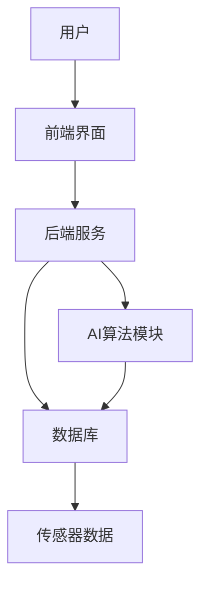

                 


# 智能农业：AI Agent控制的精准灌溉系统

---

## 关键词  
智能农业, AI Agent, 精准灌溉, 人工智能, 农业物联网, 决策优化

---

## 摘要  
本文探讨了智能农业中AI Agent控制的精准灌溉系统的实现与应用。通过结合人工智能技术，AI Agent能够实时分析土壤湿度、气象数据和作物需求，优化灌溉策略，实现水资源的高效利用。文章从背景、原理、算法、系统架构到项目实战，全面解析了AI Agent在精准灌溉中的核心作用，并提供了实际案例和最佳实践。

---

# 第1章: 智能农业与精准灌溉系统背景

## 1.1 智能农业的发展背景  
### 1.1.1 农业现代化与智能化的必要性  
随着全球人口增长和资源短缺，传统农业模式面临水资源浪费、施肥过量和作物产量不稳定等问题。农业现代化和智能化成为解决这些问题的关键。AI技术的应用为农业提供了新的解决方案，尤其是在精准灌溉方面。  

### 1.1.2 精准农业的概念与特点  
精准农业强调根据土壤、气象、作物等实时数据进行个性化管理。其特点包括数据驱动、实时监测和精准决策。  

### 1.1.3 AI技术在农业中的应用前景  
AI技术可以通过数据分析、模式识别和自动化控制，优化农业管理流程，提高作物产量和质量，减少资源浪费。  

## 1.2 精准灌溉系统的核心概念  
### 1.2.1 灌溉系统的传统模式与不足  
传统灌溉系统存在水资源浪费、灌溉时机不当等问题，导致作物生长不均匀，资源利用率低。  

### 1.2.2 精准灌溉的定义与目标  
精准灌溉通过实时监测土壤湿度、气象条件和作物需求，精确控制灌溉时间和水量，实现水资源的高效利用。  

### 1.2.3 AI Agent在精准灌溉中的作用  
AI Agent作为智能决策的核心，能够实时分析数据，优化灌溉策略，实现精准管理。  

---

# 第2章: AI Agent的核心概念与工作原理  

## 2.1 AI Agent的定义与类型  
### 2.1.1 AI Agent的定义  
AI Agent是一种智能体，能够感知环境、自主决策并执行任务。  

### 2.1.2 AI Agent的类型  
AI Agent可以分为简单反射型、基于模型的反应型、目标驱动型和效用驱动型。  

## 2.2 AI Agent在精准灌溉中的工作原理  
### 2.2.1 数据采集与分析  
AI Agent通过传感器获取土壤湿度、气象数据和作物生长状态，进行实时分析。  

### 2.2.2 决策优化  
基于分析结果，AI Agent优化灌溉策略，选择最佳灌溉时间和水量。  

### 2.2.3 执行与反馈  
AI Agent通过执行机构控制灌溉设备，并根据反馈调整决策策略。  

---

# 第3章: 精准灌溉系统的算法原理  

## 3.1 算法核心：决策树、随机森林与神经网络  
### 3.1.1 决策树算法  
决策树是一种基于特征的分类算法，适用于数据分类和决策优化。  

### 3.1.2 随机森林算法  
随机森林通过集成学习提高模型的泛化能力，适用于复杂场景的决策优化。  

### 3.1.3 神经网络算法  
神经网络能够处理非线性关系，适用于复杂的模式识别和预测任务。  

---

# 第4章: 精准灌溉系统的系统架构设计  

## 4.1 系统功能模块设计  
### 4.1.1 数据采集模块  
通过传感器实时采集土壤湿度、气象数据和作物状态。  

### 4.1.2 数据分析模块  
利用AI算法分析数据，生成灌溉策略。  

### 4.1.3 决策控制模块  
根据分析结果，控制灌溉设备执行操作。  

## 4.2 系统架构图  


---

# 第5章: 精准灌溉系统的项目实战  

## 5.1 环境搭建与开发工具安装  
### 5.1.1 Python环境安装  
安装Python和必要的库，如TensorFlow、Scikit-learn和Flask。  

### 5.1.2 传感器与硬件连接  
连接土壤湿度传感器和气象传感器，获取实时数据。  

## 5.2 系统核心代码实现  
### 5.2.1 数据采集代码  
```python
import serial

ser = serial.Serial('COM3', 9600)
data = ser.readline().decode().strip()
print(data)
```

### 5.2.2 AI算法实现  
```python
from sklearn.tree import DecisionTreeClassifier

# 训练数据
X = [[...], [...]]  # 特征数据
y = [..., ...]       # 标签数据

model = DecisionTreeClassifier()
model.fit(X, y)
```

## 5.3 系统运行与测试  
### 5.3.1 系统运行流程  
用户输入灌溉需求，系统分析数据并生成灌溉策略，执行机构启动灌溉设备。  

### 5.3.2 系统测试与优化  
通过实际测试，优化算法模型和系统性能。  

---

# 第6章: 精准灌溉系统的优势与注意事项  

## 6.1 系统优势  
### 6.1.1 节水节能  
通过精准控制减少水资源浪费。  

### 6.1.2 提高作物产量与质量  
优化灌溉策略促进作物生长。  

## 6.2 系统设计注意事项  
### 6.2.1 数据准确性  
确保传感器数据的准确性和实时性。  

### 6.2.2 系统稳定性  
保证系统在复杂环境下的稳定运行。  

---

# 第7章: 总结与展望  

## 7.1 本文总结  
本文详细介绍了AI Agent在精准灌溉系统中的应用，从算法原理到系统架构，再到项目实战，全面解析了其技术实现与优势。  

## 7.2 未来展望  
未来，随着AI技术的进步，精准灌溉系统将更加智能化和自动化，为农业可持续发展提供更有力的支持。  

---

# 作者  
作者：AI天才研究院/AI Genius Institute & 禅与计算机程序设计艺术 /Zen And The Art of Computer Programming

