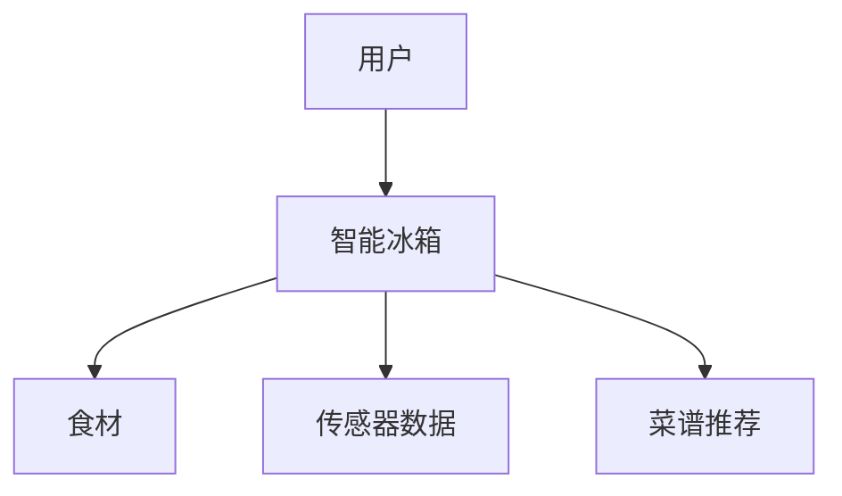
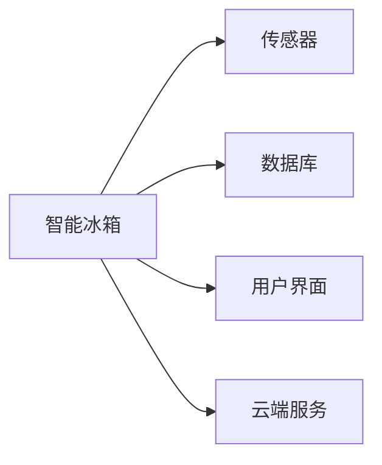

                 


```markdown
# 智能冰箱：AI Agent的食材新鲜度监测与菜谱推荐

> 关键词：智能冰箱，AI Agent，食材新鲜度监测，菜谱推荐，物联网，人工智能

> 摘要：本文探讨了智能冰箱中AI Agent如何实现食材新鲜度监测与菜谱推荐。通过背景介绍、核心概念分析、算法原理讲解、系统架构设计和项目实战，详细阐述了AI Agent在智能冰箱中的应用，以及其对现代智能家居生态的重要意义。

---

## 第一部分: 智能冰箱与AI Agent的背景介绍

### 第1章: 背景与问题背景

#### 1.1 智能冰箱的定义与现状

智能冰箱是一种集成物联网（IoT）和人工智能技术的家用电器，能够通过传感器和AI算法实现食材管理、健康监测和智能推荐等功能。近年来，随着智能家居的普及，智能冰箱逐渐成为家庭中不可或缺的一部分。

#### 1.2 AI Agent的基本概念

AI Agent（人工智能代理）是一种能够感知环境、自主决策并执行任务的智能体。在智能冰箱中，AI Agent主要用于食材管理、用户交互和系统控制。

#### 1.3 食材新鲜度监测与菜谱推荐的背景

食材新鲜度监测是保障食品质量和用户健康的必要手段。传统的冰箱仅提供冷藏和冷冻功能，无法实时监测食材状态。AI Agent的引入，使得智能冰箱能够通过传感器和算法，实时评估食材新鲜度，并为用户提供个性化菜谱推荐。

#### 1.4 本章小结

通过本章的介绍，我们了解了智能冰箱的现状、AI Agent的基本概念以及食材新鲜度监测和菜谱推荐的重要性。

---

## 第二部分: 核心概念与联系

### 第2章: 核心概念与联系

#### 2.1 AI Agent的核心原理

AI Agent通过传感器采集数据，利用机器学习算法分析数据，生成决策并执行操作。在智能冰箱中，AI Agent主要负责食材监测、用户偏好分析和系统控制。

#### 2.2 食材新鲜度监测的技术细节

食材新鲜度监测基于传感器数据，包括温度、湿度、气味等多种指标。通过机器学习模型，AI Agent能够预测食材的最佳使用时间，并提醒用户及时使用或更换。

#### 2.3 菜谱推荐算法的实现原理

菜谱推荐算法基于用户饮食习惯和食材新鲜度，结合历史数据和实时状态，为用户提供个性化推荐。推荐算法包括协同过滤、基于内容的推荐和混合推荐等。

#### 2.4 核心概念对比表格

以下是对AI Agent与传统冰箱功能的对比：

| 功能特性          | 传统冰箱         | AI Agent智能冰箱       |
|-------------------|------------------|------------------------|
| 食材管理          | 无               | 自动监测、提醒         |
| 温度控制          | 手动调节         | 智能调节               |
| 菜谱推荐          | 无               | AI驱动个性化推荐       |

#### 2.5 ER实体关系图



#### 2.6 本章小结

本章详细介绍了AI Agent的核心原理、食材新鲜度监测的技术细节以及菜谱推荐算法的实现原理，并通过对比表格和实体关系图展示了核心概念之间的联系。

---

## 第三部分: 算法原理讲解

### 第3章: AI Agent的算法原理

#### 3.1 数据采集与处理

AI Agent通过传感器采集食材的温度、湿度、重量等数据，并进行预处理和特征提取。

#### 3.2 食材新鲜度监测算法

基于机器学习的食材新鲜度监测算法，例如：

- 线性回归模型：预测食材的保质期。
- 支持向量机（SVM）：分类食材的新鲜状态。

#### 3.3 菜谱推荐算法

基于协同过滤的推荐算法，例如：

- 基于用户的协同过滤（UserCF）。
- 基于物品的协同过滤（ItemCF）。

#### 3.4 实现代码示例

以下是食材新鲜度监测的Python代码示例：

```python
import numpy as np
from sklearn.linear_model import LinearRegression

# 数据预处理
X = np.array([[22, 50], [23, 45], [21, 60]])  # 温度和湿度
y = np.array([85, 80, 90])  # 新鲜度评分

# 训练模型
model = LinearRegression()
model.fit(X, y)

# 预测新鲜度
new_data = np.array([[20, 65]])
predicted_score = model.predict(new_data)
print(predicted_score)
```

#### 3.5 数学公式讲解

线性回归模型的数学公式：

$$ y = \beta_0 + \beta_1 x_1 + \beta_2 x_2 + \epsilon $$

其中，$y$ 是预测的新鲜度评分，$\beta_0$ 是截距，$\beta_1$ 和 $\beta_2$ 是回归系数，$x_1$ 和 $x_2$ 是温度和湿度，$\epsilon$ 是误差项。

#### 3.6 本章小结

本章通过代码示例和数学公式详细讲解了AI Agent的算法原理，包括数据采集、食材监测和菜谱推荐的具体实现方法。

---

## 第四部分: 系统分析与架构设计方案

### 第4章: 系统分析与架构设计

#### 4.1 问题场景介绍

用户在使用智能冰箱时，希望系统能够实时监测食材新鲜度，并根据用户的饮食偏好推荐菜谱。

#### 4.2 系统功能设计

- 食材管理模块：监测食材状态，提醒用户及时使用。
- 菜谱推荐模块：基于食材新鲜度和用户偏好推荐菜谱。

#### 4.3 系统架构设计



#### 4.4 系统接口设计

- 传感器接口：采集温度、湿度等数据。
- 用户界面接口：显示食材状态和推荐菜谱。

#### 4.5 本章小结

本章通过系统架构设计和接口设计，展示了AI Agent在智能冰箱中的整体实现方案。

---

## 第五部分: 项目实战

### 第5章: 项目实战

#### 5.1 环境安装

安装必要的Python库：

```bash
pip install numpy scikit-learn
```

#### 5.2 系统核心实现

以下是菜谱推荐模块的Python代码：

```python
from sklearn.neighbors import NearestNeighbors

# 数据准备
user_data = {
    '用户1': [85, 90, 75],
    '用户2': [80, 85, 90],
    '用户3': [75, 70, 85]
}

# 训练模型
model = NearestNeighbors(n_neighbors=2)
model.fit(user_data.values())

# 推荐菜谱
query = [85, 80, 90]
distances, indices = model.kneighbors([query])
print(indices)
```

#### 5.3 代码解读与分析

上述代码使用了基于用户的协同过滤算法，通过计算用户之间的相似性，推荐相似用户的菜谱。

#### 5.4 实际案例分析

以用户A为例，系统会根据其饮食习惯和食材新鲜度，推荐相应的菜谱。

#### 5.5 本章小结

通过本章的实战，读者可以了解如何在实际项目中应用AI Agent的算法实现食材监测和菜谱推荐。

---

## 第六部分: 最佳实践

### 第6章: 最佳实践

#### 6.1 小结

AI Agent在智能冰箱中的应用不仅提升了用户体验，还为智能家居的发展提供了新的方向。

#### 6.2 注意事项

- 数据隐私保护
- 系统稳定性保障

#### 6.3 拓展阅读

建议读者进一步学习机器学习和物联网技术，深入了解AI Agent在智能家居中的其他应用。

#### 6.4 本章小结

本章总结了AI Agent在智能冰箱中的应用，并提出了未来的发展方向。

---

## 结语

通过本文的详细介绍，我们了解了AI Agent在智能冰箱中的重要应用，包括食材新鲜度监测和菜谱推荐。希望本文能够为读者提供有价值的参考，进一步推动智能冰箱的技术发展。

---

## 作者：AI天才研究院 & 禅与计算机程序设计艺术
```

