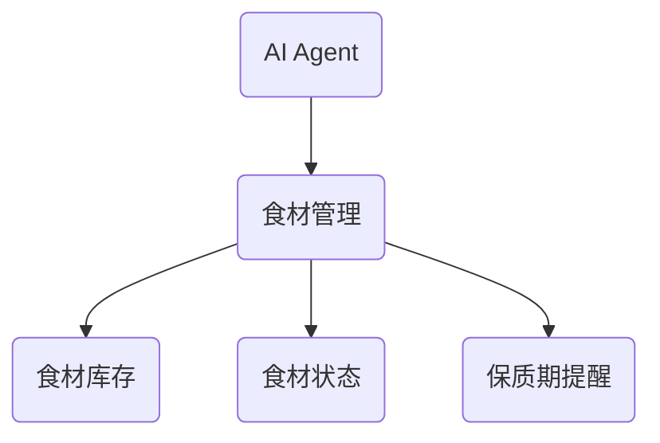
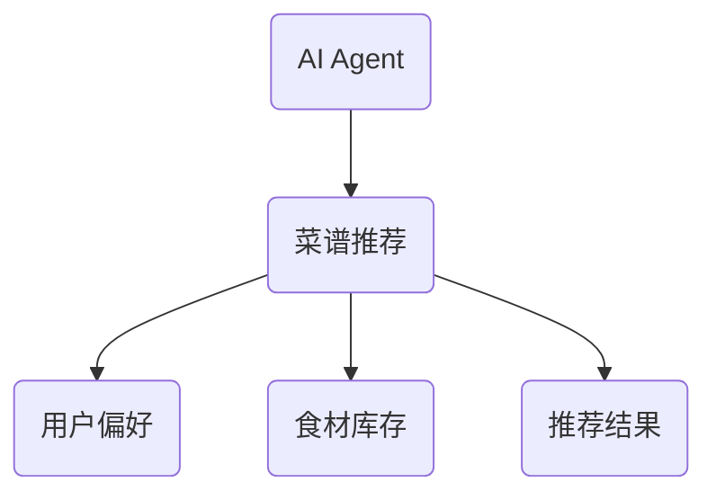
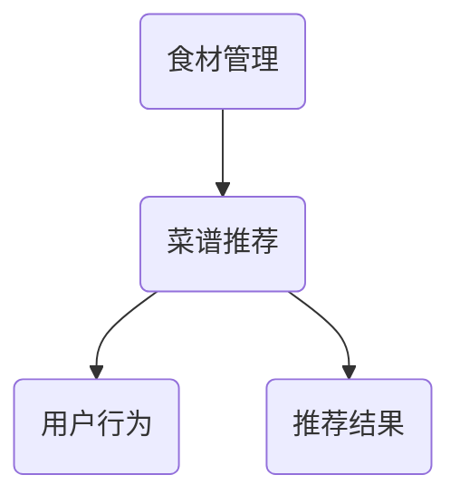
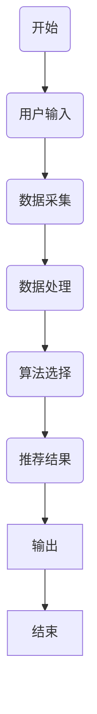
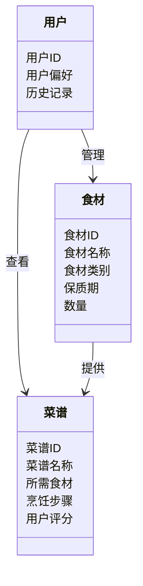
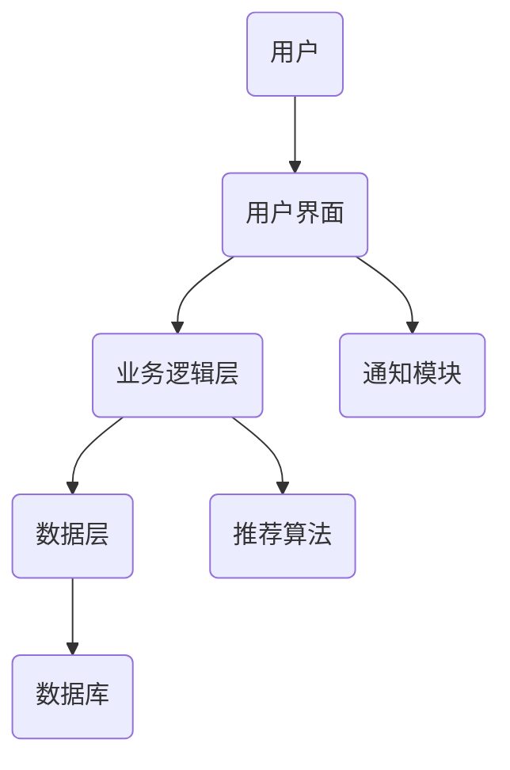
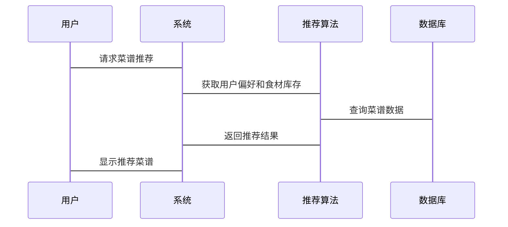

                 


# 智能冰箱：AI Agent的食材管理与菜谱推荐

> 关键词：AI Agent, 智能冰箱, 食材管理, 菜谱推荐, AI技术

> 摘要：本文探讨了智能冰箱中AI Agent在食材管理与菜谱推荐中的应用，分析了其核心概念、算法原理、系统架构，并通过实际案例展示了如何利用AI技术提升食材管理效率和菜谱推荐的精准度。

---

# 第一部分: 智能冰箱与AI Agent的背景介绍

## 第1章: 智能冰箱与AI Agent概述

### 1.1 智能冰箱的定义与现状

#### 1.1.1 智能冰箱的定义
智能冰箱是一种结合了物联网（IoT）和人工智能（AI）技术的家用电器。它能够通过传感器、摄像头等设备采集食材信息，并利用AI算法进行数据分析和处理，为用户提供智能化的服务，如食材管理、菜谱推荐、食品保质期提醒等。

#### 1.1.2 当前智能冰箱的发展现状
近年来，随着智能家居的普及和技术的进步，智能冰箱市场呈现快速增长态势。市场上主流的智能冰箱品牌纷纷推出了带有AI功能的产品，支持食材识别、语音交互、远程控制等功能。然而，尽管技术发展迅速，智能冰箱在食材管理和菜谱推荐方面仍存在一些不足，例如推荐算法的精准度、用户隐私保护等问题。

#### 1.1.3 智能冰箱的功能与应用场景
智能冰箱的主要功能包括：
- 食材信息采集与管理
- 食材保质期提醒
- 基于食材的菜谱推荐
- 用户偏好分析
- 远程控制与购物清单生成

应用场景：
- 家庭厨房：帮助用户更好地管理食材，避免浪费，提升烹饪效率。
- 商业厨房：通过智能化管理优化库存，降低运营成本。
- 物流与供应链：通过智能冰箱的数据支持，优化食材配送流程。

### 1.2 AI Agent的基本概念

#### 1.2.1 什么是AI Agent
AI Agent（人工智能代理）是指能够感知环境、自主决策并执行任务的智能实体。它可以是一个软件程序，也可以是一个硬件设备，通过传感器和执行器与物理世界交互。AI Agent的核心特征包括自主性、反应性、目标导向性和社会能力。

#### 1.2.2 AI Agent的核心特点
- **自主性**：能够在没有外部干预的情况下自主完成任务。
- **反应性**：能够实时感知环境变化并做出相应的反应。
- **目标导向性**：通过设定目标来指导行为和决策。
- **社会能力**：能够与其他AI Agent或人类进行有效交互与协作。

#### 1.2.3 AI Agent与传统AI的区别
与传统AI相比，AI Agent更加注重与环境的交互和动态适应能力。传统AI通常是在静态环境下进行数据分析和处理，而AI Agent则需要在动态复杂的环境中实时感知和决策。

### 1.3 食材管理与菜谱推荐的背景

#### 1.3.1 食材管理的重要性
食材管理是家庭厨房和商业厨房的重要环节。有效的食材管理能够减少浪费、降低成本、提高烹饪效率。然而，传统的人工管理模式效率低下，容易出现食材过期、库存积压等问题。因此，引入智能技术和AI Agent进行食材管理成为一种趋势。

#### 1.3.2 菜谱推荐的需求背景
现代消费者越来越注重饮食的多样性和健康性，用户希望根据现有的食材获得个性化的菜谱推荐。传统的菜谱推荐系统通常基于固定的数据库，难以根据用户的实际食材库存进行动态调整。因此，结合智能冰箱和AI Agent的菜谱推荐系统具有重要的现实意义。

#### 1.3.3 智能冰箱在食材管理与菜谱推荐中的作用
智能冰箱通过AI Agent技术，能够实时采集食材信息，并结合用户的饮食偏好，提供个性化的菜谱推荐。同时，它还能根据食材的保质期和存储状态，提醒用户及时使用或补充食材，从而实现智能化的食材管理。

### 1.4 本章小结
本章主要介绍了智能冰箱和AI Agent的基本概念、发展现状及其在食材管理和菜谱推荐中的作用。通过了解这些背景知识，读者可以更好地理解后续章节的技术细节和实现方案。

---

# 第二部分: 智能冰箱AI Agent的核心概念与联系

## 第2章: AI Agent的核心概念与原理

### 2.1 AI Agent的工作原理

#### 2.1.1 感知层：数据采集与处理
AI Agent通过传感器、摄像头等设备采集环境数据，并利用自然语言处理（NLP）和计算机视觉（CV）技术对数据进行分析和处理。例如，智能冰箱可以通过摄像头识别食材种类和数量，通过温湿度传感器监测食材的存储状态。

#### 2.1.2 计划层：任务规划与决策
在感知到环境数据后，AI Agent需要根据任务目标（如“推荐菜谱”）进行任务规划和决策。这通常涉及多目标优化算法，例如优先处理保质期较短的食材，或者根据用户的饮食偏好优先推荐特定类型的菜谱。

#### 2.1.3 执行层：动作执行与反馈
AI Agent根据决策结果执行具体动作，例如向用户发送菜谱推荐信息，或者通过智能家居系统触发购物清单生成。同时，AI Agent会根据用户的反馈不断优化自身的算法模型。

### 2.2 食材管理的核心要素

#### 2.2.1 食材信息的采集与存储
智能冰箱通过传感器和摄像头采集食材的种类、数量、保质期等信息，并将其存储在本地数据库或云端。这些数据通常以结构化的形式存储，例如：
- 食材ID：唯一标识每种食材
- 食材名称：食材的具体名称
- 食材类别：如蔬菜、肉类、乳制品等
- 食材数量：当前库存数量
- 保质期：食材的购买日期和保质期

#### 2.2.2 食材状态的分析与预测
AI Agent通过对食材的存储状态进行分析，预测其是否新鲜、是否需要冷藏或冷冻等。例如，通过图像识别技术检测食材的颜色变化，判断其新鲜度；通过时间戳计算食材的剩余保质期。

#### 2.2.3 食材库存的动态管理
智能冰箱需要实时更新食材库存信息，并根据用户的使用情况动态调整库存管理策略。例如，当某种食材的库存量低于预设阈值时，系统会自动添加到购物清单中。

### 2.3 菜谱推荐的机制与流程

#### 2.3.1 基于用户偏好的推荐
AI Agent可以通过分析用户的饮食记录、偏好和健康状况，推荐符合用户口味的菜谱。例如，如果用户经常搜索素食菜谱，系统会优先推荐 vegetarian 类型的菜谱。

#### 2.3.2 基于食材库存的推荐
系统根据用户当前的食材库存，推荐可以使用现有食材的菜谱。例如，当用户有鸡胸肉、胡萝卜和西兰花时，系统可能会推荐“鸡胸肉沙拉”或“胡萝卜西兰花炒菜”等菜谱。

#### 2.3.3 混合推荐模型的设计
为了提高推荐的准确性和用户体验，通常采用混合推荐模型，结合用户偏好和食材库存信息进行推荐。例如，协同过滤算法结合内容推荐算法。

### 2.4 AI Agent在食材管理与菜谱推荐中的关系

#### 2.4.1 食材管理与菜谱推荐的协同作用
食材管理为菜谱推荐提供数据支持，而菜谱推荐则帮助用户更好地利用食材，两者相辅相成。

#### 2.4.2 AI Agent在食材管理与菜谱推荐中的桥梁作用
AI Agent作为连接食材管理与菜谱推荐的桥梁，负责数据的采集、处理和分析，并根据分析结果生成推荐信息。

#### 2.4.3 系统整体架构的优化与整合
通过优化AI Agent的算法和系统架构，可以实现食材管理与菜谱推荐的高效协同，提升系统的整体性能和用户体验。

---

## 第3章: 核心概念与联系的实体关系图

### 3.1 AI Agent与食材管理的实体关系


### 3.2 AI Agent与菜谱推荐的实体关系


### 3.3 食材管理与菜谱推荐的实体关系


---

通过以上章节的逐步分析，我们已经详细介绍了智能冰箱AI Agent的核心概念、工作原理及其在食材管理与菜谱推荐中的应用。接下来，我们将深入探讨推荐算法的原理与实现，以及系统架构的设计与优化。

---

## 第三部分: 推荐算法的原理与实现

## 第3章: 推荐算法的原理与实现

### 3.1 推荐算法的原理

#### 3.1.1 协同过滤算法
协同过滤是一种基于用户行为数据的推荐算法，主要分为基于用户的协同过滤和基于物品的协同过滤。

##### 基于用户的协同过滤
- 基于用户的历史行为（如购买记录、评分）找到与当前用户相似的用户群体，推荐这些用户喜欢的物品。

##### 基于物品的协同过滤
- 基于物品的特征（如类别、属性）找到与当前物品相似的物品，推荐给当前用户。

#### 3.1.2 基于内容的推荐算法
基于内容的推荐算法通过分析物品本身的特征（如食材的营养成分、菜谱的分类）进行推荐。

#### 3.1.3 混合推荐模型
为了提高推荐的准确性和多样性，通常将协同过滤和基于内容的推荐算法结合起来，形成混合推荐模型。

### 3.2 推荐算法的流程图


### 3.3 推荐算法的数学模型与公式

#### 3.3.1 协同过滤的数学模型
协同过滤通常基于用户-物品矩阵（User-Item Matrix）进行计算。矩阵中每个元素表示用户对物品的评分或偏好。

##### 用户-物品矩阵的构建
$$
U \times I \text{ 矩阵，其中 } U \text{ 是用户数量，} I \text{ 是物品数量}
$$

##### 协同过滤的计算公式
$$
\text{相似度}(u, i) = \frac{\sum_{k} r_{uk} r_{ik}}{\sqrt{\sum_{k} r_{uk}^2} \sqrt{\sum_{k} r_{ik}^2}}}
$$

其中：
- \( u \) 是当前用户
- \( i \) 是相似用户
- \( r_{uk} \) 表示用户 \( u \) 对物品 \( k \) 的评分
- \( r_{ik} \) 表示用户 \( i \) 对物品 \( k \) 的评分

#### 3.3.2 混合推荐模型的实现
混合推荐模型通常结合协同过滤和基于内容的推荐算法，通过加权的方式生成最终的推荐结果。

$$
\text{最终评分} = \alpha \times \text{协同过滤评分} + (1-\alpha) \times \text{基于内容的评分}
$$

其中：
- \( \alpha \) 是协同过滤的权重，通常通过交叉验证确定。

### 3.4 推荐算法的实现代码

#### 3.4.1 协同过滤算法实现
```python
import numpy as np

def collaborative_filtering(user_item_matrix, user_id, item_id):
    # 计算用户之间的相似度
    user_similarities = np.zeros_like(user_item_matrix)
    for u in range(user_item_matrix.shape[0]):
        for v in range(user_item_matrix.shape[0]):
            if u != v:
                numerator = np.sum(user_item_matrix[u] * user_item_matrix[v])
                denominator = np.sqrt(np.sum(user_item_matrix[u]**2)) * np.sqrt(np.sum(user_item_matrix[v]**2))
                if denominator != 0:
                    user_similarities[u, v] = numerator / denominator
                else:
                    user_similarities[u, v] = 0
    # 推荐物品
    recommendations = np.zeros(user_item_matrix.shape[1])
    for i in range(user_item_matrix.shape[1]):
        if user_item_matrix[user_id, i] == 0:
            weighted_sum = 0
            count = 0
            for v in range(user_item_matrix.shape[0]):
                if user_item_matrix[v, i] > 0:
                    weighted_sum += user_similarities[user_id, v] * user_item_matrix[v, i]
                    count += 1
            if count != 0:
                recommendations[i] = weighted_sum / count
    return recommendations[item_id]
```

#### 3.4.2 基于内容的推荐算法实现
```python
from sklearn.feature_extraction.text import TfidfVectorizer

def content_based_recommendation(items, item_features, target_item):
    vectorizer = TfidfVectorizer()
    tfidf = vectorizer.fit_transform(item_features)
    target_vector = tfidf[target_item]
    similarities = np.dot(tfidf, target_vector.T)
    sorted_indices = np.argsort(similarities, axis=0)[::-1]
    return [items[i] for i in sorted_indices]
```

### 3.5 算法实现的注意事项

#### 3.5.1 数据预处理
- 数据清洗：去除无效数据和异常值。
- 特征提取：从原始数据中提取有用的特征，例如食材的营养成分、菜谱的分类标签。

#### 3.5.2 模型训练与优化
- 参数调整：通过交叉验证调整模型的参数，例如协同过滤中的相似度计算方式。
- 模型评估：使用准确率、召回率、F1分数等指标评估推荐算法的性能。

#### 3.5.3 性能优化
- 并行计算：利用多线程或分布式计算加速模型训练和预测。
- 数据压缩：通过降维技术（如主成分分析）减少数据维度，降低计算复杂度。

---

## 第4章: 数学模型与公式

### 4.1 推荐系统的数学模型

#### 4.1.1 用户-物品矩阵
用户-物品矩阵是推荐系统的核心数据结构，表示用户对物品的偏好。矩阵中的每个元素表示用户 \( u \) 对物品 \( i \) 的评分或偏好。

$$
U \times I \text{ 矩阵，其中 } U \text{ 是用户数量，} I \text{ 是物品数量}
$$

#### 4.1.2 协同过滤的数学公式
协同过滤算法的核心是计算用户之间的相似度或物品之间的相似度。以下是基于用户的协同过滤公式：

$$
\text{相似度}(u, v) = \frac{\sum_{i} r_{ui} r_{vi}}{\sqrt{\sum_{i} r_{ui}^2} \sqrt{\sum_{i} r_{vi}^2}}}
$$

其中：
- \( u \) 和 \( v \) 是两个不同的用户。
- \( r_{ui} \) 表示用户 \( u \) 对物品 \( i \) 的评分。
- \( r_{vi} \) 表示用户 \( v \) 对物品 \( i \) 的评分。

#### 4.1.3 混合推荐模型
混合推荐模型结合了协同过滤和基于内容的推荐算法，通过加权的方式生成最终的推荐结果。

$$
\text{最终评分} = \alpha \times \text{协同过滤评分} + (1-\alpha) \times \text{基于内容的评分}
$$

其中：
- \( \alpha \) 是协同过滤的权重，通常通过交叉验证确定。

---

## 第5章: 系统分析与架构设计方案

### 5.1 问题场景介绍

#### 5.1.1 需求分析
用户需求：
- 实时监控食材库存
- 动态菜谱推荐
- 个性化饮食建议

系统需求：
- 高效的数据采集与处理能力
- 精准的推荐算法
- 用户友好的交互界面

#### 5.1.2 项目介绍
本项目旨在开发一个基于智能冰箱的AI Agent系统，实现食材管理和菜谱推荐功能。系统将结合物联网技术和机器学习算法，为用户提供智能化的饮食解决方案。

### 5.2 系统功能设计

#### 5.2.1 领域模型


#### 5.2.2 系统架构设计


#### 5.2.3 系统接口设计
系统主要接口包括：
- 食材信息查询接口
- 菜谱推荐接口
- 用户偏好设置接口
- 通知推送接口

#### 5.2.4 系统交互流程图


### 5.3 项目实战

#### 5.3.1 环境搭建
- 安装Python和相关库（如numpy、scikit-learn、flask）
- 安装智能冰箱设备（或使用模拟数据）
- 设置数据库（如MySQL或MongoDB）

#### 5.3.2 核心代码实现

##### 数据采集模块
```python
import sqlite3
import time

def insert_food_info(food_name, quantity, expiry_date):
    conn = sqlite3.connect('food.db')
    cursor = conn.cursor()
    cursor.execute('''
        INSERT INTO foods (name, quantity, expiry_date)
        VALUES (?, ?, ?)
    ''', (food_name, quantity, expiry_date))
    conn.commit()
    conn.close()

def get_food_info():
    conn = sqlite3.connect('food.db')
    cursor = conn.cursor()
    cursor.execute('SELECT * FROM foods')
    rows = cursor.fetchall()
    conn.close()
    return rows
```

##### 推荐算法模块
```python
from sklearn.metrics.pairwise import cosine_similarity

def collaborative_filtering(user_item_matrix, user_id, item_id):
    user_matrix = user_item_matrix[user_id]
    item_matrix = user_item_matrix.T[item_id]
    similarity = cosine_similarity([user_matrix], [item_matrix])
    return similarity[0][0]
```

##### 用户界面模块
```python
from flask import Flask, render_template, request

app = Flask(__name__)

@app.route('/')
def index():
    return render_template('index.html')

@app.route('/recommend', methods=['POST'])
def recommend():
    food = request.form['food']
    quantity = int(request.form['quantity'])
    insert_food_info(food, quantity, time.strftime('%Y-%m-%d'))
    return '推荐菜谱：' + get_recommendation(food, quantity)
```

### 5.4 最佳实践与注意事项

#### 5.4.1 数据隐私保护
- 加密存储用户数据
- 遵守数据保护法规（如GDPR）

#### 5.4.2 系统性能优化
- 使用缓存技术减少数据库访问次数
- 并行化推荐算法的计算过程

#### 5.4.3 用户体验提升
- 提供个性化的界面布局
- 支持多语言和多种交互方式（如语音控制）

---

## 第六部分: 总结与展望

### 6.1 本章小结
通过本文的介绍，我们详细探讨了智能冰箱AI Agent在食材管理和菜谱推荐中的应用。从核心概念到算法实现，从系统架构到项目实战，我们全面解析了这一领域的技术细节和实现方案。

### 6.2 未来研究方向
未来的研究方向包括：
- 更精准的推荐算法：如深度学习模型的应用
- 更高效的系统架构：如边缘计算和雾计算的结合
- 更广泛的应用场景：如健康饮食管理、食材供应链优化

### 6.3 注意事项
- 数据隐私保护是未来发展的重要方向
- 系统的可扩展性和可维护性需要进一步优化
- 用户教育和培训也是推广智能冰箱的重要环节

### 6.4 拓展阅读
- 推荐阅读《推荐系统导论》
- 关注相关技术博客和论文，了解最新研究进展

---

## 作者

作者：AI天才研究院/AI Genius Institute & 禅与计算机程序设计艺术 /Zen And The Art of Computer Programming

---

通过以上章节的详细阐述，我们希望能够为读者提供一个全面而深入的技术博客，帮助读者理解智能冰箱AI Agent的食材管理与菜谱推荐的实现原理和应用前景。

