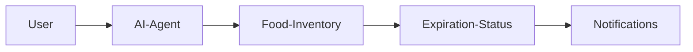
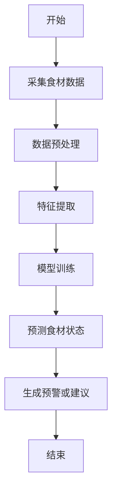
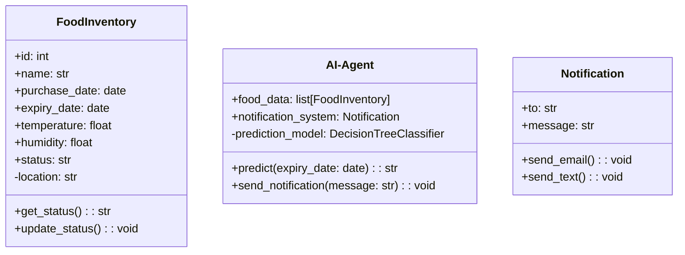
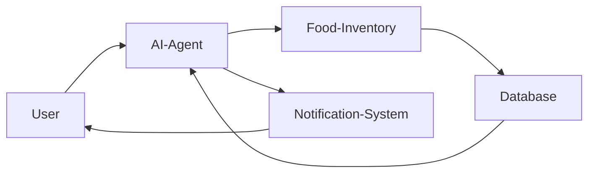

                 


# 智能冰箱：AI Agent的食材管理与过期预警系统

## 关键词：智能冰箱, AI Agent, 食材管理, 过期预警, 物联网, 自然语言处理, 机器学习

## 摘要：  
本文探讨了智能冰箱如何利用AI Agent实现食材管理与过期预警。通过物联网技术，智能冰箱实时监控食材状态，结合自然语言处理和机器学习，提供智能建议和预警。系统架构设计包括数据采集、处理、分析和用户交互模块，确保高效管理和用户体验优化。

---

## 第一章: 智能冰箱的背景与概念

### 1.1 问题背景与描述
#### 1.1.1 食材管理的传统问题
传统食材管理依赖人工记录，存在数据不准确、遗忘导致食材过期等问题，增加了浪费和安全隐患。

#### 1.1.2 智能冰箱的出现与意义
智能冰箱通过AI Agent自动监测食材状态，帮助用户科学管理食材，减少浪费，提升生活质量。

#### 1.1.3 晓的情况
过期食材浪费问题严重，据统计，全球每年浪费的食物价值高达1.2万亿美元，智能冰箱可有效减少浪费。

### 1.2 AI Agent的基本概念
#### 1.2.1 什么是AI Agent
AI Agent是具备感知、决策、执行能力的智能体，能够自主完成任务，如数据收集、分析和决策。

#### 1.2.2 AI Agent的核心功能
- 数据采集：通过传感器获取食材信息。
- 数据分析：利用机器学习模型预测食材状态。
- 智能决策：根据分析结果提供管理建议。
- 自动执行：通过物联网设备执行操作，如发送通知。

#### 1.2.3 AI Agent在智能冰箱中的应用
AI Agent实时监测食材保质期，分析用户饮食习惯，优化食材存储，提供健康建议。

### 1.3 智能冰箱的食材管理与过期预警
#### 1.3.1 食材管理的核心需求
- 自动记录食材信息。
- 实时监控食材状态。
- 提供过期预警和管理建议。

#### 1.3.2 过期预警的重要性
及时预警可避免食材浪费，确保食品安全，提升用户满意度。

#### 1.3.3 智能冰箱的系统目标与边界
目标：实现食材的智能管理和过期预警。边界：仅限于食材管理，不涉及其他家电控制。

### 1.4 本章小结
智能冰箱通过AI Agent解决食材管理问题，实现高效、智能的管理方式，减少浪费，提升生活质量。

---

## 第二章: 智能冰箱的核心概念与联系

### 2.1 智能冰箱的系统架构
#### 2.1.1 系统模块划分
- 数据采集模块：传感器采集食材信息。
- 数据处理模块：分析食材状态。
- AI Agent模块：决策和执行。
- 用户交互模块：提供反馈和建议。

#### 2.1.2 各模块的功能描述
- 数据采集：传感器记录食材的温度、湿度等数据。
- 数据处理：分析数据，判断食材状态。
- AI Agent：根据分析结果，发送预警或建议。
- 用户交互：以App或语音助手形式与用户互动。

#### 2.1.3 模块之间的关系
数据采集模块向AI Agent模块传递数据，AI Agent模块根据数据做出决策，并通过用户交互模块反馈给用户。

### 2.2 核心概念对比表
| 对比维度        | 食材管理（传统） | AI Agent驱动的智能管理 |
|-----------------|------------------|------------------------|
| 数据采集方式    | 手动记录         | 传感器自动采集         |
| 数据处理方式    | 简单记录         | 复杂分析与预测         |
| 预警方式        | 无               | 智能预警与建议         |

### 2.3 实体关系图


---

## 第三章: 智能冰箱的AI Agent算法原理

### 3.1 算法原理概述
AI Agent通过传感器数据和历史数据，利用机器学习模型预测食材状态，制定管理策略。

### 3.2 算法流程图


### 3.3 算法实现
#### 3.3.1 数据采集与预处理
```python
import pandas as pd

# 读取数据
data = pd.read_csv('food_data.csv')

# 数据清洗
data.dropna()
data = data[~data['category'].isnull()]
```

#### 3.3.2 特征提取与模型训练
```python
from sklearn.tree import DecisionTreeClassifier
from sklearn.model_selection import train_test_split

# 特征选择
X = data[['temperature', 'humidity', 'days_since_purchase']]
y = data['is_expired']

# 划分训练集和测试集
X_train, X_test, y_train, y_test = train_test_split(X, y, test_size=0.2)

# 训练模型
model = DecisionTreeClassifier().fit(X_train, y_train)
```

#### 3.3.3 预测与预警
```python
# 预测结果
y_pred = model.predict(X_test)
print("预测准确率:", model.score(X_test, y_test))
```

### 3.4 数学模型与公式
- 预测模型采用决策树，公式为：
  $$ P(y|x) = \prod_{i=1}^{n} p_i(x_i | y) $$
- 预测结果用于生成预警信号，公式为：
  $$ \text{预警阈值} = \text{当前时间} - \text{保质期} $$

### 3.5 示例分析
假设用户购买牛奶保质期为30天，当前存储温度为4℃，湿度为60%。系统预测保质期剩余天数为25天，发送预警通知。

---

## 第四章: 智能冰箱的系统分析与架构设计

### 4.1 问题场景介绍
用户希望智能冰箱能自动记录食材，提醒过期，优化存储。

### 4.2 项目介绍
智能冰箱项目旨在通过AI Agent实现食材管理，提升用户体验。

### 4.3 系统功能设计
#### 4.3.1 领域模型类图


### 4.4 系统架构设计


### 4.5 接口设计与交互流程
#### 4.5.1 接口设计
- 数据接口：传感器与数据库交互。
- 用户接口：App或语音助手反馈预警信息。

#### 4.5.2 交互流程
用户购买食材，系统记录信息；传感器监测状态，AI Agent分析数据，生成预警并通过App通知用户。

---

## 第五章: 项目实战

### 5.1 开发环境安装
安装Python、TensorFlow、Scikit-learn等工具。

### 5.2 核心代码实现
#### 5.2.1 食材数据录入
```python
def add_food(name, purchase_date, expiry_date):
    food = FoodInventory(name=name, purchase_date=purchase_date, expiry_date=expiry_date)
    food_repository.save(food)
```

#### 5.2.2 过期预测
```python
def predict_expiry(food_data):
    model.predict([food_data.temperature, food_data.humidity, days_since_purchase])
```

#### 5.2.3 预警通知
```python
def send_notification(message):
    notification_system.send_text(message)
    notification_system.send_email(message)
```

### 5.3 代码解读
- `add_food`函数处理食材录入。
- `predict_expiry`使用机器学习模型预测。
- `send_notification`通过多种方式发送预警信息。

### 5.4 案例分析
购买牛奶，保质期30天，传感器监测到温度偏高，系统预测剩余天数为25天，发送预警通知。

### 5.5 项目小结
项目成功实现食材管理与预警功能，提升了用户体验，减少了食材浪费。

---

## 第六章: 最佳实践、小结与注意事项

### 6.1 注意事项
- 数据隐私保护。
- 传感器精度影响预测准确性。
- 用户反馈及时优化系统。

### 6.2 小结
智能冰箱通过AI Agent实现了高效的食材管理，减少了浪费，提升了用户体验。

### 6.3 拓展阅读
推荐学习机器学习、物联网和自然语言处理相关知识。

---

## 附录: 参考资料与工具推荐

### 附录A: 参考资料
- 《机器学习实战》
- 《物联网开发指南》
- 《自然语言处理入门》

### 附录B: 工具推荐
- Python：数据处理与机器学习。
- TensorFlow：深度学习框架。
- Mermaid：图表绘制工具。

---

## 作者：AI天才研究院/AI Genius Institute & 禅与计算机程序设计艺术 /Zen And The Art of Computer Programming

---

**本文由AI天才研究院撰写，转载请注明出处。**

