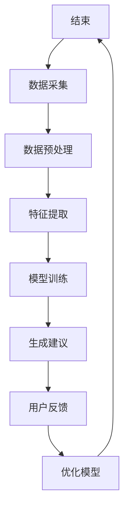
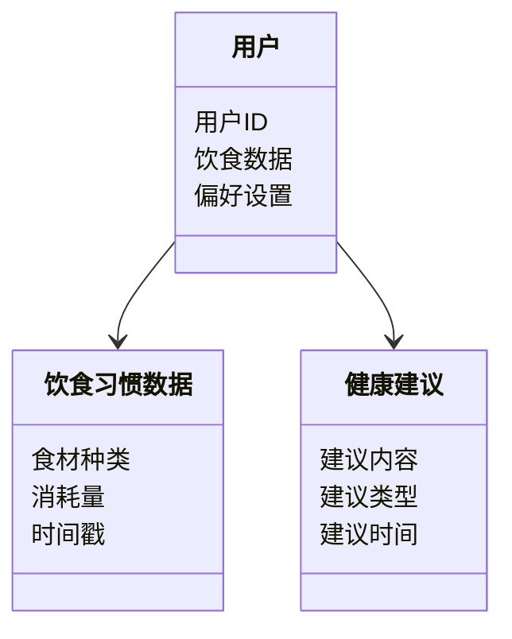
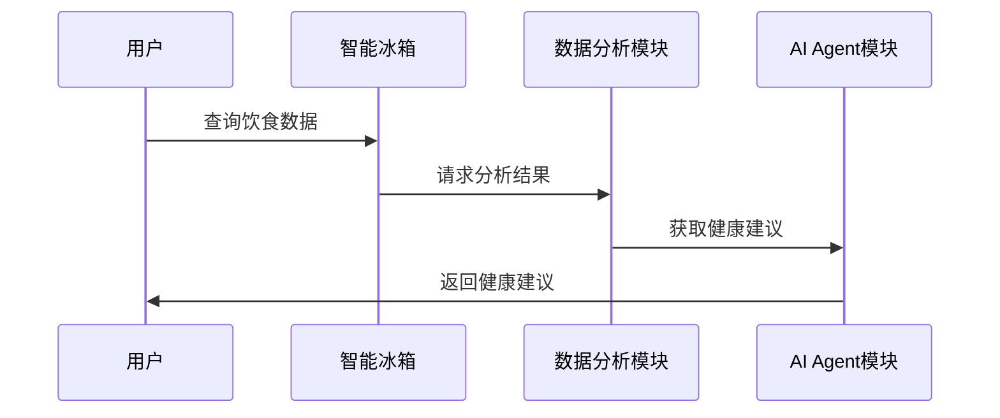

                 


# 智能冰箱：AI Agent的饮食习惯分析与健康建议

> 关键词：智能冰箱，AI Agent，饮食习惯分析，健康建议，数据挖掘，机器学习，物联网

> 摘要：本文深入探讨了AI Agent在智能冰箱中的应用，分析了其如何通过数据采集和机器学习算法来理解用户的饮食习惯，并据此提供个性化的健康建议。文章从背景、原理、算法、系统架构、实战案例到最佳实践进行了全面解析，为读者提供了从理论到实践的完整指南。

---

## 第一部分：背景介绍

### 第1章：背景与问题分析

#### 1.1 问题背景
- **饮食习惯与健康问题**：现代生活方式导致饮食不均衡，慢性疾病频发，改善饮食习惯成为健康的重要突破口。
- **智能冰箱的出现**：物联网技术的发展让冰箱具备了数据采集和智能分析的能力。
- **AI Agent的作用**：AI Agent通过分析冰箱内的食材数据和用户的饮食习惯，提供个性化的健康建议。

#### 1.2 问题描述
- **饮食习惯分析的需求**：用户希望了解自己的饮食结构是否合理，是否存在营养不均衡的问题。
- **健康建议的重要性**：基于个体差异，提供个性化的饮食建议，帮助用户改善健康状况。
- **智能冰箱的数据采集能力**：通过传感器和条码扫描，智能冰箱能够记录用户的食材消耗情况。

#### 1.3 问题解决
- **AI Agent如何分析饮食习惯**：通过数据挖掘和机器学习算法，分析用户的饮食模式，识别潜在的健康风险。
- **AI Agent如何提供健康建议**：结合用户的健康数据和饮食习惯，推荐合理的食材搭配和饮食计划。
- **智能冰箱的用户交互设计**：通过直观的用户界面，将健康建议以可视化的方式呈现给用户。

#### 1.4 边界与外延
- **智能冰箱的功能边界**：仅限于数据分析和建议生成，不涉及实际烹饪或食材采购。
- **AI Agent的应用场景**：主要用于家庭用户的饮食健康管理。
- **饮食习惯分析的范围**：基于用户的食材消耗数据和饮食记录。

#### 1.5 核心概念组成
- **数据采集模块**：负责采集用户的饮食数据，包括食材种类、消耗量等。
- **数据分析模块**：对采集到的数据进行处理和分析，识别用户的饮食习惯。
- **AI Agent模块**：基于分析结果，生成个性化的健康建议。

---

## 第二部分：核心概念与联系

### 第2章：AI Agent与智能冰箱的核心原理

#### 2.1 AI Agent的基本原理
- **AI Agent的定义**：AI Agent是一种能够感知环境、执行任务并做出决策的智能体。
- **AI Agent的核心特征**：自主性、反应性、目标导向和学习能力。
- **AI Agent的分类**：基于智能水平分为简单反射型、基于模型的反应型、目标驱动型和实用驱动型。

#### 2.2 智能冰箱的系统架构
- **硬件部分**：包括传感器、条码扫描器、显示屏等。
- **软件部分**：包括数据采集、分析和建议生成模块。
- **数据交互流程**：从数据采集到分析，再到用户反馈，形成闭环。

#### 2.3 核心概念对比
- **AI Agent与传统算法的区别**：AI Agent具备自主性和学习能力，能够适应复杂环境的变化。
- **智能冰箱与普通冰箱的对比**：智能冰箱具备数据采集和智能分析功能。
- **数据分析与健康建议的关联**：数据分析是健康建议的基础，健康建议是数据分析的结果。

#### 2.4 实体关系图
```mermaid
er
  actor 用户
  actor 健康专家
  actor 食品供应商
  entity 饮食习惯数据
  entity 健康建议
  entity 食品库存
  <--> 用户 - 饮食习惯数据
  <--> 用户 - 健康建议
  <--> 用户 - 食品库存
  <--> 健康专家 - 健康建议
  <--> 食品供应商 - 食品库存
```

---

## 第三部分：算法原理讲解

### 第3章：AI Agent的核心算法

#### 3.1 算法原理概述
- **基于协同过滤的推荐算法**：通过相似用户的饮食习惯，推荐适合当前用户的食材。
- **基于规则的健康建议生成**：根据预设的营养标准，生成个性化的饮食建议。
- **基于机器学习的饮食习惯预测**：利用历史数据，预测用户的未来饮食行为。

#### 3.2 算法流程图


#### 3.3 算法实现
- **协同过滤推荐算法**：
  ```python
  import pandas as pd
  from sklearn.metrics.pairwise import cosine_similarity

  # 数据预处理
  df = pd.read_csv('diet_data.csv')
  user_matrix = df.pivot_table(index='用户ID', columns='食材种类', values='消耗量', fill_value=0)

  # 计算相似度
  similarity = cosine_similarity(user_matrix)
  ```

- **健康建议生成规则**：
  ```python
  def generate_health_recommendation(user_data):
      # 分析用户的营养摄入情况
      if user_data['蛋白质摄入'] < 60:
          return "建议增加蛋白质摄入，如多吃鱼、豆类和瘦肉。"
      elif user_data['碳水化合物摄入'] > 300:
          return "建议减少碳水化合物摄入，选择低GI食物。"
      else:
          return "饮食结构基本合理，继续保持。"
  ```

- **饮食习惯预测模型**：
  ```python
  # 使用逻辑回归模型预测用户是否会改变饮食习惯
  from sklearn.linear_model import LogisticRegression

  model = LogisticRegression()
  model.fit(X_train, y_train)
  ```

#### 3.4 数学模型与公式
- **相似度计算公式**：
  $$\text{相似度} = \frac{\sum x_i y_i}{\sqrt{\sum x_i^2} \sqrt{\sum y_i^2}}$$
- **概率计算公式**：
  $$P(\text{改变饮食习惯}) = \frac{1}{1 + e^{-\beta x}}$$

---

## 第四部分：系统分析与架构设计

### 第4章：系统分析与架构设计

#### 4.1 问题场景介绍
- **用户需求**：用户希望智能冰箱能够分析他们的饮食习惯，并提供个性化的健康建议。
- **系统目标**：通过AI Agent技术，实现用户的饮食习惯分析和健康建议生成。

#### 4.2 项目介绍
- **项目名称**：智能冰箱AI健康助手。
- **项目目标**：帮助用户改善饮食习惯，提升健康水平。

#### 4.3 系统功能设计


#### 4.4 系统架构设计


#### 4.5 接口设计
- **数据采集接口**：通过API从智能冰箱获取食材数据。
- **健康建议接口**：通过API返回个性化的健康建议。

#### 4.6 交互流程图


---

## 第五部分：项目实战

### 第5章：项目实战

#### 5.1 环境安装
- **安装Python和相关库**：
  ```bash
  pip install pandas scikit-learn mermaid
  ```

#### 5.2 核心代码实现
- **数据采集模块**：
  ```python
  import requests

  def get_diet_data():
      response = requests.get('http://localhost:8000/api/data')
      return response.json()
  ```

- **数据分析模块**：
  ```python
  import pandas as pd

  def process_data(data):
      df = pd.DataFrame(data)
      return df
  ```

- **健康建议生成模块**：
  ```python
  def generate_recommendations(df):
      # 假设df包含用户的饮食数据
      if df['蔬菜摄入'].mean() < 200:
          return "建议增加蔬菜摄入量。"
      else:
          return "蔬菜摄入合理。"
  ```

#### 5.3 代码应用解读
- **数据采集模块**：通过API从智能冰箱获取用户的饮食数据。
- **数据分析模块**：对数据进行清洗和预处理，为后续分析做准备。
- **健康建议生成模块**：基于分析结果，生成个性化的健康建议。

#### 5.4 实际案例分析
- **案例1**：用户A的饮食数据分析，建议增加蛋白质摄入。
- **案例2**：用户B的饮食数据，建议减少碳水化合物摄入。

---

## 第六部分：最佳实践

### 第6章：最佳实践

#### 6.1 小结
- AI Agent在智能冰箱中的应用为用户提供了个性化的饮食健康管理工具。
- 通过数据采集、分析和建议生成，帮助用户改善饮食习惯，提升健康水平。

#### 6.2 注意事项
- **数据隐私**：确保用户的饮食数据不被泄露。
- **算法优化**：定期更新模型，提高健康建议的准确性。
- **用户体验**：设计直观的用户界面，提升用户体验。

#### 6.3 拓展阅读
- 《机器学习实战》
- 《深度学习入门：基于Python的CNN、RNN、GAN基础》
- 《物联网技术与应用》

---

## 第七部分：小结

### 第7章：小结

- **文章总结**：本文详细介绍了AI Agent在智能冰箱中的应用，从背景、原理到实战，为读者提供了全面的指导。
- **未来展望**：随着AI技术的不断发展，智能冰箱将具备更多功能，为用户的健康保驾护航。

---

## 作者

**作者：AI天才研究院/AI Genius Institute & 禅与计算机程序设计艺术 /Zen And The Art of Computer Programming**

---

通过本文，读者可以深入了解AI Agent在智能冰箱中的应用，掌握从理论到实践的完整流程。

