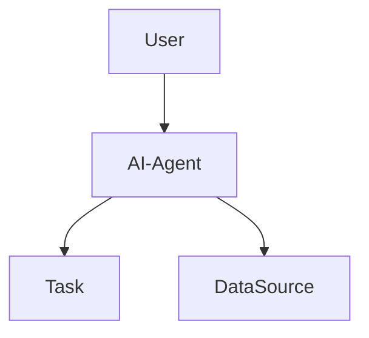
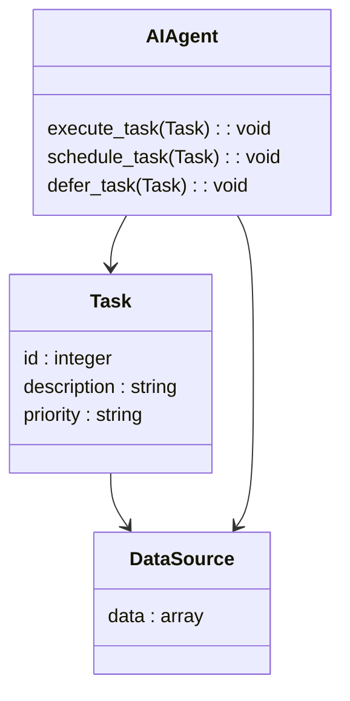
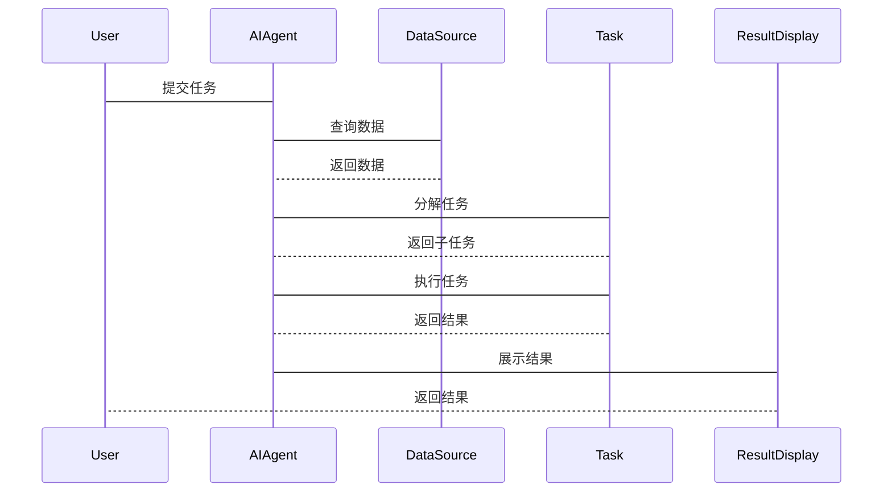

                 


# 智能办公文具：AI Agent的工作效率追踪

> 关键词：AI Agent，智能办公文具，工作效率追踪，算法原理，系统架构，项目实战

> 摘要：本文详细探讨AI Agent在智能办公文具中的应用，从背景介绍、核心概念到算法原理、系统架构，再到项目实战和最佳实践，全面分析AI Agent如何提升办公效率。

---

# 第一部分: 智能办公文具与AI Agent的背景介绍

## 第1章: AI Agent的基本概念与应用背景

### 1.1 什么是AI Agent
AI Agent（人工智能代理）是一种能够感知环境并采取行动以实现目标的智能实体。它通过分析数据、执行任务和优化决策来提高工作效率。

#### 1.1.1 AI Agent的定义
AI Agent是指具备自主决策能力的智能系统，能够根据输入的任务和环境信息，执行相应的操作以达到目标。它通过数据驱动的方式，优化决策流程，提升效率。

#### 1.1.2 AI Agent的核心特征
- **任务驱动性**：AI Agent以完成特定任务为目标。
- **自主学习**：能够通过数据和反馈进行自我优化。
- **实时反馈**：能够实时调整行为以适应环境变化。

#### 1.1.3 AI Agent与传统办公工具的区别
传统办公工具如Word、Excel主要提供静态功能，而AI Agent具备动态学习和优化能力，能够根据反馈调整行为，提供智能化支持。

### 1.2 智能办公文具的发展趋势
随着技术的进步，办公工具从简单的文档处理工具逐渐向智能化方向发展，AI Agent的应用越来越广泛。

#### 1.2.1 数字化办公的演变
从早期的手工办公到数字化办公，再到现在的智能化办公，办公工具的演变体现了技术的进步。

#### 1.2.2 AI技术在办公场景中的应用
AI技术的应用使得办公工具能够自动化处理任务、优化决策，提升效率。

#### 1.2.3 智能办公文具的市场现状
当前，智能办公文具市场增长迅速，各类AI Agent工具层出不穷，为企业和个人提供高效支持。

### 1.3 AI Agent在办公效率中的作用
AI Agent通过自动化处理任务、优化决策流程，显著提升办公效率。

#### 1.3.1 AI Agent如何提升工作效率
通过自动化处理重复性任务，AI Agent减少人工干预，提高效率。

#### 1.3.2 AI Agent在任务管理中的应用
AI Agent能够分解任务、分配优先级，帮助用户更高效地完成工作。

#### 1.3.3 AI Agent的边界与外延
AI Agent的应用范围广泛，但也有其局限性，需明确其边界。

---

## 第2章: AI Agent的工作效率追踪原理

### 2.1 AI Agent的核心概念
AI Agent通过任务分解、数据驱动的决策和自主学习来提升效率。

#### 2.1.1 任务驱动的AI Agent
AI Agent以任务为目标，分解任务并执行相应的操作。

#### 2.1.2 基于数据的实时反馈
AI Agent通过实时数据反馈调整行为，优化决策。

#### 2.1.3 AI Agent的自主学习能力
AI Agent通过学习和优化算法，不断提高效率。

### 2.2 AI Agent的工作流程
AI Agent的工作流程包括任务识别、数据采集与分析、决策与执行。

#### 2.2.1 任务识别与分解
AI Agent首先识别任务，将其分解为子任务，明确优先级。

#### 2.2.2 数据采集与分析
AI Agent采集相关数据，分析数据以制定决策。

#### 2.2.3 智能决策与执行
基于分析结果，AI Agent制定决策并执行操作。

### 2.3 AI Agent的效率追踪机制
AI Agent通过KPI评估、实时反馈和历史数据优化效率。

#### 2.3.1 基于KPI的效率评估
AI Agent通过KPI（关键绩效指标）评估效率。

#### 2.3.2 实时数据反馈与调整
AI Agent根据实时反馈调整行为，优化效率。

#### 2.3.3 历史数据的积累与优化
通过历史数据积累，AI Agent不断优化决策模型。

---

## 第3章: AI Agent的核心原理分析

### 3.1 AI Agent的原理概述
AI Agent通过任务分解、数据驱动的决策和优化算法来提升效率。

#### 3.1.1 任务分解与优先级排序
AI Agent将任务分解为子任务，并根据优先级排序。

#### 3.1.2 数据驱动的决策机制
AI Agent基于数据进行决策，实时调整行为。

#### 3.1.3 自适应优化算法
AI Agent通过优化算法，不断提高效率。

### 3.2 AI Agent的核心算法
AI Agent的核心算法包括基于规则的推理和强化学习。

#### 3.2.1 基于规则的推理算法
基于规则的推理算法通过预定义的规则进行推理。

#### 3.2.2 基于强化学习的优化算法
强化学习算法通过奖励函数优化决策。

### 3.3 AI Agent的数学模型
AI Agent的数学模型包括状态空间、动作空间和奖励函数模型。

#### 3.3.1 状态空间模型
状态空间模型描述了AI Agent可能处于的状态。

#### 3.3.2 动作空间模型
动作空间模型描述了AI Agent可以执行的动作。

#### 3.3.3 奖励函数模型
奖励函数模型定义了AI Agent在执行动作后的奖励。

---

## 第4章: AI Agent与办公场景的实体关系

### 4.1 实体关系概述
AI Agent与用户、任务、数据源等实体密切相关。

#### 4.1.1 用户与AI Agent的关系
用户通过AI Agent完成任务，AI Agent为用户提供支持。

#### 4.1.2 任务与AI Agent的关系
AI Agent分解任务并执行相应的操作。

#### 4.1.3 数据源与AI Agent的关系
AI Agent从数据源获取数据，进行分析和决策。

### 4.2 实体关系的Mermaid流程图
以下是实体关系的Mermaid流程图：



---

## 第5章: AI Agent的算法实现

### 5.1 基于规则的推理算法
基于规则的推理算法通过预定义的规则进行推理。

#### 5.1.1 算法流程
1. 收集数据
2. 应用规则
3. 得出结论

#### 5.1.2 Python代码示例
```python
def rule_based_inference(data):
    if data['priority'] == 'high':
        return 'execute immediately'
    elif data['priority'] == 'medium':
        return 'schedule'
    else:
        return 'defer'
```

### 5.2 基于强化学习的优化算法
基于强化学习的优化算法通过奖励函数优化决策。

#### 5.2.1 算法流程
1. 初始化状态
2. 执行动作
3. 获取奖励
4. 更新策略

#### 5.2.2 Python代码示例
```python
import numpy as np

# 定义状态空间
state_space = ['high', 'medium', 'low']

# 定义动作空间
action_space = ['execute', 'schedule', 'defer']

# 定义奖励函数
def reward_function(action, state):
    if action == 'execute' and state == 'high':
        return 1
    elif action == 'schedule' and state == 'medium':
        return 1
    elif action == 'defer' and state == 'low':
        return 1
    else:
        return -1

# 初始化策略
policy = np.random.choice(action_space, len(state_space))

# 更新策略
def update_policy(policy, state, action, reward):
    index = state_space.index(state)
    policy[index] = action
    return policy
```

### 5.3 算法的数学模型
AI Agent的算法涉及数学模型，如状态空间、动作空间和奖励函数。

#### 5.3.1 状态空间模型
状态空间模型定义了AI Agent可能的状态：

$$ S = \{s_1, s_2, s_3\} $$

其中，$s_1$、$s_2$、$s_3$分别表示高、中、低优先级状态。

#### 5.3.2 动作空间模型
动作空间模型定义了AI Agent可以执行的动作：

$$ A = \{a_1, a_2, a_3\} $$

其中，$a_1$、$a_2$、$a_3$分别表示立即执行、安排和延迟。

#### 5.3.3 奖励函数模型
奖励函数模型定义了AI Agent在执行动作后的奖励：

$$ R(s, a) = \begin{cases}
1 & \text{if } a \text{与} s \text{匹配} \\
-1 & \text{否则}
\end{cases} $$

---

## 第6章: 系统分析与架构设计

### 6.1 问题场景介绍
AI Agent在智能办公文具中的应用需要解决任务分解、数据采集、决策优化等问题。

### 6.2 系统功能设计
系统功能包括任务管理、数据采集、AI处理和结果展示。

#### 6.2.1 领域模型的Mermaid类图
以下是领域模型的Mermaid类图：



### 6.3 系统架构设计
系统架构采用微服务架构，包括任务处理、数据采集、AI处理和结果展示模块。

#### 6.3.1 系统架构的Mermaid架构图
以下是系统架构的Mermaid架构图：


### 6.4 系统接口设计
系统接口包括任务提交接口、数据查询接口和结果展示接口。

### 6.5 系统交互的Mermaid序列图
以下是系统交互的Mermaid序列图：



---

## 第7章: 项目实战

### 7.1 环境安装
需要安装Python、相关库（如numpy、pandas）和AI框架（如TensorFlow）。

### 7.2 核心代码实现

#### 7.2.1 任务处理代码
```python
import numpy as np

def execute_task(task):
    print(f"Executing task: {task}")
    
def schedule_task(task):
    print(f"Scheduling task: {task}")
    
def defer_task(task):
    print(f"Defering task: {task}")
```

#### 7.2.2 数据采集代码
```python
import pandas as pd

def collect_data(source):
    data = pd.read_csv(source)
    return data
```

### 7.3 代码应用解读与分析
任务处理代码根据优先级执行不同的操作，数据采集代码从数据源获取数据，AI处理代码分析数据并优化决策。

### 7.4 实际案例分析
以处理高优先级任务为例，AI Agent会立即执行任务，优化决策流程。

---

## 第8章: 最佳实践

### 8.1 小结
AI Agent通过自动化处理任务、优化决策流程，显著提升办公效率。

### 8.2 注意事项
- 确保数据安全和隐私
- 定期更新AI模型
- 优化算法，提高效率

### 8.3 拓展阅读
建议阅读《人工智能：一种现代的方法》和《机器学习实战》等书籍。

---

# 作者

作者：AI天才研究院/AI Genius Institute & 禅与计算机程序设计艺术 /Zen And The Art of Computer Programming

