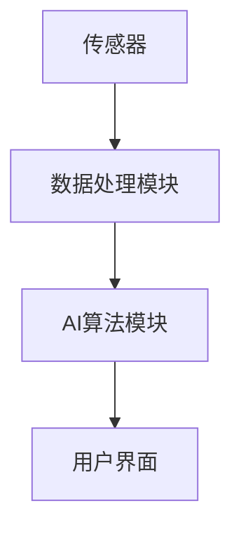
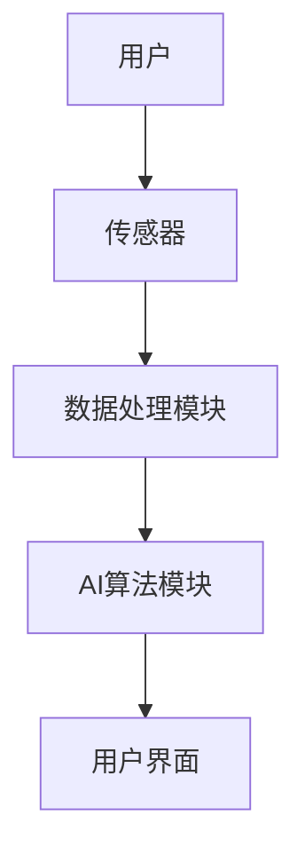

                 


# 智能办公桌：AI Agent的久坐提醒与姿势矫正

> 关键词：智能办公桌，AI Agent，久坐提醒，姿势矫正，传感器技术，算法实现

> 摘要：本文深入探讨了智能办公桌在AI Agent技术下的久坐提醒与姿势矫正功能。从问题背景到解决方案，从技术原理到算法实现，从系统架构到项目实战，全面解析了智能办公桌的设计与实现过程。通过结合传感器技术、AI算法和用户交互设计，提出了一个高效的久坐提醒与姿势矫正系统，为现代办公环境提供了智能化的健康解决方案。

---

# 第一部分: 背景介绍

## 第1章: 问题背景与需求分析

### 1.1 问题背景
现代职场中，久坐已成为一种普遍现象，长时间保持不良坐姿容易导致颈椎病、腰椎病等健康问题。随着AI技术的快速发展，智能办公桌逐渐成为解决这些问题的重要工具。

### 1.2 问题描述
- **久坐问题的现状与危害**：长时间久坐不仅影响身体健康，还可能导致工作效率下降。
- **姿势矫正的必要性**：不良坐姿会增加脊柱负担，导致肌肉疲劳和骨骼变形。
- **AI技术的应用潜力**：通过AI技术，智能办公桌可以实时监测用户坐姿，并提供个性化建议。

### 1.3 问题解决
- **AI Agent在久坐提醒中的作用**：通过传感器和AI算法，实时监测用户的坐姿和坐姿时长，自动触发提醒。
- **姿势矫正的技术实现**：结合传感器数据和AI算法，提供实时反馈和矫正建议。

### 1.4 边界与外延
- **智能办公桌的功能范围**：久坐提醒、姿势矫正、坐姿监测等。
- **相关技术的边界**：传感器技术、AI算法、用户交互设计。
- **智能办公桌的外延应用**：健康监测、办公环境优化等。

### 1.5 概念结构与核心要素
- **核心概念组成**：传感器、AI算法、用户界面。
- **关键要素分析**：传感器用于数据采集，AI算法用于数据处理和决策，用户界面用于反馈和交互。
- **概念结构图**
  ```mermaid
  graph TD
    A[智能办公桌] --> B[传感器]
    A --> C[AI算法]
    A --> D[用户界面]
  ```

---

# 第二部分: 核心概念与联系

## 第2章: AI Agent的核心原理

### 2.1 传感器数据采集
- **传感器类型与功能**：包括压力传感器、角度传感器、加速度传感器等，用于监测坐姿和坐姿时长。
- **数据采集流程**：传感器采集数据，通过蓝牙或Wi-Fi传输到智能办公桌的控制模块。
- **数据预处理方法**：数据清洗、特征提取、数据归一化等。

### 2.2 数据特征提取
- **坐姿特征提取**：提取坐姿的角度、压力等特征。
- **时间特征分析**：分析坐姿时长、坐姿频率等特征。
- **数据特征对比表格**
  | 特征类型 | 特征描述 | 示例值 |
  |----------|----------|--------|
  | 坐姿角度 | 背部与桌子的角度 | 90° |
  | 坐姿压力 | 坐姿的压力值 | 80N |

### 2.3 AI Agent的决策逻辑
- **基于时间的提醒算法**：根据坐姿时长，触发提醒。
- **基于坐姿的矫正算法**：根据坐姿角度，提供矫正建议。
- **决策逻辑流程图**
  ```mermaid
  graph TD
    A[数据采集] --> B[特征提取]
    B --> C[决策判断]
    C --> D[反馈生成]
  ```

---

# 第三部分: 算法原理讲解

## 第3章: 久坐提醒算法

### 3.1 算法流程
- **数据采集与处理**：通过传感器采集坐姿数据，进行预处理。
- **特征提取与分类**：提取坐姿特征，进行分类。
- **决策判断与反馈**：根据分类结果，触发提醒或矫正建议。

### 3.2 久坐提醒算法实现
```python
def久坐提醒算法(坐姿时长, 坐姿角度):
    if 坐姿时长 > 30分钟:
        提醒类型 = "久坐提醒"
    if 坐姿角度 < 90度:
        提醒类型 = "姿势矫正"
    return 提醒类型
```

### 3.3 数学模型与公式
- **提醒触发条件公式**
  $$ \text{提醒触发} = \begin{cases} 
  \text{是}, & \text{如果坐姿时长 > 30分钟 或 坐姿角度 < 90度} \\
  \text{否}, & \text{其他情况}
  \end{cases} $$

---

# 第四部分: 系统分析与架构设计方案

## 第4章: 系统架构设计

### 4.1 系统架构


### 4.2 功能设计
- **用户需求分析**：久坐提醒、姿势矫正、坐姿监测。
- **功能模块设计**：数据采集模块、AI处理模块、用户反馈模块。
- **领域模型类图**
  ```mermaid
  classDiagram
    class 传感器 {
       采集数据
    }
    class 数据处理模块 {
        处理数据
    }
    class AI算法模块 {
        分析数据
    }
    class 用户界面 {
        显示反馈
    }
    传感器 --> 数据处理模块
    数据处理模块 --> AI算法模块
    AI算法模块 --> 用户界面
  ```

---

## 第5章: 接口设计与交互流程

### 5.1 系统接口设计
- **传感器接口**：与智能办公桌的传感器模块通信。
- **用户界面接口**：与用户交互，显示提醒和矫正建议。

### 5.2 交互流程图


---

# 第五部分: 项目实战

## 第6章: 环境安装与核心实现

### 6.1 环境安装
- **安装Python**：安装Python 3.8以上版本。
- **安装依赖库**：安装numpy、scikit-learn、matplotlib等。

### 6.2 核心代码实现
```python
import numpy as np
from sklearn import tree

# 数据集
X = np.array([[30, 80], [25, 75], [35, 85], [40, 90]])
y = np.array(["久坐提醒", "正常", "姿势矫正", "正常"])

# 训练模型
clf = tree.DecisionTreeClassifier()
clf.fit(X, y)

# 预测
测试数据 = np.array([[32, 85]])
预测结果 = clf.predict(测试数据)
print(预测结果)
```

### 6.3 代码解读
- **数据集**：包括坐姿时长和坐姿压力。
- **训练模型**：使用决策树算法进行分类。
- **预测结果**：根据输入数据，预测提醒类型。

### 6.4 实际案例分析
- **案例分析**：假设用户坐姿时长为32分钟，坐姿压力为85N，系统预测结果为“姿势矫正”。

### 6.5 项目小结
- **经验总结**：传感器精度影响分类效果，AI算法的选择影响系统性能。
- **优化建议**：增加更多的传感器，优化AI算法。

---

# 第六部分: 最佳实践

## 第7章: 实用技巧与注意事项

### 7.1 实用技巧
- **传感器选择**：选择高精度、低功耗的传感器。
- **算法优化**：使用更复杂的AI算法，如随机森林、神经网络等。

### 7.2 注意事项
- **隐私保护**：注意用户数据的安全和隐私。
- **用户体验**：确保提醒和矫正建议的友好性。

### 7.3 小结
- **总结全文**：智能办公桌通过AI Agent技术，实现了久坐提醒和姿势矫正，为现代办公环境提供了智能化的健康解决方案。

---

# 附录

## 术语表
- **AI Agent**：人工智能代理，能够感知环境并执行任务的智能体。
- **传感器**：用于采集环境数据的装置。

## 参考文献
- [1] 《人工智能入门》
- [2] 《传感器原理与应用》

---

# 作者：AI天才研究院/AI Genius Institute & 禅与计算机程序设计艺术 /Zen And The Art of Computer Programming

