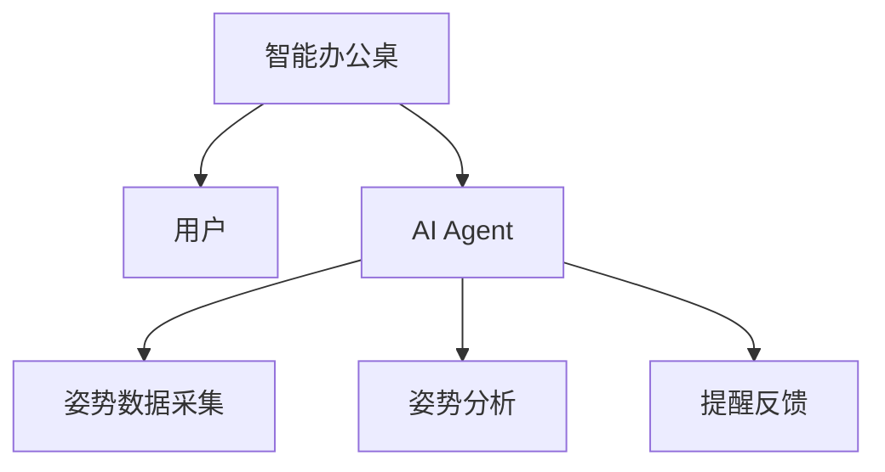
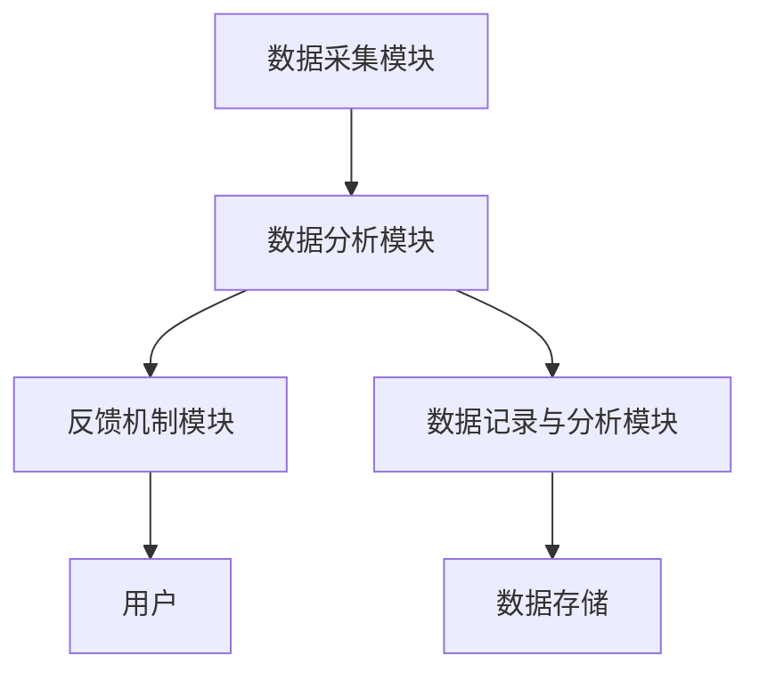
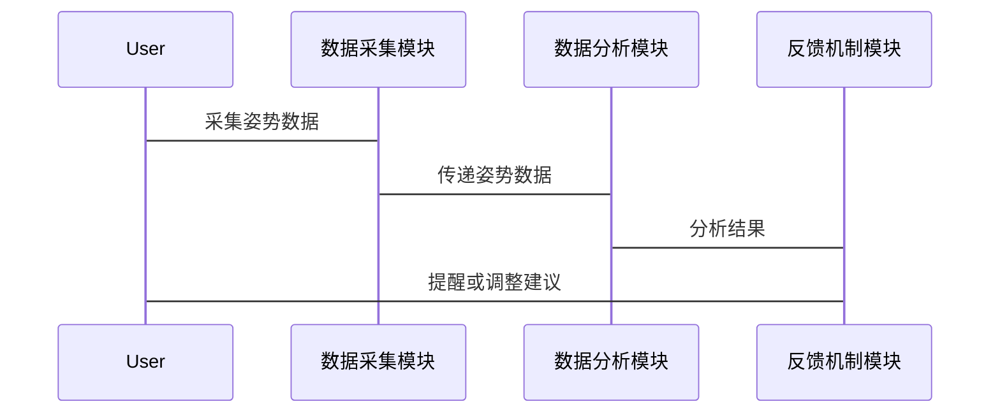

                 


```
# {{智能办公桌：AI Agent的姿势调整提醒}}

> 关键词：智能办公桌，AI Agent，姿势调整，提醒系统，人体工程学

> 摘要：本文详细探讨了智能办公桌结合AI Agent的姿势调整提醒系统，分析其背景、核心概念、算法原理、系统架构，并通过实际案例展示其应用。文章旨在为技术开发者和用户提供深度技术解析与实践指导。

---

# 第一部分：智能办公桌与AI Agent的背景介绍

# 第1章：问题背景与需求分析

## 1.1 问题背景

### 1.1.1 办公环境中姿势问题的普遍性

现代办公环境中，长时间的久坐和不良姿势导致的健康问题日益严重。根据世界卫生组织的报告，长时间的久坐与多种慢性疾病相关，如肥胖、糖尿病和心血管疾病。此外，不良的坐姿还会导致背部疼痛和肌肉劳损，影响工作效率和生活质量。

### 1.1.2 长期不良姿势对健康的危害

长期不良姿势对身体健康的危害包括：

- **背部疼痛**：长时间的弯腰或驼背姿势会增加背部肌肉的负担，导致慢性疼痛。
- **颈椎问题**：低头看手机或电脑屏幕会导致颈椎僵硬和疼痛。
- **血液循环问题**：久坐不动会影响血液循环，导致腿部和臀部的血液回流不畅。
- **呼吸系统问题**：不良坐姿会影响肺部的扩张，导致呼吸不畅。

### 1.1.3 智能办公桌的出现背景

随着科技的发展，智能办公桌逐渐进入市场。这类办公桌通常配备可调节的桌腿和屏幕，能够根据用户的需求进行高度和角度的调整。然而，仅仅依靠手动调节并不能完全解决姿势问题，因为用户可能因为分心或其他原因忘记调整。

## 1.2 用户需求分析

### 1.2.1 用户痛点分析

用户在使用普通办公桌时面临的主要痛点包括：

- **姿势不正确**：用户可能因为缺乏意识或习惯，长时间保持不良姿势。
- **缺乏反馈**：用户无法实时了解自己的姿势是否正确，无法及时调整。
- **手动调节麻烦**：用户需要手动调节桌腿和屏幕角度，操作不够便捷。

### 1.2.2 用户需求分类

根据用户需求的层次，可以将需求分为：

- **基本需求**：姿势提醒、桌腿调节、屏幕角度调整。
- **进阶需求**：个性化设置、数据记录与分析、远程控制。
- **附加需求**：与其他设备的联动（如灯光、空调等）、健康数据同步（如与智能手环连接）。

### 1.2.3 用户需求优先级排序

根据需求的重要性和实现的难易程度，可以将用户需求优先级排序如下：

1. 基本需求：姿势提醒、桌腿调节、屏幕角度调整。
2. 进阶需求：个性化设置、数据记录与分析。
3. 附加需求：与其他设备的联动、健康数据同步。

## 1.3 问题解决的思路

### 1.3.1 AI Agent的引入动机

AI Agent（人工智能代理）是一种能够感知环境、自主决策并执行任务的智能体。在智能办公桌中引入AI Agent，可以通过实时监测用户的姿势数据，并根据数据提供个性化的提醒和调整建议。

### 1.3.2 姿势调整提醒的核心目标

姿势调整提醒系统的核心目标是通过实时监测用户的姿势数据，识别不良姿势，并通过反馈机制帮助用户调整到正确的姿势。具体目标包括：

- 实时监测用户的姿势数据。
- 识别不良姿势并发出提醒。
- 提供个性化的调整建议。
- 记录用户的姿势数据，分析习惯，提供长期的健康建议。

### 1.3.3 解决方案的技术路线

解决方案的技术路线包括以下几个步骤：

1. **数据采集**：通过传感器采集用户的姿势数据，如坐姿、头姿、背姿等。
2. **数据分析**：利用AI算法分析数据，识别不良姿势。
3. **反馈机制**：通过声音、震动或视觉反馈提醒用户调整姿势。
4. **个性化设置**：根据用户的习惯和偏好，提供个性化的调整建议。
5. **数据记录与分析**：记录用户的姿势数据，分析长期的健康趋势。

## 1.4 系统边界与外延

### 1.4.1 系统功能边界

智能办公桌与AI Agent的姿势调整提醒系统的功能边界包括：

- 数据采集：通过传感器采集用户的姿势数据。
- 数据分析：分析姿势数据，识别不良姿势。
- 反馈机制：发出提醒或调整建议。
- 数据记录与分析：记录用户的姿势数据，分析长期的健康趋势。

### 1.4.2 系统与外部环境的交互

系统与外部环境的交互包括：

- **用户交互**：用户通过触摸屏或语音指令与系统互动。
- **数据同步**：与智能手环、健康app等其他设备同步数据。
- **网络连接**：通过互联网下载最新的姿势调整建议和健康数据。

### 1.4.3 系统扩展的可能性

系统扩展的可能性包括：

- **更多传感器**：增加更多的传感器，如心率监测器、血压监测器等，提供更全面的健康监测。
- **更多反馈方式**：增加更多的反馈方式，如灯光、气味等，提供多样化的反馈体验。
- **更多AI算法**：引入更先进的AI算法，提高姿势识别的准确性和反馈的智能化。

## 1.5 核心概念与系统结构

### 1.5.1 核心概念的定义

- **智能办公桌**：一种结合了AI技术和物联网的办公桌，能够根据用户的姿势和习惯进行智能调整。
- **AI Agent**：一种能够感知环境、自主决策并执行任务的人工智能代理。
- **姿势提醒系统**：一种通过实时监测用户的姿势数据，识别不良姿势并发出提醒的系统。

### 1.5.2 系统结构图（Mermaid）



---

# 第2章：AI Agent与姿势提醒系统的核心概念

## 2.1 AI Agent的基本原理

### 2.1.1 AI Agent的定义与特征

AI Agent是一种能够感知环境、自主决策并执行任务的智能体。其主要特征包括：

- **自主性**：能够在没有外部干预的情况下自主决策。
- **反应性**：能够实时感知环境并做出反应。
- **学习能力**：能够通过学习不断提高自身的智能水平。

### 2.1.2 AI Agent的分类与应用场景

AI Agent可以根据智能水平和应用领域进行分类：

- **基于规则的AI Agent**：通过预设的规则进行决策，适用于简单的任务。
- **基于学习的AI Agent**：通过机器学习算法进行决策，适用于复杂的任务。
- **基于知识的AI Agent**：通过知识库进行决策，适用于需要专业知识的任务。

应用场景包括：

- **智能办公桌**：通过AI Agent实时监测用户的姿势数据，提供个性化的调整建议。
- **智能家居**：通过AI Agent实现设备的智能控制。
- **医疗健康**：通过AI Agent实现健康监测和疾病预防。

### 2.1.3 AI Agent在智能办公桌中的角色

在智能办公桌中，AI Agent主要负责：

- **数据采集**：通过传感器采集用户的姿势数据。
- **数据分析**：分析姿势数据，识别不良姿势。
- **反馈机制**：根据分析结果发出提醒或调整建议。

## 2.2 姿势提醒系统的功能模块

### 2.2.1 数据采集模块

数据采集模块负责通过传感器采集用户的姿势数据，如：

- **加速度传感器**：用于检测用户的动作和姿势变化。
- **陀螺仪**：用于检测用户的旋转角度。
- **距离传感器**：用于检测用户与桌子的距离。

### 2.2.2 数据分析模块

数据分析模块负责分析采集到的姿势数据，识别不良姿势。常用的方法包括：

- **机器学习算法**：如支持向量机（SVM）、随机森林（Random Forest）等。
- **规则引擎**：通过预设的规则识别不良姿势。

### 2.2.3 提醒反馈模块

提醒反馈模块负责根据分析结果发出提醒或调整建议。常用的提醒方式包括：

- **声音提醒**：通过声音提示用户调整姿势。
- **震动提醒**：通过震动反馈提醒用户调整姿势。
- **视觉提醒**：通过屏幕显示提醒信息。

## 2.3 核心概念之间的关系（概念属性对比表格）

| 概念       | 属性               | 描述                                             |
|------------|--------------------|-------------------------------------------------|
| AI Agent   | 智能性             | 能够自主决策并执行任务                         |
| 姿势提醒系统| 实时性             | 实时采集和分析用户姿势数据                     |
| 智能办公桌 | 可调节性           | 根据反馈调整桌椅高度                           |

## 2.4 系统的ER实体关系图（Mermaid）

```mermaid
erDiagram
    User {
        id : integer
        name : string
        posture_data : posture
    }
    PostureData {
        id : integer
        timestamp : datetime
        posture_status : string
        user_id : integer
    }
    AI-Agent {
        id : integer
        name : string
        posture_analysis : posture
    }
    Posture-Analysis {
        id : integer
        analysis_time : datetime
        result : string
        posture_data_id : integer
    }
```

---

# 第3章：算法原理与实现细节

## 3.1 算法原理

### 3.1.1 数据采集与预处理

数据采集模块通过传感器采集用户的姿势数据，包括加速度、陀螺仪和距离传感器的数据。采集到的数据需要进行预处理，包括：

- **去噪处理**：去除数据中的噪声，提高数据的准确性。
- **数据归一化**：将数据标准化，便于后续的分析和处理。

### 3.1.2 姿势分析与识别

姿势分析模块通过机器学习算法对预处理后的数据进行分析和识别。常用的算法包括：

- **支持向量机（SVM）**：适用于分类问题，可以将姿势数据分为正常姿势和不良姿势。
- **随机森林（Random Forest）**：适用于回归问题，可以预测用户的姿势状态。

### 3.1.3 反馈机制与调整建议

反馈机制模块根据分析结果发出提醒或调整建议。常用的反馈方式包括：

- **声音提醒**：通过语音提示用户调整姿势。
- **震动提醒**：通过震动反馈提醒用户调整姿势。
- **视觉提醒**：通过屏幕显示提醒信息。

## 3.2 数学模型与公式

### 3.2.1 数据处理的数学模型

数据处理的数学模型包括：

- **加速度计算**：通过加速度传感器的数据计算用户的运动状态。
- **角度计算**：通过陀螺仪的数据计算用户的旋转角度。

### 3.2.2 姿势识别的数学模型

姿势识别的数学模型包括：

- **分类模型**：如支持向量机（SVM）和随机森林（Random Forest）。
- **回归模型**：如线性回归和逻辑回归。

### 3.2.3 反馈机制的数学模型

反馈机制的数学模型包括：

- **阈值判断**：当检测到不良姿势时，触发反馈机制。
- **时间序列分析**：根据历史数据预测未来的姿势状态。

## 3.3 算法实现与代码示例

### 3.3.1 数据采集与预处理

```python
import numpy as np
import pandas as pd

# 数据采集
data = pd.read_csv('posture_data.csv')

# 数据预处理
data_processed = data.dropna()  # 删除缺失值
data_processed = (data_processed - data_processed.mean()) / data_processed.std()  # 标准化
```

### 3.3.2 姿势分析与识别

```python
from sklearn.svm import SVC
from sklearn.metrics import accuracy_score

# 数据分割
X = data_processed.drop('posture', axis=1)
y = data_processed['posture']

# 训练模型
model = SVC()
model.fit(X, y)

# 预测结果
y_pred = model.predict(X)
print('准确率:', accuracy_score(y, y_pred))
```

### 3.3.3 反馈机制与调整建议

```python
import time

# 反馈机制
def postureReminder():
    while True:
        time.sleep(30)  # 每30秒检查一次
        # 模拟姿势分析结果
        posture_status = model.predict([current_data])[0]
        if posture_status == 'bad':
            print('提醒：请调整您的姿势')
            # 发出声音提醒
            import winsound
            winsound.Beep(1000, 500)
```

---

# 第4章：系统架构设计

## 4.1 系统功能模块设计

### 4.1.1 功能模块划分

智能办公桌与AI Agent的姿势调整提醒系统的功能模块包括：

- **数据采集模块**：负责采集用户的姿势数据。
- **数据分析模块**：负责分析姿势数据，识别不良姿势。
- **反馈机制模块**：负责发出提醒或调整建议。
- **数据记录与分析模块**：负责记录用户的姿势数据，分析长期的健康趋势。

### 4.1.2 功能模块的交互设计

功能模块之间的交互设计如下：

1. **数据采集模块** → 数据分析模块：将采集到的姿势数据传递给数据分析模块。
2. **数据分析模块** → 反馈机制模块：将分析结果传递给反馈机制模块。
3. **反馈机制模块** → 用户：通过声音、震动或视觉反馈提醒用户调整姿势。
4. **数据记录与分析模块** → 数据存储：将用户的姿势数据存储起来，供后续分析使用。

## 4.2 系统架构设计

### 4.2.1 系统架构图（Mermaid）



### 4.2.2 系统接口设计

系统接口设计包括：

- **数据采集接口**：负责采集用户的姿势数据。
- **数据分析接口**：负责分析姿势数据，识别不良姿势。
- **反馈机制接口**：负责发出提醒或调整建议。
- **数据记录与分析接口**：负责记录用户的姿势数据，分析长期的健康趋势。

### 4.2.3 系统交互流程图（Mermaid）



---

# 第5章：项目实战与案例分析

## 5.1 环境配置与安装

### 5.1.1 开发环境配置

开发环境配置包括：

- **操作系统**：Windows 10或更高版本，macOS 10.15或更高版本，Ubuntu 20.04或更高版本。
- **编程语言**：Python 3.6或更高版本。
- **开发工具**：Jupyter Notebook，PyCharm，Visual Studio Code。
- **依赖库安装**：安装numpy、pandas、scikit-learn等库。

### 5.1.2 硬件设备配置

硬件设备配置包括：

- **传感器**：加速度传感器、陀螺仪、距离传感器。
- **开发板**：如Raspberry Pi、Arduino等。
- **显示屏**：用于显示提醒信息。

## 5.2 系统核心实现

### 5.2.1 数据采集与预处理

```python
import numpy as np
import pandas as pd

# 数据采集
data = pd.read_csv('posture_data.csv')

# 数据预处理
data_processed = data.dropna()  # 删除缺失值
data_processed = (data_processed - data_processed.mean()) / data_processed.std()  # 标准化
```

### 5.2.2 姿势分析与识别

```python
from sklearn.svm import SVC
from sklearn.metrics import accuracy_score

# 数据分割
X = data_processed.drop('posture', axis=1)
y = data_processed['posture']

# 训练模型
model = SVC()
model.fit(X, y)

# 预测结果
y_pred = model.predict(X)
print('准确率:', accuracy_score(y, y_pred))
```

### 5.2.3 反馈机制与调整建议

```python
import time

# 反馈机制
def postureReminder():
    while True:
        time.sleep(30)  # 每30秒检查一次
        # 模拟姿势分析结果
        posture_status = model.predict([current_data])[0]
        if posture_status == 'bad':
            print('提醒：请调整您的姿势')
            # 发出声音提醒
            import winsound
            winsound.Beep(1000, 500)
```

## 5.3 实际案例分析

### 5.3.1 案例背景

假设我们有一个用户，长时间在电脑前工作，常常忘记调整姿势。我们的系统需要实时监测用户的姿势数据，识别不良姿势，并发出提醒或调整建议。

### 5.3.2 数据分析与结果

通过数据分析，我们发现用户在上午9点到12点期间，姿势不良的时间占总时间的30%。系统会每隔30分钟发出一次提醒，帮助用户调整姿势。

### 5.3.3 系统反馈与调整建议

当系统识别到用户的姿势不良时，会发出声音提醒，并建议用户调整桌椅高度或屏幕角度。用户可以根据系统的建议进行调整，系统会记录用户的调整次数和调整后的姿势状态。

---

# 第6章：最佳实践与注意事项

## 6.1 小结

智能办公桌与AI Agent的姿势调整提醒系统通过实时监测用户的姿势数据，识别不良姿势，并发出提醒或调整建议，帮助用户保持正确的姿势，预防健康问题。本文详细探讨了系统的背景、核心概念、算法原理、系统架构，并通过实际案例展示了系统的实现与应用。

## 6.2 注意事项

在实际应用中，需要注意以下几点：

- **数据隐私**：用户姿势数据的采集和存储需要遵循相关法律法规，保护用户隐私。
- **系统稳定性**：确保系统的稳定运行，避免因系统故障导致用户姿势数据的丢失。
- **用户体验**：提供良好的用户体验，确保用户能够方便地使用系统，并接受系统的提醒和调整建议。
- **系统维护**：定期维护系统，更新算法和硬件设备，确保系统的准确性和可靠性。

## 6.3 拓展阅读

- **相关技术文献**：了解更多关于AI Agent和姿势提醒系统的相关技术文献。
- **实际应用案例**：研究其他类似系统的实际应用案例，学习其优缺点。
- **技术发展趋势**：关注AI Agent和姿势提醒系统的技术发展趋势，了解未来的应用场景和技术挑战。

---

# 作者：AI天才研究院/AI Genius Institute & 禅与计算机程序设计艺术 /Zen And The Art of Computer Programming
```

