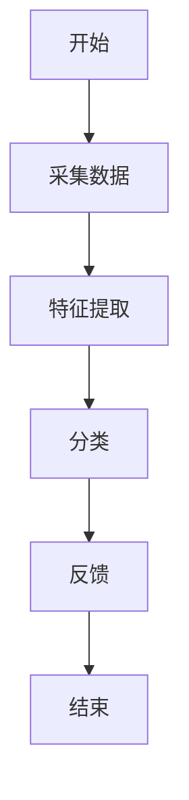
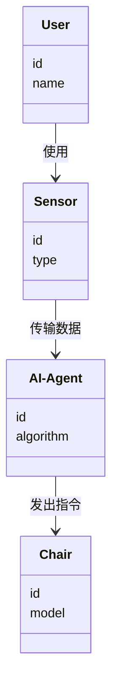
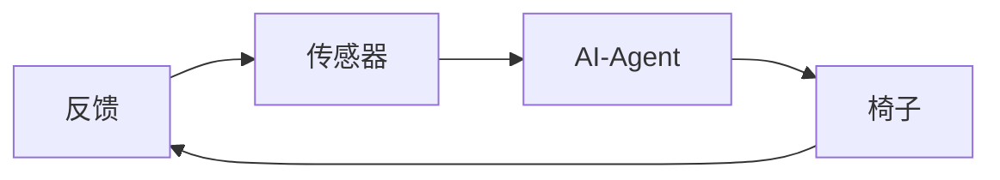
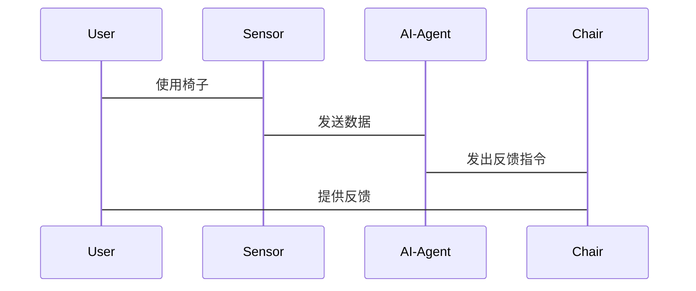

                 


# 智能办公椅：AI Agent的久坐提醒与姿势矫正

> 关键词：智能办公椅，AI Agent，久坐提醒，姿势矫正，人体工程学，健康办公

> 摘要：本文详细探讨了智能办公椅在AI Agent技术的应用，特别是在久坐提醒和姿势矫正方面的功能设计与实现。通过分析智能办公椅的核心原理、算法实现、系统架构以及实际案例，本文为读者提供了从理论到实践的全面解读。

---

## 第一章：智能办公椅的背景与概念

### 1.1 问题背景与需求分析

#### 1.1.1 现代办公方式的演变
现代办公方式正在经历从传统办公室到灵活办公模式的转变。随着远程办公和混合办公模式的普及，人们越来越依赖于舒适的办公环境和高效的办公工具。然而，长时间的久坐已经成为现代办公中常见的问题。

#### 1.1.2 久坐对健康的负面影响
久坐不仅会导致腰背疼痛，还可能引发更严重的健康问题，例如颈椎病、椎间盘突出、血液循环不畅等。据统计，全球每年因久坐导致的健康问题造成了巨大的经济损失。

#### 1.1.3 办公环境中的健康问题
现代办公环境中，许多人缺乏运动，长时间保持不良姿势，导致身体亚健康状态。如何在办公环境中实现健康办公，成为亟待解决的问题。

### 1.2 姿势矫正的重要性

#### 1.2.1 良好姿势的标准
良好的坐姿要求脊柱保持自然曲线，肩部放松，手臂与桌面平行，膝盖弯曲成90度等。这些标准姿势有助于减少身体疲劳和健康问题。

#### 1.2.2 姿势不良的后果
姿势不良会导致肌肉疲劳、骨骼错位、血液循环不畅等问题，长期下去可能引发严重的健康问题。

#### 1.2.3 姿势矫正的解决方案
姿势矫正需要从预防和纠正两方面入手。预防包括选择合适的椅子和桌椅高度，纠正包括通过提醒和反馈调整坐姿。

### 1.3 AI Agent在办公椅中的应用

#### 1.3.1 AI Agent的定义与特点
AI Agent是一种智能代理系统，能够感知环境、理解用户需求并主动提供服务。它具有自主性、反应性、目标导向性和学习能力。

#### 1.3.2 AI Agent在智能办公椅中的作用
AI Agent在智能办公椅中主要用于监测用户坐姿、提醒久坐，并通过反馈调整椅子的参数，帮助用户保持良好的坐姿。

#### 1.3.3 AI Agent与智能办公椅的结合
通过传感器、摄像头和AI算法，AI Agent能够实时监测用户的坐姿，分析数据并做出反馈，从而实现久坐提醒和姿势矫正。

---

## 第二章：智能办公椅的核心概念与联系

### 2.1 核心概念分析

#### 2.1.1 AI Agent的核心原理
AI Agent通过传感器采集数据，利用机器学习算法分析数据，生成反馈并控制椅子的参数。其核心在于数据采集、分析和反馈的闭环系统。

#### 2.1.2 智能办公椅的系统构成
智能办公椅由传感器模块、数据处理模块、反馈执行模块和用户界面模块组成。每个模块协同工作，实现坐姿监测和反馈。

#### 2.1.3 关键技术点
- 数据采集：通过压力传感器、摄像头等设备获取坐姿数据。
- 数据分析：利用机器学习算法识别坐姿问题。
- 反馈控制：根据分析结果调整椅子的支撑和反馈力度。

### 2.2 核心概念对比

#### 2.2.1 传统办公椅与智能办公椅的对比
| 特性             | 传统办公椅          | 智能办公椅          |
|------------------|---------------------|---------------------|
| 数据采集         | 无                   | 有                   |
| 坐姿分析         | 无                   | 有                   |
| 反馈控制         | 无                   | 有                   |

#### 2.2.2 AI Agent与传统传感器的对比
| 特性             | AI Agent            | 传统传感器          |
|------------------|---------------------|---------------------|
| 数据处理         | 智能分析             | 简单信号采集         |
| 决策能力         | 自主决策             | 需人工干预           |
| 适应性           | 高度适应             | 较低适应             |

### 2.3 实体关系图

```mermaid
erDiagram
    user {
        id
        name
        seat_position
    }
    sensor {
        id
        type
        data
    }
    ai_agent {
        id
        algorithm
        status
    }
    chair {
        id
        model
        status
    }
    user --> sensor : 使用
    sensor --> ai_agent : 传输数据
    ai_agent --> chair : 发出指令
```

---

## 第三章：智能办公椅的算法原理

### 3.1 数据采集与处理

#### 3.1.1 数据采集流程
1. 传感器采集坐姿数据，包括压力分布、位置信息等。
2. 数据预处理，去除噪声，提取关键特征。
3. 数据传输到AI Agent进行分析。

#### 3.1.2 数据分析算法
- 使用机器学习算法，如支持向量机（SVM）和随机森林（Random Forest）进行分类。
- 通过训练数据模型，识别坐姿是否标准。

#### 3.1.3 特征提取
- 提取坐姿的关键特征，如背部倾斜角度、臀部压力分布等。

### 3.2 坐姿分析与反馈

#### 3.2.1 坐姿分析算法


#### 3.2.2 反馈机制
- 通过振动、声音或视觉反馈提醒用户调整坐姿。
- 根据坐姿问题的严重程度调整椅子的支撑力度。

### 3.3 数学模型

#### 3.3.1 坐姿检测模型
```latex
$$ \text{坐姿评分} = \alpha \cdot \text{背部角度} + \beta \cdot \text{臀部压力} + \gamma \cdot \text{其他特征} $$
$$ \alpha + \beta + \gamma = 1 $$
```

#### 3.3.2 算法优化
- 使用梯度下降优化模型参数，提高分类准确率。
- 通过交叉验证选择最优模型。

---

## 第四章：智能办公椅的系统架构与设计

### 4.1 系统分析

#### 4.1.1 问题场景
用户长时间久坐，坐姿不良，需要通过系统提醒和反馈调整坐姿。

#### 4.1.2 功能需求
- 实时监测坐姿。
- 提醒久坐。
- 调整椅子参数。

### 4.2 系统设计

#### 4.2.1 领域模型类图


#### 4.2.2 系统架构图


#### 4.2.3 接口设计
- 用户接口：显示坐姿评分和反馈信息。
- 传感器接口：采集坐姿数据。
- AI-Agent接口：接收数据并发出控制指令。

#### 4.2.4 交互流程


---

## 第五章：智能办公椅的项目实战

### 5.1 环境安装

#### 5.1.1 开发环境
- 操作系统：Windows/Mac/Linux
- 开发工具：Python、TensorFlow、OpenCV
- 传感器：压力传感器、摄像头

#### 5.1.2 依赖安装
```bash
pip install tensorflow scikit-learn numpy
```

### 5.2 核心功能实现

#### 5.2.1 数据采集代码
```python
import numpy as np

# 模拟传感器数据
def get_posture_data():
    return np.random.rand(10, 5)

# 数据预处理
def preprocess(data):
    return data.mean(axis=1)

data = get_posture_data()
processed_data = preprocess(data)
```

#### 5.2.2 AI Agent实现
```python
from sklearn.svm import SVC

# 训练模型
model = SVC()
model.fit(processed_data, labels)
```

#### 5.2.3 反馈控制
```python
def feedback_control(posture_score):
    if posture_score < 0.5:
        return "调整背部"
    elif posture_score < 0.8:
        return "轻微提醒"
    else:
        return "良好"
```

### 5.3 案例分析

#### 5.3.1 案例一：正常坐姿
- 数据输入：正常坐姿数据
- 系统反馈：坐姿良好

#### 5.3.2 案例二：久坐提醒
- 数据输入：久坐数据
- 系统反馈：提醒休息

### 5.4 项目总结

---

## 第六章：最佳实践与注意事项

### 6.1 小结

### 6.2 注意事项

#### 6.2.1 数据隐私
- 确保用户数据的安全性，避免数据泄露。

#### 6.2.2 系统稳定性
- 定期更新系统，确保算法准确性和系统稳定性。

#### 6.2.3 用户体验
- 提供友好的用户界面和反馈机制，提升用户体验。

### 6.3 拓展阅读

#### 6.3.1 推荐书籍
- 《机器学习实战》
- 《人体工程学与办公健康》

#### 6.3.2 在线资源
- TensorFlow官方文档
- OpenCV官方文档

---

## 作者信息

作者：AI天才研究院/AI Genius Institute & 禅与计算机程序设计艺术/Zen And The Art of Computer Programming

---

以上就是《智能办公椅：AI Agent的久坐提醒与姿势矫正》的完整目录和内容概述。

