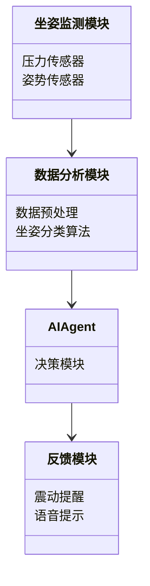
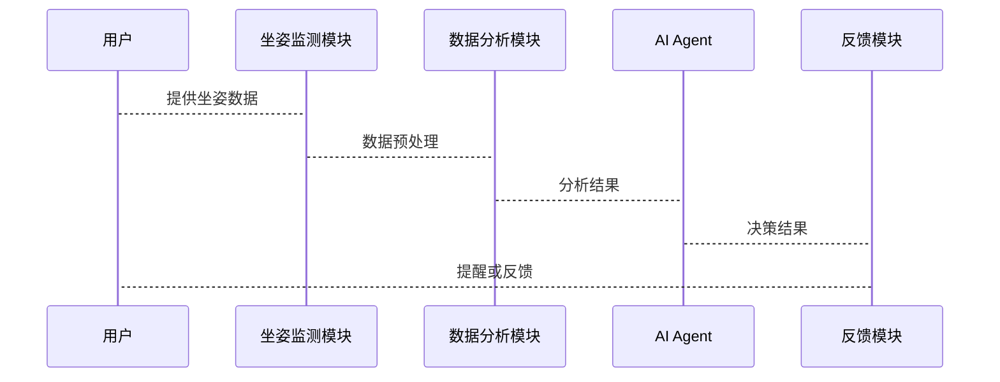

                 


# 智能办公椅：AI Agent的坐姿矫正系统

> 关键词：智能办公椅，AI Agent，坐姿矫正，算法原理，系统架构，数学模型

> 摘要：本文详细探讨了智能办公椅结合AI Agent的坐姿矫正系统，从背景、核心概念、算法原理到系统架构，全面分析了该系统的设计与实现。文章通过详细的步骤解释和实例分析，展示了如何利用AI技术改善办公环境，提升用户健康。

---

## 第一部分: 智能办公椅的背景与价值

### 第1章: 智能办公椅与AI Agent的背景介绍

#### 1.1 问题背景与描述

- **1.1.1 坐姿矫正的重要性**  
  长期不良坐姿可能导致背部疼痛、颈椎问题甚至脊柱畸形。现代办公环境中，久坐已成为健康隐患，坐姿矫正显得尤为重要。

- **1.1.2 办公椅的使用场景与痛点**  
  办公椅是日常办公的重要工具，但传统办公椅缺乏智能监测功能，无法主动提醒用户调整坐姿。

- **1.1.3 AI Agent在办公椅中的应用价值**  
  AI Agent可以通过实时监测坐姿，主动提供反馈，帮助用户保持正确的坐姿，提升健康水平。

#### 1.2 问题解决与边界

- **1.2.1 坐姿矫正系统的核心目标**  
  实现实时坐姿监测、异常坐姿提醒、坐姿矫正指导。

- **1.2.2 系统的边界与外延**  
  仅关注坐姿矫正，不涉及其他办公椅功能（如调节高度、倾斜角度）。

- **1.2.3 核心概念与要素组成**  
  - 传感器模块：监测坐姿数据。  
  - AI Agent：分析数据并提供反馈。  
  - 用户界面：显示反馈信息。

#### 1.3 本章小结

本章介绍了智能办公椅结合AI Agent的背景，明确了坐姿矫正的重要性，并界定了系统的功能范围和核心要素。

---

## 第二部分: AI Agent与坐姿矫正系统的核心概念

### 第2章: AI Agent的基本原理与功能

#### 2.1 AI Agent的核心原理

- **2.1.1 AI Agent的定义与分类**  
  AI Agent是一种智能体，能够感知环境并采取行动以实现目标。根据智能水平，分为反应式和认知式AI Agent。

- **2.1.2 AI Agent的基本功能模块**  
  - 感知模块：接收输入数据。  
  - 处理模块：分析数据并生成决策。  
  - 行动模块：输出反馈或控制信号。

- **2.1.3 AI Agent的决策机制**  
  基于规则或机器学习模型进行决策，确保反馈的准确性和及时性。

#### 2.2 坐姿矫正系统的核心功能

- **2.2.1 坐姿监测模块**  
  通过压力传感器和姿势传感器监测用户的坐姿状态。

- **2.2.2 数据分析模块**  
  对坐姿数据进行预处理和特征提取，识别不良坐姿。

- **2.2.3 矫正反馈模块**  
  通过震动或语音提醒用户调整坐姿。

#### 2.3 AI Agent与坐姿矫正系统的结合

- **2.3.1 系统的整体架构**  
  AI Agent作为核心，整合传感器数据和反馈模块，形成闭环系统。

- **2.3.2 各模块之间的关系**  
  传感器→AI Agent分析→反馈模块执行，实时监测和矫正坐姿。

- **2.3.3 系统的核心算法与流程**  
  从数据采集到分析，再到反馈，形成完整的处理流程。

#### 2.4 本章小结

本章详细讲解了AI Agent的基本原理和坐姿矫正系统的核心功能，展示了AI Agent如何与办公椅结合，实现智能坐姿矫正。

---

## 第三部分: 算法原理与数学模型

### 第3章: 坐姿矫正算法的原理与实现

#### 3.1 坐姿监测算法

- **3.1.1 基于传感器的数据采集**  
  使用压力传感器和姿势传感器，获取用户的坐姿数据。

- **3.1.2 数据预处理与特征提取**  
  对传感器数据进行去噪和平滑处理，提取关键特征。

- **3.1.3 坐姿分类算法**  
  使用支持向量机（SVM）或随机森林等算法，对坐姿进行分类。

#### 3.2 AI Agent的决策算法

- **3.2.1 基于规则的决策**  
  根据预设规则，判断坐姿是否正确。

- **3.2.2 基于机器学习的决策**  
  利用训练好的模型，进行实时决策。

- **3.2.3 基于深度学习的决策**  
  使用更复杂的模型，如卷积神经网络（CNN），提高决策准确性。

#### 3.3 数学模型与公式

- **3.3.1 坐姿分类的数学模型**  
  SVM分类器模型：  
  $$ f(x) = \text{sign}(w \cdot x + b) $$

- **3.3.2 AI Agent决策的数学公式**  
  $$ \text{决策} = \text{argmax}(P(\text{正确坐姿}|x)) $$

- **3.3.3 示例与解释**  
  例如，当传感器数据中背部压力异常时，AI Agent会触发震动提醒。

#### 3.4 本章小结

本章详细讲解了坐姿矫正算法的原理，包括数据采集、预处理和分类算法，并展示了数学模型在实际中的应用。

---

## 第四部分: 系统分析与架构设计

### 第4章: 系统分析与功能设计

#### 4.1 问题场景介绍

- **4.1.1 办公环境中的健康问题**  
  长期不良坐姿导致的健康问题，如背部疼痛、颈椎病。

- **4.1.2 用户需求分析**  
  用户需要实时坐姿监测和反馈，以保持健康。

#### 4.2 项目介绍

- **4.2.1 项目目标**  
  开发一款结合AI Agent的智能办公椅，实现坐姿矫正功能。

- **4.2.2 系统功能设计**  
  - 实时监测坐姿。  
  - 异常坐姿提醒。  
  - 提供矫正建议。

#### 4.3 系统架构设计

- **4.3.1 领域模型类图**  
  使用Mermaid绘制系统模块关系图。



- **4.3.2 系统架构图**  
  使用Mermaid绘制系统架构图。


#### 4.4 系统接口设计

- **4.4.1 接口定义**  
  - 传感器数据接口：提供坐姿数据。  
  - AI Agent接口：接收数据并返回决策结果。  
  - 反馈模块接口：接收决策结果并执行反馈。

- **4.4.2 交互流程图**  
  使用Mermaid绘制交互序列图。



#### 4.5 本章小结

本章分析了系统的应用场景，设计了系统功能，并通过图表展示了系统的架构和交互流程。

---

## 项目实战

### 第5章: 项目实战

#### 5.1 环境安装

- **5.1.1 开发环境搭建**  
  - 安装Python、TensorFlow、传感器库。

#### 5.2 核心代码实现

- **5.2.1 传感器数据采集**  
  使用Python代码读取传感器数据。

```python
import numpy as np

# 模拟传感器数据
def get_posture_data():
    return np.random.randn(100)

posture_data = get_posture_data()
```

- **5.2.2 数据分析与分类**  
  使用SVM进行坐姿分类。

```python
from sklearn import svm

# 训练SVM分类器
model = svm.SVC()
model.fit(X_train, y_train)
```

- **5.2.3 AI Agent决策与反馈**  
  根据分类结果，触发反馈模块。

```python
# 示例反馈逻辑
if model.predict(X_test)[0] == '不良坐姿':
    feedback_module.vibrate()
    feedback_module.voice_prompt()
```

#### 5.3 项目小结

本章通过代码示例展示了如何实现坐姿监测和反馈功能，强调了AI技术在实际应用中的重要性。

---

## 总结与展望

### 6.1 总结

智能办公椅结合AI Agent的坐姿矫正系统，通过实时监测和反馈，帮助用户保持正确坐姿，提升办公健康。系统的实现结合了传感器、AI算法和反馈机制，展示了AI技术在智能设备中的广泛应用。

### 6.2 展望

未来，智能办公椅可以进一步优化算法，增加更多健康监测功能，如心率监测、压力监测等，打造全方位的健康办公解决方案。

---

## 作者

作者：AI天才研究院/AI Genius Institute & 禅与计算机程序设计艺术 /Zen And The Art of Computer Programming

---

这篇文章详细探讨了智能办公椅结合AI Agent的坐姿矫正系统，从背景、核心概念、算法原理到系统架构，全面分析了该系统的设计与实现。文章通过详细的步骤解释和实例分析，展示了如何利用AI技术改善办公环境，提升用户健康。

