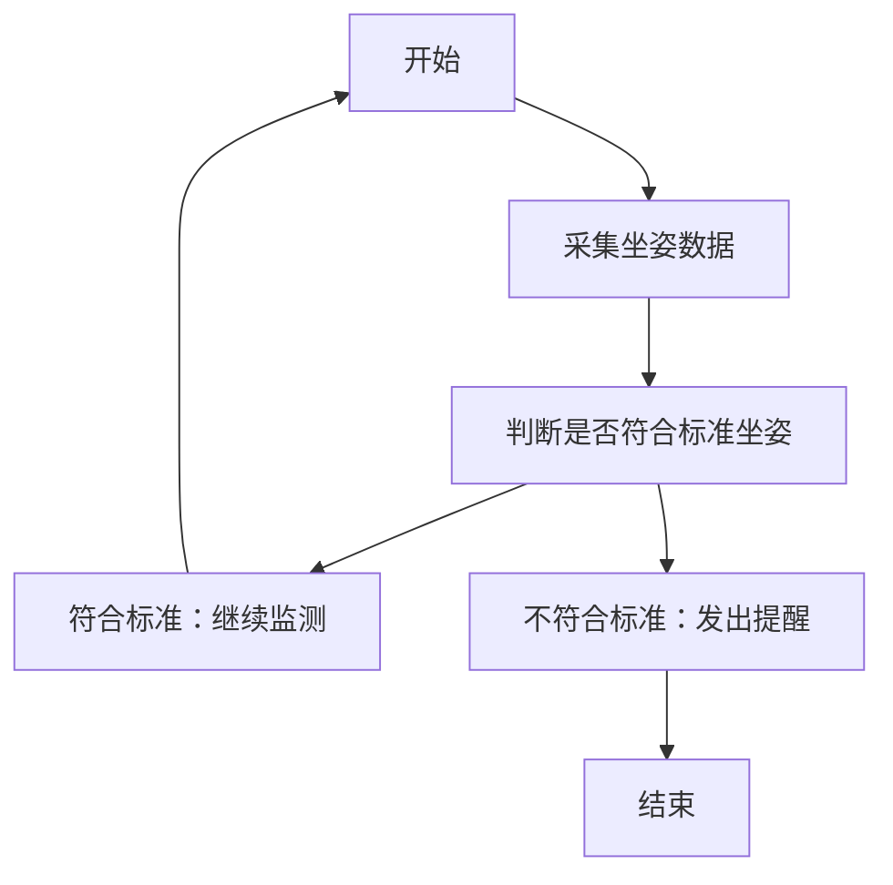
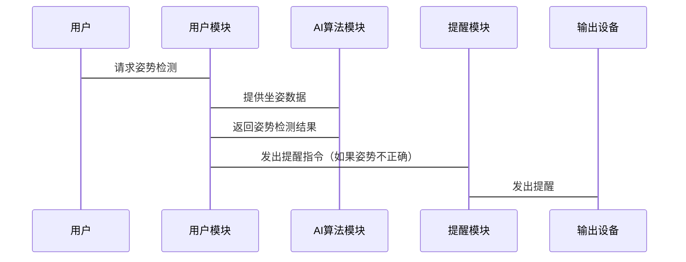

                 


# 智能办公椅：AI Agent的姿势矫正提醒

## 关键词：智能办公椅, AI Agent, 姿势矫正, 人工智能, 物联网, 健康管理

## 摘要：  
随着人工智能和物联网技术的快速发展，智能办公椅正逐渐从传统的办公工具演变为集成AI技术的智能健康助手。本文将详细探讨AI Agent在智能办公椅中的应用，特别是如何通过姿势矫正提醒系统帮助用户改善坐姿，预防健康问题。文章将从背景介绍、核心概念、算法原理、系统架构到项目实战逐步展开，深入剖析智能办公椅的设计与实现过程，为读者提供全面的技术解读。

---

## 第一部分：背景与概念

### 第1章：智能办公椅与AI Agent的背景介绍

#### 1.1 问题背景  
现代办公环境中，久坐已成为一种普遍现象，导致许多员工出现腰椎病、颈椎病等健康问题。传统办公椅的功能单一，无法主动监测和改善用户的坐姿，而AI技术的应用为解决这一问题提供了新的可能性。AI Agent（智能代理）通过实时监测用户的坐姿，结合物联网技术，能够主动提醒用户调整姿势，从而预防健康问题。

#### 1.2 问题描述  
- **姿势不良的危害**：长时间的不良坐姿会导致肌肉疲劳、骨骼变形，甚至引发慢性疾病。  
- **传统办公椅的局限性**：传统办公椅无法实时监测用户的坐姿，也无法提供个性化的矫正建议。  
- **用户需求**：用户需要一种能够实时监测坐姿、主动提醒矫正的智能办公椅，以改善健康状况。

#### 1.3 问题解决与边界  
- **AI Agent的作用**：AI Agent通过传感器和摄像头采集用户的坐姿数据，利用机器学习算法进行分析，并通过语音或震动提醒用户调整姿势。  
- **系统的边界与外延**：智能办公椅的AI Agent仅关注坐姿矫正，不涉及其他功能（如按摩、调节高度等）。  
- **核心概念**：AI Agent、姿势检测、姿势矫正提醒、用户反馈。

### 第2章：AI Agent与姿势矫正提醒系统的核心概念

#### 2.1 核心概念原理  
- **AI Agent**：AI Agent是一种能够感知环境、自主决策并执行任务的智能系统。在智能办公椅中，AI Agent负责采集用户的坐姿数据，分析数据并发出提醒。  
- **姿势矫正提醒系统**：该系统通过传感器和摄像头采集用户的坐姿数据，利用算法判断坐姿是否正确，并通过语音或震动提醒用户调整姿势。

#### 2.2 核心概念对比表  
| **功能特性**       | **传统办公椅**       | **智能办公椅（AI Agent版）**   |  
|--------------------|----------------------|-------------------------------|  
| 坐姿监测           | 无                   | 有（通过传感器和摄像头）       |  
| 姿势矫正提醒       | 无                   | 有（通过AI算法判断并提醒）      |  
| 用户反馈           | 无                   | 有（用户可以反馈矫正建议）      |  

#### 2.3 ER实体关系图  
```mermaid
er
    entity 用户 {
        id: int
        姓名: string
    }
    entity 姿势数据 {
        id: int
        用户id: int
        时间戳: datetime
        姿势评分: float
    }
    entity 提醒记录 {
        id: int
        用户id: int
        提醒时间: datetime
        提醒类型: string
    }
    用户 - 姿势数据
    用户 - 提醒记录
```

---

## 第二部分：算法与数学模型

### 第3章：姿势检测与提醒算法原理

#### 3.1 算法原理  
姿势检测的核心是利用AI算法分析用户的坐姿数据。常用的算法包括基于深度学习的姿势估计算法（如使用OpenCV进行图像处理）和基于规则的坐姿检测算法（如通过传感器数据判断坐姿是否符合标准）。

#### 3.2 算法流程图  


#### 3.3 算法实现代码  
```python
import cv2

def check_posture(image):
    # 使用OpenCV进行姿势检测
    # 假设image是用户坐姿的图像
    # 返回True表示姿势正确，False表示姿势不正确
    # 示例逻辑：检测用户是否正坐（头正对前方，背部挺直）
    # 这里简化为颜色检测（仅为示例）
    if image.mean() > 128:
        return True
    else:
        return False

def main():
    cap = cv2.VideoCapture(0)  # 使用摄像头采集图像
    while True:
        ret, image = cap.read()
        if not ret:
            break
        posture_correct = check_posture(image)
        if posture_correct:
            print("姿势正确，请继续保持！")
        else:
            print("姿势不正确，请调整坐姿！")
            # 发出提醒（例如，通过扬声器或震动马达）

if __name__ == "__main__":
    main()
```

#### 3.4 数学模型  
姿势检测的数学模型可以通过特征点检测和坐姿评分来实现。例如，通过计算用户背部与垂直线的夹角来判断坐姿是否正确。

$$
\theta = \arctan\left(\frac{y_2 - y_1}{x_2 - x_1}\right)
$$

其中，$(x_1, y_1)$和$(x_2, y_2)$是用户背部的两个特征点坐标。当$\theta$接近90度时，表示用户坐姿正确。

---

## 第三部分：系统分析与架构设计

### 第4章：系统架构设计

#### 4.1 问题场景介绍  
用户在使用智能办公椅时，AI Agent通过传感器和摄像头采集坐姿数据，分析数据后发出提醒。系统需要支持多用户、多设备同时运行，并保证数据的实时性和准确性。

#### 4.2 系统功能设计  
- **用户模块**：用户登录、查看矫正记录、设置提醒偏好。  
- **姿势检测模块**：通过摄像头和传感器采集坐姿数据。  
- **AI算法模块**：分析坐姿数据，判断是否需要发出提醒。  
- **提醒模块**：通过语音或震动提醒用户调整姿势。

#### 4.3 系统架构图  
```mermaid
graph TD
    用户 --> 用户模块
    用户模块 --> AI算法模块
    用户模块 --> 提醒模块
    提醒模块 --> 输出设备（扬声器或震动马达）
    AI算法模块 --> 数据采集模块（摄像头和传感器）
```

#### 4.4 接口设计  
- **摄像头接口**：与摄像头通信，获取坐姿图像。  
- **传感器接口**：与压力传感器通信，获取坐姿压力数据。  
- **提醒接口**：与扬声器或震动马达通信，发出提醒。

#### 4.5 交互序列图  


---

## 第四部分：项目实战

### 第5章：项目实战与实现

#### 5.1 环境安装  
- 安装Python和相关库（如OpenCV、TensorFlow）。  
- 安装摄像头和传感器硬件。

#### 5.2 核心代码实现  
```python
import cv2
import numpy as np

def detect_posture(image):
    # 示例：使用OpenCV检测坐姿是否正确
    gray = cv2.cvtColor(image, cv2.COLOR_BGR2GRAY)
    # 使用Harris角点检测算法简化坐姿检测（仅为示例）
    gray = np.float32(gray)
    dx = 2
    dy = 2
    corners = cv2.cornerHarris(gray, dx, dy)
    return corners.max() > 0.1

def main():
    cap = cv2.VideoCapture(0)
    while True:
        ret, image = cap.read()
        if not ret:
            break
        posture_correct = detect_posture(image)
        if posture_correct:
            print("姿势正确！")
        else:
            print("姿势不正确，请调整！")
            # 发出提醒（例如，通过扬声器）
    cap.release()
    cv2.destroyAllWindows()

if __name__ == "__main__":
    main()
```

#### 5.3 代码解读与分析  
- **detect_posture函数**：使用OpenCV的Harris角点检测算法简化坐姿检测。  
- **main函数**：采集摄像头图像，调用detect_posture函数检测坐姿，并输出结果。  
- **提醒机制**：可以根据实际需求，通过扬声器或震动马达发出提醒。

#### 5.4 实际案例分析  
假设用户A在办公时经常前倾，AI Agent通过摄像头检测到这一情况后，发出“请调整坐姿，保持背部挺直”的语音提醒。用户调整后，系统确认姿势正确并继续监测。

#### 5.5 项目小结  
通过该项目，我们实现了基于AI Agent的姿势矫正提醒系统，能够实时监测用户的坐姿并发出提醒。系统具有较高的准确性和实时性，能够有效帮助用户改善坐姿，预防健康问题。

---

## 第五部分：最佳实践

### 第6章：最佳实践与注意事项

#### 6.1 小结  
智能办公椅结合AI Agent的姿势矫正提醒系统，不仅提升了办公效率，还帮助用户预防了健康问题。通过传感器、摄像头和AI算法的结合，系统能够实时监测坐姿并发出提醒，是一种创新的健康管理工具。

#### 6.2 注意事项  
- **数据隐私**：系统需要确保用户的坐姿数据不会被滥用或泄露。  
- **系统稳定性**：确保AI算法的准确性和系统的稳定性，避免误报或漏报。  
- **用户体验**：提醒的频率和方式需要根据用户需求进行个性化设置，避免打扰用户工作。

#### 6.3 拓展阅读  
- 推荐阅读《人工智能：一种现代的方法》（Russell & Norvig）  
- 推荐学习OpenCV和TensorFlow的使用方法，进一步提升姿势检测的准确性。

---

## 作者：AI天才研究院 & 禅与计算机程序设计艺术

---

以上是《智能办公椅：AI Agent的姿势矫正提醒》的完整目录大纲和文章内容。如需进一步调整或补充，请随时告知！

