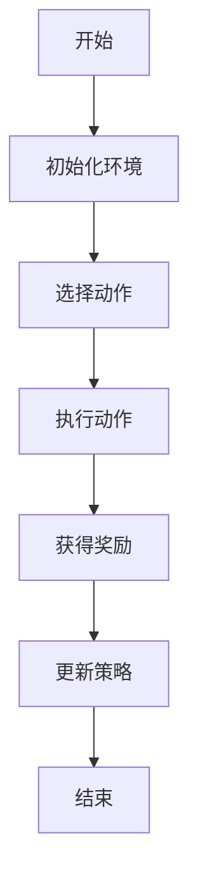
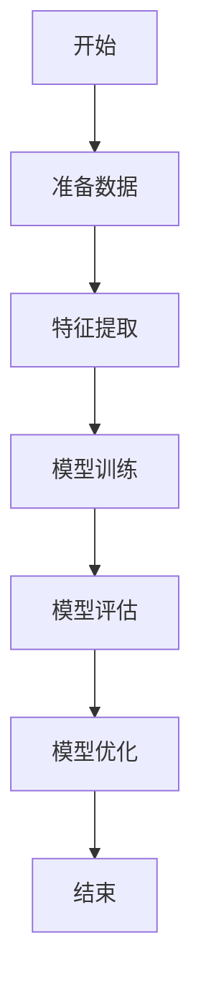
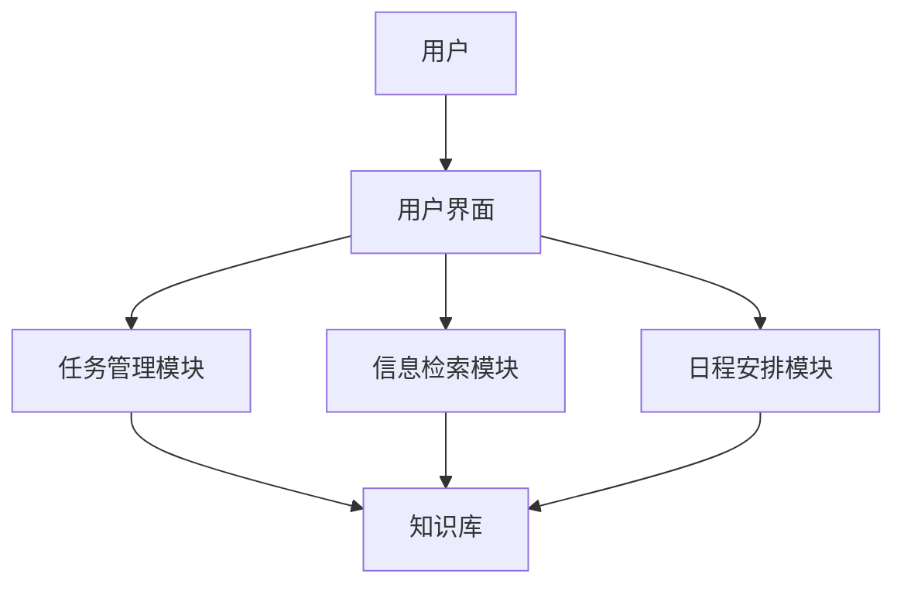
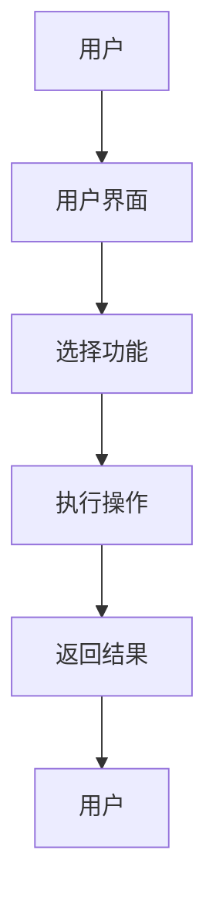

                 


# 第一部分: 智能办公与AI Agent的背景介绍

## 第1章: AI Agent的基本概念与问题背景
### 1.1 AI Agent的定义与核心概念
#### 1.1.1 AI Agent的定义
AI Agent（人工智能代理）是一种能够感知环境、自主决策并执行任务的智能系统。它通过与用户交互或环境交互，主动帮助用户完成特定任务，优化工作流程，提升效率。

#### 1.1.2 AI Agent的核心概念
AI Agent具有以下核心属性：
1. **自主性**：能够在没有外部干预的情况下自主运作。
2. **反应性**：能够感知环境变化并做出实时反应。
3. **目标导向**：具有明确的目标，并通过决策过程实现目标。
4. **学习能力**：能够通过数据和经验不断优化自身性能。

#### 1.1.3 AI Agent与传统办公工具的对比
| 特性          | AI Agent                          | 传统办公工具                  |
|---------------|-----------------------------------|------------------------------|
| **智能化**     | 高                                 | 低                           |
| **自主性**     | 高                                 | 低                           |
| **适应性**     | 高                                 | 低                           |
| **学习能力**   | 高                                 | 低                           |

### 1.2 问题背景与问题描述
#### 1.2.1 当前办公效率的痛点
现代办公环境中，员工面临着以下主要问题：
1. **信息过载**：每天需要处理大量信息，筛选和处理效率低下。
2. **任务繁杂**：重复性任务占用大量时间，影响工作效率。
3. **决策延迟**：由于信息分散，决策过程缓慢，错失商机。

#### 1.2.2 AI Agent如何解决这些问题
AI Agent通过智能化的处理方式，能够：
1. **自动化处理**：自动筛选和处理信息，减少人工干预。
2. **实时反馈**：快速响应用户需求，提高处理速度。
3. **智能决策**：基于数据分析提供决策支持，提升决策效率。

#### 1.2.3 AI Agent的应用场景与边界
AI Agent在智能办公中的典型应用场景包括：
1. **任务管理**：协助用户制定和跟踪任务进度。
2. **信息检索**：快速查找所需信息，提高工作效率。
3. **日程安排**：智能管理用户日程，避免时间冲突。

### 1.3 AI Agent的演进与技术趋势
AI Agent的技术演进主要经历了以下几个阶段：
1. **规则驱动阶段**：基于预定义规则进行简单决策。
2. **数据驱动阶段**：通过机器学习算法处理大量数据，实现更复杂的决策。
3. **大模型阶段**：利用大语言模型（如GPT）提升自然语言处理能力，实现更智能的交互。

---

# 第二部分: AI Agent的核心概念与联系

## 第2章: AI Agent的核心原理与概念联系
### 2.1 AI Agent的核心原理
AI Agent的工作原理可以分解为以下几个关键步骤：
1. **感知环境**：通过传感器或接口获取外部信息。
2. **分析理解**：利用自然语言处理（NLP）等技术理解信息内容。
3. **决策推理**：基于分析结果，生成解决方案或行动方案。
4. **执行反馈**：根据决策结果执行操作，并收集反馈以优化自身性能。

### 2.2 AI Agent的概念结构与核心要素
AI Agent的核心要素包括：
1. **知识库**：存储任务相关的知识和数据。
2. **推理引擎**：用于逻辑推理和决策制定。
3. **执行单元**：负责具体任务的执行操作。
4. **学习模块**：通过机器学习算法不断优化性能。

### 2.3 AI Agent与其他技术的对比
以下是AI Agent与传统办公工具的关键区别：
| 特性          | AI Agent                          | 传统办公工具                  |
|---------------|-----------------------------------|------------------------------|
| **智能化**     | 高                                 | 低                           |
| **自主性**     | 高                                 | 低                           |
| **适应性**     | 高                                 | 低                           |
| **学习能力**   | 高                                 | 无                           |

### 2.4 AI Agent的ER实体关系图
以下是一个简单的AI Agent ER实体关系图，展示了AI Agent的核心组件及其相互关系：

```mermaid
erd
    title AI Agent ER Diagram
    entity AI Agent {
        id
        name
        version
        description
    }
    entity Knowledge Base {
        id
        data_type
        content
    }
    entity Task Manager {
        id
        task_id
        status
    }
    entity User Interface {
        id
        input_type
        output_type
    }
    AI Agent -[1..n]-> Knowledge Base
    AI Agent -[1..n]-> Task Manager
    AI Agent -[1..n]-> User Interface
```

---

# 第三部分: AI Agent的算法原理与实现

## 第3章: AI Agent的算法原理
### 3.1 AI Agent的核心算法
AI Agent的实现通常涉及以下几种核心算法：
1. **强化学习（Reinforcement Learning）**：通过奖励机制优化决策过程。
2. **监督学习（Supervised Learning）**：基于标注数据进行分类和预测。
3. **无监督学习（Unsupervised Learning）**：发现数据中的潜在模式和结构。

### 3.2 强化学习算法的实现步骤
以下是强化学习算法的实现步骤：

1. **环境感知**：AI Agent通过传感器或接口感知环境状态。
2. **状态表示**：将环境状态转化为算法可以处理的形式。
3. **动作选择**：基于当前状态，选择一个动作。
4. **执行动作**：AI Agent执行选择的动作。
5. **奖励反馈**：根据动作执行的结果，获得奖励或惩罚。
6. **策略更新**：基于奖励反馈，更新策略以优化未来决策。

### 3.3 强化学习算法的流程图
以下是一个强化学习算法的流程图：



### 3.4 强化学习算法的Python实现示例
以下是一个简单的强化学习算法的Python实现示例：

```python
import numpy as np

class AIAgent:
    def __init__(self, state_space, action_space):
        self.state_space = state_space
        self.action_space = action_space
        self.q_table = np.zeros((state_space, action_space))

    def choose_action(self, state):
        # 使用epsilon-greedy策略选择动作
        epsilon = 0.1
        if np.random.random() < epsilon:
            return np.random.randint(self.action_space)
        else:
            return np.argmax(self.q_table[state])

    def learn(self, state, action, reward, next_state):
        # 更新Q表
        self.q_table[state][action] += 0.1 * (reward + np.max(self.q_table[next_state]) - self.q_table[state][action])

# 初始化环境
state_space = 5
action_space = 3

agent = AIAgent(state_space, action_space)

# 训练过程
for _ in range(100):
    state = np.random.randint(state_space)
    action = agent.choose_action(state)
    reward = np.random.random()
    next_state = np.random.randint(state_space)
    agent.learn(state, action, reward, next_state)
```

### 3.5 监督学习算法的实现步骤
以下是监督学习算法的实现步骤：
1. **数据准备**：收集并标注训练数据。
2. **特征提取**：将数据转换为适合算法处理的特征向量。
3. **模型训练**：基于训练数据训练模型。
4. **模型评估**：使用测试数据评估模型性能。
5. **模型优化**：根据评估结果优化模型参数。

### 3.6 监督学习算法的流程图
以下是一个监督学习算法的流程图：



### 3.7 监督学习算法的数学模型
以下是一个简单的监督学习算法的数学模型示例：

$$
y = mx + b
$$

其中：
- \( y \) 是输出值
- \( m \) 是斜率
- \( x \) 是输入值
- \( b \) 是截距

模型的目标是最小化预测值与真实值之间的误差，通常使用均方误差（MSE）作为损失函数：

$$
L = \frac{1}{n}\sum_{i=1}^{n}(y_i - \hat{y}_i)^2
$$

优化目标函数的过程通常使用梯度下降算法：

$$
m = m - \alpha \frac{\partial L}{\partial m}
$$

其中：
- \( \alpha \) 是学习率
- \( \frac{\partial L}{\partial m} \) 是损失函数关于 \( m \) 的偏导数

---

# 第四部分: AI Agent的系统分析与架构设计

## 第4章: 系统分析与架构设计
### 4.1 项目背景介绍
本项目旨在开发一个基于AI Agent的智能办公系统，旨在通过自动化任务处理、信息检索和日程管理等功能，帮助用户提高工作效率。

### 4.2 系统功能设计
系统功能设计包括以下几个模块：
1. **用户界面模块**：提供用户与AI Agent交互的界面。
2. **任务管理模块**：负责任务的创建、跟踪和完成。
3. **信息检索模块**：提供信息的快速检索和筛选功能。
4. **日程安排模块**：智能管理用户的日程安排。

### 4.3 系统架构设计
以下是系统的架构设计图：



### 4.4 系统接口设计
系统接口设计包括以下几个部分：
1. **用户接口**：提供用户与系统交互的界面。
2. **任务接口**：用于任务的创建、查询和删除。
3. **信息接口**：用于信息的检索和筛选。
4. **日程接口**：用于日程的安排、查询和更新。

### 4.5 系统交互流程图
以下是系统的交互流程图：



---

# 第五部分: 项目实战与应用

## 第5章: 项目实战
### 5.1 环境安装与配置
以下是项目所需的环境和工具：
1. **Python**：3.8+
2. **TensorFlow**：2.5+
3. **numpy**：1.21+
4. **scikit-learn**：0.24+

### 5.2 系统核心功能实现
以下是系统核心功能的实现代码：

```python
from sklearn.linear_model import LinearRegression

# 创建数据集
import numpy as np
import matplotlib.pyplot as plt

# 生成数据
X = np.linspace(0, 10, 100)
y = 2 * X + 1 + np.random.random(100)

# 训练模型
model = LinearRegression()
model.fit(X.reshape(-1, 1), y)

# 预测
y_pred = model.predict(X.reshape(-1, 1))

# 可视化
plt.scatter(X, y, color='blue')
plt.plot(X, y_pred, color='red')
plt.show()
```

### 5.3 项目应用与案例分析
以下是项目的一个实际应用案例：

1. **任务管理**：用户可以通过AI Agent创建和跟踪任务，系统会根据优先级自动排序并提醒用户完成任务。
2. **信息检索**：用户可以通过AI Agent快速检索所需信息，系统会根据关键词自动筛选相关结果。
3. **日程安排**：用户可以通过AI Agent智能管理日程安排，系统会根据用户的日程安排自动调整会议时间。

### 5.4 项目总结与优化
通过本项目的实现，我们可以看到AI Agent在智能办公中的巨大潜力。未来，可以通过以下方式进一步优化系统：
1. **提升模型性能**：使用更复杂的模型（如深度学习模型）提高预测精度。
2. **优化用户界面**：设计更友好直观的用户界面，提高用户体验。
3. **增加功能模块**：扩展更多功能模块，如邮件自动处理、智能提醒等。

---

# 第六部分: 最佳实践与小结

## 第6章: 最佳实践与注意事项
### 6.1 AI Agent在智能办公中的最佳实践
1. **数据质量**：确保数据的准确性和完整性，避免因数据问题导致模型性能下降。
2. **模型选择**：根据具体任务需求选择合适的模型，避免盲目追求复杂模型。
3. **系统安全**：确保系统的安全性，防止数据泄露和网络攻击。

### 6.2 开发中的注意事项
1. **模块化设计**：将系统设计为模块化结构，便于后续维护和扩展。
2. **性能优化**：通过优化算法和代码，提高系统的运行效率。
3. **用户体验**：注重用户体验设计，确保用户能够方便地使用系统。

### 6.3 项目小结
通过本项目的实施，我们可以看到AI Agent在智能办公中的巨大潜力。AI Agent不仅可以提高工作效率，还可以通过不断学习和优化，为用户提供更智能、更个性化的服务。

---

# 作者：AI天才研究院/AI Genius Institute & 禅与计算机程序设计艺术 /Zen And The Art of Computer Programming

