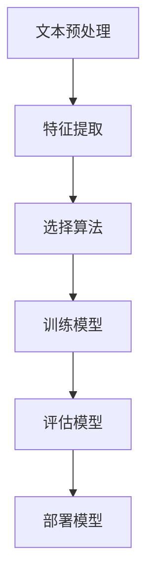
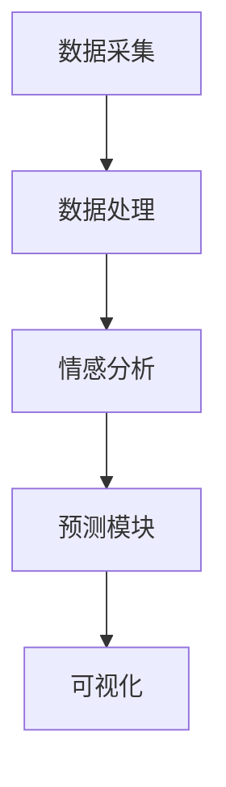

                 


# 智能加密货币市场情绪分析与预测

> 关键词：智能加密货币，情绪分析，市场预测，机器学习，自然语言处理

> 摘要：本文将深入探讨如何利用智能技术分析加密货币市场情绪，并基于这些分析进行市场预测。文章从情绪分析的基本原理出发，结合加密货币市场的特点，详细讲解了算法原理、系统架构设计以及项目实战，最后总结了最佳实践和未来发展方向。

---

## 第1章 加密货币市场与情绪分析概述

### 1.1 加密货币市场的特点

#### 1.1.1 加密货币市场的定义与特点
- 加密货币市场的定义：加密货币市场是指所有加密货币的交易市场，如比特币、以太坊等。
- 市场特点：
  - 高波动性：价格波动剧烈，受市场情绪影响显著。
  - 去中心化：交易不受传统金融体系控制，依赖去中心化技术。
  - 全球性：市场24小时交易，覆盖全球。

#### 1.1.2 加密货币市场的参与者与交易机制
- 参与者：
  - 投资者：个人和机构投资者。
  - 矿工：通过挖矿获得加密货币。
  - 开发者：开发和维护加密货币项目。
- 交易机制：
  - 市场订单：即时成交。
  - 限价订单：设定价格后成交。
  - 停止损失订单：设定止损点。

#### 1.1.3 加密货币市场的波动性与风险
- 波动性原因：
  - 市场情绪变化快。
  - 技术升级和政策变化。
  - 市场操纵的可能性。
- 风险管理：
  - 分散投资。
  - 使用止损工具。
  - 保持信息敏感性。

### 1.2 情绪分析的定义与重要性

#### 1.2.1 情绪分析的定义
- 情绪分析：通过自然语言处理技术分析文本中的情感倾向。
- 应用领域：金融、社交媒体、客户服务等。

#### 1.2.2 情绪分析在金融领域的应用
- 识别市场情绪：通过新闻、社交媒体分析投资者情绪。
- 预测市场走势：情绪变化可能影响价格波动。
- 风险管理：提前识别负面情绪以规避风险。

#### 1.2.3 情绪分析在加密货币市场的独特性
- 数据来源多样性：社交媒体、论坛、新闻等多种来源。
- 市场参与者情绪波动大：加密货币市场参与者情绪多变，容易受外界影响。
- 高频交易：情绪变化可能迅速反映在价格上。

### 1.3 情绪预测的背景与意义

#### 1.3.1 情绪预测的定义
- 情绪预测：利用历史情绪数据和市场数据，预测未来的情绪状态。
- 方法：统计分析、机器学习、深度学习等。

#### 1.3.2 情绪预测在加密货币市场的应用价值
- 提供投资参考：帮助投资者做出更明智的决策。
- 优化交易策略：根据情绪变化调整买卖时机。
- 风险预警：提前识别市场风险。

#### 1.3.3 情绪预测的挑战与机遇
- 挑战：
  - 数据噪声多：社交媒体数据真假难辨。
  - 情绪变化快：模型需要不断更新。
  - 数据量大：处理和分析成本高。
- 机遇：
  - 技术进步：AI和大数据技术的发展为情绪分析提供了新工具。
  - 市场需求：投资者对情绪分析的需求日益增加。

---

## 第2章 情绪分析的核心概念与联系

### 2.1 情绪分析的基本原理

#### 2.1.1 情绪分析的分类与方法
- 分类：
  - 细粒度情感分析：区分不同情感强度。
  - 多语言情感分析：支持多种语言的情感分析。
- 方法：
  - 基于规则：使用关键词和情感词典。
  - 统计方法：利用机器学习模型，如SVM。
  - 深度学习：使用RNN、LSTM等模型。

#### 2.1.2 情感分析的关键步骤
- 数据预处理：
  - 清洗数据：去除噪声，如停用词。
  - 分词：将文本分割成词语。
  - 标注：标注情感倾向。
- 特征提取：
  - 词袋模型：统计词频。
  - 词嵌入：使用Word2Vec、GloVe等生成词向量。
- 模型训练：
  - 选择合适的算法，如SVM、随机森林、LSTM等。

#### 2.1.3 情绪分析的评价指标
- 常见指标：
  - 准确率：正确分类的比例。
  - 召回率：识别出所有正例的比例。
  - F1分数：准确率和召回率的调和平均。
  - AUC-ROC：评估模型区分能力。

### 2.2 情绪分析与加密货币市场的关联

#### 2.2.1 情绪与价格波动的关系
- 情绪影响价格：积极情绪推高价格，消极情绪压低价格。
- 延迟效应：情绪变化可能不会立即反映在价格上。
- 多因素影响：情绪只是众多影响价格的因素之一。

#### 2.2.2 情绪指标的构建与应用
- 构建指标：
  - 情感强度指数：综合分析多源数据。
  - 市场情绪周期：识别市场的周期性变化。
- 应用：
  - 投资决策：帮助投资者判断市场趋势。
  - 风险管理：识别市场拐点。
  - 交易信号：生成买卖信号。

#### 2.2.3 情绪分析在市场预测中的作用
- 提供数据支持：为预测模型提供输入。
- 增强模型准确性：结合情绪数据和其他数据源提高预测精度。
- 实时监控：帮助投资者实时掌握市场情绪变化。

### 2.3 核心概念对比与ER实体关系图

#### 2.3.1 情绪分析方法对比表

| 方法类型 | 描述 | 优缺点 | 适用场景 |
|----------|------|--------|----------|
| 传统统计方法 | 基于关键词匹配 | 简单易实现，但精度低 | 小数据集或简单场景 |
| 机器学习 | 基于特征提取和模型训练 | 精度高，但需要大量数据 | 中等数据规模 |
| 深度学习 | 基于神经网络 | 精度高，能够处理复杂模式 | 大数据和复杂场景 |

#### 2.3.2 ER实体关系图

```mermaid
erDiagram
    actor 投资者 {
        <属性> 姓名、金额、投资组合
    }
    actor 开发者 {
        <属性> 项目名称、代码仓库
    }
    actor 矿工 {
        <属性> 矿池、算力
    }
    entity 市场数据 {
        <属性> 价格、交易量、时间戳
    }
    entity 情绪数据 {
        <属性> 情感强度、来源、时间戳
    }
    entity 交易记录 {
        <属性> 用户ID、交易金额、交易时间
    }
    市场数据 --> 市场情绪分析
    情绪数据 --> 情感强度计算
    交易记录 --> 情绪数据
```

---

## 第3章 情绪分析算法原理

### 3.1 文本预处理与特征提取

#### 3.1.1 文本预处理步骤
- 分词：将文本分割成词语或短语。
- 去除停用词：移除无意义词汇，如“的”、“是”等。
- 词干提取：将词转换为基本形式，如“trading”变为“trade”。

#### 3.1.2 特征提取方法
- 词袋模型：统计每个词的出现频率。
- 词嵌入：使用Word2Vec生成词向量。
- 位置编码：在序列模型中引入位置信息。

#### 3.1.3 常见特征选择技术
- 卡方检验：选择与目标变量相关性高的特征。
- 互信息：基于信息论选择特征。
- 主成分分析：降维并选择主要特征。

### 3.2 情感分类算法

#### 3.2.1 支持向量机（SVM）
- 原理：通过寻找最优超平面进行分类。
- 优点：适用于中小规模数据，分类精度高。
- 缺点：难以处理高维数据，需要特征工程。

#### 3.2.2 长短期记忆网络（LSTM）
- 原理：通过记忆单元和门控机制处理序列数据。
- 优点：能够捕捉长序列依赖，适合时间序列数据。
- 缺点：训练时间长，参数多。

#### 3.2.3 双向LSTM（Bi-LSTM）
- 原理：同时考虑前后文信息。
- 优点：捕捉双向依赖关系，提高情感分类精度。
- 应用：适合处理复杂的情感表达。

### 3.3 情感分类流程图



---

## 第4章 情感分析数学模型与公式

### 4.1 词嵌入模型

#### 4.1.1 Word2Vec模型
- 模型结构：使用神经网络训练词向量。
- 训练目标：通过上下文预测目标词或反之。
- 表达式：$v_{word}$ 表示词的向量。

#### 4.1.2 GloVe模型
- 基于全局词频统计，构建词向量。
- 目标函数：$\min \sum_{i<j} \alpha_{i,j} \cdot \text{sim}(w_i, w_j)$

### 4.2 LSTM模型

#### 4.2.1 LSTM基本结构
- 细胞状态：$c_t$
- 隐藏状态：$h_t$
- 更新门：$f_t$
- 输入门：$i_t$
- 输出门：$o_t$

#### 4.2.2 LSTM数学公式
- 更新门：
  $$ f_t = \sigma(g(x_t, h_{t-1})) $$
- 输入门：
  $$ i_t = \sigma(g(x_t, h_{t-1})) $$
- 细胞状态更新：
  $$ c_t = f_t \cdot c_{t-1} + i_t \cdot tanh(g(x_t, h_{t-1})) $$
- 输出门：
  $$ o_t = \sigma(g(x_t, h_{t-1})) $$
- 隐藏状态：
  $$ h_t = o_t \cdot tanh(c_t) $$

---

## 第5章 系统分析与架构设计

### 5.1 系统架构设计

#### 5.1.1 系统功能模块
- 数据采集模块：收集市场数据和情绪数据。
- 数据处理模块：清洗和预处理数据。
- 情感分析模块：进行情感分类。
- 预测模块：基于情绪数据进行市场预测。
- 可视化模块：展示分析结果。

#### 5.1.2 系统架构图



---

## 第6章 项目实战

### 6.1 环境搭建

#### 6.1.1 安装依赖
- Python：3.8+
- 库：TensorFlow、Keras、NLTK、Pandas

#### 6.1.2 数据集准备
- 数据来源：社交媒体、新闻网站。
- 数据清洗：去除无效数据，填充缺失值。

### 6.2 核心实现

#### 6.2.1 数据预处理代码

```python
import pandas as pd
import numpy as np

# 加载数据
data = pd.read_csv('crypto_tweets.csv')

# 分词
from nltk.tokenize import word_tokenize
data['tokens'] = data['text'].apply(word_tokenize)

# 去除停用词
from nltk.corpus import stopwords
stop_words = set(stopwords.words('english'))
data['tokens'] = data['tokens'].apply(lambda x: [word for word in x if word not in stop_words])
```

#### 6.2.2 模型训练代码

```python
from tensorflow.keras.models import Sequential
from tensorflow.keras.layers import LSTM, Dense, Dropout, Embedding

# 模型定义
model = Sequential()
model.add(Embedding(input_dim=词汇量, output_dim=100, input_length=词长))
model.add(LSTM(units=128, dropout=0.2, recurrent_dropout=0.2))
model.add(Dense(units=1, activation='sigmoid'))
model.compile(loss='binary_crossentropy', optimizer='adam', metrics=['accuracy'])
```

### 6.3 案例分析

#### 6.3.1 情感分类结果

```python
# 预测
model.predict(data['tokens'])
```

#### 6.3.2 预测结果可视化

```python
import matplotlib.pyplot as plt

plt.plot(predicted_prices, label='Predicted')
plt.plot(actual_prices, label='Actual')
plt.xlabel('Time')
plt.ylabel('Price')
plt.legend()
plt.show()
```

---

## 第7章 总结与展望

### 7.1 总结

#### 7.1.1 核心内容回顾
- 加密货币市场的特点。
- 情绪分析的原理与方法。
- 情感分类算法的应用。
- 系统架构设计与实现。

### 7.2 展望

#### 7.2.1 未来发展方向
- 更先进的模型：如Transformer架构。
- 多模态分析：结合图像、视频等多种数据源。
- 实时分析：优化算法提高处理速度。

#### 7.2.2 注意事项
- 数据质量：确保数据准确可靠。
- 模型更新：定期更新模型以适应市场变化。
- 风险控制：合理使用情绪分析结果，避免过度依赖。

---

## 作者：AI天才研究院/AI Genius Institute & 禅与计算机程序设计艺术 /Zen And The Art of Computer Programming

---

**这篇文章全面介绍了智能加密货币市场情绪分析与预测的背景、核心概念、算法原理、系统架构设计以及项目实战。通过详细讲解每个部分，帮助读者理解如何利用智能技术分析和预测加密货币市场的情绪变化，为投资决策提供科学依据。**

