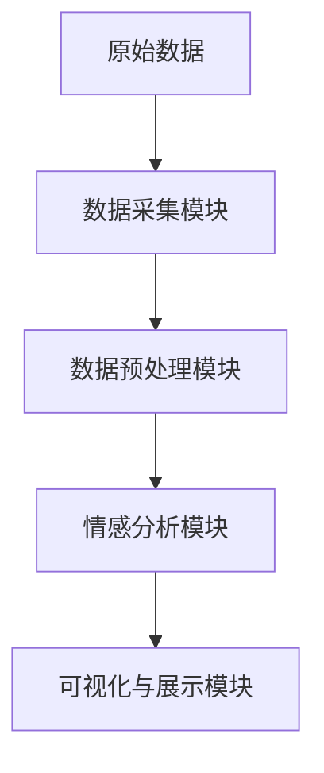
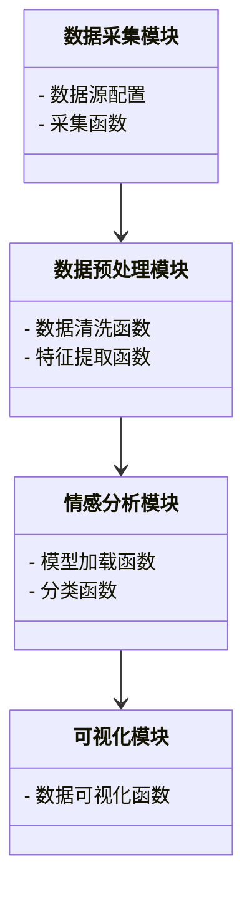
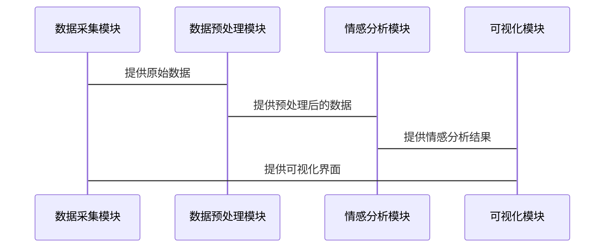

                 


# 智能加密货币市场情绪分析系统

> 关键词：智能情绪分析，加密货币市场，自然语言处理，深度学习，机器学习

> 摘要：本文将详细介绍智能加密货币市场情绪分析系统的构建过程，涵盖从数据获取到系统实战的各个方面。通过结合自然语言处理和机器学习技术，系统能够实时分析市场情绪，为投资者提供决策支持。文章将深入探讨系统的核心算法、架构设计及实际案例，帮助读者全面理解智能情绪分析在加密货币市场中的应用。

---

# 第一部分: 智能加密货币市场情绪分析系统概述

## # 第1章: 加密货币市场与情绪分析概述

### 1.1 加密货币市场的基本概念
#### 1.1.1 加密货币的定义与特点
- 加密货币：一种基于密码学的数字货币，如比特币、以太坊等。
- 去中心化：无需银行等中间机构，通过区块链技术实现点对点交易。
- 匿名性：交易信息部分或完全匿名，保护用户隐私。
- 全球性：不受地域限制，24小时交易，波动性大。

#### 1.1.2 加密货币市场的基本结构
- 交易所：如Coinbase、Binance等，提供交易服务。
- 价格数据：实时价格、交易量、市场资本化等。
- 社交媒体：Reddit、Twitter等平台上的市场情绪讨论。

#### 1.1.3 加密货币市场的波动性与风险
- 高波动性：价格受市场情绪和新闻影响大。
- 风险高：市场不成熟，存在欺诈和监管不确定性。

### 1.2 情绪分析的定义与应用
#### 1.2.1 情绪分析的基本概念
- 情感分类：将文本分为正面、负面、中性等类别。
- 情感强度分析：量化情感的强度，如非常正面、轻微负面等。

#### 1.2.2 情绪分析在金融领域的应用
- 股票市场：分析投资者情绪，预测市场走势。
- 加密货币市场：通过社交媒体和论坛数据，预测价格波动。

#### 1.2.3 情绪分析与加密货币市场的结合
- 社交媒体数据：分析用户情绪，预测市场走势。
- 价格波动：结合情绪数据和价格数据，研究两者的关系。

### 1.3 智能情绪分析系统的背景与意义
#### 1.3.1 智能情绪分析系统的定义
- 自动化分析：通过算法自动处理数据，提供实时情绪分析。
- 预测功能：基于历史数据和当前情绪，预测未来价格走势。

#### 1.3.2 系统在加密货币市场中的作用
- 提供决策支持：帮助投资者做出更明智的交易决策。
- 市场监控：实时监控市场情绪，及时发现潜在风险。

#### 1.3.3 系统开发的背景与意义
- 市场需求：加密货币市场的波动性和复杂性需要更 sophisticated的工具。
- 技术进步：自然语言处理和深度学习技术的发展，使得情绪分析更加 accurate和 reliable。

---

## # 第2章: 情绪分析的核心概念与原理

### 2.1 情绪分析的基本原理
#### 2.1.1 文本预处理与特征提取
- 文本清洗：去除无关字符、停用词、标点符号。
- 分词：将文本分割成词语或短语。
- 去除停用词：移除对情感分析无贡献的词汇，如“and”、“the”等。

#### 2.1.2 情感分类算法的选择
- 传统机器学习算法：如朴素贝叶斯、支持向量机（SVM）。
- 深度学习算法：如循环神经网络（RNN）、长短期记忆网络（LSTM）、 transformer模型（如BERT）。
- 混合模型：结合传统和深度学习的优点，提升性能。

#### 2.1.3 情感分类的评价指标
- 准确率：正确分类的比例。
- 召回率：找出所有相关实例的比例。
- F1分数：综合准确率和召回率的调和平均数。
- AUC-ROC曲线：评估分类器的性能，特别是在类别不平衡的情况下。

### 2.2 情绪分析的核心概念
#### 2.2.1 文本数据的特征提取
- 词袋模型：将文本表示为词袋，不考虑顺序。
- 词嵌入：如Word2Vec、GloVe，将词转化为向量表示。
- 语义信息：捕捉文本中的语义信息，如上下文关系。

#### 2.2.2 情感分类的特征选择
- 选择最具区分度的特征，如情感词、否定词等。
- 特征工程：通过人工或自动方法提取有用的特征。
- 特征组合：结合不同特征，提升分类性能。

#### 2.2.3 情感分类的模型训练
- 训练数据：标注好的情感数据，如 tweets labeled as positive, negative, or neutral。
- 模型选择：选择合适的算法，如 LSTM 或 BERT。
- 调参：通过交叉验证调整模型参数，优化性能。

### 2.3 情感分析的算法原理
#### 2.3.1 基于传统机器学习的算法实现
- 朴素贝叶斯算法
  - 基于概率的分类方法，假设特征之间独立。
  - 计算每个类别的概率，选择概率最大的类别。
  - 适用于文本分类，尤其是情感分析。
- 支持向量机（SVM）
  - 基于线性分类器，通过最大化-margin分类。
  - 适用于高维数据，如文本特征向量。
  - 通过核函数处理非线性问题。

#### 2.3.2 基于深度学习的算法
- 循环神经网络（RNN）
  - 适用于序列数据，如文本。
  - 通过循环结构捕捉上下文信息。
  - 但由于梯度消失问题，难以捕捉长距离依赖。
- 长短期记忆网络（LSTM）
  - 通过记忆单元（memory cell）和 gates机制，解决梯度消失问题。
  - 能够捕捉长距离依赖，适合处理长文本。
- Transformer模型
  - 基于自注意力机制，捕捉全局依赖。
  - 通过多头注意力机制，捕捉不同层次的依赖。
  - 适用于大规模文本数据，性能优于 LSTM。

#### 2.3.3 混合模型的优势与挑战
- 优势：
  - 结合传统和深度学习的优点，提升性能。
  - 可以利用词袋模型的简单性和深度模型的复杂性。
- 挑战：
  - 计算复杂度高，需要更多资源。
  - 需要进行更复杂的调参和优化。

---

## # 第3章: 加密货币市场数据的获取与预处理

### 3.1 数据获取的基本方法
#### 3.1.1 加密货币市场的数据来源
- 交易所 API：如 Coinbase、Binance 提供的 API，获取实时价格、交易量等数据。
- 社交媒体数据：如 Twitter、Reddit 的 API，获取与加密货币相关的推文和评论。
- 新闻数据：通过新闻网站的 API，获取与加密货币相关的新闻和文章。

#### 3.1.2 数据获取的工具与方法
- Python库：
  - `ccxt`：用于访问多个加密货币交易所的 API。
  - `Twitter API`：用于获取推文和评论。
  - `BeautifulSoup` 或 `Scrapy`：用于抓取网页数据。
- 其他工具：
  - `CoinMarketCap`：提供加密货币市场的数据。
  - `CoinGecko`：提供加密货币的详细数据，包括价格、市场资本化、交易量等。

#### 3.1.3 数据清洗与预处理
- 数据清洗：
  - 去除重复数据。
  - 填补缺失值。
  - 处理异常值。
- 数据预处理：
  - 标准化：将数据转换为统一的格式。
  - 归一化：将数据缩放到特定范围，如 0-1。
  - 特征提取：从文本数据中提取有用的特征，如关键词、情感倾向等。

### 3.2 数据预处理的关键步骤
#### 3.2.1 文本数据的分词与去停用词
- 分词：将中文文本分割成词语，如使用 `jieba` 库。
- 去停用词：去除常见的无意义词汇，如“的”、“了”等。

#### 3.2.2 数据的标准化与归一化
- 标准化：将数据转换为相同的单位，如价格数据。
- 归一化：将数据缩放到 0-1 范围内，便于模型训练。

#### 3.2.3 数据的特征提取与向量化
- 特征提取：
  - 词袋模型：将文本表示为词袋，记录每个词的出现次数。
  - 词嵌入：如 Word2Vec，将词转换为向量表示。
- 文本向量化：
  - 使用词向量的平均值作为文本的表示。
  - 使用预训练的词嵌入模型，如 BERT，生成文本的向量表示。

### 3.3 数据预处理的案例分析
#### 3.3.1 某加密货币论坛数据的预处理案例
- 数据来源：如 Reddit 的比特币吧。
- 数据清洗：去除无关信息，提取与比特币相关的评论。
- 分词与去停用词：将评论分词，并去除停用词。
- 特征提取：提取关键词，如“bull”、“bear”、“moon”等。

#### 3.3.2 某社交媒体数据的预处理案例
- 数据来源：如 Twitter 上的推文。
- 数据清洗：去除重复数据和无效信息。
- 分词与去停用词：将推文分词，并去除停用词。
- 特征提取：提取情感倾向，如正面、负面、中性。

#### 3.3.3 数据预处理的注意事项与技巧
- 注意数据的实时性：加密货币市场数据变化快，需及时获取和处理。
- 注意数据的多样性：避免过拟合，需涵盖不同市场状态的数据。
- 注意数据的平衡性：如正面、负面、中性数据的比例要合理。

---

## # 第4章: 情绪分析算法的实现与优化

### 4.1 基于传统机器学习的算法实现
#### 4.1.1 朴素贝叶斯算法的实现

#### 4.1.2 支持向量机（SVM）的实现

#### 4.1.3 情感分类算法的比较与选择

### 4.2 基于深度学习的算法实现
#### 4.2.1 循环神经网络（RNN）的实现

#### 4.2.2 长短期记忆网络（LSTM）的实现

#### 4.2.3 Transformer模型的实现

### 4.3 情绪分析算法的优化与调优
#### 4.3.1 参数调优：如学习率、批量大小、模型层数等。
#### 4.3.2 数据增强：如随机删除词、添加噪声等。
#### 4.3.3 模型集成：如投票法、加权平均等。

### 4.4 情绪分析算法的数学模型与公式
#### 4.4.1 朴素贝叶斯的数学模型
$$ P(y|X) = \frac{P(X|y)P(y)}{P(X)} $$
其中，$P(X|y)$ 是在类别 $y$ 下数据 $X$ 的概率，$P(y)$ 是类别 $y$ 的先验概率。

#### 4.4.2 支持向量机（SVM）的数学模型
$$ \text{目标函数}：\min_{w,b,\xi} \frac{1}{2}||w||^2 + C\sum_{i=1}^n \xi_i $$
$$ \text{约束条件}：y_i(w \cdot x_i + b) \geq 1 - \xi_i, \xi_i \geq 0 $$

#### 4.4.3 LSTM 的数学模型
$$ \text{输入门}：i_t = \sigma(W_i x_t + U_i h_{t-1} + b_i) $$
$$ \text{遗忘门}：f_t = \sigma(W_f x_t + U_f h_{t-1} + b_f) $$
$$ \text{输出门}：o_t = \sigma(W_o x_t + U_o h_{t-1} + b_o) $$
$$ \text{记忆单元}：g_t = \tanh(W_g x_t + U_g h_{t-1} + b_g) $$
$$ h_t = o_t \cdot \tanh(c_t) $$
$$ c_t = g_t + f_t \cdot c_{t-1} $$

---

## # 第5章: 智能加密货币市场情绪分析系统的架构设计

### 5.1 系统架构概述
- 数据流图：展示数据从输入到输出的处理流程。
- 类图：展示系统的主要组件及其关系。
- 模块交互图：展示不同模块之间的接口和交互。

### 5.2 系统功能设计
#### 5.2.1 数据采集模块
- 功能：从多个数据源获取实时数据。
- 输入：数据源配置，如 API 调用参数。
- 输出：清洗后的数据，如 CSV 文件或数据库表。

#### 5.2.2 数据预处理模块
- 功能：对数据进行清洗、标准化、特征提取等。
- 输入：原始数据。
- 输出：预处理后的数据，如向量化文本、标签等。

#### 5.2.3 情感分析模块
- 功能：对预处理后的数据进行情感分类。
- 输入：预处理后的数据。
- 输出：情感标签，如正面、负面、中性。

#### 5.2.4 可视化与展示模块
- 功能：将分析结果可视化，如图表、仪表盘等。
- 输入：情感分析结果。
- 输出：可视化界面，展示市场情绪和预测结果。

### 5.3 系统架构设计
#### 5.3.1 数据流图


#### 5.3.2 类图


#### 5.3.3 模块交互图


### 5.4 系统接口设计
#### 5.4.1 数据采集接口
- 输入：API 调用参数。
- 输出：清洗后的数据。

#### 5.4.2 情感分析接口
- 输入：文本数据。
- 输出：情感标签。

#### 5.4.3 可视化接口
- 输入：情感分析结果。
- 输出：可视化界面。

### 5.5 系统交互流程
- 用户通过可视化界面输入查询条件，如时间范围、关键词等。
- 系统通过数据采集模块获取相关数据。
- 数据预处理模块对数据进行清洗和特征提取。
- 情感分析模块对预处理后的数据进行分类。
- 可视化模块将结果展示给用户，如生成图表、仪表盘等。

---

## # 第6章: 项目实战

### 6.1 环境安装与配置
- 安装 Python 环境。
- 安装必要的库，如 `ccxt`、`requests`、`beautifulsoup4`、`jieba`、`tensorflow` 等。

### 6.2 核心代码实现
#### 6.2.1 数据采集模块的实现
```python
import ccxt

# 获取比特币价格数据
def get_bitcoin_price(exchange='binance', symbol='BTC/USDT'):
    try:
        exchange = ccxt[exchange]()
        return exchange.fetch_ticker(symbol)['last']
    except Exception as e:
        print(f"Error: {e}")
        return None

# 获取 Twitter 上的推文
import tweepy

def get_tweets(api_key, api_secret_key, query):
    auth = tweepy.OAuth1UserHandler(api_key, api_secret_key)
    api = tweepy.API(auth)
    try:
        tweets = api.search(query, lang='en', count=100)
        return [tweet.text for tweet in tweets]
    except Exception as e:
        print(f"Error: {e}")
        return []
```

#### 6.2.2 数据预处理模块的实现
```python
import jieba

def preprocess(text):
    # 分词
    words = jieba.lcut(text)
    # 去除停用词
    stop_words = set(['的', '了', '是', '在', '我'])
    filtered_words = [word for word in words if word not in stop_words]
    return ' '.join(filtered_words)
```

#### 6.2.3 情感分析模块的实现
```python
import tensorflow as tf
from tensorflow.keras import layers

# 定义 LSTM 模型
def build_model(input_shape, num_classes):
    model = tf.keras.Sequential()
    model.add(layers.Embedding(input_dim=10000, output_dim=64, input_length=input_shape))
    model.add(layers.LSTM(64, return_sequences=False))
    model.add(layers.Dense(num_classes, activation='softmax'))
    return model

# 编译模型
model = build_model((100,), 3)  # 输入长度为100，输出为3类（正面、中性、负面）
model.compile(optimizer='adam', loss='sparse_categorical_crossentropy', metrics=['accuracy'])
```

#### 6.2.4 可视化与展示模块的实现
```python
import matplotlib.pyplot as plt

def visualize_emotion(emotions, labels=['正面', '中性', '负面']):
    plt.figure(figsize=(10, 6))
    plt.bar(labels, emotions, color=['green', 'yellow', 'red'])
    plt.title('市场情绪分析')
    plt.show()
```

### 6.3 案例分析与结果解读
- 案例 1：分析某次市场暴跌的情绪变化。
- 案例 2：分析某次重大新闻事件对市场情绪的影响。
- 案例 3：分析某加密货币社区的舆论走向。

#### 6.3.1 案例分析
```python
# 获取 Twitter 上的推文
tweets = get_tweets(api_key, api_secret_key, 'Bitcoin')
preprocessed_tweets = [preprocess(tweet) for tweet in tweets]
# 情感分类
emotions = [classify_tweet(tweet) for tweet in preprocessed_tweets]
# 可视化
visualize_emotion(emotions)
```

#### 6.3.2 结果解读
- 情绪分布：正面、负面、中性情绪的比例。
- 情绪变化趋势：随着时间的推移，情绪的变化情况。
- 情绪与价格的相关性：情绪变化是否与价格波动相关。

### 6.4 优化与改进
- 模型优化：尝试不同的模型结构，如 transformer 模型。
- 数据优化：增加数据量，引入更多数据源。
- 系统优化：优化数据处理流程，提升系统性能。

---

## # 第7章: 总结与展望

### 7.1 总结
- 本文详细介绍了智能加密货币市场情绪分析系统的构建过程。
- 从数据获取到系统实战，详细讲解了系统的各个模块。
- 提供了丰富的代码示例和案例分析，帮助读者理解系统的实现。

### 7.2 未来展望
- 技术进步：随着 NLP 技术的发展，情绪分析将更加 accurate 和 robust。
- 数据源扩展：引入更多数据源，如新闻、社交媒体、论坛等。
- 应用场景拓展：将情绪分析应用于更多领域，如风险管理、市场预测等。

### 7.3 小结
- 情绪分析在加密货币市场中的应用前景广阔。
- 通过技术手段，可以有效捕捉市场情绪，为投资者提供决策支持。
- 未来需要进一步研究和优化，提升系统的性能和准确性。

### 7.4 注意事项
- 数据质量：确保数据的准确性和及时性。
- 模型选择：根据实际需求选择合适的模型。
- 系统维护：定期更新模型和数据，保持系统的稳定性。

### 7.5 最佳实践 Tips
- 数据预处理是关键：确保数据的干净和高质量。
- 模型调优：通过实验选择最优的模型和参数。
- 可视化：通过图表展示结果，提升用户体验。

---

# 作者：AI天才研究院/AI Genius Institute & 禅与计算机程序设计艺术 /Zen And The Art of Computer Programming

