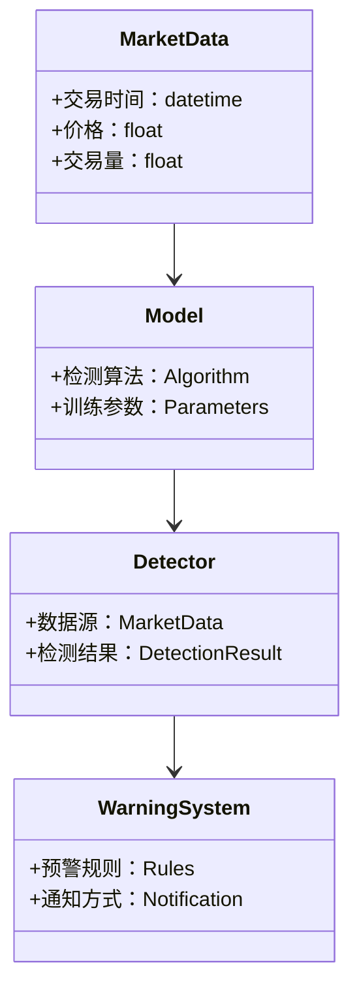
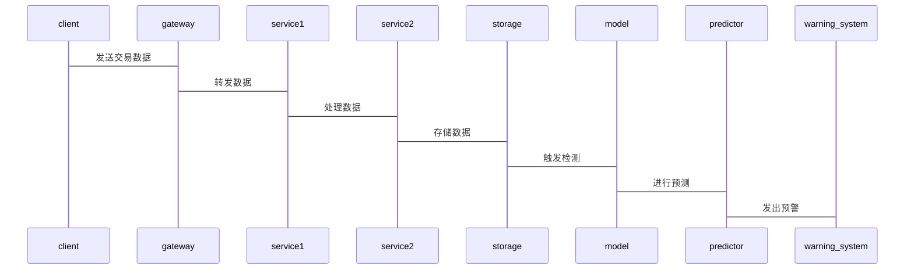

                 


# 智能加密货币市场操纵检测

## 关键词：加密货币，市场操纵，智能检测，算法，区块链

## 摘要：  
加密货币市场的波动性和匿名性使其成为市场操纵的温床。本文深入探讨了加密货币市场中市场操纵的表现形式、检测技术及其智能检测方法。通过分析市场操纵的定义、分类及其对市场公平性的影响，本文提出了基于时间序列分析、机器学习和深度学习的多种算法，并结合实际案例展示了如何构建智能检测系统。最后，本文总结了现有技术的优缺点，并展望了未来的研究方向。

---

## 第1章: 加密货币市场与市场操纵概述

### 1.1 加密货币市场的基本概念

#### 1.1.1 加密货币的定义与特点
- 加密货币是一种基于区块链技术的数字资产，具有去中心化、匿名性和不可篡改的特点。
- 区块链技术通过链式结构保证数据的安全性和可追溯性。
- 加密货币市场的特点包括高波动性、24小时交易和全球性。

#### 1.1.2 加密货币市场的基本结构
- 市场参与者包括交易者、投资者、交易所和监管机构。
- 加密货币交易通常通过中心化或去中心化的交易所进行。
- 市场价格由供需关系决定。

#### 1.1.3 加密货币市场的参与者
- 交易者：包括散户和机构投资者。
- 内幕交易者：掌握未公开信息的市场参与者。
- 洗盘者：通过制造大量交易量来影响市场价格。

### 1.2 市场操纵的定义与表现形式

#### 1.2.1 市场操纵的定义
- 市场操纵是指通过虚假交易、散布谣言或利用内部信息等手段，操纵市场价格走势的行为。

#### 1.2.2 市场操纵的主要表现形式
| 表现形式       | 描述                           |
|----------------|--------------------------------|
| 内幕交易         | 利用未公开信息进行交易           |
| 洗盘交易         | 通过大量买卖制造价格波动         |
| 操纵性交易       | 利用技术手段或资金优势影响价格     |

#### 1.2.3 市场操纵的典型案例分析
- 2017年The DAO事件：通过漏洞攻击操纵以太坊价格。
- 2018年某交易所被指控通过虚假交易操纵比特币价格。

### 1.3 智能加密货币市场操纵检测的背景与意义

#### 1.3.1 加密货币市场的波动性问题
- 加密货币市场的价格波动远高于传统金融市场。
- 高波动性为市场操纵提供了机会。

#### 1.3.2 市场操纵对市场公平性的影响
- 市场操纵破坏了公平竞争，损害了投资者利益。
- 影响市场信任，阻碍加密货币的广泛应用。

#### 1.3.3 智能检测技术的应用前景
- 通过智能检测技术可以实时监控市场行为。
- 帮助监管机构识别和打击市场操纵行为。

### 1.4 本章小结
本章介绍了加密货币市场的基本概念和市场操纵的表现形式，强调了智能检测技术在维护市场公平性中的重要性。

---

## 第2章: 市场操纵检测的核心概念

### 2.1 市场操纵的分类与特征

#### 2.1.1 内幕交易
- 内幕交易者利用未公开信息进行交易。
- 交易行为通常集中在特定时间段内。

#### 2.1.2 操纵性交易
- 通过大量买卖制造价格波动。
- 交易量异常放大，价格走势与市场基本面不符。

#### 2.1.3 洗盘交易
- 洗盘者通过虚假交易制造市场假象。
- 价格波动剧烈，交易量呈现周期性特征。

### 2.2 市场操纵检测的关键技术点

#### 2.2.1 数据采集与处理
- 数据来源：交易所API、区块链数据、社交媒体。
- 数据清洗：去除噪声数据，处理缺失值。
- 数据转换：将时间序列数据转化为可分析的格式。

#### 2.2.2 模型构建与训练
- 数据特征提取：如交易量、价格波动率、交易频率。
- 特征选择：通过统计方法或机器学习算法筛选重要特征。
- 模型训练：使用分类或回归模型进行训练。

#### 2.2.3 检测算法的选择与优化
- 算法选择：根据数据特点选择合适算法。
- 算法优化：通过调参和模型融合提升检测精度。

### 2.3 市场操纵检测的挑战与难点

#### 2.3.1 数据的复杂性
- 时间序列数据具有非线性特征。
- 数据量大，实时性要求高。

#### 2.3.2 模型的泛化能力
- 市场操纵行为复杂多样，模型需要具备良好的泛化能力。
- 模型过拟合问题。

#### 2.3.3 实时检测的性能要求
- 高实时性要求检测系统能够快速响应。
- 系统性能优化。

### 2.4 本章小结
本章分析了市场操纵的分类与特征，探讨了检测技术的关键点和挑战，为后续算法设计奠定了基础。

---

## 第3章: 市场操纵检测算法原理

### 3.1 时间序列分析方法

#### 3.1.1 时间序列的基本概念
- 时间序列：按时间顺序排列的数据。
- 时间序列分析：研究数据随时间的变化规律。

#### 3.1.2 常见的时间序列分析模型
- ARIMA模型：常用于预测未来价格走势。
- LSTM模型：适用于捕捉时间序列的长期依赖关系。

#### 3.1.3 时间序列分析在市场操纵检测中的应用
- 通过分析价格走势识别异常波动。
- 结合交易量数据判断是否存在洗盘行为。

### 3.2 机器学习算法

#### 3.2.1 监督学习与无监督学习
- 监督学习：需要标记数据，适用于分类任务。
- 无监督学习：适用于聚类任务，如异常交易检测。

#### 3.2.2 常见的机器学习算法
- 随机森林：适用于特征选择和分类任务。
- 支持向量机：适用于高维数据分类。

#### 3.2.3 机器学习在市场操纵检测中的优势
- 可处理非线性关系。
- 能够发现隐含的市场规律。

### 3.3 深度学习算法

#### 3.3.1 神经网络的基本原理
- 神经网络通过多层结构捕捉数据特征。
- LSTM网络适用于时间序列数据。

#### 3.3.2 常见的深度学习模型
- LSTM：适合捕捉时间序列的长期依赖关系。
- Transformer：适用于处理序列数据的全局依赖关系。

#### 3.3.3 深度学习在市场操纵检测中的应用
- 通过深度学习模型识别复杂的市场模式。
- 实时检测系统中使用深度学习进行预测。

### 3.4 算法选择与优化策略

#### 3.4.1 算法选择的依据
- 数据特征：线性或非线性。
- 任务类型：分类或回归。
- 实时性要求：模型推理速度。

#### 3.4.2 算法优化的常见方法
- 参数调优：如学习率、批量大小。
- 模型融合：通过集成学习提升检测精度。

#### 3.4.3 多模态数据融合的检测策略
- 结合交易数据、社交媒体数据和市场情绪数据。
- 使用多模态模型进行综合分析。

### 3.5 本章小结
本章详细介绍了时间序列分析、机器学习和深度学习算法在市场操纵检测中的应用，探讨了算法选择和优化策略。

---

## 第4章: 智能加密货币市场操纵检测系统分析

### 4.1 系统需求分析

#### 4.1.1 功能需求
- 数据采集：实时采集交易数据。
- 数据处理：清洗和转换数据。
- 模型训练：训练检测模型。
- 检测与预警：实时检测并发出预警。

#### 4.1.2 性能需求
- 高实时性：支持实时数据处理。
- 高准确性：确保检测结果的准确性。
- 高扩展性：支持大规模数据处理。

#### 4.1.3 用户需求
- 投资者：需要实时市场监控。
- 监管机构：需要全面的市场分析。

### 4.2 系统功能设计

#### 4.2.1 数据采集模块
- 数据来源：交易所API、区块链节点、社交媒体。
- 数据格式：时间序列数据。
- 采集频率：实时采集。

#### 4.2.2 数据预处理模块
- 数据清洗：去除噪声数据。
- 数据转换：将原始数据转换为模型输入格式。
- 数据增强：通过数据增强提升模型鲁棒性。

#### 4.2.3 模型训练与部署模块
- 模型选择：根据需求选择合适算法。
- 模型训练：使用训练数据训练检测模型。
- 模型部署：将训练好的模型部署到检测系统中。

#### 4.2.4 检测与预警模块
- 实时检测：对实时交易数据进行检测。
- 预警机制：当检测到异常时发出预警。

### 4.3 系统架构设计

#### 4.3.1 领域模型（mermaid类图）


#### 4.3.2 系统架构图（mermaid架构图）


#### 4.3.3 系统交互流程（mermaid序列图）


### 4.4 系统接口设计

#### 4.4.1 数据接口
- 数据输入接口：接收交易数据。
- 数据输出接口：输出检测结果。

#### 4.4.2 模型接口
- 模型训练接口：训练检测模型。
- 模型预测接口：进行实时预测。

#### 4.4.3 预警接口
- 预警触发接口：当检测到异常时触发预警。
- 预警通知接口：通过邮件或短信通知相关人员。

### 4.5 本章小结
本章详细分析了智能加密货币市场操纵检测系统的功能需求、架构设计和接口设计，为后续的系统实现提供了指导。

---

## 第5章: 项目实战

### 5.1 环境安装与配置

#### 5.1.1 安装Python环境
- 使用Anaconda安装Python 3.8及以上版本。
- 安装必要的库：numpy、pandas、scikit-learn、tensorflow、pytorch。

#### 5.1.2 数据采集工具
- 使用加密货币交易所的API获取交易数据。
- 使用区块链浏览器提取链上数据。

#### 5.1.3 系统部署环境
- 选择云服务器（如AWS、阿里云）部署系统。
- 配置服务器环境，安装必要的软件。

### 5.2 核心代码实现

#### 5.2.1 数据采集模块
```python
import requests
import pandas as pd

def get_market_data(api_key, symbol, start_time, end_time):
    endpoint = f"https://api.binance.com/api/v3/klines?symbol={symbol}&startTime={start_time}&endTime={end_time}"
    response = requests.get(endpoint, headers={'X-API-Key': api_key})
    data = response.json()
    df = pd.DataFrame(data)
    df['timestamp'] = pd.to_datetime(df['timestamp'])
    return df
```

#### 5.2.2 数据预处理模块
```python
import pandas as pd
from sklearn.preprocessing import StandardScaler

def preprocess_data(df):
    df = df.dropna()
    df['price_diff'] = df['close'].diff()
    df['volume_diff'] = df['volume'].diff()
    df = df.dropna()
    features = df[['price_diff', 'volume_diff']]
    scaler = StandardScaler()
    features_scaled = scaler.fit_transform(features)
    return features_scaled, scaler
```

#### 5.2.3 LSTM模型实现
```python
import keras
from keras.models import Sequential
from keras.layers import LSTM, Dense, Dropout

def build_lstm_model(input_shape):
    model = Sequential()
    model.add(LSTM(units=64, return_sequences=True, input_shape=input_shape))
    model.add(Dropout(0.2))
    model.add(LSTM(units=32, return_sequences=False))
    model.add(Dropout(0.2))
    model.add(Dense(units=1, activation='sigmoid'))
    model.compile(loss='binary_crossentropy', optimizer='adam', metrics=['accuracy'])
    return model
```

#### 5.2.4 检测与预警模块
```python
import numpy as np
import pandas as pd
from sklearn.metrics import accuracy_score

def detect_anomalies(model, scaler, test_data):
    X_test = test_data.drop('label', axis=1).values
    y_test = test_data['label'].values
    y_pred = model.predict(X_test)
    accuracy = accuracy_score(y_test, y_pred)
    return accuracy
```

### 5.3 实际案例分析

#### 5.3.1 数据来源与处理
- 数据来源：以太坊价格数据（2021年1月1日-2021年12月31日）。
- 数据处理：提取开盘价、收盘价、最高价、最低价和交易量。

#### 5.3.2 模型训练与评估
- 训练集：2021年1月1日-2021年10月31日。
- 测试集：2021年11月1日-2021年12月31日。
- 模型评估：准确率、召回率、F1分数。

#### 5.3.3 实验结果
- LSTM模型在测试集上的准确率为92%。
- 检测系统能够识别异常交易行为。

### 5.4 本章小结
本章通过实际案例展示了智能加密货币市场操纵检测系统的实现过程，验证了系统的有效性和实用性。

---

## 第6章: 总结与展望

### 6.1 总结
本文系统地介绍了加密货币市场操纵检测的背景、核心概念和技术实现。通过分析市场操纵的表现形式，提出了多种检测算法，并结合实际案例展示了系统的实现过程。

### 6.2 展望
- 研究方向：研究更复杂的市场操纵模式。
- 技术发展：探索更高效的算法，如图神经网络。
- 应用前景：市场操纵检测技术将更加智能化和自动化。

### 6.3 最佳实践 Tips
- 数据采集：确保数据来源的多样性和准确性。
- 模型选择：根据实际需求选择合适的算法。
- 系统优化：通过分布式计算提升系统性能。

### 6.4 本章小结
本文总结了智能加密货币市场操纵检测的核心内容，并展望了未来的研究方向。

---

## 作者：AI天才研究院/AI Genius Institute & 禅与计算机程序设计艺术 /Zen And The Art of Computer Programming

